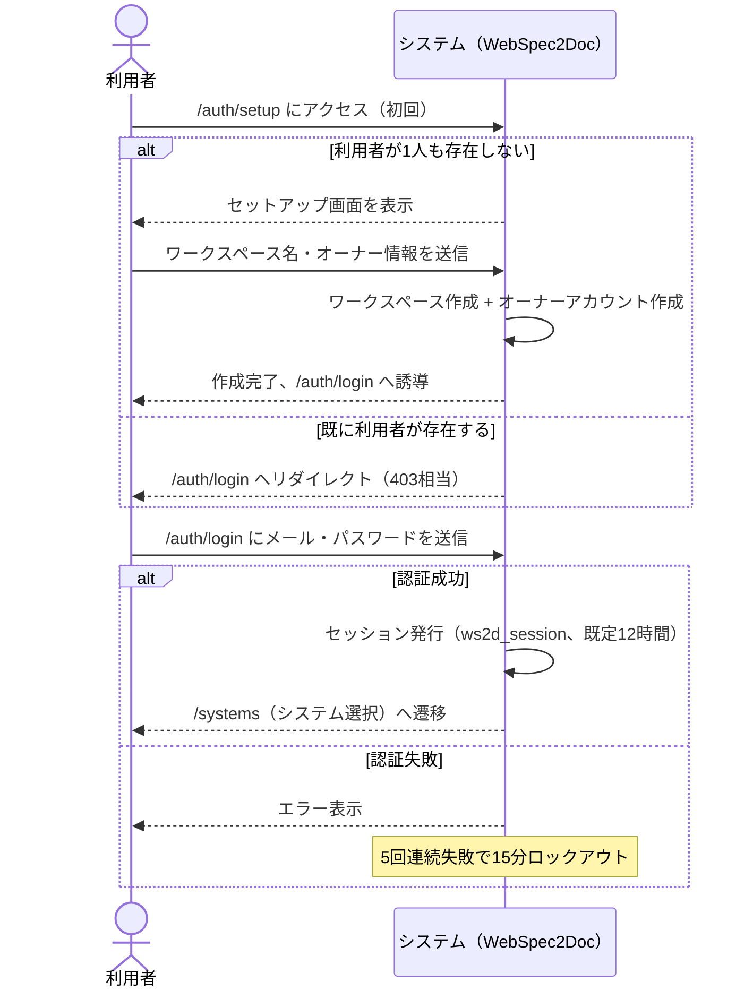
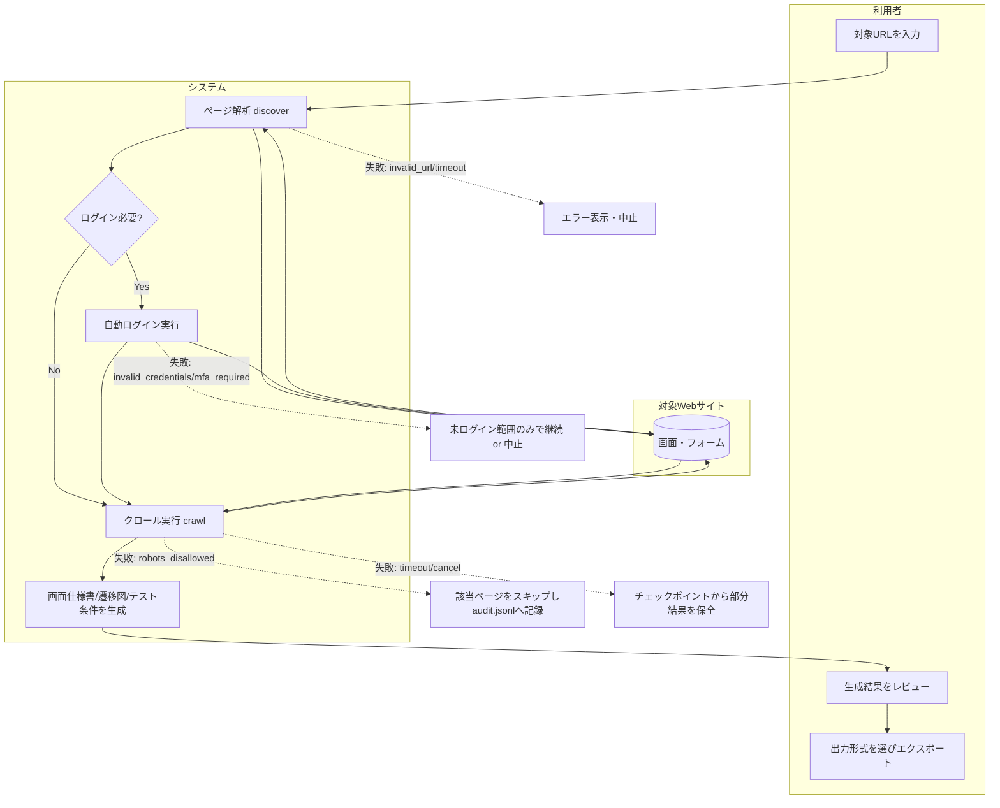
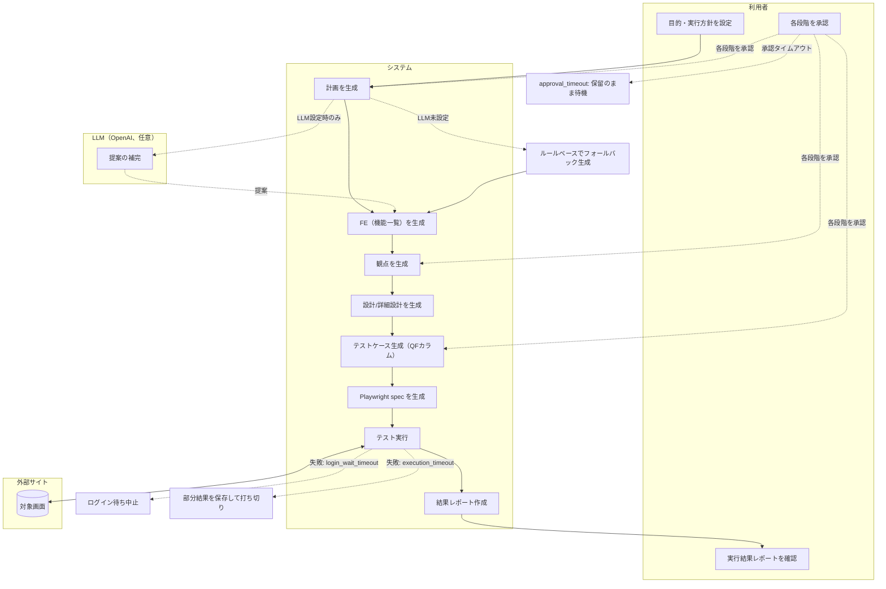
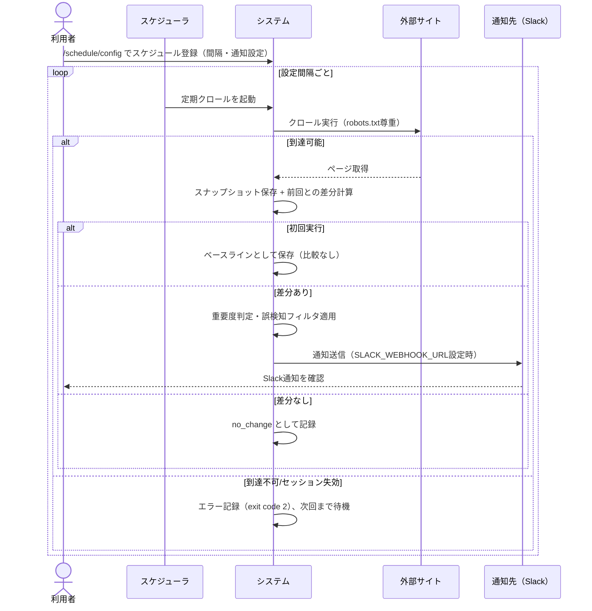

# WS2D-BF-001 業務フロー図

- 文書ID: WS2D-BF-001
- 版数: 1.0 / 作成日: 2026-08-02 / 準拠: IPA共通フレーム（業務フロー）
- 用語は `CONTEXT.md`、`WS2D-GL-001_用語集.md` を参照。

各フローは役割（利用者／システム／外部サイト／LLM）をスイムレーン相当で区別し、例外・エラー時の分岐を明記する。

## フロー1: 初期セットアップ（アカウント作成→テナント作成→ログイン）

**例外・エラー分岐**

- 認証失敗の連続（ロックアウト）: 正しいパスワードでも15分間拒否。
- パスワード要件不備（10文字未満・メールと同一）: セットアップ時点で拒否。
- 2人目以降の利用者は `/auth/setup` に到達不可（管理者による招待が必要、`tenant_membership`）。

## フロー2: ドキュメント作成業務（対象サイト登録→クロール→解析→ドキュメント生成→レビュー→出力）

**例外・エラー分岐**

- 対象サイト到達不可（`invalid_url`, `timeout`）: 解析段階で中止しエラー表示。
- ログイン失敗（`invalid_credentials`, `mfa_required`, `session_expired`）: 未ログイン範囲のみの結果として記録するか、`--require-login` 相当の設定時は中止。
- robots.txt 拒否（`robots_disallowed`）: 該当ページのみスキップし監査ログ（`audit.jsonl`）に理由を記録。
- タイムアウト・中止（`timeout`, `cancel`）: チェックポイントから再開可能な形で部分結果を保全。

## フロー3: AutoRunによるテスト設計・実行業務（目的設定→計画→観点→設計→ケース生成→実行→レポート）

**例外・エラー分岐**

- LLM未設定: ルールベースでフォールバック生成し、機能を損なわず継続する。
- 承認タイムアウト（`approval_timeout`）: 段階は保留のまま次に進まず、利用者の操作を待つ。
- ログイン待ちタイムアウト（`login_wait_timeout`）: 実行を中止。
- 実行タイムアウト（`execution_timeout_partial_result`）: 部分結果を保存して打ち切り、全件成功したかのように扱わない。
- 中止（`cancel`）: 実行中のジョブを安全に停止。

## フロー4: 定期監視・ドリフト検知業務（スケジュール登録→定期実行→差分検知→通知）

**例外・エラー分岐**

- 対象サイト到達不可・セッション失効（`session_expired`, `missing_target`）: エラーとして記録し、判定結果は変えずに次回実行まで待機。
- Webhook未設定・通知送信エラー（`missing_webhook`, `notify_http_error`）: 通知は送られないが、ドリフト判定結果自体は変わらない。
- 初回実行（`first_run`）: 比較対象がないためベースラインとして保存するのみ。
- CI組み込み時: 差分ありは exit code 1 でジョブ失敗として扱う。

## 改訂履歴

| 版 | 日付 | 内容 | 作成者 |
|---|---|---|---|
| 1.0 | 2026-08-02 | 新規作成 | 開発チーム |
