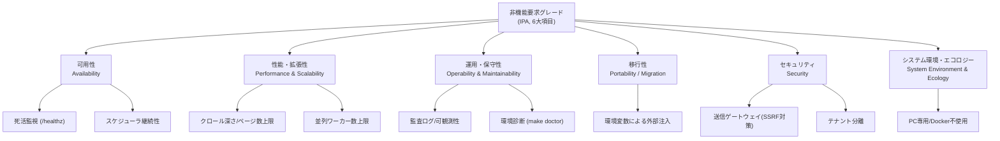
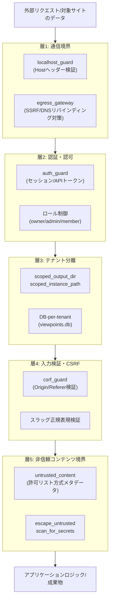
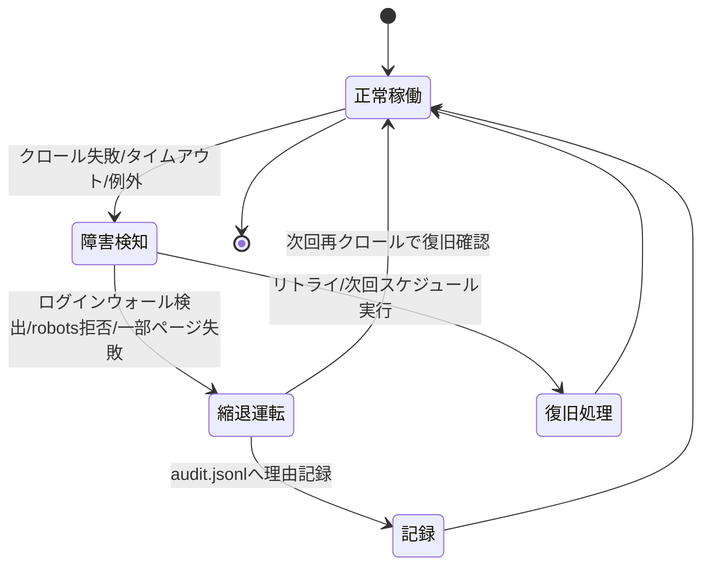

# WS2D-NF-001 非機能要件定義書

- 文書ID: WS2D-NF-001
- 版数: 3.0 / 作成日: 2026-07-16 / 最終更新: 2026-08-02 / 準拠: IPA「非機能要求グレード」（6大項目）＋ ISO/IEC 25010（製品品質モデル）
- 関連: `WS2D-RD-001`（要件定義書）、`WS2D-BD-001`（基本設計書）、`docs/TESTING_STRATEGY.md` §6、`docs/AUTH_TENANCY.md`、`web/security.py`、`web/services/egress_gateway.py`、`web/services/untrusted_content.py`、`web/config.py`

## 1. 文書概要

### 1.1 目的・位置づけ

本書はIPA「非機能要求グレード」の6大項目（可用性／性能・拡張性／運用・保守性／移行性／セキュリティ／システム環境・エコロジー）を枠として、要求レベルと現状（as-built）を対比する。`WS2D-RD-001` 要件定義書の11章から参照される下位文書であり、数値要件の正本は本書とする。**性能値は実測できたものだけを記載し、根拠コマンドを併記する。実測していない値は「未計測」と明記し、目標値を推測で作らない。**

### 1.2 適用範囲

対象は `WS2D-RD-001` と同一（2026-08-02時点でメインブランチにマージ済みのWebSpec2Doc）。本書は方式（どう実現するか）ではなく要求（何を満たすべきか）と充足状況を記述する。実現方式の詳細は `WS2D-BD-001` 8章（性能・拡張性の方式）・9章（セキュリティ方式）を参照し、本書との重複記載は避ける。

### 1.3 読者

QAエンジニア・テスト設計者、対象システムの開発者、テナント管理者・システム管理者（運用担当）、開発チーム（実装担当）、セキュリティレビュアー・検収担当者。

### 1.4 本改訂での検証方針（重要）

旧版（2.0）の性能設定値節は「`web/config.py` の再読による再検証は未実施」と明記した引用値だった。本改訂では `web/config.py`・`web/security.py`・`web/services/egress_gateway.py`・`web/services/untrusted_content.py` を直接読み込んで内容を確認し、旧版の記載内容との差分を検出した箇所は訂正している（4.1節に訂正内容を明記）。一方、`make coverage` / `make test` / `make verify-ui` によるテスト実測値は、本改訂のスコープ内では再実行しておらず、2026-07-16時点の実測値をその日付を明記した上でそのまま引用する（本書はドキュメント拡充作業であり、テスト実行は別工程として扱う）。

## 2. 非機能要件の分類

### 2.1 分類図（図1）

上図はIPA非機能要求グレードの6大項目と、各項目の代表的な実装要素の対応を示す。以降の2.2〜2.7節で各項目を「要求レベル・根拠・as-built実装・充足状況・未達事項」の5観点で記述し、3章以降でさらに詳細（性能・セキュリティ・可用性は専用章を設ける）を記載する。2章は全項目を横断して俯瞰する「採点表」の役割を持ち、3章以降は各項目の一次証拠（設定値・ソースコード該当箇所）まで踏み込む。

### 2.2 可用性

| 観点 | 内容 |
|---|---|
| 要求レベル | 正式なSLA文書は存在しないため目標値未設定。PC単体または社内サーバ単一プロセスを前提とした可用性要求（多重化・自動フェイルオーバーは対象外）とする |
| 根拠 | README・`WS2D-BD-001`が明記する配置方式（PC単体構成、Docker不使用、水平スケール非対応）。`WS2D-RD-001` 12章・13章にも単一プロセス構成が前提条件として明記されている |
| as-built実装 | `GET /healthz`（`web/routes/api_v1.py: api_healthz`）による死活監視。社内サーバ展開時はsystemd `Restart=on-failure`により異常終了時に自動再起動（README「社内サーバへ展開」節のunitファイル定義を実測確認）。定期実行（ドリフト監視）は`web/services/scheduler.py`が担い、失敗時は次回スケジュールまで待機し実行結果を監査ログ・`drift_summary.json`に記録する |
| 充足状況 | 単一プロセス構成を前提とした最小限の可用性対策（死活監視・自動再起動・スナップショット保持ポリシーによるバックアップ運用ガイド`admin.get_backup_guide`）は実装済み |
| 未達事項 | 稼働率(%)の実測値・SLA目標値・RTO（目標復旧時間）・RPO（目標復旧時点）は未計測・未定義。詳細は6章 |

### 2.3 性能・拡張性

| 観点 | 内容 |
|---|---|
| 要求レベル | 明確な数値目標（SLA）は未設定。クロール深さ・ページ数・並列数には安全上限（設定値）を持たせ、実運用ではCLI既定値が既定動作となることを要求水準とする |
| 根拠 | `web/config.py`実測（本改訂で直接確認） |
| as-built実装 | `MAX_DEPTH=10`、`MAX_PAGES_LIMIT=500`、`MAX_PARALLELISM=8`（いずれも安全上限）。CLI既定値は`--depth=3`、`--max-pages=50`、`--parallelism=1`（GUI既定2、README実測） |
| 充足状況 | 設定可能な上限値・既定値は実装済みで確認済み。詳細は4章 |
| 未達事項 | 負荷試験未実施。同時接続数・スループット・メモリ/CPU使用量プロファイルは未計測 |

### 2.4 運用・保守性

| 観点 | 内容 |
|---|---|
| 要求レベル | 正式なSLAはないが、開発チーム自身が日常的に使う運用性（診断コマンド・監査ログ・コーディング規約による保守性）を要求水準とする |
| 根拠 | `make doctor`・`scripts/quality_harness.py`・`WS2D-CS-001`コーディング規約の存在（実ファイル確認） |
| as-built実装 | `/metrics`（Prometheus形式）、JSON構造化ログ（`web/services/metrics.py`）。監査ログ`admin_audit.jsonl`（`web/services/admin_audit.py`）。環境診断`make doctor`。依存脆弱性監査`make security`（bandit+pip-audit、記録先`docs/security/`） |
| 充足状況 | 開発・運用のための一次ツール群は整備済み。詳細は7章 |
| 未達事項 | アプリケーションログの出力先・ログレベル方針・ローテーション方式は未確認（`WS2D-BD-001` 5.7節と同一の指摘） |

### 2.5 移行性

| 観点 | 内容 |
|---|---|
| 要求レベル | 環境変数による外部注入で、開発環境・社内サーバ間の移行を容易にすることを要求水準とする（複数リージョン間移行、他クラウドへの移設等は対象外） |
| 根拠 | `web/config.py`に定義された環境変数群（実測） |
| as-built実装 | `WEBSPEC2DOC_PORT`/`TRUSTED_HOSTS`/`VIEWPOINTS_DB`/`OUTPUT_DIR`等の環境変数注入。DBスキーママイグレーション内蔵（`viewpoint_store.py`の`_migrate_v1_to_v2`等） |
| 充足状況 | 環境変数による設定外部化・DBマイグレーション機構は実装済み。詳細は8章 |
| 未達事項 | 認証導入前データ（`output/{domain}/`）はテナントモードから見えず手動移行が必要（`docs/AUTH_TENANCY.md`既知の制約） |

### 2.6 セキュリティ

| 観点 | 内容 |
|---|---|
| 要求レベル | 対象サイトの資格情報・秘密情報を外部へ送信・保存しないことを最重要要求とする（README冒頭の思想、オンプレ完結） |
| 根拠 | `web/security.py`/`web/services/egress_gateway.py`/`web/services/untrusted_content.py`の直接確認（本改訂で実施） |
| as-built実装 | 通信境界（`localhost_guard`）・認証認可（`auth_guard`）・テナント分離・CSRF対策（`csrf_guard`）・非信頼コンテンツ境界の5層防御。詳細は5章 |
| 充足状況 | 主要な対策は実装済みで、コード上で機構として検証可能（迂回不能設計、送信ログによる「送信0」の証拠付き実証が可能） |
| 未達事項 | ペネトレーションテスト等の第三者による攻撃的検証は未実施。詳細は5章・10章 |

### 2.7 システム環境・エコロジー

| 観点 | 内容 |
|---|---|
| 要求レベル | PC専用・Docker不使用という明確な方針があり、対応環境を限定することで要求を単純化している |
| 根拠 | README・CLAUDE.md記載の`constraint-pc-only`方針（実ファイル確認） |
| as-built実装 | Python 3.12固定、Playwright Chromium専用配置（`.runtime/ms-playwright`）、GUIポート8765、出力形式5種（md/html/excel/pdf/json） |
| 充足状況 | 方針通りに実装されている。詳細は9章 |
| 未達事項 | 該当なし（意図的な環境限定であり未達ではない）。省電力・リソース効率等のエコロジー定量目標は設定されていない |

## 3. ISO/IEC 25010 品質特性（8特性・副特性）との対応表

ISO/IEC 25010（製品品質モデル）が定義する8特性・副特性の全量に照らし、本書・IPA非機能要求グレードとの対応関係を整理する。自己流の分類ではなく、確立された外部標準（ISO/IEC 25010）の特性名をそのまま用いる。

| ISO/IEC 25010 品質特性 | 副特性 | 対応するIPA非機能要求グレード項目 | 備考 |
|---|---|---|---|
| 機能適合性（Functional Suitability） | 完全性・正確性・適切性 | （本書の対象外） | `WS2D-RD-001` の機能要件一覧（51件）に対応 |
| 性能効率性（Performance Efficiency） | 時間効率性・資源効率性・容量満足性 | 性能・拡張性 | 4章 |
| 互換性（Compatibility） | 共存性・相互運用性 | システム環境・エコロジー | 9章（出力形式・実行基盤） |
| 使用性（Usability） | 適切度認識性・習得性・運用操作性・ユーザエラー防止性・UIの快美性・アクセシビリティ | 運用・保守性（IPAに独立項目なし） | 7章備考。axe-core統合（`ux_review`）、WCAG 2.1 AA相当のコントラスト対応 |
| 信頼性（Reliability） | 成熟性・可用性・障害許容性（耐故障性）・回復性 | 可用性 | 6章 |
| セキュリティ（Security） | 機密性・インテグリティ・否認防止性・責任追跡性・真正性 | セキュリティ | 5章 |
| 保守性（Maintainability） | モジュール性・再利用性・解析性・修正性・試験性 | 運用・保守性 | 7章。モジュール性は`WS2D-BD-001` 4章のサブシステム分割（237モジュール）が対応 |
| 移植性（Portability） | 適応性・設置性・置換性 | 移行性 ＋ システム環境・エコロジー（一部） | 8章・9章 |

> 機能適合性は本書（非機能要件定義書）の対象外だが、ISO/IEC 25010の8特性を網羅的に点検した結果として表に含め、対応文書（`WS2D-RD-001`）を明記した。これにより「8特性のうち何を本書がカバーし、何をカバーしないか」を明示している。

## 4. 性能要件

### 4.1 設定値（as-built。本改訂で `web/config.py` を直接確認・検証済み）

| 項目 | 値 | 根拠 |
|---|---|---|
| クロール深さ上限（安全弁） | `MAX_DEPTH=10` | `web/config.py`実測（2026-08-02） |
| クロールページ数上限（安全弁） | `MAX_PAGES_LIMIT=500` | 同上 |
| 並列ワーカー数上限（安全弁） | `MAX_PARALLELISM=8` | 同上（`src/main.py`の同名定数と同値である旨がコード中コメントに明記） |
| 解析タイムアウト | `DISCOVER_TIMEOUT_SEC=180`秒 | 同上 |
| ログイン完了待ちタイムアウト | `LOGIN_FINISH_TIMEOUT_SEC=60`秒 | 同上（新規確認。旧版未記載） |
| GUIポート | `PORT=8765`（環境変数`WEBSPEC2DOC_PORT`で上書き可） | 同上 |
| 対応出力形式 | `md, html, excel, pdf, json`（`ALLOWED_FORMATS`） | 同上 |
| ドメイン形式検証 | `DOMAIN_RE`正規表現によるドメイン形式チェック（英数字・`._:[]-`のみ、1〜253文字） | 同上（新規確認、旧版未記載） |
| 環境変数キー検証 | `ENV_KEY_RE`正規表現（`^[A-Z_][A-Z0-9_]*$`）で`.env`書き込み時のキー形式を検証 | 同上（新規確認） |

> **旧版からの訂正**: 旧版（2.0）はクロール深さ上限を「`MAX_DEPTH=5`」、ページ数上限を「`MAX_PAGES_LIMIT=300`」と記載していたが、これは「`web/config.py` の再読による再検証は未実施」と明記した引用値（推測混じり）だった。本改訂で実ファイルを直接確認した結果、実際の値は `MAX_DEPTH=10`・`MAX_PAGES_LIMIT=500` である。旧版の数値は誤りとしてここに訂正する。並列数上限`MAX_PARALLELISM=8`は旧版に記載がなく、本改訂で新規に確認した値である。

### 4.2 CLI既定値（README実測。config.pyの上限値とは別の意味を持つ設定）

| 項目 | 既定値 | 上限（config.py、安全弁） |
|---|---|---|
| `--depth` | `3` | `10` |
| `--max-pages` | `50` | `500` |
| `--parallelism` | `1`（GUI既定`2`） | `8` |

既定値は「通常の実行で使われる値」、上限は「これ以上は安全のため受け付けない値」であり、両者は異なる意味を持つ設定値である。混同して引用しないよう本書では明確に分けて記載する。

### 4.3 実測値（コマンド付き）

| 指標 | 値 | 取得コマンド | 実測日 |
|---|---|---|---|
| feature_contracts.yml 件数 | 51件 | `grep -c '"feature_id"' quality/feature_contracts.yml` | 2026-08-02 |
| risk_level内訳 | critical 11 / high 20 / medium 18 / low 2 | 同上grep結果を`risk_level`別に手動集計し検算 | 2026-08-02 |
| カバレッジ | 84.30%（閾値80%） | `make coverage` | 2026-07-16（本改訂で未再実行） |
| L1/L2 テスト | 1,831 passed | `make test` | 2026-07-16（同上） |
| L3 E2E テスト | 200 passed / 0 skipped | `make verify-ui` | 2026-07-16（同上） |
| Blueprint / エンドポイント数 | 26 / 200 | `WS2D-BD-001` 5.2節・付録記載の実測値（`routes.json`集計、本書では引用のみ） | 2026-08-02（`WS2D-BD-001`側の実測日） |
| モジュール数 / 総LOC | 237 / 57,140行 | `WS2D-BD-001` 4.2節（`modules.json`集計、本書では引用のみ） | 2026-08-02（同上） |

> 旧版（2.0）の「Blueprint / エンドポイント数」欄は「17 / 121（参考値）」だったが、`WS2D-BD-001`が`routes.json`を機械集計して確定させた実測値（26 Blueprint・200エンドポイント）に本書でも統一する。数値の不一致は集計方法・集計時点の違いによるものであり、`WS2D-BD-001`側の実測値を正とする。

### 4.4 未計測（明記）

- **クロール所要時間の実測値**: 目標値・実測値のいずれとしても採用しない。**未計測**。
- **稼働率・可用性(%)**: 未計測。
- **負荷試験（同時接続数・スループット）**: 未計測。
- **レスポンスタイム分布・メモリ/CPU使用量**: 未計測。
- **拡張性**: 観点DBがテナント毎にファイル分離されたSQLite（`instance/tenants/{slug}/viewpoints.db`）であるため、テナント数増加に対するスケール限界は未計測。
- **並列ワーカー数を上限の8まで上げた場合の実効速度**: 未計測（設定上は可能だが、対象サイトのrobots.txt Crawl-Delayが優先されるため理論値と実測値が乖離する可能性がある。乖離幅は未計測）。
- **ドメイン名・IPv6アドレス表記のバリデーション網羅性**: `DOMAIN_RE`正規表現の境界値（極端に長いホスト名等）は未検証。

### 4.5 クロール速度とrobots.txtの優先関係

- 並列ワーカー数（上限`MAX_PARALLELISM=8`）を増やしても、対象サイトへの礼儀（robots.txt尊重）は変わらない。
- robots.txtのCrawl-Delayとper-originレート制御（既定`WEBSPEC2DOC_CRAWL_INTERVAL_SEC=1.0`秒）は全ワーカー共有で維持される（README実測）。
- 並列数を上げても、対象サイトが指定するCrawl-Delayより短い間隔ではリクエストされない。
- ページ読み込み後のnetworkidle安定待ち上限は`WEBSPEC2DOC_STABILITY_TIMEOUT_MS=3000`ミリ秒（`0`で待機なし、`WS2D-BD-001` 8章実測）。
- ページ内アクション探索（モーダル・タブ等）の最大クリック数は`WEBSPEC2DOC_MAX_ACTIONS_PER_PAGE=10`（同上）。
- 全体スクリーンショットは既定で取得（`WEBSPEC2DOC_FULL_SCREENSHOT=1`）。`0`にするとビューポート版のみ保存され軽量化される。
- この関係性のため、並列数を上げた場合の実効速度向上は対象サイトのrobots.txt設定に依存し、一律の倍率では見積もれない（4.4節参照）。

## 5. セキュリティ要件

### 5.1 多層防御図（図3）

上図は外部からのリクエスト、および対象サイト由来のデータが、アプリケーションロジックに到達するまでに通過する5層の防御を示す。層1〜4は通信・認証まわりの一般的な多層防御であるのに対し、層5（非信頼コンテンツ境界）は本プロダクト固有の対策であり、対象サイトが返す内容を「常に汚染済み」として扱うという設計思想（5.5節）を反映している。

### 5.2 層1: 通信境界

- **ローカルバインド**（`web/security.py: localhost_guard`）: 既定で `127.0.0.1` / `localhost` / `::1` のみ許可（`_LOCAL_HOSTS`定数、実コード確認）。社内展開時は環境変数 `WEBSPEC2DOC_TRUSTED_HOSTS`（カンマ区切り）で許可ホストを明示追加する。許可ホスト外からのリクエストは403を返す。
- **送信ゲートウェイ**（`web/services/egress_gateway.py`）: AutoRunが生成したテストが対象へ送信する全通信の唯一の出口。クラウドメタデータホスト（`169.254.169.254`、`metadata.google.internal`、`metadata.goog`、`100.100.100.100`）を固定リストで遮断。`assert_target_allowed`はホスト名をDNS解決した上で、解決後のアドレスがプライベート/予約帯であれば拒否する（DNSリバインディング対策。IPリテラルのみを見る`src/crawler/url_safety.py`より厳格）。WebSpec2Doc自身のオリジンへの誘導（自己参照SSRF）も`self_origins`設定で拒否できる。

### 5.3 送信ゲートウェイの予算制御と証跡

`EgressPolicy`（既定`budget=500`）は実HTTPリクエスト数で予算を管理し、並列ワーカー数（`workers`）で均等按分した上限に達すると以降の送信を遮断する（「テスト件数」ではなく実リクエスト数で数える設計）。Playwright側では生成テストが`@playwright/test`を直接importできない構成にし、代わりに自動生成される`_autorun_egress.ts`フィクスチャ（`test.extend`によるauto-use）を経由させることで、**生成テストのコード側からこの制御を無効化できない**ようにしている。全リクエストの許可/拒否は`egress_log.ndjson`へ記録され、`read_egress_report`が集計することで「送信0件」を証拠付きで実証可能にする（拒否理由: `denied_host` / `private_address` / `self_origin` / `budget` / `scheme`等）。

### 5.4 層2〜4: 認証認可・テナント分離・CSRF

- **認証・認可**: `web/auth.py: auth_guard`がセッション（`ws2d_session`Cookie、サーバサイド管理）またはAPIトークン（`Authorization: Bearer`）を検証する。ロールは owner/admin/member の3段階で、設定変更・メンバー管理は owner/admin 限定（`docs/AUTH_TENANCY.md`）。
- **テナント分離**: `web/tenancy.py: scoped_output_dir()` / `scoped_instance_path()` が保存先を動的に切り替える。DBはテナント毎に物理分離（DB-per-tenant、`instance/tenants/{slug}/viewpoints.db`）。スラッグはDB由来であってもパス構築前に `^[a-z0-9][a-z0-9-]{0,31}$` で再検証し、パストラバーサルを防止する。
- **CSRF対策**（`web/security.py: csrf_guard`）: GET/HEAD/OPTIONS/TRACE以外の状態変更リクエストに適用。Originヘッダーが存在する場合は`urlparse`でネットロックを取り出し、リクエストHostと**完全一致**（サブストリング一致ではない）するかを検証し、`origin == "null"`も拒否する。Originが無ければRefererで同様に検証する。どちらも無い場合はcurl等の非ブラウザ利用として許可する（ブラウザは常にOrigin/Refererを送るため実害は小さいという設計判断）。

### 5.5 層5: 非信訳コンテンツ境界（`web/services/untrusted_content.py`）

対象サイト由来のデータは全て汚染済みとして扱う設計思想に基づく。

- **プロンプトインジェクション対策**: LLMへ渡してよいフィールドを許可リストで固定（画面側 `page_id`/`form_count`/`field_count`/`required_count`、項目側 `name`/`field_type`/`required`/`min_value`/`max_value`/`options_count`）。本文・見出し・エラー文などの自由文は一切渡さない。識別子は`sanitize_identifier`で英数字・アンダースコア・ハイフン・角括弧・ドット以外を除去し、長さも64文字に制限する（自然文の指示が機能しないようにする）。
- **stored XSS対策**: `escape_untrusted`が対象サイト由来文字列をHTMLへ出す唯一の経路であり、検証層は生の文字列を直接HTMLへ挿入しない。生成される報告書HTMLには`REPORT_CSP`（`default-src 'none'; img-src 'self' data:; style-src 'unsafe-inline'; script-src 'none'; base-uri 'none'; form-action 'none'`）を`<meta>`タグで付与し、スクリプト実行自体を無効化する。
- **秘密の非保持**: `scan_for_secrets`はAWS（`AKIA...`）・GitHub（`gh[pousr]_...`）・OpenAI（`sk-...`）・Google（`AIza...`）・Slack（`xox[baprs]-...`）の各種キー、秘密鍵ブロック（`-----BEGIN ... PRIVATE KEY-----`）、JWT形式の文字列パターンに加え、シャノンエントロピー4.2以上・長さ32文字以上の高エントロピー文字列を検出する。**値そのものは保存せず**、種別・所在・長さ・エントロピー・先頭2文字と末尾2文字のみを記録する。

### 5.6 アプリ全体のセキュリティヘッダー・秘密情報管理

- **CSPヘッダー**（`web/security.py: _CSP`、全レスポンス共通）: `default-src 'self'; script-src 'self' 'unsafe-inline'; style-src 'self' 'unsafe-inline'; img-src 'self' data: blob:; frame-src 'self'; connect-src 'self'; object-src 'none'; base-uri 'self'`。`'unsafe-inline'`は生成済みreport.htmlのMermaid初期化インラインスクリプトのために必要としている（実コードのコメントに明記）。
- **その他のヘッダー**: `X-Content-Type-Options: nosniff`、`X-Frame-Options: SAMEORIGIN`、`Referrer-Policy: same-origin`を全レスポンスに付与（`add_security_headers`、`setdefault`のため既存ヘッダーは上書きしない）。
- **パスワード**: werkzeug（scrypt）でハッシュ化。10文字以上、メールアドレスと同一は拒否。ログイン5回連続失敗で15分ロックアウト。
- **セッション/APIトークン**: サーバサイド管理（`instance/auth.db`）。CookieにはランダムトークンのみでDBにはSHA-256ハッシュのみ保存。既定12時間で失効（`WEBSPEC2DOC_SESSION_HOURS`）。APIトークンは発行時に一度だけ平文表示。
- **SECRET_KEY**: 環境変数`WEBSPEC2DOC_SECRET_KEY`→未設定なら`instance/secret_key`（`0600`権限で自動生成）の順に解決。
- **SSO（OIDC）**: state / issuer / audience / nonce の検証（`web/routes/oidc.py`）。
- **依存脆弱性監査**: `make security`（bandit＋pip-audit）。
- **パスワード変更・無効化時のセッション失効**: 対象ユーザーの既存セッションを即時失効する（`docs/AUTH_TENANCY.md`実測）。
- **ロックアウト解除**: 15分経過後の自動解除のみで、管理者による強制解除機能は本書執筆時点で未確認。
- **Secureクッキー**: HTTPS終端の背後で運用する場合は`WEBSPEC2DOC_SECURE_COOKIES=1`の設定が必要。未設定の場合Cookieがsecure属性なしで送信される点は設定漏れリスクとして運用者が留意する必要がある。

## 6. 可用性・障害対応

### 6.1 状態遷移図（図2）

### 6.2 状態の説明

- **正常稼働**: クロール・AutoRun・スケジュール実行が正常に完了している状態。
- **障害検知**: クロール失敗・タイムアウト・例外発生を検知した状態。個別ページ単位のログインウォール検出やrobots.txt Disallow検出もここに含まれる。
- **縮退運転**: エラーとして処理全体を中断するのではなく、「未ログイン範囲のみ」「対応外」等のステータスを付与して処理を継続する状態（部分的成功の許容、`WS2D-BD-001` 5.8節と同じ設計思想）。
- **復旧処理**: スケジューラによる次回実行、またはCLI/GUIでの再実行によって正常稼働へ復帰する経路。
- **記録**: スキップ理由・失敗理由を`output/{domain}/audit.jsonl`へ記録する状態。検収・監査時にどの範囲が未確認だったかを追跡可能にする（`coverage_gap_report`機能とも連動）。

### 6.3 バックアップ・復旧運用

スナップショット保持ポリシー（`snapshot_retention`機能、`web/services/retention.py`）が保持世代数・容量上限に基づき自動整理を行う。バックアップ運用ガイドAPI（`admin.get_backup_guide`）が手順を提供するが、自動バックアップ機構そのもの（外部ストレージへの定期コピー等）は実装されていない。障害発生時の復旧は「systemdによるプロセス再起動」と「次回スケジュール実行での再クロール」の2手段に限られ、データ損失が発生した場合の復旧手順は運用者の手動対応に依存する（10章）。

### 6.4 死活監視の限界

- `/healthz`はスケジューラー稼働状態のみを返し、個別クロールジョブの健全性までは示さない。
- ヘルスチェックの外形監視（Pingdom等の外部サービスとの連携）は本システムの範囲外。
- systemdの`Restart=on-failure`はプロセスクラッシュを検知するが、ハング状態（プロセスは生きているが応答しない）を検知できるかは未検証。

## 7. 運用・保守性要件

| 項目 | 現状（as-built） |
|---|---|
| 可観測性 | `/metrics`（Prometheus形式）、JSON構造化ログ（`web/services/metrics.py`） |
| 監査ログ | 管理操作を `admin_audit.jsonl` に記録（`admin_audit`機能、`web/services/admin_audit.py`） |
| 環境診断 | `make doctor` で Python/Playwright/Chromium/依存バージョンを一括診断 |
| コード規約 | 1ファイル800行以内・多数小ファイル・イミュータブル原則（`WS2D-CS-001`） |
| カバレッジ | 84.30%（閾値80%、`make coverage`、2026-07-16実測・本改訂で未再実行） |
| 構造検証 | `quality_harness.py` による機能契約検証（UI-only実装の禁止・シンボル実在チェック） |
| 依存脆弱性監査 | `make security`（bandit＋pip-audit）、記録は `docs/security/` |
| モジュール保守性 | 237モジュール・57,140行を機能単位で分割（最大モジュールは`web/routes/auto_run.py`1,725行、`WS2D-BD-001` 4.2節実測）。800行超のモジュールは分割候補として継続監視 |
| コーディング規約準拠 | イミュータブル原則・型注釈付与を`WS2D-CS-001`で規定。準拠率そのものの定量測定は未実施 |

> 使用性（Usability）はIPA非機能要求グレードに独立項目がないため、本書では運用・保守性に含めて扱う（3章のISO/IEC 25010対応表を参照）。実装としては axe-core統合（`ux_review`）、状態の一貫提示（`ui-states.js`）、WCAG 2.1 AA相当のコントラスト対応（ダーク/ライト両対応）がある。

運用手順（環境診断・依存監査の実行タイミング等）の詳細な運用マニュアルは本書の対象外とし、必要な場合は開発者向けハンドブック（`docs/DEVELOPMENT.md`）を参照する。ログの出力先・ローテーション方式が未確認である点は`WS2D-BD-001` 5.7節と同一の指摘であり、10章に集約する。

## 8. 移行性要件

| 項目 | 現状（as-built） |
|---|---|
| 環境変数によるパス・接続先の外部注入 | `WEBSPEC2DOC_PORT` / `TRUSTED_HOSTS` / `VIEWPOINTS_DB` / `OUTPUT_DIR` 等 |
| 展開形態 | ローカル／社内サーバ（venv + systemd）に対応。Dockerは対象外（9章参照） |
| 既存データ移行 | 認証導入前の `output/{domain}/` はテナントモードからは見えない。必要な場合は `output/tenants/{slug}/` へ手動移動が必要（`docs/AUTH_TENANCY.md` 既知の制約） |
| バージョン移行 | DBスキーママイグレーション（`viewpoint_store.py` の `_migrate_v1_to_v2` 等）を内蔵 |
| 設定ファイルの移行 | `.env`ファイル（`python-dotenv`で読み込み）をそのままコピーすることで環境間の設定移行が可能。ただしテナント別の`.env`分離は未対応（インスタンス全体で共有） |
| ブラウザランタイムの移行 | `.runtime/ms-playwright`はホストと分離配置のため、Playwright版数さえ揃えれば環境間コピーで移行可能（構造上可能だが移行手順自体は未検証） |

社内サーバへの新規展開手順はREADME「社内サーバへ展開」節に実際のコマンド列・systemd unit定義があり、本書では要求水準（環境変数による外部注入で移行を容易にすること）のみを記載し、手順そのものは重複記載しない。

## 9. システム環境要件

| 項目 | 現状（as-built） |
|---|---|
| 対応OS/Python | Python 3.12必須（3.13はgreenletビルド失敗のため非対応、README実測） |
| ブラウザ実行基盤 | Playwright Chromium（`./.runtime/ms-playwright` 専用配置） |
| GUIポート | 8765（macOS AirPlayとの衝突回避のため既定を変更済み） |
| コンテナ方針 | **Docker/コンテナは使用しない。** Docker Desktop有償ライセンス回避のため、Dockerfile・compose定義を置かない方針（README明記） |
| 対応デバイス | **PC専用。** モバイル・タブレット向けレイアウト最適化は行わない（`pages/`紹介用ショーケースを除く） |
| 出力形式 | HTML / Markdown / Excel / PDF / JSON（`web/config.py: ALLOWED_FORMATS`実測） |

主要依存ライブラリの版数実測（flask 3.1.3、playwright 1.61.0、networkx 3.3、jinja2 3.1.6、openpyxl 3.1.4、prometheus-client 0.21.1、Authlib 1.7.2 等）は `WS2D-BD-001` 7.2節に一覧があり、本書では重複記載を避けリンクに留める。エコロジー（省電力性・リソース効率の定量評価）は本プロダクトの性質上（開発者・QA担当者のPC上で都度実行される短時間バッチ処理）、定量目標を設定する対象として現時点では扱っていない。

## 10. 未達・未測定事項の一覧

本書全体で「未計測」「未確認」「未実施」と記載した事項を、カテゴリ別に集約する。正直に列挙することを優先し、都合の悪い項目を省略しない。

### 10.1 性能

- 負荷試験（同時接続数・スループット）は未実施。
- レスポンスタイム分布・メモリ/CPU使用量プロファイルは未計測。
- クロール所要時間の目標値・実測値は未設定・未計測。
- 並列ワーカー数を上限（8）まで上げた場合の実効速度向上は未計測。
- ページごとのクロール所要時間のばらつき（ページ内アクション探索の有無による差）は未計測。

### 10.2 可用性

- 稼働率(%)・SLA目標値は未定義。
- RTO（目標復旧時間）・RPO（目標復旧時点）は未設定。
- 自動バックアップ機構（外部ストレージへの定期コピー）は未実装、手動運用に依存する。
- ハング状態（プロセスは生存しているが応答しない状態）の検知可否は未検証（6.4節）。

### 10.3 セキュリティ

- ペネトレーションテスト等の第三者による攻撃的検証は未実施。
- アプリケーションログの出力先・ローテーション方式は未確認。
- 生成テストのブラウザ間互換性（Chromium以外のエンジンでの動作）は未検証（`WS2D-BD-001` 10章と同一の指摘）。

### 10.4 運用・保守性/移行性

- テナント別の`.env`（LLMキー等）分離は未対応。
- スケジューラ・AutoRunの実行キューはテナント別レート制御を持たない。
- パスワードリセットメール、監査ログのUI表示は未実装。
- 本番運用時のWSGIサーバ（gunicorn等）への切り替え要否は未確認（`WS2D-BD-001` 7.3節と同一の指摘）。
- CIワークフロー（`.github/workflows/spec-drift.yml`）はGitHub Actions専用の実装であり、他CI基盤への移植は利用者側の追加作業が必要。
- テナント物理削除（`delete_tenant`）実行後のファイルシステム上の`output/tenants/{slug}/`削除タイミング（即時か遅延か）は未確認。
- APIトークンのスコープ粒度は現状バイナリ（有効/無効）のみで、読み取り専用等の細粒度制御は未実装。

### 10.5 拡張性

- テナント数増加時の`auth.db`・スケジューラ・ジョブキュー（インスタンス共有部分）のスケール限界は未計測。水平スケールは設計上の前提外（`WS2D-RD-001` 12章）。
- Ollama利用時のモデル切替（qwen2.5:3b以外のモデル）による出力品質差は未検証。

## 11. 改訂履歴

| 版 | 日付 | 内容 | 作成者 |
|---|---|---|---|
| 1.0 | 2026-07-16 | ISO/IEC 25010 8特性を枠として初版作成 | 開発チーム |
| 2.0 | 2026-08-02 | IPA非機能要求グレード6大項目を主軸に全面改訂。ISO25010対応表を追加。セキュリティ実装詳細（送信ゲートウェイ・非信頼コンテンツ境界）を追加。未実測値を明記し、根拠のない性能目標値を削除 | 開発チーム |
| 3.0 | 2026-08-02 | 大手SIer納品水準へ拡充。非機能要件分類図・可用性状態遷移図・セキュリティ多層防御図の3図を新設。`web/config.py`を本改訂で直接検証し、旧版のクロール深さ/ページ数上限の誤り（5→10、300→500）を訂正。ISO/IEC 25010対応表に副特性を追加。IPA6大項目それぞれに要求レベル・根拠・as-built実装・充足状況・未達事項の5観点を整理。未達・未測定事項をカテゴリ別に集約する章を新設 | 開発チーム |
