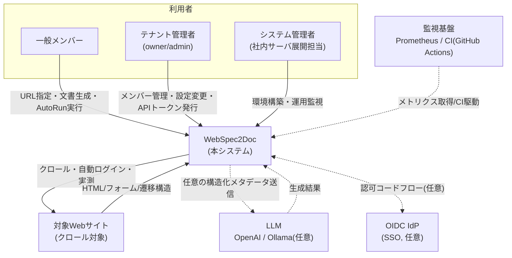
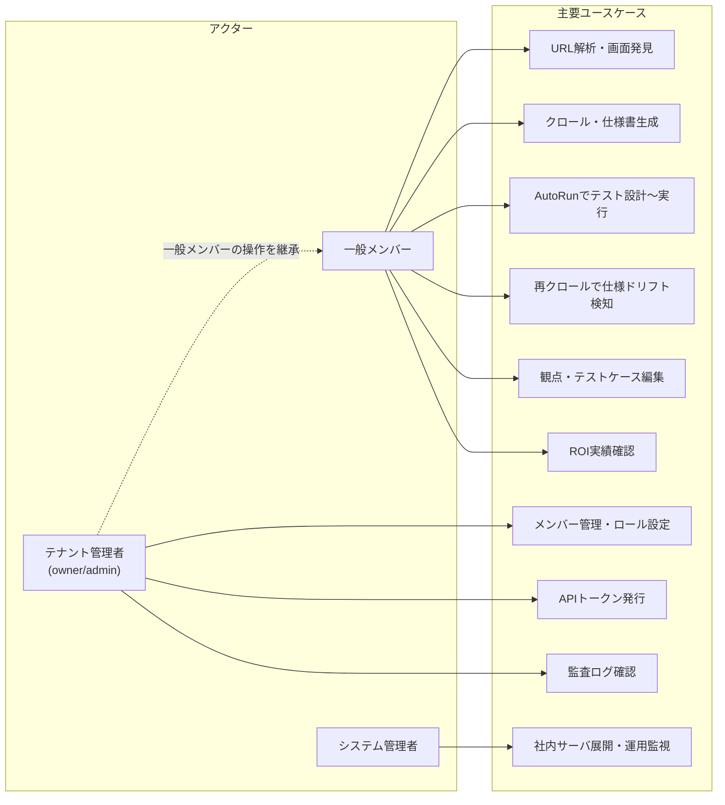
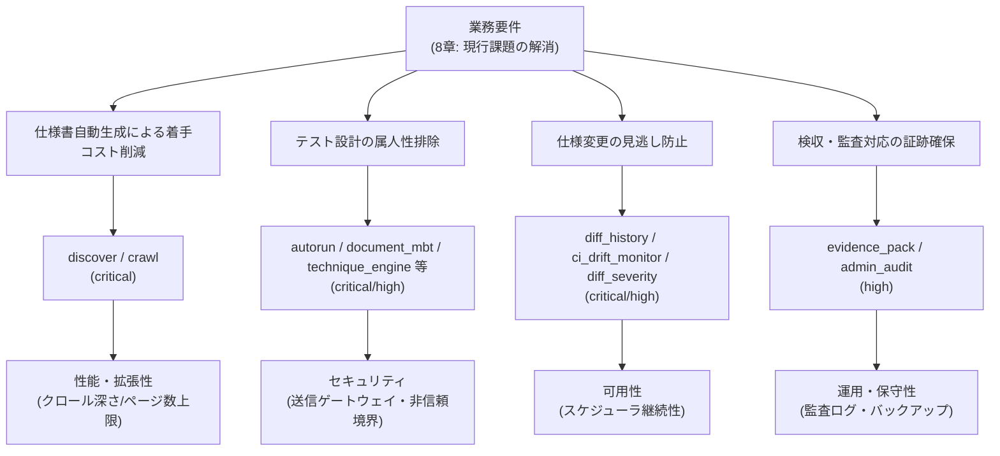

# WS2D-RD-001 要件定義書

- 文書ID: WS2D-RD-001
- 版数: 4.0 / 作成日: 2026-07-16 / 最終更新: 2026-08-02 / 準拠: IPA 共通フレーム（要件定義）
- 要件の機械可読ソース: `quality/feature_contracts.yml`（本書はその整形・解説）
- 要件IDは `feature_id`。優先度は `risk_level`、受入基準は `required_tests` に対応。

> **件数についての注記**: `docs/sdlc/README.md`（2026-07-16実測記載）および本書旧版は要件数を「19件」「33件」としていたが、
> 本書執筆時点（2026-08-02）に `grep -c '"feature_id"' quality/feature_contracts.yml` で再実測した結果は **51件**
> （内訳: critical 11 / high 20 / medium 18 / low 2、全件 `status: implemented`）。機能追加により件数が増えたため、
> 本書はこの実測値51件を正とし、旧版の19/33という数値は古い記載として扱う。内訳は本書執筆にあたり `quality/feature_contracts.yml`
> の全51件を手動で risk_level 別に再集計し、上記grep実測値と一致することを検算済みである。

## 1. 文書概要

### 1.1 目的

本書は WebSpec2Doc の要件定義工程の成果物として、業務要件・機能要件・非機能要件の関係を整理し、開発・レビュー・検収の共通の合意基盤とすることを目的とする。要件の一次ソースは `quality/feature_contracts.yml`（機械可読）であり、本書はこれを人間が読める形に整形・解説する位置づけを持つ。両者に齟齬が生じた場合は `feature_contracts.yml` を正とする。

### 1.2 適用範囲

対象は 2026-08-02 時点でメインブランチにマージ済みの WebSpec2Doc、すなわちマルチテナント認証実装（PR #154〜#158 系列）を含む現行版である。GUI・CLIモード・AutoRun自動QAパイプライン・ドキュメント生成・観点管理・仕様ドリフト検知・ROIダッシュボード・アプリ利用者認証とテナント分離のすべてを対象とする。将来の拡張ロードマップ（`docs/11_機能拡張ロードマップ_現新比較とUX検証.md`）記載の未着手項目は対象外。

### 1.3 読者

- QAエンジニア・テスト設計者（主利用者。生成物を基にテスト観点・ケースを設計する）
- 対象システムの開発者（生成された仕様書・ドリフト検知結果を受け取る側）
- テナント管理者（owner/admin。ワークスペース運用の意思決定者）
- 開発チーム（実装担当。本書を実装のインプットとする）
- レビュアー・検収担当者（本書を検収基準の一部として参照する）

### 1.4 関連文書

| 文書番号 | 文書名 | 関係 |
|---|---|---|
| WS2D-NF-001 | 非機能要件定義書 | 本書10章の詳細（性能・可用性・セキュリティ等の数値要件） |
| WS2D-BD-001 | 基本設計書 | 本書の下位。アーキテクチャ・方式設計 |
| WS2D-GL-001 | 用語集 | 全社共通の用語定義 |
| `CONTEXT.md` | プロダクトコンテキスト | ドメイン背景・設計判断の経緯 |
| `README.md` | 利用者向け説明 | セットアップ・機能一覧・CLI仕様 |
| `docs/AUTH_TENANCY.md` | 認証・テナント分離仕様 | 5章・11章の一次情報源 |
| `docs/DEVELOPMENT.md` | 開発者向けハンドブック | 環境構築・運用手順の詳細 |
| `docs/TESTING_STRATEGY.md` | テスト戦略 | 受入基準（required_tests）の技法的背景 |
| `quality/feature_contracts.yml` | 機能契約（機械可読） | 9章・51件表の一次ソースそのもの |
| `docs/11_機能拡張ロードマップ_現新比較とUX検証.md` | 機能拡張ロードマップ | 1.2節で言及する将来拡張項目の詳細 |

### 1.5 用語

主要な用語の定義は `WS2D-GL-001` 用語集を正とする。本書で頻出する用語のうち、`WS2D-BD-001`（基本設計書）1.4節と共通のシステム固有語を抜粋する。「機能要件」は `feature_contracts.yml` の `feature_id` 単位（9章、51件）を指し、「非機能要件」は IPA 非機能要求グレードの6大項目単位（`WS2D-NF-001`）を指す。

| 用語 | 説明 |
|---|---|
| WebSpec2Doc | 稼働中WebサイトのURLからQAテスト設計インプット文書を自動生成するツール本体 |
| サイト認証 | クロール対象Webサイトへのログイン（`/api/login/*`）。ID/PASSWORDは送信後即破棄しセッションのみ保存 |
| 利用者ログイン | WebSpec2Doc自体を使う人の認証（`/auth/*`）。サイト認証と名前空間を分離 |
| テナント／ワークスペース | 利用者の作業単位。`WEBSPEC2DOC_AUTH_MODE`に応じてデータ分離の粒度が変わる |
| 観点（Viewpoint） | テスト観点をツリー構造で管理する単位 |
| AutoRun | 解析→設計→spec生成→テスト実行までを自動化する実行系 |
| 段階承認 | AutoRunの各段階で利用者が承認または差し戻しを行う仕組み |
| ドリフト検知 | 再クロール時に前回スナップショットとの差分を検出する機能 |
| evidence（根拠） | 生成された仕様・テスト条件に紐づく実測セレクタ・スクリーンショット座標等の裏付け情報 |
| Blueprint | Flaskのルーティング分割単位。26 Blueprint・200エンドポイントで構成 |
| spec.ts | AutoRunが生成するPlaywright実行用テストスクリプト |
| egress制御 | クロール対象への発信をローカル／許可ホストに限定するSSRF対策 |

## 2. システム化の背景

### 2.1 現行業務の課題

- 稼働中のWebシステムに最新の仕様書が存在しない、または陳腐化しているケースが多く、QAエンジニアがテスト設計に着手する前にドキュメント整備という余計な工程が発生する。
- 手作業でのWeb仕様書作成・テスト設計は工数が大きく、担当者の経験に依存する（属人化）。同値分割・境界値分析・デシジョンテーブル等の技法適用も人手では網羅性を担保しづらい。
- 仕様変更（ドリフト）の検知は定期的な手動比較に頼らざるを得ず、見逃しリスクと工数が発生する。

### 2.2 課題の詳細（フェーズ別、一般的傾向としての整理）

以下は本プロダクトが解決対象とする課題を、QA工程のフェーズ別に整理したものである。特定の顧客・現場の実測工数ではなく、手動QA作業に一般的に伴う構造的リスクとして記載する（数値の実測はない）。

- **仕様把握フェーズ**: ドキュメントが存在しない、または実装と乖離した状態では、QAエンジニアが対象システムを手動で操作し、画面構成・入力項目・遷移を目視で記録する必要がある。読み取りの網羅性は担当者の経験と投入時間に依存しやすい。
- **テスト設計フェーズ**: 同値分割・境界値分析・デシジョンテーブル・状態遷移テスト等のISTQB標準技法の適用は、担当者の技法知識と経験に依存し、適用の有無・網羅度にばらつきが生じやすい。
- **実行フェーズ**: 手動実行が中心となる場合、回帰確認のたびに同等の工数が再発生しやすい。
- **保守フェーズ**: 対象システムの仕様変更が発生しても、これを検知する仕組みが定期的な手動比較以外にないと、見逃しリスクと突発的な調査工数が発生しやすい。
- **検収・監査フェーズ**: テスト実施記録・証跡が個人のファイルに散在すると、検収・監査時に再構成の工数が生じやすい。

### 2.3 本システムによる解決の方向性

| 課題 | 本システムによる解決 |
|---|---|
| ドキュメント不在による着手コスト | URL入力のみで画面仕様書・遷移図・テスト条件を自動生成 |
| 手動テスト設計の属人性・工数 | 境界値分析(BVA)・状態遷移テスト・t-way被覆配列等の技法をルールベース/LLMで自動適用 |
| 仕様変更の見逃し | 再クロールによる差分検知、CI組み込みのDrift Check as Code |
| 実施記録の不在（検収・監査対応） | 検収・監査向けテスト実施証跡パック(`evidence_pack`)、送信ログ(`egress_log.ndjson`) |

### 2.4 本システムが検証する範囲・しない範囲（境界の明確化）

- 検証する: クロールで実際に観測できた画面構成・入力項目・遷移構造（evidence付き）
- 検証する: axe-core・ニールセン10原則に基づく静的なUXヒューリスティック（`ux_review`）
- 検証する: 再クロール時点との構造的な差分（仕様ドリフト）
- 検証しない: 対象システムのビジネスロジック・データベース設計そのものの適否
- 検証しない: 対象システムのパフォーマンス実装の適否（本システム自体の性能要件は`WS2D-NF-001`が対象）
- 検証しない: LLM生成所見の最終的な妥当性（QAエンジニアによる確認を前提とする）
- 検証しない: 対象システムのセキュリティ実装そのもの（本システムは脆弱性診断ツールではない、12章）

## 3. システム化の目的とゴール

稼働中のWebシステムのURLを渡すだけで、QAエンジニアがテスト設計を始めるために必要な文書（画面仕様書・テスト設計・画面遷移図・テストケース等）を自動生成する。一度登録したサイトを再クロールして**仕様ドリフトを検知**する継続利用を主眼とする。以下、ゴールを可能な限り測定可能な形で記載し、測定値・目標値が存在しない項目は「目標値未設定」と明記する（数値の捏造は行わない）。

| ゴール | 現状の測定状況 |
|---|---|
| 仕様書作成の着手コスト削減 | 目標値未設定・未測定。URL投入から画面仕様書生成までの所要時間は同梱デモ（`make demo`）で体験できるが、削減時間の定量値は未計測 |
| テスト設計技法の適用網羅性 | 状態遷移テスト・境界値分析・6技法（分類ツリー法・直交表・原因結果グラフ・ドメイン分析・エラー推測・ユースケーステスト、`autorun_extended_techniques`）は実装済みで機械的に適用されるが、削減時間・削減コストの金額換算目標は未設定 |
| 仕様ドリフトの検知 | 検知の仕組み（`diff_history`, `ci_drift_monitor`, `diff_severity`）は実装済み。検知率・見逃し率（本番運用での実測）は未計測 |
| ROI（削減工数の可視化） | `usage_roi` ダッシュボードで推定表示するが、換算係数は環境変数設定値であり実測に基づく検証は未実施（未検証） |
| 品質保証の内部指標 | `docs/sdlc/README.md` 系列の実測（2026-07-16時点、`make coverage`でカバレッジ84.30%、`make test`でL1/L2 1,831件合格、`make verify-ui`でE2E 200件合格）はあるが、本書改訂時点で再実行はしていない（詳細は `WS2D-NF-001` 2章） |
| 内部品質の作り込み | `scripts/quality_harness.py`による機能契約検証・シンボル実在チェックを実装済み。定量的な「作り込み品質スコア」の目標値は未設定 |

いずれの項目も、本書改訂時点で正式なKPI・数値目標は未設定である。今後、実運用データが蓄積された段階で目標値を設定し、本書を改訂する（15章の今後の課題として管理する）。

## 4. 業務コンテキストと対象業務範囲

### 4.1 業務コンテキスト図（図1）

上図は本システムと外部アクター（利用者3種、対象Webサイト、LLM、IdP、監視基盤）の関係を示す。利用者からの操作はすべてWebSpec2Docを経由し、対象Webサイトへの直接アクセスは本システムのクロール処理のみが行う（利用者が対象サイトへ直接アクセスする経路は本システムの管理対象外）。LLM・IdP・監視基盤との連携は全て任意（未設定でも主要機能は動作）であり、破線で表現している。対象Webサイトへ渡す情報は構造化メタデータのみであり、本文等の自由文は渡さない（非信頼コンテンツ境界、10章参照）。

### 4.2 対象業務範囲

Webサイト/Webアプリケーションのクロール・解析・QA文書生成・AutoRunによるテスト設計〜実行・定期的なドリフト監視が対象業務範囲である。対象サイトへの書き込みを伴う業務（実データの登録・更新等）や、対象サイト自体の機能開発・運用は範囲外。対象サイトの正当なアクセス許可の取得・維持は利用者側の責務とする（12章）。

## 5. ステークホルダーと役割

| 役割 | 説明 | 関心事 | 期待 | 制約 | 対応するロール／機能契約 |
|---|---|---|---|---|---|
| テナント管理者（owner / admin） | ワークスペースの作成・メンバー管理・設定変更（LLMキー等）・APIトークン発行を行う | ワークスペース運用の安全性・メンバーの適切な権限管理 | メンバー管理・監査ログ確認を画面から完結できること | 設定変更・メンバー管理はowner/admin限定。最後の有効オーナーは無効化・降格不可 | `tenant_membership`, `account_auth` |
| 一般メンバー（member） | ドキュメント作成・AutoRun実行等の日常操作を行う。設定変更・メンバー管理は不可 | クロール・テスト生成が迅速かつ正確であること | URL投入だけで実用的な仕様書・テスト設計が得られること | 設定変更・メンバー管理・APIトークン発行は不可 | `account_auth`, `autorun`, `crawl` |
| システム管理者（社内サーバ展開担当） | venv+systemdでの展開・環境変数設定（`WEBSPEC2DOC_TRUSTED_HOSTS`等）・稼働監視を行う | 展開の容易さ・障害時の自動復旧・セキュリティ設定の可視性 | 環境変数のみで社内ネットワーク展開ができること | Docker不使用の方針上、コンテナオーケストレーション基盤は利用不可 | 前提条件（12章）、`observability` |
| 対象システムの開発者 | 生成された画面仕様書・ドリフト検知結果・現新比較レポートを受け取り、変更の影響範囲を確認する | 自分たちの実装変更が意図せぬ形で仕様として固定化されないこと | ドリフト検知結果が正確で誤検知が少ないこと | 本システムへの直接操作権限は前提としない（受け取る側） | `diff_history`, `old_new_comparison` |
| QAエンジニア／テスト設計者（主利用者） | 生成物を基にテスト観点・テストケースを設計し、AutoRunで実行・レポートを確認する | 生成された観点・ケースがテスト設計の出発点として使えること、根拠(evidence)が明示されること | 技法適用の網羅性、証跡付きレポート | 対象サイトの業務ロジック・データ正しさの検証は本システムの範囲外（自身で別途担保） | `autorun_stage_approval`, `testcase_table`, `document_mbt` |
| 検収・監査担当者（第三者検証会社を含む） | 納品物の検収・監査、テスト実施記録の妥当性確認を行う | 証跡の網羅性・改ざん耐性・第三者が読んでも追跡可能であること | evidence_packやaudit.jsonlで機械的に検証できること | 本システムの操作権限は持たず、生成物を受け取って確認する側であることが多い | `evidence_pack`, `admin_audit` |

> 実装上のロールは `owner` / `admin` / `member` の3段階（`docs/AUTH_TENANCY.md`）。本書の「テナント管理者」は owner・admin の両方を指す。「システム管理者」はアプリ内のロールではなく、社内サーバへの展開・運用を担う外部の役割であり、通常はテナント管理者と兼任されることが多いが、本書では関心事の違いから別ステークホルダーとして扱う。

## 6. アクターとユースケース

### 6.1 ユースケース図相当（図2）

### 6.2 ユースケース一覧表

| ユースケースID | ユースケース名 | 主アクター | 対応する機能要件ID | 概要 |
|---|---|---|---|---|
| UC-01 | URL解析・画面発見 | 一般メンバー | `discover` | URLを入力し到達可能な画面候補を検出する |
| UC-02 | クロール・仕様書生成 | 一般メンバー | `crawl` | 検出画面をクロールし画面仕様書・レポートを生成する |
| UC-03 | AutoRunでテスト設計〜実行 | 一般メンバー | `autorun`, `autorun_stage_approval`, `document_mbt` | 解析から段階承認を経てテスト実行までを一気通貫で行う |
| UC-04 | 再クロールで仕様ドリフト検知 | 一般メンバー | `diff_history`, `diff_severity` | 前回スナップショットとの差分を検出し重要度を判定する |
| UC-05 | 観点管理・テストケース編集 | 一般メンバー | `testcase_table`, `condition_to_testcase_link` | テスト観点・テストケース表を編集し実行結果を紐づける |
| UC-06 | ROI実績確認 | 一般メンバー | `usage_roi` | 利用実績から削減工数の推定値を確認する |
| UC-07 | メンバー管理・ロール設定 | テナント管理者 | `tenant_membership` | ワークスペースメンバーの追加・削除・ロール変更を行う |
| UC-08 | APIトークン発行 | テナント管理者 | `api_v1_openapi`, `sso_oidc` | `/api/v1` 向けのテナントAPIトークンを発行・失効する |
| UC-09 | LLMキー等の環境設定変更 | テナント管理者 | `settings` | OpenAIキー等の `.env` 設定を変更する |
| UC-10 | 監査ログ確認 | テナント管理者 | `admin_audit` | 管理操作の監査ログを確認する |
| UC-11 | スナップショット保持ポリシー設定 | テナント管理者 | `snapshot_retention` | 保持世代数・容量上限を設定する |
| UC-12 | CI組み込みドリフト監視の設定 | システム管理者 | `ci_drift_monitor` | GitHub Actions等でのドリフト監視ワークフローを設定する |
| UC-13 | 社内サーバ展開・運用監視 | システム管理者 | 前提条件、`observability` | venv+systemdでの展開、Prometheusメトリクスの監視設定を行う |
| UC-14 | 現新比較（移行検証） | 一般メンバー | `old_new_comparison` | 移行前後のサイトを比較し差分を検証する |
| UC-15 | Doc Fusion（既存仕様書との突合） | 一般メンバー | `doc_fusion` | 既存の参考文書と実測結果を突合しギャップを検出する |
| UC-16 | 検収向け証跡パック出力 | 一般メンバー | `evidence_pack` | テスト実施の証跡をパック化して出力する |
| UC-17 | マルチビューポート検証 | 一般メンバー | `multi_viewport` | 複数画面幅でのレイアウト差分を検証する |
| UC-18 | 完全アーカイブ取得 | テナント管理者 | `full_archive` | sitemap/PDF等を含む完全アーカイブを取得する |
| UC-19 | API仕様の逆生成確認 | 一般メンバー | `api_spec_recovery` | 実測から画面↔API対応表を逆生成し確認する |
| UC-20 | 文言表記ゆれチェック | 一般メンバー | `wording_consistency` | サイト内文言の表記ゆれを確認する |
| UC-21 | CI警告一掃の確認（内部品質） | 開発チーム | `ci_warnings_cleanup` | pytest収集警告・Pillow非推奨警告が解消されていることを確認する |

## 7. 業務フロー

業務フローの詳細な図（画面遷移を含むアクティビティ図相当）は [`WS2D-BF-001` 業務フロー図](WS2D-BF-001_業務フロー図.md)に譲り、本書では概要のみを記載する。GUIの標準利用フローは次の4ステップであり、システム化範囲全体を横断する。

| ステップ | 操作 | 主な関連機能 |
|---|---|---|
| 1. 解析 | URLを入力して「画面分析」を実行、N件の画面を検出 | `discover` |
| 2. 条件設定 | 取得する画面の選択・ログイン設定・差分オプション指定 | `login`, `settings` |
| 3. 実行 | クロール中のライブプレビューで進捗確認 | `crawl` |
| 4. レポート | 8タブで成果物を確認・エクスポート | `spec_xlsx_full_export`, `state_transition_table`, `testcase_table` |

AutoRunを利用する場合は、上記フローに代えて「目的→計画→FE→観点→設計→詳細→ケース」の7段階承認パイプライン（`autorun_stage_approval`）に沿って進む。再クロールによるドリフト検知（`diff_history`）は、既存サイトに対して2.〜4.のフローを再実行する形を取る。いずれのフローも、対象サイトへの状態変更リクエスト（POST/PUT/PATCH/DELETE）は既定で遮断される（12章）。

## 8. 業務要件

### 8.1 現行業務（As-Is）の課題

- QAエンジニアが対象システムを手動で操作し、画面一覧・入力項目・遷移を目視で記録する。
- テスト観点・テストケースを人手でExcel等に起票する。同値分割・境界値分析等の技法適用は個人のスキルに依存する。
- 仕様変更の検知は定期的な手動比較に頼り、見逃しリスクと工数が発生する。
- テスト実施記録・証跡が個人のファイルに散在し、検収・監査時に再構成が必要になる。

### 8.2 導入後の姿（To-Be）

- URL入力だけで自動クロール→解析→画面仕様書／テスト設計／遷移図／テストケースを自動生成する（`discover`, `crawl`）。
- 観点管理・AutoRunで実測ベースのテスト設計〜実行〜レポート作成まで一気通貫に行う（`autorun`, `autorun_stage_approval`, `document_mbt`）。
- 再クロールで前回との差分を自動検知し、CI組み込みでドリフトをゲートする（`diff_history`, `ci_drift_monitor`）。
- ROIダッシュボードで削減工数を可視化する（`usage_roi`）。
- 検収・監査向けにテスト実施の証跡パックを生成する（`evidence_pack`）。

## 9. 機能要件一覧（51件）

各要件の UI／route／core 実装ファイル・シンボル・異常系・成果物・永続化先は `quality/feature_contracts.yml` に定義され、`WS2D-TM-001`（トレーサビリティ）で実装・テストまで追跡できる。以下は51件全件を掲載する（省略なし）。「関連モジュール」は `core_files` のうち代表的なものを1〜2件抜粋しており、全量は `quality/feature_contracts.yml` を参照。

| 要件ID | 機能名 | 概要 | 優先度 | 関連画面 | 関連API | 関連モジュール |
|---|---|---|---|---|---|---|
| `discover` | URL解析 / 画面発見 | 対象URLから到達可能な画面候補を検出する | critical | ウィザード ステップ1（view-generate.html） | `web/routes/discover.py`（/api/discover, /api/discover-stream） | `src/crawler/page_crawler.py`, `src/crawler/url_safety.py` |
| `crawl` | クロール / レポート生成 | 検出画面をクロールし画面仕様書・レポートを生成する | critical | ウィザード ステップ3（view-generate.html） | `web/routes/crawl.py`（/run, /api/cancel, /api/live-screenshot） | `src/crawler/parallel_crawler.py`, `src/analyzer/html_analyzer.py` |
| `login` | ログイン / セッション（対象サイト） | クロール対象サイトへの自動ログインとセッション保存 | critical | ウィザード内ログインフォーム | `web/routes/login.py`（/api/login/*） | `src/crawler/auto_login.py`, `src/analyzer/login_wall.py` |
| `account_auth` | アプリ利用者認証 | WebSpec2Doc自体へのログイン・初期セットアップ・アカウント管理 | critical | auth/login.html, setup.html, account.html, signup.html | `web/routes/account.py`（/auth/*, /api/auth/*） | `web/services/auth_store.py`, `web/auth.py` |
| `tenant_membership` | テナント選択と所属管理 | 利用者とワークスペースの所属・ロール（owner/admin/member）を管理する | critical | auth/user.html, auth/tenant.html, admin/console.html | `web/routes/tenant_admin.py`, `account.py` | `web/services/auth_store.py` |
| `tenant_isolation` | テナント分離 | 出力・観点DB・APIトークンをワークスペース単位で分離する | critical | auth/account.html | `web/routes/account.py` | `web/tenancy.py`, `web/services/viewpoint_store.py` |
| `autorun` | AutoRun | 解析→クロール→QA生成→テスト実行を一つのフローで行う | high | view-auto-run.html | `web/routes/auto_run.py` | `web/services/spec_ts_generator.py`, `web/services/playwright_executor.py` |
| `diff_history` | 差分 / 履歴 / 再クロール | 再クロールし前回スナップショットとの仕様ドリフトを検出する | critical | history.js, recrawl.js, results.js | `web/routes/history.py`, `site.py`, `runs.py` | `src/diff/snapshot.py`, `src/diff/differ.py` |
| `settings` | 設定 | LLMキー等の環境設定を管理する | high | view-settings.html | `web/routes/settings.py`, `pages.py` | `web/env_store.py` |
| `usage_roi` | ROIダッシュボード / 利用実績 | 利用実績から削減工数（時間・円）を推定表示する | medium | view-usage.html | `web/routes/usage.py` | `web/services/usage_tracker.py` |
| `coverage_gap_report` | カバレッジと未確認領域 | 網羅性証明として未確認領域を可視化する | medium | report.html内セクション | （レポート生成に統合、専用APIなし） | `src/generator/coverage_gap.py` |
| `doc_fusion` | 文書×実測突合（Doc Fusion） | 既存仕様書等の参考文書と実測結果を突合しギャップを検出する | high | view-generate.html（doc-fusion.js） | `web/routes/crawl.py`, `traceability.py` | `src/ingest/loader.py`, `src/ingest/matcher.py` |
| `exploration_capture` | 探索セッション記録 / カバレッジヒートマップ | 手動探索操作を記録しカバレッジをヒートマップ化する | high | （report経由、専用画面なし） | `web/routes/report.py` | `src/capture/session_recorder.py`, `src/capture/coverage.py` |
| `reverse_assets` | リバース（記録セッション→テスト資産逆生成） | 記録済み探索セッションからテスト資産を逆生成する | medium | なし | なし（内部生成） | `src/capture/reverse_generator.py` |
| `field_definition_bva` | 項目定義書＋境界値分析（BVA） | 入力項目の境界値テストデータを自動生成する | medium | なし（spec.xlsxへ出力） | なし（内部生成） | `src/analyzer/bva.py` |
| `finding_ticket` | 気づきマーク→再現手順付きバグ票 | 探索中の気づきを再現手順付きバグ票として出力する | medium | なし | なし（内部生成） | `src/capture/finding_reporter.py` |
| `test_plan` | テスト計画ドラフト生成 | インベントリ×ROI係数から工数見積・スコープ表を生成する | medium | なし | `web/routes/qa_process.py` | `src/generator/test_plan_generator.py` |
| `ci_warnings_cleanup` | CI警告一掃 | pytest収集警告・Pillow非推奨警告を解消し再発を防止する | low | なし | なし（内部品質） | `src/diff/screenshot_diff.py`, `src/llm/viewpoint_generator.py` |
| `old_new_comparison` | 現新比較モード | 移行前後のサイトを比較し差分を検証する | high | view-compare.js | `web/routes/history.py` | `src/diff/pair_matcher.py`, `src/diff/comparison.py` |
| `ux_review` | UX自動エキスパートレビュー | axe-core＋ニールセン10原則によるUX所見を生成する | medium | report.html「UX所見」タブ | なし（内部生成） | `src/ux/axe_runner.py`, `src/ux/heuristics.py` |
| `snapshot_retention` | スナップショット保持・容量・バックアップ運用 | 保持ポリシーに基づきスナップショットを自動整理する | high | view-settings.html | `web/routes/admin.py` | `web/services/retention.py` |
| `admin_audit` | 管理操作のテナント監査ログ | 管理操作を監査ログに記録する | high | view-settings.html | `web/routes/admin.py` 他複数 | `web/services/admin_audit.py` |
| `ci_drift_monitor` | Drift Check as Code | CI組み込みのドリフト監視とSlack通知を行う | high | view-settings.html | CIワークフロー経由（専用routeなし） | `src/ci_drift.py`, `web/services/drift_summary.py` |
| `document_mbt` | 文書駆動MBT | 参考文書の要件と実測を突合しMBTモデルからテスト設計する | critical | view-auto-run.html（autorun-document.js） | `web/routes/auto_run.py` | `src/mbt/document_model.py`, `src/mbt/manual_procedures.py` |
| `evidence_pack` | 検収・監査向けテスト実施証跡パック | テスト実施の証跡をパック化して出力する | high | （autorun.js経由） | `web/routes/auto_run.py` | `src/evidence/pack_model.py` |
| `diff_severity` | 差分の重要度判定と誤検知フィルタ | 差分に重要度を付与し除外ルールで誤検知を抑制する | high | なし（diff_report.htmlへ出力） | なし（内部生成） | `src/diff/severity.py`, `src/diff/ignore_rules.py` |
| `api_v1_openapi` | REST API拡充とOpenAPI公開 | `/api/v1` 系REST APIとOpenAPI仕様を公開する | high | なし | `web/routes/api_v1.py`, `api_v1_schedule.py` | `web/services/openapi_spec.py` |
| `multi_viewport` | マルチビューポート仕様書 | 複数画面幅でのレイアウト差分を検証する | medium | なし | なし（内部生成） | `src/viewport/profiles.py`, `src/viewport/comparison.py` |
| `sso_oidc` | SSO（OIDC） | OIDCによるシングルサインオンとAPIトークンスコープを提供する | critical | なし | `web/routes/oidc.py` | `web/services/oidc.py` |
| `observability` | 可観測性 | Prometheusメトリクス・構造化ログを提供する | medium | なし | `web/routes/metrics.py` | `web/services/metrics.py` |
| `api_spec_recovery` | API仕様の逆生成 | 実測から画面↔API対応表・OpenAPI雛形を逆生成する | medium | なし | なし（内部生成） | `src/apispec/recovery.py` |
| `screen_coverage_map` | 画面カバレッジマップ | 画面のテスト実行網羅状況をマップ化する | medium | なし | なし（内部生成） | `src/apispec/coverage_map.py` |
| `wording_consistency` | 文言一貫性・表記ゆれチェック | サイト内文言の表記ゆれを検出する | low | なし | なし（内部生成） | `src/wording/consistency.py` |
| `full_archive` | 完全アーカイブと外形監視 | sitemap/PDF等を含む完全アーカイブと外形監視を行う | medium | なし | なし（内部生成） | `src/archive/full_archive.py`, `src/archive/external_monitor.py` |
| `qa_assistant_chat` | QAアシスタント（LLMチャット） | LLMへのQA相談チャットを提供する | medium | view-auto-run.html（autorun-chat.js） | `web/routes/llm_chat.py` | `src/llm/openai_client.py` |
| `autorun_stage_approval` | AutoRun 段階承認パイプライン | テスト目的〜テストケースまでを段階的に人間承認する | critical | view-auto-run.html（autorun-stages.js） | `web/routes/autorun_stages.py` | `src/autorun/automation_plan.py`, `src/autorun/stages.py` |
| `autorun_result_report` | AutoRun 実行結果レポート専用ページ | 実行結果を専用ページでダッシュボード表示する | high | autorun-report.html | `web/routes/autorun_report.py` | `src/autorun/qf_schema.py` |
| `autorun_security_kernel` | AutoRun セキュリティカーネル | 送信ゲートウェイと非信頼コンテンツ境界を提供する | critical | なし | なし（内部機構） | `web/services/egress_gateway.py`, `web/services/untrusted_content.py` |
| `autorun_self_check` | AutoRun 自己検証（ミューテーションテスト） | 生成テストの検出力をミューテーションテストで自己検証する | high | autorun-report.js | `web/routes/auto_run.py` | `web/services/mutation_verifier.py` |
| `autorun_nonfunctional_judge` | AutoRun 非機能判定・観測完全性 | 非機能の基準線との合否判定と未観測領域を明示する | high | autorun-report.js | `web/routes/auto_run.py` | `web/services/nonfunctional_judge.py`, `web/services/observation_coverage.py` |
| `ui_visual_complexity` | UI 視覚的複雑性の実測・回帰検知 | 画面の視覚的複雑性を実測し回帰を検知する | medium | なし | なし（内部生成） | `web/services/visual_complexity.py` |
| `autorun_failure_triage` | AutoRun 失敗の原因特定 | 失敗の原因候補を特定し技法適用結果を提示する | high | なし | `web/routes/auto_run.py` | `web/services/failure_hypothesis.py` |
| `technique_engine` | テスト技法エンジン | t-way被覆配列の正準実装と性質検証器を提供する | high | なし | なし（内部生成） | `src/techniques/combinatorial.py`, `src/techniques/verify.py` |
| `autorun_extended_techniques` | テスト技法の網羅的適用 | 分類ツリー法・直交表等6技法を適用する | high | view-auto-run.html（autorun-stages.js） | `web/routes/autorun_stages.py` | `src/autorun/classification_tree.py`, `src/autorun/orthogonal_array.py` |
| `state_transition_table` | 状態遷移表 | ISTQB状態遷移テストの標準テーブルを生成する | high | view-transition.js | `web/routes/report.py` | `src/graph/state_table.py` |
| `testcase_table` | ローレベルテストケース表 | 10列テストケース表の生成・編集・Playwright実行を行う | high | view-testcase-grid.js | `web/routes/qa_process.py` | `src/generator/testcase_table.py`, `web/services/testcase_table_store.py` |
| `zero_wait_sample_report` | ゼロ待ちサンプルレポート | 同梱デモレポートを即時展開して体験可能にする | medium | view-dashboard.html | `web/routes/report.py`, `history.py` | `web/routes/report.py`, `web/config.py` |
| `cli_mode` | CLIモード（System 03） | 画面を使わず端末からdoc/autorun/testを実行する | high | cli.html | `web/routes/pages.py`（/cli）、実体は`src/cli.py` | `src/cli.py`, `web/services/cli_runner.py` |
| `spec_xlsx_full_export` | テスト仕様書一式のExcel出力（7シート） | 画面一覧〜遷移表まで7シートのExcelを一括出力する | medium | view-generate.html | `web/routes/report.py` | `web/services/export_xlsx.py` |
| `condition_to_testcase_link` | 条件⇄テストケースの接続 | 画面別設計の条件からテストケースへ絞り込み遷移する | medium | view-design.js, view-testcase-grid.js | `web/routes/qa_process.py` | `web/services/screen_test_design.py` |
| `condition_run_status` | テスト実行結果の設計への還元 | 実行結果を条件行にバッジとして反映する | medium | view-design.js | `web/routes/qa_process.py` | `web/services/condition_run_status.py` |

### 9.1 機能要件のグルーピング（参考）

51件は個別に独立した要件だが、実装上の関連性から次のようにグルーピングできる（本書執筆にあたり `quality/feature_contracts.yml` の内容から分類したものであり、正式なサブシステム分割は `WS2D-BD-001` 4章のコンポーネント図を正とする）。

| グループ | 件数 | 代表的な要件ID |
|---|---|---|
| 認証・テナント基盤 | 4 | `account_auth`, `tenant_membership`, `tenant_isolation`, `sso_oidc` |
| クロール・解析・ログイン | 3 | `discover`, `crawl`, `login` |
| AutoRun・段階承認・技法エンジン | 11 | `autorun`, `document_mbt`, `autorun_stage_approval`, `autorun_security_kernel`, `technique_engine`, `autorun_extended_techniques` 他 |
| 差分・ドリフト検知 | 4 | `diff_history`, `old_new_comparison`, `ci_drift_monitor`, `diff_severity` |
| テスト設計・実行支援 | 6 | `field_definition_bva`, `test_plan`, `state_transition_table`, `testcase_table`, `condition_to_testcase_link`, `condition_run_status` |
| 探索・記録・逆生成 | 4 | `exploration_capture`, `reverse_assets`, `finding_ticket`, `ui_visual_complexity` |
| 文書生成・エクスポート | 7 | `doc_fusion`, `multi_viewport`, `api_spec_recovery`, `screen_coverage_map`, `wording_consistency`, `full_archive`, `spec_xlsx_full_export` |
| 運用・可観測性 | 7 | `settings`, `usage_roi`, `snapshot_retention`, `admin_audit`, `api_v1_openapi`, `observability`, `cli_mode` |
| その他（品質内部施策等） | 5 | `coverage_gap_report`, `ci_warnings_cleanup`, `ux_review`, `qa_assistant_chat`, `zero_wait_sample_report` |

グループ別件数の合計は 4+3+11+4+6+4+7+7+5 = 51 件であり、9章の全件と一致する（検算済み）。この分類は実装ディレクトリ構成に基づく便宜的なものであり、`risk_level`とは独立した軸である点に注意する。

## 10. 要件の階層構造

### 10.1 階層構造図（図3）

### 10.2 導出根拠

上図は「業務要件→機能要件→非機能要件」の導出関係を示す。業務要件（8章のTo-Be像）は4つの解決テーマ（着手コスト削減、属人性排除、見逃し防止、証跡確保）に分解され、各テーマは対応する機能要件（9章の51件のうち代表例）に落とし込まれている。さらに各機能要件は、それを安全・安定に稼働させるための非機能要件（`WS2D-NF-001`）を要求する。例えば「仕様変更の見逃し防止」という業務要件は `diff_history` 等の機能要件を生み、その機能が定期的なスケジュール実行に依存するため「可用性（スケジューラ継続性）」という非機能要件を要求する、という具合である。この導出関係は本書と `WS2D-NF-001` の対応関係の根拠でもあり、非機能要件を単独の技術的都合ではなく業務要件からの必然的帰結として位置づけるために記載する。

## 11. 非機能要件の概要

非機能要件の詳細は `WS2D-NF-001_非機能要件定義書.md` を正とする。本書ではIPA非機能要求グレードの6大項目それぞれについて、現状の充足状況を一行で要約する。

| 項目 | 現状の要約 |
|---|---|
| 可用性 | 単一プロセス構成を前提に死活監視・自動再起動を実装。SLA目標値は未設定 |
| 性能・拡張性 | クロール深さ・ページ数・並列数に安全上限を設定済み。負荷試験は未実施 |
| 運用・保守性 | メトリクス・監査ログ・環境診断コマンドを整備済み |
| 移行性 | 環境変数による外部注入とDBマイグレーション機構を実装済み |
| セキュリティ | 送信ゲートウェイ・非信頼コンテンツ境界を含む5層の防御を実装済み（詳細は`WS2D-NF-001`5章） |
| システム環境・エコロジー | PC専用・Docker不使用の方針に沿った実装（Python 3.12固定） |

数値要件（設定値・実測値・未計測項目の一覧）はすべて `WS2D-NF-001` に記載し、本書では重複記載しない。

## 12. スコープ外（Non-Goals）

- **モバイル・タブレット対応は行わない。** 本体（GUI、ポート8765）はPC専用。`pages/` のオンラインショーケース（紹介用の静的サイト）はスマホ閲覧に対応するが、これはツール本体とは別物であり、GUI自体のレスポンシブ対応は範囲外。
- **Docker配布は行わない。** README に明記の通り「コンテナは使用しない方針」。従業員1,000人超の組織ではDocker Desktopが有償ライセンス対象となるため、Dockerfile・compose定義を置かない。社内サーバ展開は venv + systemd を前提とする。
- **対象サイトへの書き込み・破壊的操作は行わない。** クロール礼儀（`src/crawler/politeness.py`）とAutoRunの実測バリデーションはPOST/PUT/PATCH/DELETE等の状態変更リクエストを遮断する。フォーム送信を伴うテスト実行は既定で無効（`form_submit_enabled` が明示有効化された場合のみ）。
- **対象サイト自体の脆弱性診断（ペネトレーションテスト）は目的としない。** UXレビュー・機能テスト・仕様ドリフト検知が主眼であり、対象サイトのセキュリティ診断機能は持たない。
- **対象サイトのビジネスロジック・データの正しさの検証は行わない。** 実測できるのは構造（画面・入力項目・遷移）であり、業務データの整合性は範囲外。
- **水平スケール（複数プロセス・複数ホストでの負荷分散）は前提としない。** PC単体または単一サーバでの垂直的な運用が設計上の前提であり、多重化・自動フェイルオーバーは範囲外（`WS2D-BD-001` 10章）。
- **他ブラウザエンジン（Firefox/WebKit等）への対応は行わない。** Playwright自体は対応可能だが、本システムは動作検証をChromiumに限定しており、他エンジンでの動作は未検証（`WS2D-BD-001` 10章）。
- **多言語（日本語以外）のUI・生成文書への対応は行わない。** GUI・生成される仕様書はいずれも日本語を前提とする。
- **Excel以外の帳票フォーマット（Word/PowerPoint等）への出力は行わない。** 対応形式は`web/config.py: ALLOWED_FORMATS`が定義する5種（md/html/excel/pdf/json）に限定される。
- **対象システムの要件定義・設計・実装そのものの支援は行わない。** 本システムは既に稼働中のシステムを対象とする「事後」のツールであり、これから作るシステムの上流工程を支援するものではない。
- **同梱デモサイト（`make demo`）は動作確認専用であり、外部に公開しない。** 対外的な検証環境として利用することは想定していない。
- **経営層向けの独立した経営レポート機能は持たない。** ROIダッシュボード（`usage_roi`）はワークスペース単位の実績表示に留まり、全社横断の経営指標統合は範囲外。
- **他言語SDK・クライアントライブラリの提供は行わない。** `/api/v1`はOpenAPI仕様を公開するが、公式SDKの配布は範囲外。

## 13. 前提条件・制約条件

- 対象サイトへの正当なアクセス許可が利用者側にあることを前提とする（許可のないサイトへのクロールは利用者の責任）。
- **robots.txt を尊重**し、per-originレート制御（crawl-delay）を既定で有効化する（`src/crawler/politeness.py`）。
- **ログイン必要サイト**は自動ログイン機能でID/PASSWORDを入力する。認証情報は送信後即破棄し、セッション（Cookie等）のみ `output/{domain}/auth.json` に保存する（パスワード本体は保持しない）。
- **LLM連携（OpenAI）はオプション。** 未設定時はルールベースでフォールバック生成する（`CONTEXT.md`）。ローカルのOllamaも代替バックエンドとして利用可能（本書執筆時点でOllama(qwen2.5:3b)の利用実績あり）。
- **対応ブラウザ実行基盤は Playwright Chromium** に限定する。
- **Python 3.12 が必須。** 3.13 は greenlet のビルド失敗のため非対応（README）。
- **既定は127.0.0.1バインドのみ許可。** 社内サーバ展開時のみ `WEBSPEC2DOC_TRUSTED_HOSTS` で許可ホストを明示的に追加する（`web/security.py`）。
- **既定は単一プロセス構成。** GUI・CLIともに1プロセスを基本とし、クロール・AutoRun実行時のみPlaywrightをサブプロセスとして都度起動する（`WS2D-BD-001` 7.3節）。
- **出力形式は5種（md/html/excel/pdf/json）に限定。** Word等の他形式は本書執筆時点で非対応（`web/config.py: ALLOWED_FORMATS`）。
- **監査ログ・観測結果はクロール時点のスナップショットに基づく。** 対象サイトがクロール後に変更されても次回再クロールまで反映されない。
- **CI連携はGitHub Actionsでの利用実績を前提とする。** GitLab CI・CircleCI等でも同等のexit codeで利用可能だが、公式にサポートするワークフロー定義はGitHub Actions向けのみ（README実測）。

## 14. 要件に関わるリスクと対応方針

| リスクID | リスク内容 | 影響 | 対応方針（実装／運用） | 関連要件・章 |
|---|---|---|---|---|
| R-01 | 対象サイトの正当なアクセス許可がない状態でのクロール実行 | 意図しない相手への負荷・法的リスク | 利用者側の許可取得を前提条件として明記（13章）。書き込み系リクエストは既定で遮断 | 前提条件, `crawl` |
| R-02 | LLM出力の幻覚（存在しない欠陥・条件の生成） | 誤ったテスト観点・UX所見の混入 | ルールベースフォールバック、`filter_hallucinated_findings`等の検証層でLLM出力と実測データを突合 | `ux_review`, `doc_fusion` |
| R-03 | 対象サイトによるプロンプトインジェクション（検証者への指示混入） | AutoRunの合否判定が対象サイト側に汚染される | 非信頼コンテンツ境界が許可リスト方式の構造化メタデータのみをLLMへ渡す | `autorun_security_kernel` |
| R-04 | SSRF・内部ネットワーク／クラウドメタデータへの誘導 | 内部情報の窃取・意図しない内部システムへのアクセス | 送信ゲートウェイがDNS解決後アドレスを検証し、メタデータホスト・プライベートアドレスを既定拒否 | `autorun_security_kernel` |
| R-05 | 秘密情報（APIキー等）の成果物への混入 | 秘密情報の第三者への漏洩 | `scan_for_secrets`が値そのものを保存せず先頭・末尾2文字のみ記録 | `autorun_security_kernel` |
| R-06 | テナント間のデータ越境（他テナントの出力・観点データの参照） | 情報漏洩・コンプライアンス違反 | `scoped_output_dir`/`scoped_instance_path`によるパス分離、スラッグの正規表現再検証 | `tenant_isolation` |
| R-07 | Playwright/Chromiumのバージョン不整合による解析失敗 | クロール自体が実行できない | `make doctor`による環境診断、専用ランタイム配置（`.runtime/ms-playwright`） | 前提条件 |
| R-08 | 仕様ドリフトの誤検知（スクリーンショットの些細な差分等） | 誤ったアラートによる調査工数の浪費 | `diff_severity`機能が重要度判定と除外ルールで誤検知を抑制 | `diff_severity` |
| R-09 | クロール対象サイトの認証情報の取り扱い誤り | 認証情報の漏洩・不正利用 | フォーム送信後に即時破棄、保存対象はセッション（Cookie）のみ | `login` |
| R-10 | 稼働率・SLA目標が未設定のまま商用/共有サーバ運用に用いられる | 障害時の対応期待値の齟齬 | 現時点でSLA未定義である旨を本書・`WS2D-NF-001`に明記し、運用ポリシー側での取り決めを促す | 前提条件, `WS2D-NF-001` |
| R-11 | Playwright sync APIのスレッド制約により、リクエストスレッド内で直接ブラウザ操作すると破綻する | クロール処理自体が実行不能になる | サブプロセス分離方式を採用し、リクエストスレッドに直接持ち込まない（`WS2D-BD-001` 5.6節） | `crawl`, `autorun` |
| R-12 | クロールによる対象サイトへの意図しない高負荷 | 対象サイトのサービス低下・苦情 | per-originレート制御（Crawl-Delay）と既定インターバル`WEBSPEC2DOC_CRAWL_INTERVAL_SEC=1.0秒`により負荷を抑制 | 前提条件 |
| R-13 | 生成物（仕様書・テスト設計）が業務ロジックの正しさそのものの証明と誤認される | 検収担当者による過信・誤判断 | 2.4節の検証範囲チェックリストと12章スコープ外に明記 | スコープ外 |
| R-14 | OIDC（SSO）連携時の設定不備（issuer/audience不一致等）によるログイン不能 | 利用者がワークスペースにアクセスできなくなる | state/issuer/audience/nonceの検証で不正利用は防ぐが、設定不備自体はシステム管理者の事前確認に依存する | `sso_oidc` |
| R-15 | 大規模サイトでページ数上限（`MAX_PAGES_LIMIT`）に到達しクロールが打ち切られる | 未到達範囲が仕様書に反映されない | `coverage_gap_report`機能が未確認領域を明示し、打ち切りを利用者に可視化する | `coverage_gap_report` |
| R-16 | ISO/IEC 25010等の外部標準との対応表が実装変更に追随せず陳腐化する | 品質特性の説明が実態と乖離する | 改訂のたびに`WS2D-NF-001` 3章の対応表を点検する運用ルールとする | `WS2D-NF-001` |
| R-17 | 開発チーム内のみでのレビューによる客観性の欠如 | 見落とし・自己都合な解釈が残る | 検収担当者・第三者による本書レビューを推奨する（5章） | 前提条件 |
| R-18 | 複数のLLMバックエンド（OpenAI/Ollama）切替時に出力品質が変動する | テスト観点・所見の質にばらつきが出る | ルールベースフォールバックを最終防波堤として維持し、LLM不在でも動作を保証する | `qa_assistant_chat`, `ux_review` |
| R-19 | 本書・`WS2D-NF-001`の数値がコード変更後に追随せず陳腐化する | ドキュメントと実装の乖離（本書自体が解決対象とする問題の再発） | 改訂のたびに一次ファイル（`feature_contracts.yml`/`web/config.py`等）を再検証する運用ルールとする | 前提条件 |

## 15. 未確定事項・今後の課題

- OpenAI APIキー等の `.env` 設定はテナント別に分離されておらず、インスタンス全体で共有される（`docs/AUTH_TENANCY.md` 既知の制約）。テナント別キー管理は今後の課題。
- スケジューラ・AutoRunの実行キューはテナント別のレート制御を持たない。
- パスワードリセットメール機能は未実装（`docs/AUTH_TENANCY.md`）。
- 監査ログのUI表示（画面上での閲覧）は未実装。現状は監査ログJSONLファイルの直接確認のみ。
- 稼働率・SLA・負荷試験の目標値が未設定（詳細は`WS2D-NF-001` 1章・4章）。
- 業務フロー詳細図は [`WS2D-BF-001` 業務フロー図](WS2D-BF-001_業務フロー図.md)（mermaid 図 4 点）として作成済み。本書 7 章から参照する。
- ユースケース一覧（6章）は主要21件を掲載しているが、51件の機能要件すべてに対応するユースケースを網羅的に列挙してはいない。詳細な対応関係が必要な場合は9章の機能要件一覧と`quality/feature_contracts.yml`を参照すること。
- 生成AI（LLM）の出力に関する著作権・利用規約上の扱いは本書のスコープ外とし、利用者と各LLMベンダーとの契約に委ねる。
- 大規模サイト（数千ページ級）でのクロール完走性能は未検証であり、`MAX_PAGES_LIMIT=500`が事実上の実務上限になっている。
- 状態遷移テストの0-switch／1-switch被覆率の実測値（達成率%）は未計測。
- 複数テナントを横断した全社ダッシュボード（テナント別ROIの一覧比較等）は未実装。
- 本書の受入基準（Definition of Done）は各機能の`required_tests`に依存しており、独立した検収チェックリストは未整備。
- 国際化（多言語UI対応）は日本語のみを前提としており対象外。

## 16. 改訂履歴

| 版 | 日付 | 内容 | 作成者 |
|---|---|---|---|
| 2.0 | 2026-07-19 | feature_contracts.yml（当時33件）に基づく要件一覧・利用者認証要件を反映 | 開発チーム |
| 3.0 | 2026-08-02 | feature_contracts.yml現況（51件）に基づき全面改訂。背景・目的、ステークホルダー、業務要件、スコープ外、前提条件を新設・拡充 | 開発チーム |
| 4.0 | 2026-08-02 | 大手SIer納品水準へ拡充。業務コンテキスト図・ユースケース図・要件階層構造図の3図を新設。機能要件一覧に関連モジュール列を追加。ステークホルダーにシステム管理者を追加、関心事・期待・制約列を新設。要件リスク一覧・未確定事項章を新設。目的・ゴールを測定可能な形に整理し、未設定の目標値を明記 | 開発チーム |
