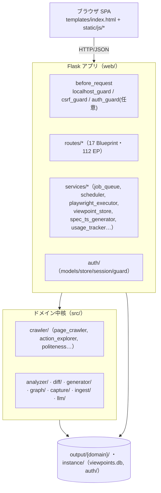

# WS2D-BD-001 基本設計書（方式設計）

- 版数: 1.0 / 作成日: 2026-07-16 / 準拠: IPA 共通フレーム（システム方式設計）
- 意思決定記録: `docs/adr/`（0001〜0004）を正とし本書から参照する。

## 1. アーキテクチャ概要

3 層（プレゼンテーション / アプリケーション / ドメイン）＋ 単一 SPA フロント。

## 2. レイヤ責務

| 層 | 実体 | 責務 |
|---|---|---|
| プレゼンテーション | `templates/`, `static/js/*`, `static/css/*` | SPA・クライアント側ビュー切替・状態表示（`ui-states.js`）・共通部品（`core.js`, `table-utils.js`） |
| アプリケーション | `web/routes/*`（薄いルート）＋`web/services/*` | 入力検証・ジョブ制御・永続化・LLM 連携（任意） |
| ドメイン中核 | `src/*` | クロール・解析・差分・生成・グラフ・探索記録（Flask 非依存） |
| 認証・テナント（任意） | `web/auth.py` / `web/services/auth_store.py` / `web/tenancy.py` / `web/routes/account.py` | 利用者認証（PW・ロール・APIトークン）＋テナント分離。既定 `auto`（`docs/AUTH_TENANCY.md`） |

## 3. 主要な設計判断（ADR）

- ADR-0001 → 0002: サイト認証をサブプロセス手渡し方式から GUI 内自動ログインへ。
- ADR-0003: 画面遷移図を Mermaid UML 4 タブ構成に。
- ADR-0004: 利用者ログイン＋ワークスペース導入（初期の軽量版。現在は商用/共有サーバ向け
  実装 `docs/AUTH_TENANCY.md`＝`account_auth`/`tenant_isolation` に統合・置換）。

## 4. 品質・安全の方式

- **機能整合性ゲート**: `quality_harness` が `feature_contracts.yml` を検証（UI-only 禁止・
  シンボル実在・critical/high の異常系必須）。`docs/process/functional-integrity-gate.md`。
- **多層テスト**: L0 契約 / L1 単体 / L2 結合(test_client) / L3 E2E(Playwright)。
- **ローカル安全**: 既定 127.0.0.1、localhost_guard・CSRF・CSP。
- **クロール礼儀**: robots・レート制御・破壊的遮断（`src/crawler/politeness.py`）。

## 5. 技術スタック

- バックエンド: Python 3.12 / Flask 3。ブラウザ自動化: Playwright Chromium。
- フロント: 素の JS（フレームワーク非依存）＋ tokens ベース CSS。
- 永続化: ファイル（`output/{domain}/`）＋ SQLite（`instance/viewpoints.db`）＋ JSON。
- LLM（任意）: OpenAI（`src/llm/`。未設定時はルールベースにフォールバック）。

## 6. 関連文書
- 画面: `WS2D-SD-001` / API: `WS2D-IF-001` / データ: `WS2D-DD-001`。
