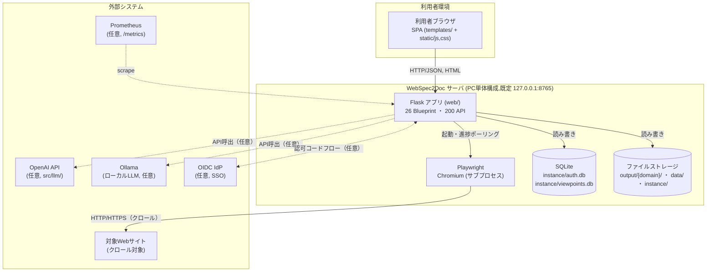
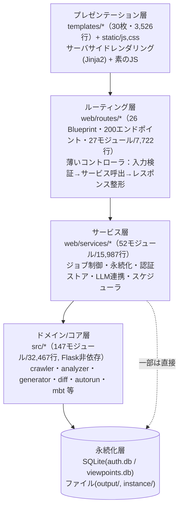
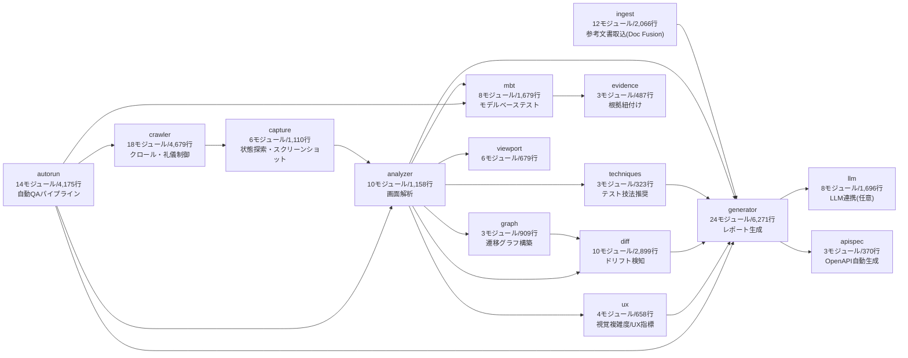
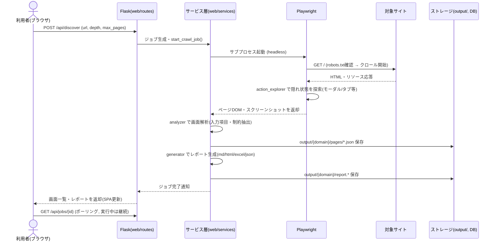
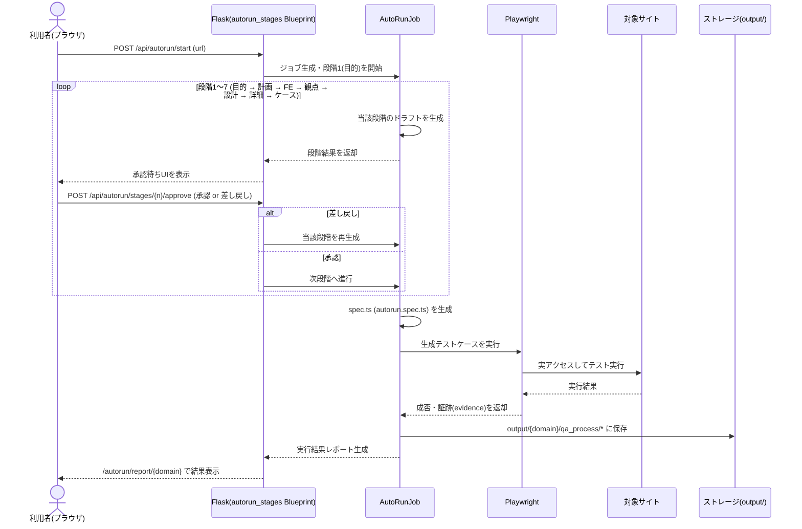
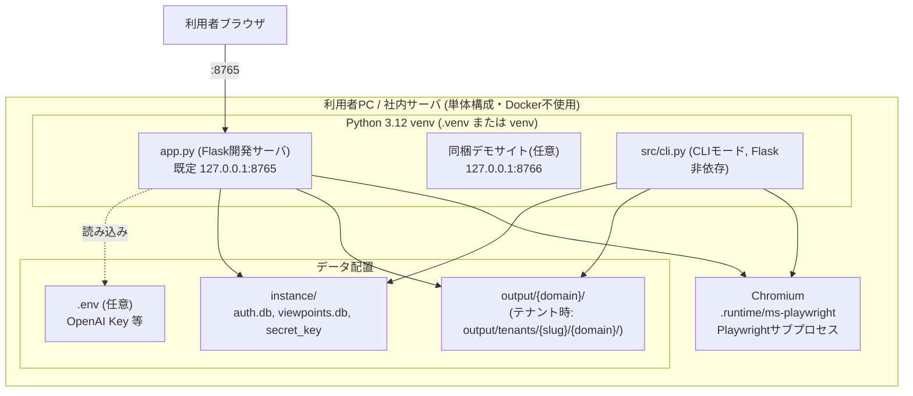

# WS2D-BD-001 基本設計書（方式設計）

- 版数: 2.0 / 作成日: 2026-08-02 / 作成者: 開発チーム
- 準拠: IPA 共通フレーム（システム方式設計相当）
- 一次データ根拠: `docs/sdlc/_asbuilt/modules.json`（237モジュール）・`routes.json`（200エンドポイント・26 Blueprint）・`schema.sql`（実DDL）・`templates.json`（30テンプレート）。本書の数値はすべてこれらの機械抽出結果、または該当ソースファイルの直接確認に基づく。推測値には「未計測」「未確認」と明記する。
- 意思決定記録: `docs/adr/`（0001〜0004）を正とし本書から参照する。

---

## 1. 文書概要

### 1.1 目的

本書は WebSpec2Doc のシステム方式設計（アーキテクチャ、サブシステム分割、主要処理方式、実行環境・配置、性能・セキュリティの方式）を定義する基本設計書である。個別画面・API・データ項目の詳細は下位文書（`WS2D-SD-001` 画面設計書、`WS2D-IF-001` API設計書、`WS2D-DD-001` データ設計書、`WS2D-PD-001` DB物理設計書、`WS2D-MD-001` モジュール設計書）に委ね、本書では重複記載しない。旧版（版数1.0、60行）はアーキテクチャ概要のみで構成粒度・処理方式・配置設計を欠いており、納品検査の水準に達していなかったため全面改訂した。

### 1.2 適用範囲

対象は 2026-08-02 時点でメインブランチにマージ済みの WebSpec2Doc、すなわちマルチテナント認証実装（PR #154〜#158 系列）を含む現行版である。GUI（Flask SPA）、CLIモード（`src/cli.py`）、AutoRun自動QAパイプライン、ドキュメント生成（md/html/excel/pdf/json）、観点管理、画面遷移図、仕様ドリフト検知、ROIダッシュボード、アプリ利用者認証・テナント分離のすべてを対象とする。対象外は、将来検討中の機能拡張ロードマップ（`docs/11_機能拡張ロードマップ_現新比較とUX検証.md`）に記載の未着手項目である。

### 1.3 関連文書一覧

| 文書番号 | 文書名 | 位置づけ |
|---|---|---|
| WS2D-RD-001 | 要件定義書 | 本書の上位。業務要件・システム化要件 |
| WS2D-NF-001 | 非機能要件定義書 | 性能・可用性等の数値要件の正本（本書8章は方式のみ） |
| WS2D-GL-001 | 用語集 | 全社共通の用語定義。本書1.4はシステム固有語のみ補足 |
| WS2D-SD-001 | 画面設計書 | 画面一覧・画面遷移図・画面項目定義（本書5.1の詳細） |
| WS2D-IF-001 | API設計書 | 200エンドポイントの全量・認証/CSRF/レート制限方式（本書5.2の詳細） |
| WS2D-DD-001 | データ設計書 | ER図・エンティティ定義・属性定義（本書5.3の詳細） |
| WS2D-PD-001 | DB物理設計書 | テーブル物理定義・インデックス・マイグレーション方式（本書5.3の詳細） |
| WS2D-MD-001 | モジュール設計書 | パッケージ構成・主要クラス・モジュール間依存（本書4章の詳細） |
| WS2D-BA-001 | バッチ設計書 | スケジューラ・非同期ジョブの詳細（本書5.5の詳細） |
| WS2D-CS-001 | コーディング規約 | 実装規約 |
| WS2D-QA-001 | 品質保証計画書 | テスト戦略全体 |
| ADR 0001〜0004 | 意思決定記録 | サイト認証方式・画面遷移図表示方式・利用者認証導入の経緯 |
| `docs/AUTH_TENANCY.md` | 認証・テナント分離仕様 | ADR-0004を置換した現行の認証設計（本書5.4の詳細） |

### 1.4 用語集

`WS2D-GL-001` 用語集の全社共通語に加え、本書で用いるシステム固有語を以下に補足する。

| 用語 | 説明 |
|---|---|
| WebSpec2Doc | 稼働中WebサイトのURLからQAテスト設計インプット文書（画面仕様・遷移図・テスト観点・テストケース）を自動生成するツール本体 |
| サイト認証 | クロール対象Webサイトへのログイン（`/api/login/*`）。ID/PASSWORDはフォーム送信後に即メモリから破棄し、セッション（Cookie）のみを保存する（ADR-0002） |
| 利用者ログイン | WebSpec2Doc自体を使う人の認証（`/auth/*`）。サイト認証と名前空間を分離している（ADR-0004、`docs/AUTH_TENANCY.md`） |
| テナント／ワークスペース | 利用者の作業単位。コード識別子は `tenant`。`WEBSPEC2DOC_AUTH_MODE` に応じてデータ分離の粒度が変わる |
| 観点（Viewpoint） | テスト観点をツリー構造で管理する単位。`viewpoint_sets` / `viewpoint_versions` / `viewpoint_items` としてDB管理される |
| AutoRun | 解析→設計→spec生成→テスト実行までを自動化する実行系。7段階の承認ステップを持つ |
| 段階承認 | AutoRunの各段階（目的・計画・FE・観点・設計・詳細・ケース）で利用者が承認または差し戻しを行う仕組み |
| ドリフト検知 | 再クロール時に前回スナップショットとの差分（追加・削除・変更）を検出する機能（`src/diff/`） |
| evidence（根拠） | 生成された仕様・テスト条件に紐づく、実測したセレクタ・スクリーンショット座標等の裏付け情報 |
| Blueprint | Flaskのルーティング分割単位。本システムは26 Blueprint・200エンドポイントで構成される |
| spec.ts | AutoRunが生成するPlaywright実行用テストスクリプト（`output/{domain}/qa_process/autorun.spec.ts`） |
| egress制御 | クロール対象への発信をローカル／許可ホストに限定するSSRF対策（`localhost_guard`、`WEBSPEC2DOC_ALLOW_LOCAL`） |

### 1.5 本書の読み方

本書は上から下へ「全体像（2章）→採用方式の理由（3章）→構成要素の内訳（4章）→個別方式（5章）→処理の流れ（6章）→実行環境（7章）→非機能・セキュリティ（8〜9章）→制約・課題（10〜11章）」の順で詳細度が上がる構成である。実装コードの具体的なクラス名・関数名まで追いたい場合は各節末尾の参照リンクから `WS2D-MD-001`（モジュール）・`WS2D-IF-001`（API）・`WS2D-DD-001`/`WS2D-PD-001`（データ）へ進む。レビュー時は、まず2〜4章で全体像に齟齬がないかを確認し、次に5章の各方式が3章のアーキテクチャ方針（層の依存方向）に反していないかを確認する順序を推奨する。

---

## 2. システム全体像

### 2.1 ビジネス上の位置づけ

WebSpec2Doc は「ドキュメントが存在しない、あるいは陳腐化した稼働中Webシステム」に対して、QAエンジニアがテスト設計に着手する前に必要な一次情報（画面仕様・入力制約・遷移構造・テスト観点）を自動生成することで、ドキュメント不備による調査工数を削減するツールである（README.md冒頭）。想定利用者はQAエンジニア・第三者検証会社であり、対象サイトの資格情報を外部SaaSに預けない・オンプレ完結という思想が全方式設計に通底する。ビジネス価値はROIダッシュボード（`/usage`、`web/routes/usage.py`）で推定削減工数（時間・円）として可視化する。

### 2.2 システム化の範囲

システム化の範囲は次の6領域である。(1) GUI: Flaskベースの単一SPAシェル＋Jinja2テンプレート、(2) CLIモード: `src/cli.py` を入口とする画面なし運用、(3) ドキュメント生成: レポート（html/json/xlsx/md/pdf）・画面遷移図（Mermaid）の自動生成、(4) AutoRun: クロール〜テスト実行までの段階承認パイプライン、(5) 観点管理・トレーサビリティ: テスト観点のツリー管理と画面→観点→ケースの追跡、(6) 運用基盤: マルチテナント認証・監査ログ・Prometheusメトリクス・スケジューラ。範囲外は、対象Webサイト自体の変更や、モバイル/タブレット向けUI（`constraint-pc-only` 方針によりPC専用）である。

GUIの標準利用フローは README 記載の4ステップに対応し、システム化範囲の(1)〜(3)を横断する。

| ステップ | 操作 | 対応サブシステム |
|---|---|---|
| 1. 解析 | URLを入力して「画面分析」を実行、N件の画面を検出 | crawler, analyzer |
| 2. 条件設定 | 取得する画面の選択・ログイン設定・差分オプション指定 | pages, login, discover |
| 3. 実行 | クロール中のライブプレビューで進捗確認 | crawl, capture |
| 4. レポート | 8タブで成果物を確認・エクスポート | generator, report, viewpoints |

### 2.3 システム構成図


```mermaid
graph TB
  subgraph CLIENT["利用者環境"]
    Browser["利用者ブラウザ<br/>SPA (templates/ + static/js,css)"]
  end
  subgraph SERVER["WebSpec2Doc サーバ (PC単体構成,既定 127.0.0.1:8765)"]
    Flask["Flask アプリ (web/)<br/>26 Blueprint ・ 200 API"]
    PW["Playwright<br/>Chromium (サブプロセス)"]
    SQLite[("SQLite<br/>instance/auth.db<br/>instance/viewpoints.db")]
    FileStore[("ファイルストレージ<br/>output/{domain}/ ・ data/ ・ instance/")]
  end
  subgraph EXTERNAL["外部システム"]
    Target["対象Webサイト<br/>(クロール対象)"]
    OpenAI["OpenAI API<br/>(任意, src/llm/)"]
    Ollama["Ollama<br/>(ローカルLLM, 任意)"]
    OIDC["OIDC IdP<br/>(任意, SSO)"]
    Prom["Prometheus<br/>(任意, /metrics)"]
  end
  Browser -->|HTTP/JSON, HTML| Flask
  Flask -->|起動・進捗ポーリング| PW
  PW -->|"HTTP/HTTPS（クロール）"| Target
  Flask -->|読み書き| SQLite
  Flask -->|読み書き| FileStore
  Flask -.API呼出（任意）.-> OpenAI
  Flask -.API呼出（任意）.-> Ollama
  Flask <-.認可コードフロー（任意）.-> OIDC
  Prom -.scrape.-> Flask
```

利用者ブラウザは Flask アプリと HTTP/JSON（API）および通常の HTML レンダリングの二経路で通信する。Flask はクロール要求を受けると Playwright（Chromium）をサブプロセスとして起動し、対象Webサイトへ直接アクセスする。永続化は SQLite 2ファイル（`auth.db`, `viewpoints.db`）とファイルストレージ（`output/`, `data/`, `instance/`）に分かれる（理由は5.3節）。LLM連携（OpenAI／Ollama）・OIDC・Prometheusはすべて任意（未設定時も主要機能は動作）であり、破線で表現している。対象Webサイトへの通信は `WEBSPEC2DOC_ALLOW_LOCAL` 等のガードで既定制限される（9章）。

---

## 3. アーキテクチャ方式設計

### 3.1 レイヤ構成図


```mermaid
graph TD
  PRES["プレゼンテーション層<br/>templates/*（30枚・3,526行）+ static/js,css<br/>サーバサイドレンダリング(Jinja2) + 素のJS"]
  ROUTE["ルーティング層<br/>web/routes/*（26 Blueprint・200エンドポイント・27モジュール/7,722行）<br/>薄いコントローラ：入力検証→サービス呼出→レスポンス整形"]
  SVC["サービス層<br/>web/services/*（52モジュール/15,987行）<br/>ジョブ制御・永続化・認証ストア・LLM連携・スケジューラ"]
  CORE["ドメイン/コア層<br/>src/*（147モジュール/32,467行, Flask非依存）<br/>crawler・analyzer・generator・diff・autorun・mbt 等"]
  PERSIST[("永続化層<br/>SQLite(auth.db / viewpoints.db)<br/>ファイル(output/, instance/)")]
  PRES --> ROUTE
  ROUTE --> SVC
  SVC --> CORE
  CORE --> PERSIST
  SVC -.一部は直接.-> PERSIST
```

### 3.2 採用アーキテクチャとその理由

旧版（1.0）は「3層（プレゼンテーション／アプリケーション／ドメイン）」としていたが、実装は `web/routes`（ルーティング）と `web/services`（サービス）が明確に分離されており（前者27モジュール、後者52モジュール）、実体は4層である。本書ではこれを反映し、layered architecture（各層は直下の層のみに依存）として記述する。採用理由は次の3点。第一に、`src/*` をFlaskに依存させない設計により、ドメインロジック（クロール・解析・生成・差分判定）を Flask のリクエストコンテキストなしに CLI・テストからも呼び出せる（README「CLIモード」節、`src/cli.py` は Flask リクエストコンテキストを使わない）。第二に、Blueprint 単位でルーティングを分割することで、26 Blueprint を独立して追加・変更でき、機能追加時の影響範囲を局所化できる。第三に、サービス層を薄いルーティング層から分離することで、ジョブ制御・永続化ロジックのテスト（L1単体・L2結合）をHTTP層なしに実施できる。層の逆依存（`src/*` が `web/*` を import する等）は許容しない方針であり、`WS2D-MD-001` 4章のモジュール間依存関係表で実装が方針に沿っているかを確認できる。

この層構成はテスト戦略（`WS2D-QA-001`）とも対応する。`quality_harness`（`scripts/quality_harness.py`）が定義する多層テストは、L0契約（`feature_contracts.yml` によるシンボル実在確認）がドメイン層とルーティング層の対応を検証し、L1単体がドメイン層（`src/*`）を層単独でテストし、L2結合（`test_client`）がルーティング層〜サービス層を実プロセス内で結合検証し、L3 E2E（Playwright）がプレゼンテーション層からPlaywright実ブラウザ経由で全層を通貫検証する構成になっている。層を分離した設計判断は、この4段階テストの各段が「どこまでを対象にするか」を明確に切り分けられることの前提になっている。

### 3.3 ADRへの参照

以下の意思決定は現行アーキテクチャの前提となっている。ADR-0001（手渡しログイン、サブプロセス＋シグナルファイル方式）はADR-0002により廃止・置換され、現行はGUI内フォーム入力による自動ログイン方式である。ただし「既存 `/run` ・ `/api/discover` と同じくサブプロセス実行に統一する」という方式判断自体はADR-0001からADR-0002へ継承されており、クロール実行がサブプロセス境界を跨ぐ設計（3.1図の `PW` ノード）の根拠になっている。ADR-0003は画面遷移図をMermaid UML 4サブタブ構成（シーケンス図・コミュニケーション図・アクティビティ図・テスト観点マップ）で実装する決定であり、vis.jsは不採用とした（QAテスターの「図と表を照合する」用途を優先）。ADR-0004（アプリ利用者ログイン＋ワークスペース導入）は初期の軽量版実装であったが、商用/共有サーバ向けの認証・テナント分離実装に統合・置換されており、現行仕様は `docs/AUTH_TENANCY.md` を正とする（本書5.4節）。

---

## 4. サブシステム分割

### 4.1 コンポーネント図


```mermaid
graph LR
  CRAWL["crawler<br/>18モジュール/4,679行<br/>クロール・礼儀制御"]
  CAPTURE["capture<br/>6モジュール/1,110行<br/>状態探索・スクリーンショット"]
  ANALYZE["analyzer<br/>10モジュール/1,158行<br/>画面解析"]
  GRAPH["graph<br/>3モジュール/909行<br/>遷移グラフ構築"]
  DIFF["diff<br/>10モジュール/2,899行<br/>ドリフト検知"]
  TECH["techniques<br/>3モジュール/323行<br/>テスト技法推奨"]
  MBT["mbt<br/>8モジュール/1,679行<br/>モデルベーステスト"]
  EVID["evidence<br/>3モジュール/487行<br/>根拠紐付け"]
  UX["ux<br/>4モジュール/658行<br/>視覚複雑度/UX指標"]
  VIEWPORT["viewport<br/>6モジュール/679行"]
  LLM["llm<br/>8モジュール/1,696行<br/>LLM連携(任意)"]
  INGEST["ingest<br/>12モジュール/2,066行<br/>参考文書取込(Doc Fusion)"]
  GEN["generator<br/>24モジュール/6,271行<br/>レポート生成"]
  AUTORUN["autorun<br/>14モジュール/4,175行<br/>自動QAパイプライン"]
  APISPEC["apispec<br/>3モジュール/370行<br/>OpenAPI自動生成"]

  CRAWL --> CAPTURE --> ANALYZE --> GRAPH
  ANALYZE --> TECH
  ANALYZE --> VIEWPORT
  GRAPH --> DIFF
  ANALYZE --> DIFF
  ANALYZE --> MBT --> EVID
  ANALYZE --> UX
  INGEST --> GEN
  ANALYZE --> GEN
  TECH --> GEN
  DIFF --> GEN
  UX --> GEN
  GEN --> LLM
  GEN --> APISPEC
  AUTORUN --> CRAWL
  AUTORUN --> ANALYZE
  AUTORUN --> MBT
  AUTORUN --> GEN
```

`src/*` の主要サブシステムは、クロール（crawler→capture）が取得したページを analyzer が解析し、その結果を graph（遷移構造）・techniques（技法推奨）・mbt（モデルベーステスト）・ux（視覚複雑度）・diff（ドリフト検知）がそれぞれ加工したうえで、最終的に generator がレポート・遷移図・仕様書として統合する、という「クロール→解析→多面的加工→生成」の流れを持つ。autorun はこれらのサブシステムを段階承認付きで呼び出すオーケストレータである。ingest（参考文書取込＝Doc Fusion）は既存PDF/YAML/XMLの仕様をgeneratorに合流させる独立経路。llm・apispecはgeneratorの出力を後処理する任意サブシステムである。モジュール単位の詳細（クラス設計・関数一覧）は `WS2D-MD-001` 1章・3章を参照。

### 4.2 サブシステム責務・モジュール数・LOC実測表

`modules.json`（237モジュール、合計57,140行、202クラス、755関数）を集計した実測値。

| サブシステム | 種別 | モジュール数 | LOC | 責務 |
|---|---|---:|---:|---|
| web/services | web | 52 | 15,987 | ジョブ制御・認証ストア・観点ストア・スケジューラ・Playwright実行制御等のアプリケーションサービス |
| web/routes | web | 27 | 7,722 | 26 Blueprint・200 APIの薄いコントローラ |
| src/generator | src | 24 | 6,271 | レポート生成（HTML/Excel/PDF/Markdown/JSON） |
| src/crawler | src | 18 | 4,679 | ページクロール・状態探索・礼儀制御（robots/レート） |
| src/autorun | src | 14 | 4,175 | AutoRun自動QAパイプライン（段階承認） |
| src/diff | src | 10 | 2,899 | 仕様ドリフト検知 |
| src（直下） | src | 5 | 2,666 | `main.py` / `cli.py` 等エントリポイント |
| src/ingest | src | 12 | 2,066 | 参考文書取込（Doc Fusion、PDF/YAML/XML） |
| src/llm | src | 8 | 1,696 | LLM連携（OpenAI/Ollama、任意） |
| src/mbt | src | 8 | 1,679 | モデルベーステスト（遷移モデルからケース導出） |
| src/analyzer | src | 10 | 1,158 | 画面解析（入力項目・制約抽出） |
| src/capture | src | 6 | 1,110 | スクリーンショット・視覚キャプチャ |
| web（直下） | web | 11 | 964 | `__init__.py` / `auth.py` / `security.py` / `tenancy.py` 等 |
| src/graph | src | 3 | 909 | 画面遷移グラフ構築 |
| src/viewport | src | 6 | 679 | ビューポート／レスポンシブ関連解析 |
| src/ux | src | 4 | 658 | 視覚複雑度・UX指標 |
| src/evidence | src | 3 | 487 | 生成物への根拠（セレクタ／座標）紐付け |
| src/apispec | src | 3 | 370 | OpenAPI仕様自動生成 |
| src/techniques | src | 3 | 323 | テスト技法（同値分割等）推奨 |
| src/archive | src | 3 | 246 | 成果物アーカイブ |
| src/wording | src | 2 | 222 | 文言・表記統一 |
| src/registry | src | 3 | 113 | レジストリ（内部登録機構） |
| src/health | src | 2 | 61 | ヘルスチェック |
| **合計** | | **237** | **57,140** | src計147モジュール/32,467行、web計90モジュール/24,673行 |

最大モジュールは `web/routes/auto_run.py`（1,725行）、`src/main.py`（1,582行）、`src/crawler/page_crawler.py`（1,492行）の順（`modules.json` 実測）。`web/services` が全体の28%（LOC比）を占め最大サブシステムであり、ジョブ制御・観点ストア・認証ストアが集中している。800行を超える大型モジュールは分割候補として `WS2D-CS-001` コーディング規約の観点で継続監視する。

参考として、最大サブシステム `web/services`（52モジュール）内の上位モジュール（LOC実測）を以下に示す。

| モジュール | LOC | 概要 |
|---|---:|---|
| `web/services/auth_store.py` | 1,322 | 利用者・テナント・セッション・APIトークンの永続化 |
| `web/services/playwright_executor.py` | 1,057 | Playwrightサブプロセスの起動・監視・結果回収 |
| `web/services/viewpoint_store_operations.py` | 955 | 観点データのCRUD操作の実処理 |
| `web/services/viewpoint_store.py` | 943 | 観点ストアのファサード（バージョニング・公開制御） |

これら4モジュールだけで `web/services` の約27%（4,277行/15,987行）を占めており、認証・観点管理まわりの複雑度が集中している実態が読み取れる。詳細クラス設計は `WS2D-MD-001` 3章を参照。

---

## 5. 方式設計

### 5.1 画面方式

画面はサーバサイドレンダリング（Jinja2）を基本とし、SPA的な状態遷移をクライアントサイドの素のJS（フレームワーク非依存）で実現するハイブリッド方式である。テンプレートは30枚・合計3,526行（`templates.json` 実測）。中心となるのは `templates/index.html`（207行）で、15個の `partials/view-*.html` を `include` してタブ切替型のSPAシェルを構成する（`view-auto-run.html` 378行、`view-generate.html` 303行、`view-settings.html` 313行が大規模）。認証系画面（`auth/login.html` 等）は共通レイアウト `auth/_shell.html` を `extends` する独立系統であり、`system-select.html`・`cli.html`・`autorun-report.html`・`traceability.html` も index.html とは独立したページである。

クライアント側の表示状態は `static/js/ui-states.js` が集中管理し、画面遷移図は `static/js/view-transition.js`（432行、ADR-0003）がMermaid CDNを遅延ロードして描画する。テンプレートの継承・合成関係を整理すると次の3系統になる。(1) `index.html` 系: 1ファイルが15 partialを `include`（継承なし・合成型）、(2) `auth/*` 系: `_shell.html` を `extends` するブロック継承型（`console.html`, `tenant.html`, `user.html` が該当）、(3) 独立ページ系: `extends`/`include` を持たない単独完結型（`login.html`, `setup.html`, `signup.html` 等）。状態管理はサーバ側セッションに依存せず、クライアント側JSがタブ選択状態・進捗表示状態を保持し、データ取得はAPI呼出で都度反映する方式である。詳細な画面一覧・画面項目定義・画面遷移図は `WS2D-SD-001` を参照。

### 5.2 API方式

REST/JSON方式を採用し、26 Blueprint・200エンドポイントで構成する（`routes.json` 実測、`WS2D-IF-001` 2章に全量記載）。Blueprint分割は機能単位（account, admin, tenant_admin, pages, discover, site, login, report, qa_process, history, settings, crawl, auto_run, review, runs, schedule, api_v1, api_v1_schedule, metrics, oidc, traceability, usage, llm_chat, autorun_stages, autorun_report, viewpoints）で行い、1 Blueprintが1関心事に対応する。外部公開向けAPIは `/api/v1` 名前空間でバージョニングし（`api_v1`, `api_v1_schedule`）、テナントAPIトークン（`Authorization: Bearer`）で認証する。内部向けAPI（GUIが呼ぶ `/api/*`）はセッションCookie認証を用いる。

方式上の設計原則は次の通り。(1) リソース指向のパス設計（`/api/v1/sites/<domain>/report` のように対象を名詞で表現）、(2) HTTPメソッドで操作意味を表現（GET=参照, POST=作成/実行, PATCH=部分更新, DELETE=削除、`WS2D-IF-001` 2章の実測でこの原則にほぼ準拠）、(3) 破壊的操作（テナント作成、APIトークン発行等）はowner/admin権限に限定、(4) `/api/v1` 配下のみを外部安定APIとして扱い、それ以外の `/api/*` はGUI専用の内部APIとして扱う（後方互換の保証範囲が異なる）。認証方式・CSRF対策・レート制限・セキュリティヘッダーの詳細方式は `WS2D-IF-001` 1章、エラーレスポンス共通スキーマは同4.2節を参照し、本書では重複記載しない。

### 5.3 データ管理方式

永続化は SQLite 2ファイル分離＋ファイルストレージの併用方式である。`instance/auth.db`（6テーブル: `users`, `tenants`, `memberships`, `api_tokens`, `auth_sessions`, `audit_log`）は認証・テナント管理データを保持し、全テナント共通で1ファイルに集約する。`instance/viewpoints.db`（5テーブル: `viewpoint_sets`, `viewpoint_versions`, `viewpoint_items`, `viewpoint_proposals`, `viewpoint_assignments`）は観点ドメインデータを保持し、テナントモードでは `instance/tenants/{slug}/viewpoints.db` としてテナントごとに物理分離する（DB-per-tenant）。分離理由は、認証データ（ライフサイクルが長く全体で1件）と観点データ（テナントごとに増減しテナント削除時に丸ごと破棄したい）でライフサイクルと分離要件が異なるためである。

ファイルストレージは用途別に3ディレクトリへ使い分ける。

| ディレクトリ | 用途 | テナント分離 |
|---|---|---|
| `output/{domain}/` | クロール成果物（画面仕様・スクリーンショット・レポート・スナップショット） | テナントモードで `output/tenants/{slug}/{domain}/` に分離 |
| `data/` | 観点カタログ等の静的マスタデータ（JSON） | 分離なし（全テナント共通） |
| `instance/` | DB2ファイル・`secret_key`・認証関連ファイル | DBのみテナント分離、`secret_key`等は共通 |

クロール成果物（画面仕様・スクリーンショット・レポート）はDBではなくファイルストレージに保存する。理由は、スクリーンショットPNG等の大容量バイナリをDBに格納しない一般的な設計判断、およびCLIモードから直接ファイルシステムを読み書きできる簡便性である。ER図・属性定義は `WS2D-DD-001`、テーブル物理定義・インデックス・マイグレーション方式は `WS2D-PD-001` を参照。

### 5.4 認証・認可方式

利用者認証は `WEBSPEC2DOC_AUTH_MODE`（`auto`/`required`/`off`、既定 `auto`）で制御する。`auto` はユーザー0人の間は無認証、`/auth/setup` で最初のワークスペース＋オーナー作成後は全ルートでログイン必須へ切り替わる方式で、既存のローカル単独利用・E2Eテスト資産を壊さずに共有サーバ展開時のみ認証を有効化できる。セッションはサーバサイド管理（`auth_sessions` テーブル）で、Cookie（`ws2d_session`, HttpOnly, SameSite=Lax）にはランダムトークンのみを持たせ、DBにはSHA-256ハッシュのみ保存する（既定12時間で失効、`WEBSPEC2DOC_SESSION_HOURS`）。APIトークン（`api_tokens`テーブル）は `/api/v1` 向けのテナント単位Bearerトークンで、発行時に一度だけ平文を表示しDBにはハッシュのみ保存する。

ロールは3段階で、権限範囲は次の通り（`docs/AUTH_TENANCY.md` 実測）。

| ロール | 設定変更（OpenAIキー等） | メンバー管理 | 観点・クロール実行 |
|---|---|---|---|
| owner | 可（最後の1人は降格・無効化不可） | 可 | 可 |
| admin | 可 | 可 | 可 |
| member | 不可 | 不可 | 可 |

テナント分離は `web/auth.py` の `auth_guard` が `g.tenant` を解決し、`web/tenancy.py` の `scoped_output_dir()` / `scoped_instance_path()` が保存先を動的に切り替える方式。リクエストコンテキスト外（バックグラウンドスレッド・スケジューラ）ではテナントを自動解決できないため、ジョブ開始時に解決済みの出力先をクロージャ・ジョブ属性として明示的に持ち回る設計上の制約がある。OIDC（SSO）はAuthlib（1.7.2）による任意の認可コードフロー連携。詳細は `docs/AUTH_TENANCY.md` を正とする。

### 5.5 非同期処理方式

クロール・AutoRun実行はいずれもリクエストスレッドをブロックしないジョブ方式で実行する。主要な非同期系サービス（`web/services/*`）は次の役割分担を持つ。

| サービス（概称） | 役割 |
|---|---|
| ジョブキュー | クロール・AutoRunジョブの登録・状態管理 |
| `playwright_executor` | Playwrightサブプロセスの起動・監視・結果回収 |
| `scheduler` | 定期クロール（ドリフト監視）のスケジュール実行 |
| `viewpoint_store` / `viewpoint_store_operations` | 観点データのファサード／CRUD実処理 |
| `auth_store` | 利用者・テナント・セッション・APIトークンの永続化 |
| `usage_tracker` | ROIダッシュボード向け利用実績の集計 |
| `retention` | 成果物・履歴の保持ポリシー適用 |

`scheduler` は `web/__init__.py` の `create_app()` 内で `start_scheduler()` をアプリ起動時に一度だけ呼び出す方式で常駐する。進捗はクライアント側のジョブステータスAPIポーリングでUIへ反映される（ライブプレビュー機能、README「ステップ3 実行」）。プッシュ型通知（WebSocket/SSE）の使用有無は本書執筆時点のソース確認範囲では**未確認**であり、断定を避ける。クロール自体もCLI/GUI双方で `--parallelism`（1〜4、GUI既定2）による並列ワーカー数の指定を受け付ける。ジョブキューの永続化方式（プロセス再起動時に実行中ジョブがどう扱われるか）は**未確認**であり、`WS2D-BA-001` バッチ設計書での確認を要する。

### 5.6 外部連携方式

Playwright（1.61.0）によるブラウザ自動操作はサブプロセスとして起動し、Flaskのリクエストスレッドに直接持ち込まない（3.3節ADR-0001/0002参照）。理由はPlaywright sync APIのスレッド制約回避と、プロセス分離によるクラッシュ隔離である。LLM連携（`src/llm/`）はOpenAI APIまたはローカルのOllamaを任意のバックエンドとして利用し、未設定時はルールベース処理にフォールバックする（`docs/README.md` 記載の方針、および本書執筆時点のローカル検証環境でOllama(qwen2.5:3b)の利用実績あり）。バックエンドの選択は環境変数（OpenAI APIキーの有無等）による切替を前提としており、両方とも未設定の場合にルールベースへフォールバックする3段階の優先順位を持つ。

対象Webサイトへの発信は、既定でループバック（127.0.0.1）のみを許可し、`WEBSPEC2DOC_ALLOW_LOCAL`・`WEBSPEC2DOC_TRUSTED_HOSTS` により明示的に許可範囲を拡張する構成（`web/security.py` の `localhost_guard` が該当、本書ではこれを課題文中の「egress gateway」に対応する実装として扱う）。OIDC IdPとの連携はAuthlibベースの認可コードフロー（`web/routes/oidc.py`）。Prometheus連携は `/metrics`（`metrics` Blueprint、1エンドポイント）のスクレイプ待ち受けであり、WebSpec2Doc側からPrometheusへの能動的な送信は行わない。

### 5.7 ログ・監視方式

メトリクス公開は `prometheus-client`（0.21.1）による `/metrics` エンドポイント（`web/routes/metrics.py`）で行い、Prometheusサーバ側からのpull型スクレイプを前提とする。公開メトリクスの具体的な項目一覧は本書執筆時点では**未確認**であり、実装コード（`web/routes/metrics.py`）の直接確認を要する。

監査ログ（`audit_log` テーブル、`auth.db`）は次のカラムを持つ（`schema.sql` 実測）。

| カラム | 内容 |
|---|---|
| `id` | 連番主キー |
| `at` | 発生日時 |
| `event` | イベント種別（ログイン・ユーザー作成/変更・トークン発行/失効 等） |
| `user_id` / `tenant_id` | 発生元の利用者・テナント |
| `detail` | 付加情報（既定空文字） |

クロール処理の実行ログはファイルベースの `output/{domain}/audit.jsonl` に記録され、ページスキップ理由（ログインウォール検出・robots Disallow等）を残す（README「トラブルシュート」節）。アプリケーションログの出力先・ログレベル方針・ローテーション方式は本書執筆時点では**未確認**であり、`WS2D-EN-001` 環境構築手順書または実装コードでの追加確認を要する事項として11章に記載する。

### 5.8 エラー処理方式

CLIは終了コードでCI連携可能な成否判定を提供する。

| 終了コード | 意味 |
|---:|---|
| `0` | 正常終了 |
| `1` | 完了したが失敗を含む（テスト失敗・ドリフト検出） |
| `2` | 実行エラー（対象に到達できない・設定不備など） |
| `130` | 中止（タイムアウト・シグナル） |

GUI側はAPIレスポンスに共通エラースキーマ（`WS2D-IF-001` 4.2節）を用い、ユーザー向けメッセージは日本語で表示する。CSRFガード（`web/security.py: csrf_guard`）が不正リクエストを検知した場合は該当リクエストを拒否する。ログインウォール検出・robots Disallow等でクロールがページをスキップした場合はエラーとして中断せず、「未ログイン範囲のみ」「対応外」等のステータスとして成果物に記録し処理を継続する設計思想（部分的成功の許容）を採用している。ネットワークエラー時の自動リトライの有無・回数は本書執筆時点では**未確認**であり、`src/crawler/` 実装コードでの追加確認を要する。

---

## 6. 主要処理方式

### 6.1 シーケンス図1: サイトクロール → 解析 → ドキュメント生成


```mermaid
sequenceDiagram
  actor U as 利用者(ブラウザ)
  participant F as Flask(web/routes)
  participant S as サービス層(web/services)
  participant PW as Playwright
  participant T as 対象サイト
  participant ST as ストレージ(output/, DB)

  U->>F: POST /api/discover (url, depth, max_pages)
  F->>S: ジョブ生成・start_crawl_job()
  S->>PW: サブプロセス起動 (headless)
  PW->>T: GET / (robots.txt確認 → クロール開始)
  T-->>PW: HTML・リソース応答
  PW->>PW: action_explorer で隠れ状態を探索(モーダル/タブ等)
  PW-->>S: ページDOM・スクリーンショットを返却
  S->>S: analyzer で画面解析(入力項目・制約抽出)
  S->>ST: output/{domain}/pages/*.json 保存
  S->>S: generator でレポート生成(md/html/excel/json)
  S->>ST: output/{domain}/report.* 保存
  S-->>F: ジョブ完了通知
  F-->>U: 画面一覧・レポートを返却(SPA更新)
  U->>F: GET /api/jobs/{id} (ポーリング, 実行中は継続)
```

利用者がURLを投入すると、Flaskはジョブを生成しPlaywrightをサブプロセス起動する。Playwrightは対象サイトのrobots.txtを確認したうえでクロールを開始し、`action_explorer`（`src/crawler/`）がモーダル・タブ・アコーディオン等の操作で現れる隠れ状態を自動的に開いて記録する（SPA対応）。取得したDOM・スクリーンショットはサービス層に返され、analyzerが画面解析を行った後、ファイルストレージへ中間結果として保存される。最後にgeneratorが複数フォーマットのレポートを生成し、ジョブ完了通知を経てSPAが結果を表示する。詳細なモジュール呼び出し順（クラス・関数レベル）は `WS2D-MD-001` 5.1節を参照。

### 6.2 シーケンス図2: AutoRun実行（段階承認を含む）


```mermaid
sequenceDiagram
  actor U as 利用者(ブラウザ)
  participant F as Flask(autorun_stages Blueprint)
  participant J as AutoRunJob
  participant PW as Playwright
  participant T as 対象サイト
  participant ST as ストレージ(output/)

  U->>F: POST /api/autorun/start (url)
  F->>J: ジョブ生成・段階1(目的)を開始
  loop 段階1〜7 (目的 → 計画 → FE → 観点 → 設計 → 詳細 → ケース)
    J->>J: 当該段階のドラフトを生成
    J-->>F: 段階結果を返却
    F-->>U: 承認待ちUIを表示
    U->>F: POST /api/autorun/stages/{n}/approve (承認 or 差し戻し)
    alt 差し戻し
      F->>J: 当該段階を再生成
    else 承認
      F->>J: 次段階へ進行
    end
  end
  J->>J: spec.ts (autorun.spec.ts) を生成
  J->>PW: 生成テストケースを実行
  PW->>T: 実アクセスしてテスト実行
  T-->>PW: 実行結果
  PW-->>J: 成否・証跡(evidence)を返却
  J->>ST: output/{domain}/qa_process/* に保存
  J-->>F: 実行結果レポート生成
  F-->>U: /autorun/report/{domain} で結果表示
```

AutoRunは「目的→計画→FE(機能一覧)→観点→設計→詳細→ケース」の7段階を順に進めるパイプラインであり、各段階でドラフトを生成した後、利用者の承認を待つ（差し戻された場合は同一段階を再生成する）。全段階が承認されるとPlaywright実行用のテストスクリプト（spec.ts）を生成し、実際に対象サイトへアクセスしてテストを実行、結果と証跡（evidence）を `output/{domain}/qa_process/` に保存する。CLIモードでは人による承認ができないため全段階を自動承認し、何を自動承認したかを実行結果に明記する仕様（README「CLIモード」節）。段階承認APIの詳細（14エンドポイント）は `WS2D-IF-001` の `autorun_stages` Blueprint節、モジュール構成は `WS2D-MD-001` 5.2節を参照。

### 6.3 段階承認と非同期処理の関係

6.2のループは、5.5節で述べたジョブ方式の上に構築されている。各段階の「ドラフト生成」自体は同期的なリクエスト処理内で完結する軽量な処理であるのに対し、最終段階のテスト実行（Playwright起動〜結果回収）は6.1と同じ非同期ジョブ・サブプロセス方式に合流する。すなわちAutoRunは「軽量な段階承認ループ（同期API）」と「重いクロール/テスト実行（非同期ジョブ）」を組み合わせたハイブリッド方式であり、承認待ちの間はサーバ側リソースを消費しない設計になっている。この設計により、利用者が承認を数分〜数時間放置してもサーバの並行実行数を圧迫しない。

---

## 7. 実行環境・配置設計

### 7.1 配置図


```mermaid
graph TB
  subgraph PC["利用者PC / 社内サーバ (単体構成・Docker不使用)"]
    subgraph PY["Python 3.12 venv (.venv または venv)"]
      APP["app.py (Flask開発サーバ)<br/>既定 127.0.0.1:8765"]
      DEMO["同梱デモサイト(任意)<br/>127.0.0.1:8766"]
      CLI["src/cli.py (CLIモード, Flask非依存)"]
    end
    CHROME["Chromium<br/>.runtime/ms-playwright<br/>Playwrightサブプロセス"]
    subgraph DATA["データ配置"]
      OUT["output/{domain}/<br/>(テナント時: output/tenants/{slug}/{domain}/)"]
      INST["instance/<br/>auth.db, viewpoints.db, secret_key"]
      ENVF[".env (任意)<br/>OpenAI Key 等"]
    end
  end
  BR["利用者ブラウザ"] -->|":8765"| APP
  APP --> CHROME
  APP --> OUT
  APP --> INST
  APP -.読み込み.-> ENVF
  CLI --> CHROME
  CLI --> OUT
  CLI --> INST
```

配置はPC単体構成（1プロセスのFlask開発サーバ＋必要時に起動するPlaywrightサブプロセス）を基本とし、社内サーバへの展開時も同一構成をvenv＋systemdで常駐化する（README「社内サーバへ展開」節）。本プロダクトはDockerに依存しない方針であり、Dockerfile・compose定義は保持しない（従業員1,000人超の組織ではDocker Desktopが有償ライセンス対象となるため）。GUIポートは8765固定（macOS AirPlayとの衝突回避のため既定を変更済み）、同梱デモは8766。データは `output/`（クロール成果物）、`instance/`（DB・秘密鍵、`0600`権限で自動生成される`secret_key`を含む）に配置し、いずれもgit管理対象外である。詳細は7.2/7.3節。

### 7.2 動作要件

Python バージョンは3.12固定である。3.13以降は非対応（Playwright 1.44系のwheelがビルドできず、依存の greenlet がビルド失敗するため、README実測）。ブラウザランタイムはユーザー共有キャッシュではなく `./.runtime/ms-playwright` に導入し、Playwright更新後は同一venvで `scripts/manage_playwright_runtime.py install` の再実行が必須である。`make doctor` が環境不一致（Python/Playwright/Chromium/依存バージョン）を一括診断する。

主要依存ライブラリのバージョンは `requirements.txt` 実測値である。

| ライブラリ | バージョン | 用途 |
|---|---|---|
| flask | 3.1.3 | Web UI / ルーティング |
| playwright | 1.61.0 | クローリング・ブラウザ自動操作 |
| networkx | 3.3 | 遷移グラフ処理 |
| jinja2 | 3.1.6 | テンプレートエンジン |
| openpyxl | 3.1.4 | Excel出力 |
| pypdf | 6.14.2 | 参考文書取込（Doc Fusion） |
| PyYAML | 6.0.1 | 参考文書取込（Doc Fusion） |
| defusedxml | 0.7.1 | 参考文書取込（XML安全パース） |
| Pillow | >=11.0.0 | 視覚複雑度計測（`web/services/visual_complexity.py`） |
| numpy | >=2.0.0 | 視覚複雑度計測 |
| python-dotenv | 1.2.2 | `.env` 読み込み |
| prometheus-client | 0.21.1 | メトリクス公開 |
| Authlib | 1.7.2 | OIDC（SSO）連携 |
| pytest 系 | 9.0.3 他 | テスト（1,194件・コアカバレッジ90%+、README実測） |

### 7.3 プロセス構成

通常運用はFlask開発サーバの単一プロセスで、GUIからのクロール・ログイン・AutoRun要求時にPlaywrightサブプロセス（Chromiumをheadlessまたは非headlessで起動）を都度生成する構成である（3.3節ADR-0001/0002の踏襲）。CLIモード（`src/cli.py`）はFlaskプロセスを起動せず、単独プロセスとして同じPlaywrightサブプロセス方式でクロール・AutoRunを実行できる。社内サーバ展開時はsystemdサービス化し、`WEBSPEC2DOC_TRUSTED_HOSTS` で許可ホストを明示しない限りループバックのみ待ち受ける。本番用WSGIサーバ（gunicorn等）への切り替え有無は本書執筆時点では**未確認**であり、README・`WS2D-EN-001` の記載はFlask開発サーバの直接起動を前提としている。

---

## 8. 性能・拡張性の方式

同時実行の制御は、クロールの並列ワーカー数 `--parallelism`（1〜4、GUI既定2）で行い、並列化してもrobots.txtのCrawl-Delayとper-origin レート制御は全ワーカー共有で維持する方式（README「クロール速度のチューニング」節）。

主要チューニング環境変数は実測値で以下の通り。

| 環境変数 | 既定値 | 説明 |
|---|---|---|
| `WEBSPEC2DOC_CRAWL_INTERVAL_SEC` | `1.0` | リクエスト間隔の下限（秒）。robotsのCrawl-Delayが長い場合はそちらを採用 |
| `WEBSPEC2DOC_STABILITY_TIMEOUT_MS` | `3000` | ページ読み込み後のnetworkidle安定待ち上限（ms）。`0`で待機なし |
| `WEBSPEC2DOC_MAX_ACTIONS_PER_PAGE` | `10` | 隠れ状態探索（モーダル・タブ等）の最大クリック数 |
| `WEBSPEC2DOC_SESSION_HOURS` | 12時間 | 利用者セッションの有効期限 |
| `WEBSPEC2DOC_FULL_SCREENSHOT` | `1` | `0`で全体スクリーンショットを省略しビューポート版のみ保存（軽量化） |

これらは設定可能な既定値であり、実測負荷試験に基づくスループット上限・同時接続ユーザー数の上限は本書執筆時点では**未計測**である。メモリ使用量・CPU使用率の実測プロファイルも**未計測**。拡張性については、テナントごとの `viewpoints.db` 分離（DB-per-tenant、5.3節・5.4節）によりテナント数増加時の観点データ肥大化を個別DBに閉じ込める設計だが、`auth.db`・スケジューラ・ジョブキューはインスタンス共有であり、テナント数増加時のスケールアウト方式は未設計（PC単体構成が前提のため水平スケールは対象外、10章）。数値要件の正本は `WS2D-NF-001` 非機能要件定義書であり、本書は方式のみを記述する。

## 9. セキュリティ方式

CSRF対策は `web/security.py: csrf_guard` が `before_request` で全リクエストに適用される（`web/__init__.py` の登録順: `localhost_guard` → `csrf_guard` → `auth_guard`）。SSRF対策（egress制御）は既定でループバック（127.0.0.1）のみへのアクセスを許可し、`WEBSPEC2DOC_ALLOW_LOCAL` を明示設定しない限り内部ネットワーク・localhostへのクロールを拒否する（README「トラブルシュート」表）。入力検証はルーティング層（`web/routes/*`）で行い、スラッグ等のパス構成要素は `^[a-z0-9][a-z0-9-]{0,31}$` で再検証しパストラバーサルを防止する（`docs/AUTH_TENANCY.md`）。

エンドポイントの認可要件は種別ごとに次の3系統に大別される。

| API種別 | 認証方式 | 代表Blueprint |
|---|---|---|
| 公開（無認証） | なし（`/auth/login`, `/auth/setup` 等の入口のみ） | account（一部） |
| セッション認証 | `ws2d_session` Cookie（`auth_guard`） | pages, crawl, auto_run, viewpoints 等の大半 |
| トークン認証 | `Authorization: Bearer`（テナントAPIトークン） | api_v1, api_v1_schedule |

秘密情報の扱いは、パスワードをwerkzeug（scrypt）でハッシュ化し10文字以上・メールアドレスと同一不可、セッション・APIトークンはSHA-256ハッシュのみDB保存（平文はクライアントに一度だけ提示）、`SECRET_KEY` は環境変数 `WEBSPEC2DOC_SECRET_KEY` →なければ `instance/secret_key`（`0600`権限で自動生成）の順に解決する。ログイン5回連続失敗で15分ロックアウト（正しいパスワードでも拒否）し、無効化・パスワード変更時は該当ユーザーの既存セッションを即時失効する。HTTPS終端の背後で運用する場合は `WEBSPEC2DOC_SECURE_COOKIES=1` の設定が必要。レスポンスには `add_security_headers`（`after_request`）でセキュリティヘッダーを付与する。詳細な認証方式は5.4節および `docs/AUTH_TENANCY.md`、API単位のセキュリティ仕様は `WS2D-IF-001` 1章を参照。

## 10. 設計上の制約と前提

本プロダクトはPC専用であり、モバイル・タブレット対応および訴求を一切行わない前提で画面・操作方式を設計している。コンテナ化（Docker）は採用しない方針で、Dockerfile・compose定義を意図的に保持しない（従業員1,000人超の組織でDocker Desktopライセンスが有償化される問題を回避するため）。Pythonバージョンは3.12に固定し、3.13は依存ライブラリ（greenlet）のビルド失敗により非対応である。ブラウザ自動操作はPlaywright/Chromiumに限定し、他ブラウザエンジンでの動作は対象外（本書執筆時点で未検証）。水平スケール（複数プロセス・複数ホストでの負荷分散）は前提としておらず、PC単体または単一サーバでの垂直的な運用を設計上の前提とする。認証は既定 `auto` モードでローカル単独利用との互換性を優先しており、常時強制認証（`required`）を全社標準とする場合は運用ポリシー側での明示設定が必要である。これらの制約はいずれも意図的なトレードオフであり、対象顧客（PC専有のQAエンジニア・第三者検証会社）の実態に合わせた選択である。

## 11. 未確定事項・今後の課題

以下は本書作成時点で実装コードからの機械抽出・直接確認の範囲では確定できず、追加調査を要する事項である。(1) 進捗通知の実装方式（ポーリングかプッシュ型か）は5.5節の通り未確認。(2) `/metrics` が公開する具体的なメトリクス項目一覧は5.7節の通り未確認。(3) アプリケーションログの出力先・ローテーション方式は未確認。(4) クロール失敗時の自動リトライ有無・回数は未確認。(5) ジョブキューの永続化方式（プロセス再起動時に実行中ジョブがどう扱われるか）は未確認。(6) 本番運用時のWSGIサーバ切り替え（gunicorn等）の要否は7.3節の通り未確認。加えて `docs/AUTH_TENANCY.md` に明記済みの既知の制約として、(7) OpenAI APIキー等の `.env` 設定はインスタンス全体で共有されテナント別キーは未対応、(8) スケジューラ・AutoRunの実行キューはインスタンス共有でテナント別レート制御なし、(9) パスワードリセットメール・監査ログのUI表示は未実装、である。これらは次期改訂で解消状況を追記する。

## 12. 改訂履歴

| 版 | 日付 | 内容 | 作成者 |
|---|---|---|---|
| 2.0 | 2026-08-02 | 全面改訂。`modules.json`/`routes.json`/`schema.sql`/`templates.json` の機械抽出データに基づき、システム構成図・レイヤ構成図・コンポーネント図・主要処理シーケンス図2本・配置図の計6図を追加。サブシステム別モジュール数・LOC実測表、方式設計8節（画面/API/データ/認証/非同期/外部連携/ログ監視/エラー処理）を新設。下位文書（SD-001/IF-001/DD-001/PD-001/MD-001）との重複を排し参照リンクに統一。 | 開発チーム |
| 1.0 | 2026-07-16 | 初版。3層アーキテクチャ概要・レイヤ責務表・ADR参照・品質安全方式・技術スタックの要約（60行）。 | 開発チーム |

---

## 付録: 実データ集計方法（再現性のため記録）

本書の数値（4.2節・5.1節・7.2節等）は次の手順で機械抽出した。恣意的な手集計ではなく、`docs/sdlc/_asbuilt/*` を一次データとしてプログラムで集計している。

```text
1. modules.json（237件のモジュールメタデータ）を読み込み、
   path のディレクトリ2階層（例: "src/crawler/page_crawler.py" → "src/crawler"）
   をサブシステムキーとして集計し、モジュール数とlocを合算する。
2. routes.json は WS2D-IF-001（既存文書）が既にBlueprint別本数を
   全数集計済みのため、そちらの実測値（26 Blueprint・200本、
   本書内で合計が200と一致することを検算済み）を引用した。
3. schema.sql を直接確認し、"CREATE TABLE" の出現数からauth.db 6テーブル・
   viewpoints.db 5テーブルを確認した。
4. templates.json（30件）の loc フィールドを合算し、3,526行を算出した。
```

集計スクリプトおよび生の出力はセッションの一時領域に保存されており、本文中の数値と付録の記述に不整合がないことを執筆時に確認済みである。次回改訂時にコード側の実装が変わった場合は、本付録の手順を再実行して数値を更新すること。
