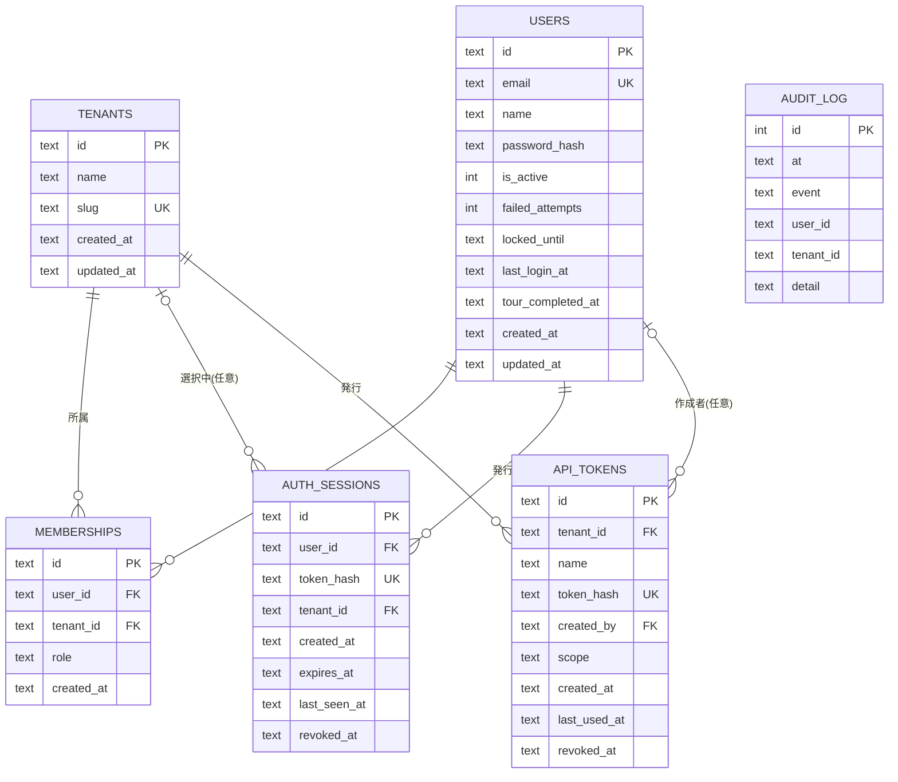
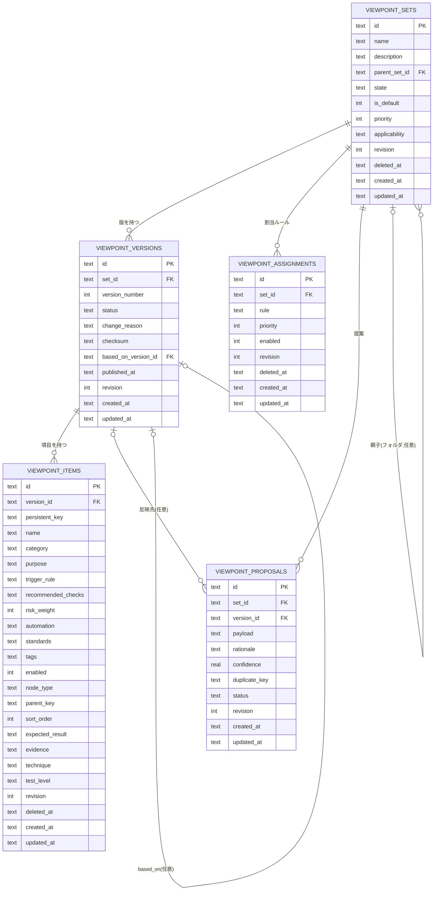
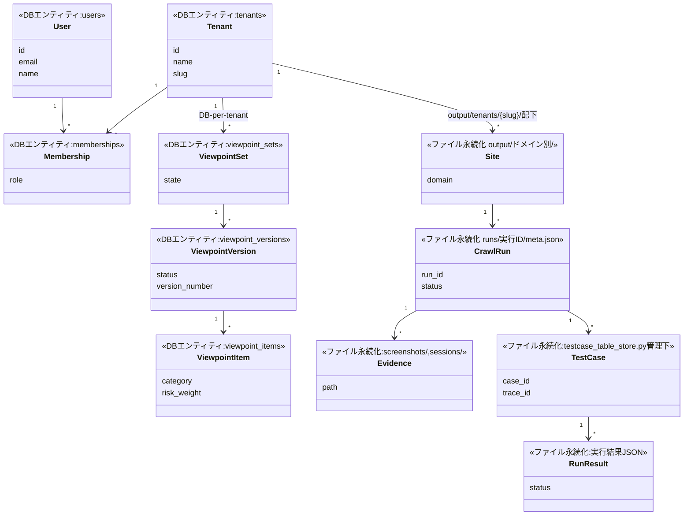
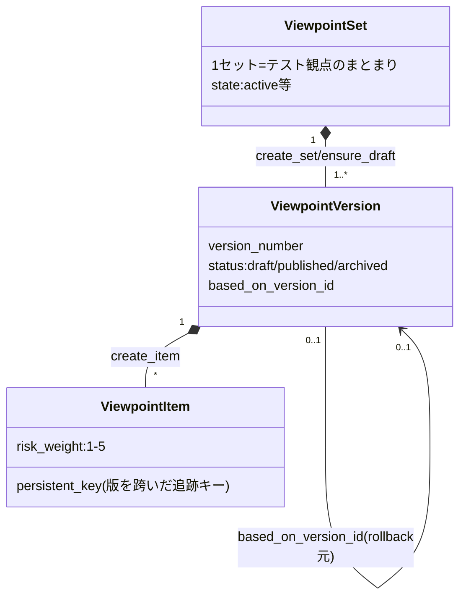
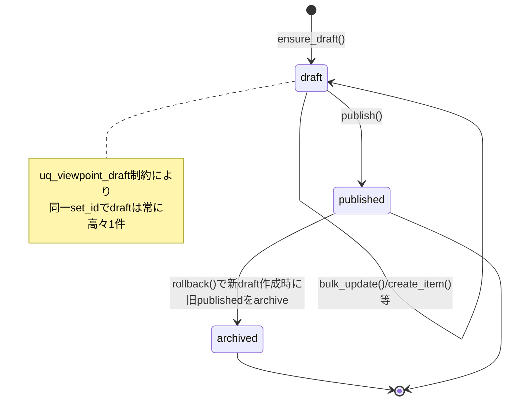
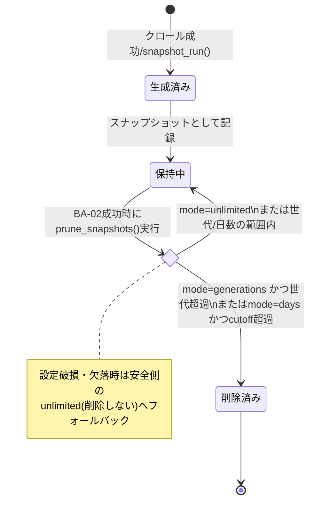

# WS2D-DD-001 データ設計書

- 版数: 2.2 / 作成日: 2026-08-02 / 準拠: IPA 共通フレーム（データ設計・論理）
- 本書は**論理設計**を扱う。物理設計（ストレージ・パフォーマンス等）は **`docs/sdlc/30_implementation/WS2D-PD-001_DB物理設計書.md`** を参照（`docs/sdlc/_asbuilt/schema.sql` を正本として転記・注釈したもの）。本書では重複記載しない。
- ワークスペース分離の詳細な運用手順は既存 `docs/AUTH_TENANCY.md` を参照し、本書では重複記載しない。

## 1. ER 図

### 1.1 auth.db

注: `audit_log` の `user_id`/`tenant_id` は DDL 上 `REFERENCES` が付与されておらず外部キー制約なし（対象が削除された後も監査記録を残す設計と推定されるが、この設計意図自体は未確認）。`memberships` は `UNIQUE(user_id, tenant_id)` により 1 ユーザー・1 テナントにつき所属は最大 1 件。

### 1.2 viewpoints.db

注: `viewpoint_items.version_id` は `ON DELETE CASCADE`（バージョン削除時に配下アイテムも削除される）。`uq_viewpoint_draft`（`viewpoint_versions(set_id) WHERE status='draft'` の UNIQUE INDEX）により **1 セットにつき下書き版は同時に 1 つまで**。`uq_viewpoint_set_name_active` により `deleted_at IS NULL` の範囲で名称（小文字化）が一意。

## 2. エンティティ定義

| エンティティ | 論理名 | 意味 | 主キー | ライフサイクル |
|---|---|---|---|---|
| tenants | テナント | 契約単位・組織単位の作業区画 | id | 作成 →（名称変更）→ 削除（所属・API トークンも連鎖削除、`AuthStore.delete_tenant`） |
| users | 利用者 | ログイン主体 | id | 作成 →（無効化/有効化）→ 削除（所属・セッションも削除） |
| memberships | 所属 | 利用者とテナントの所属関係＋テナント内ロール | id | ユーザー作成時・所属編集 API で作成／置換 |
| auth_sessions | セッション | ログインセッション（Cookie 発行の裏付け） | id | ログイン成立時に発行 → 有効期限切れ or ログアウト/失効で無効化 |
| api_tokens | API トークン | `/api/v1` 向け Bearer 認証情報 | id | 管理者が発行 →（失効） |
| audit_log | 監査ログ | ログイン・ユーザー変更・トークン発行等の追記記録 | id | 追記のみ（更新・削除なし） |
| viewpoint_sets | 観点セット | テスト観点のまとまり（フォルダ構造可） | id | 作成 → 版の追加 →（論理削除 deleted_at） |
| viewpoint_versions | 観点バージョン | 観点セットの版（draft/published/archived） | id | draft 作成 → publish →（rollback/archive） |
| viewpoint_items | 観点項目 | 個々のテスト観点 | id | バージョン内で作成 → 更新 →（論理削除） |
| viewpoint_assignments | 割当ルール | 観点セットの適用条件 | id | 作成 → 更新 →（論理削除） |
| viewpoint_proposals | 観点提案 | AI（OpenAI）生成の観点候補 | id | 生成(pending) → 採否決定(adopted/rejected) |

## 3. 属性定義

### 3.1 users

| 論理項目名 | 物理カラム名 | 型 | 必須 | 意味 | 取りうる値 |
|---|---|---|---|---|---|
| ID | id | TEXT | Yes(PK) | 利用者を一意に識別 | - |
| メールアドレス | email | TEXT | Yes(UNIQUE) | ログインID兼連絡先 | - |
| 氏名 | name | TEXT | Yes | 表示名 | - |
| パスワードハッシュ | password_hash | TEXT | Yes(既定'') | werkzeug（既定scrypt）によるハッシュ。空文字はモック認証（パスワードなし）を意味する | - |
| 有効フラグ | is_active | INTEGER | Yes(既定1) | アカウント有効/無効 | 0=無効, 1=有効 |
| 失敗回数 | failed_attempts | INTEGER | Yes(既定0) | 連続ログイン失敗回数（ロック判定用。`MAX_FAILED_ATTEMPTS=5`） | 0以上 |
| ロック解除時刻 | locked_until | TEXT | No | 失敗回数超過時のロック解除予定時刻（`LOCK_MINUTES=15`） | ISO8601 |
| 最終ログイン | last_login_at | TEXT | No | 直近ログイン成功時刻 | ISO8601 |
| ツアー完了時刻 | tour_completed_at | TEXT | No | 初回ツアー完了記録 | ISO8601 |
| 作成/更新日時 | created_at/updated_at | TEXT | Yes | - | ISO8601 |

注: ロールはこのテーブルには持たず `memberships.role` に持つ（旧スキーマでは users に role/tenant_id があったが、`_migrate_v4` で「1 ユーザー=1 テナント」を解いて memberships へ移設済み）。`MIN_PASSWORD_LENGTH=10`。

### 3.2 memberships

| 論理項目名 | 物理カラム名 | 型 | 必須 | 意味 | 取りうる値 |
|---|---|---|---|---|---|
| ID | id | TEXT | Yes(PK) | - | - |
| 利用者ID | user_id | TEXT | Yes(FK→users) | - | - |
| テナントID | tenant_id | TEXT | Yes(FK→tenants) | - | - |
| ロール | role | TEXT | Yes | そのテナント内での権限 | CHECK: 'member' \| 'admin' |
| 作成日時 | created_at | TEXT | Yes | - | ISO8601 |

制約: `UNIQUE(user_id, tenant_id)` — 同一ユーザーが同一テナントに複数所属することはない。

### 3.3 auth_sessions

| 論理項目名 | 物理カラム名 | 型 | 必須 | 意味 | 取りうる値 |
|---|---|---|---|---|---|
| ID | id | TEXT | Yes(PK) | セッションID | - |
| 利用者ID | user_id | TEXT | Yes(FK→users) | - | - |
| トークンハッシュ | token_hash | TEXT | Yes(UNIQUE) | Cookie値のSHA-256。生トークンは保存しない | - |
| 選択中テナントID | tenant_id | TEXT | No(FK→tenants) | テナント未選択の間はNULL | - |
| 作成日時 | created_at | TEXT | Yes | - | ISO8601 |
| 失効予定時刻 | expires_at | TEXT | Yes | 既定作成から12時間後（`WEBSPEC2DOC_SESSION_HOURS`で変更可） | ISO8601 |
| 最終利用時刻 | last_seen_at | TEXT | Yes | - | ISO8601 |
| 失効時刻 | revoked_at | TEXT | No | 明示ログアウト・パスワード変更時等 | ISO8601 |

### 3.4 api_tokens

| 論理項目名 | 物理カラム名 | 型 | 必須 | 意味 | 取りうる値 |
|---|---|---|---|---|---|
| ID | id | TEXT | Yes(PK) | - | - |
| テナントID | tenant_id | TEXT | Yes(FK→tenants) | - | - |
| 名称 | name | TEXT | Yes | 利用者が識別用に付ける名前 | - |
| トークンハッシュ | token_hash | TEXT | Yes(UNIQUE) | 生トークンのSHA-256 | - |
| 作成者ID | created_by | TEXT | No(FK→users) | - | - |
| スコープ | scope | TEXT | Yes(既定'full') | 権限範囲 | 'read' \| 'full'（`API_TOKEN_SCOPES`） |
| 作成日時 | created_at | TEXT | Yes | - | ISO8601 |
| 最終利用時刻 | last_used_at | TEXT | No | - | ISO8601 |
| 失効時刻 | revoked_at | TEXT | No | - | ISO8601 |

### 3.5 tenants

| 論理項目名 | 物理カラム名 | 型 | 必須 | 意味 | 取りうる値 |
|---|---|---|---|---|---|
| ID | id | TEXT | Yes(PK) | - | - |
| 名称 | name | TEXT | Yes | - | - |
| スラッグ | slug | TEXT | Yes(UNIQUE) | パス構築に使用。作成時`slugify_tenant_name`で生成、使用時`^[a-z0-9][a-z0-9-]{0,31}$`で再検証 | - |
| 作成/更新日時 | created_at/updated_at | TEXT | Yes | - | ISO8601 |

### 3.6 audit_log

| 論理項目名 | 物理カラム名 | 型 | 必須 | 意味 | 取りうる値 |
|---|---|---|---|---|---|
| ID | id | INTEGER | Yes(PK, AUTOINCREMENT) | - | - |
| 発生時刻 | at | TEXT | Yes | - | ISO8601 |
| イベント種別 | event | TEXT | Yes | - | 未確認（自由文字列。呼び出し箇所の全列挙は未実施） |
| 利用者ID | user_id | TEXT | No | 外部キー制約なし | - |
| テナントID | tenant_id | TEXT | No | 外部キー制約なし | - |
| 詳細 | detail | TEXT | Yes(既定'') | - | - |

### 3.7 viewpoint_sets

| 論理項目名 | 物理カラム名 | 型 | 必須 | 意味 | 取りうる値 |
|---|---|---|---|---|---|
| ID | id | TEXT | Yes(PK) | - | - |
| 名称 | name | TEXT | Yes | UNIQUE INDEX(lower(name)) WHERE deleted_at IS NULL | - |
| 説明 | description | TEXT | Yes(既定'') | - | - |
| 親セットID | parent_set_id | TEXT | No(FK→自身) | フォルダ階層 | - |
| 状態 | state | TEXT | Yes(既定'active') | - | 未確認（CHECK制約なし） |
| 既定フラグ | is_default | INTEGER | Yes(既定0) | - | 0/1 |
| 優先度 | priority | INTEGER | Yes(既定0) | - | - |
| 適用条件 | applicability | TEXT | Yes(既定'{}') | JSON | - |
| 版番号(楽観ロック) | revision | INTEGER | Yes(既定1) | - | - |
| 削除時刻 | deleted_at | TEXT | No | 論理削除 | - |
| 作成/更新日時 | created_at/updated_at | TEXT | Yes | - | ISO8601 |

### 3.8 viewpoint_versions

| 論理項目名 | 物理カラム名 | 型 | 必須 | 意味 | 取りうる値 |
|---|---|---|---|---|---|
| ID | id | TEXT | Yes(PK) | - | - |
| セットID | set_id | TEXT | Yes(FK→viewpoint_sets) | - | - |
| バージョン番号 | version_number | INTEGER | Yes | UNIQUE(set_id, version_number) | 1以上 |
| ステータス | status | TEXT | Yes | - | CHECK: 'draft' \| 'published' \| 'archived' |
| 変更理由 | change_reason | TEXT | Yes(既定'') | - | - |
| チェックサム | checksum | TEXT | Yes(既定'') | 内容の同一性検証用 | - |
| 元バージョンID | based_on_version_id | TEXT | No(FK→自身) | - | - |
| 公開日時 | published_at | TEXT | No | - | ISO8601 |
| 版番号(楽観ロック) | revision | INTEGER | Yes(既定1) | - | - |

制約: `uq_viewpoint_draft`（set_id 単位で status='draft' の UNIQUE INDEX）— 1 セットにつき draft は同時に 1 つまで。

### 3.9 viewpoint_items

| 論理項目名 | 物理カラム名 | 型 | 必須 | 意味 | 取りうる値 |
|---|---|---|---|---|---|
| ID | id | TEXT | Yes(PK) | - | - |
| バージョンID | version_id | TEXT | Yes(FK→viewpoint_versions, ON DELETE CASCADE) | - | - |
| 永続キー | persistent_key | TEXT | Yes | UNIQUE(version_id, persistent_key)。版を跨いだ同一項目の追跡キー | - |
| 名称 | name | TEXT | Yes | - | - |
| カテゴリ | category | TEXT | Yes | - | 未確認 |
| 目的 | purpose | TEXT | Yes(既定'') | - | - |
| トリガ条件 | trigger_rule | TEXT | Yes(既定'{}') | JSON | - |
| 推奨チェック | recommended_checks | TEXT | Yes(既定'') | - | - |
| リスク重み | risk_weight | INTEGER | Yes(既定3) | - | CHECK: 1〜5 |
| 自動化区分 | automation | TEXT | Yes(既定'manual') | - | 'manual'を確認。他の値は未確認 |
| 出典規格 | standards | TEXT | Yes(既定'') | 根拠規格・ガイドライン | - |
| タグ | tags | TEXT | Yes(既定'[]') | JSON配列 | - |
| 有効フラグ | enabled | INTEGER | Yes(既定1) | - | 0/1 |
| ノード種別 | node_type | TEXT | Yes(既定'viewpoint') | ツリー表示上の種別 | 'viewpoint'を確認。他の値は未確認 |
| 親キー | parent_key | TEXT | No | ツリー階層 | - |
| 表示順 | sort_order | INTEGER | Yes(既定0) | - | - |
| 期待結果 | expected_result | TEXT | Yes(既定'') | - | - |
| エビデンス | evidence | TEXT | Yes(既定'') | - | - |
| 技法 | technique | TEXT | Yes(既定'') | - | - |
| テストレベル | test_level | TEXT | Yes(既定'') | - | - |
| 版番号 | revision | INTEGER | Yes(既定1) | - | - |
| 削除時刻 | deleted_at | TEXT | No | 論理削除 | - |

### 3.10 viewpoint_assignments

| 論理項目名 | 物理カラム名 | 型 | 必須 | 意味 | 取りうる値 |
|---|---|---|---|---|---|
| ID | id | TEXT | Yes(PK) | - | - |
| セットID | set_id | TEXT | Yes(FK→viewpoint_sets) | - | - |
| ルール | rule | TEXT | Yes | 適用条件式 | 未確認（書式は未確認） |
| 優先度 | priority | INTEGER | Yes(既定0) | - | - |
| 有効フラグ | enabled | INTEGER | Yes(既定1) | - | 0/1 |
| 版番号 | revision | INTEGER | Yes(既定1) | - | - |
| 削除時刻 | deleted_at | TEXT | No | - | - |

### 3.11 viewpoint_proposals

| 論理項目名 | 物理カラム名 | 型 | 必須 | 意味 | 取りうる値 |
|---|---|---|---|---|---|
| ID | id | TEXT | Yes(PK) | - | - |
| セットID | set_id | TEXT | Yes(FK→viewpoint_sets) | - | - |
| バージョンID | version_id | TEXT | No(FK→viewpoint_versions) | 反映先（未反映ならNULL） | - |
| ペイロード | payload | TEXT | Yes | 提案内容(JSON、AI生成) | - |
| 根拠 | rationale | TEXT | Yes | AIが提示した採用理由 | - |
| 確信度 | confidence | REAL | Yes | - | CHECK: 0〜1 |
| 重複キー | duplicate_key | TEXT | Yes(既定'') | 既存項目との重複検出用 | - |
| ステータス | status | TEXT | Yes | - | CHECK: 'pending' \| 'adopted' \| 'rejected' |
| 版番号 | revision | INTEGER | Yes(既定1) | - | - |

## 4. データ分類とテナント分離

- **テナント境界を持つデータ**: viewpoints.db 全体（DB-per-tenant。`instance/tenants/{slug}/viewpoints.db`）、`output/tenants/{slug}/{domain}/` 配下のクロール成果物、`instance/tenants/{slug}/` 配下の設定ファイル。auth.db 内では `memberships`（user×tenant）、`api_tokens`（tenant_id NOT NULL）、`auth_sessions.tenant_id`（選択中テナント、NULL可）。
- **テナント境界を持たないデータ**: `users`・`tenants` テーブル自体（全テナント共通のマスタ）、`audit_log`（全テナント共通の 1 テーブルに記録、tenant_id カラムで参照するのみで物理分離はしない）、`data/viewpoint_templates/*.json`（観点テンプレートは全テナント共有参照）。
- **分離の実装単位**: 行レベルの `tenant_id` フィルタではなく、`web/tenancy.py: scoped_output_dir()/scoped_instance_path()` によるパス切替（ファイルシステムレベル）と DB 接続先切替（DB-per-tenant）の組み合わせ。テナントなし（ローカル単独利用・認証オフ）時は `/tenants/{slug}/` を経由せず従来パスを使う。

## 5. ファイルベースの永続化

### 5.1 実行履歴（`web/services/run_store.py`）

- `output/{domain}/runs/{run_id}/` に実行回ごとの成果物を退避する。`run_id` は `^\d{8}-\d{6}(-\d+)?$`（同一秒の並行実行にも対応する連番サフィックス）。
- `meta.json` に実行メタ情報（`RunMeta.to_dict()`）を記録。`snapshot_run()` が成果物をコピーし、`load_meta`/`list_runs`/`latest_run_id` 等で参照する。存在しない実行回への参照は例外を投げず None を返す設計（「捏造しない」という方針がソースコードのdocstringに明記されている）。

### 5.2 保持ポリシー（`web/services/retention.py`）

- `RetentionPolicy` を JSON 設定として読み書き（`load_retention_policy`/`save_retention_policy`）。設定不備時は「安全側の無制限」にフォールバックする。
- `prune_snapshots()` がサイトごとの snapshot JSON に保持ルールを適用し世代 GC を行う。`collect_storage_usage()` がテナントスコープ済みの `output`/`instance` 実容量を集計する。
- 管理 API は `GET/PUT /retention`（`web/routes/admin.py`、管理者権限必須）。

### 5.3 その他ファイル成果物（既存 WS2D-DD-001 v1.0 §2 を継承・変更なし）

- `output/{domain}/report.json`（正本）、`report.html`、`screens.md`、`forms.md`、`transition.mmd`、`spec.xlsx`、`screenshots/P*.png`、`sessions/`、`audit.jsonl`。

## 6. 個人情報・機微情報の扱い

| 項目 | 該当データ | 保護状況 |
|---|---|---|
| メールアドレス | users.email | 平文保存（ログインID・連絡先として業務上必要）。ログ出力時のマスキング有無は未確認 |
| パスワード | users.password_hash | werkzeug `generate_password_hash`/`check_password_hash` によるハッシュ化（既定scrypt）。平文は保存しない |
| セッショントークン | auth_sessions.token_hash | SHA-256 ハッシュのみ保存。生トークンは Cookie（HttpOnly）にのみ存在しDBには残らない |
| API トークン | api_tokens.token_hash | 同上（SHA-256）。作成直後のレスポンスでのみ平文が返る想定（レスポンス構造の詳細は本改訂では未確認） |
| クロール対象サイトの認証情報 | `output/{domain}/auth.json` | 既存DD-001 v1.0の記載を継承: 「サイト認証のID/PWは送信のみで即破棄、保存しない（ADR-0002）」。Cookie等セッション情報のみ保存 |
| secret_key | `instance/secret_key` | 環境変数優先、無ければファイル生成しパーミッション0600 |

## 7. ドメインモデル図

1〜3章のDBテーブルではなく、**業務概念のレベル**で整理する。DBテーブルに対応しない概念（ファイルで永続化されるもの）も含める。`schema.sql` の11テーブル（api_tokens, audit_log, auth_sessions, memberships, tenants, users, viewpoint_assignments, viewpoint_items, viewpoint_proposals, viewpoint_sets, viewpoint_versions）に対応がない業務概念は、5章の実測（`run_store.py`/`retention.py`/既存ファイル一覧）を根拠にファイル永続化として扱う。

補足:

- `<<DBエンティティ>>` は1〜3章のER図に対応テーブルがあるもの。`<<ファイル永続化>>` は対応テーブルが存在しない業務概念で、5章のファイルベース永続化の実測に基づく。
- `Site`（対象サイト）は `domain` 文字列と `output/{domain}/` ディレクトリの存在のみで表現され、専用テーブルを持たない。
- `TestCase`・`RunResult` は `testcase_table_store.py`（テストケース表の永続化）・`run_store.py`（実行回ごとの成果物）が扱う概念でDB化されていない。両者は `web/services/condition_run_status.py`（`trace_id`/`condition_id` によるテストケース⇔実行結果の突合、実装確認済み）で関連付けられる。
- 多重度は業務上自然な解釈（1サイトに複数クロール実行、1実行に複数証跡）であり、ファイル構造上の強制ではない。

## 8. 観点セットのバージョニング概念図

set / version / item の3階層構造と、バージョンの状態遷移（draft/published/archived）を示す。実装は `ViewpointStoreBase`/`ViewpointStoreOperations`（`WS2D-MD-001` 6.1節）。

補足: `viewpoint_versions.status` のCHECK制約は `'draft'|'published'|'archived'` の3値（3.8節）。`rollback()` は「published を archived にして draft から作り直す」という意味的な遷移だが、`archived → draft` の直接遷移が実装上どう起きるか（新規バージョン発行との関係）は `ViewpointStoreOperations.rollback()` の呼び出し詳細まで踏み込んでおらず**未確認**。`version_diff()` により任意の2バージョン間の差分参照が可能（状態遷移とは独立した読み取り専用操作）。

## 9. データライフサイクル図（クロール結果・生成ドキュメント）

`retention.py`（`WS2D-BA-001` BA-04）の保持ポリシーに基づく生成→保持→削除の流れ。

補足: 上記は `output/{domain}/snapshots/` 配下（差分比較用スナップショット）が対象。`run_store.py` が管理する `output/{domain}/runs/{run_id}/`（実行回ごとの成果物）には、本書の調査範囲では自動削除・保持ポリシーの適用が確認できず**未確認**（`retention.py` の対象は明示的に snapshots であり runs ではない）。生成された `report.json`/`report.html`/`spec.xlsx` 等（既存5.3節）が snapshot と同じライフサイクルに従うか独立して残り続けるかは、本改訂では確認していない。

## 改訂履歴

| 版 | 日付 | 内容 | 作成者 |
|---|---|---|---|
| 1.0 | 2026-07-16 | 初版作成 | 開発チーム |
| 2.0 | 2026-08-02 | 論理設計として全面改訂。ER図（mermaid、カーディナリティ精査済み）・属性定義（全11テーブル）・テナント分離・ファイル永続化・個人情報の扱いを実装確認の上で追記 | 開発チーム |
| 2.1 | 2026-08-02 | WS2D-PD-001 への参照を修正（誤って「未作成」と記載していたが、実際は `docs/sdlc/30_implementation/WS2D-PD-001_DB物理設計書.md` として作成済みだった） | 開発チーム |
| 2.2 | 2026-08-02 | ドメインモデル図・観点セットのバージョニング概念図・データライフサイクル図（mermaid）を追加。既存ER図（1章）は変更なし | 開発チーム |
