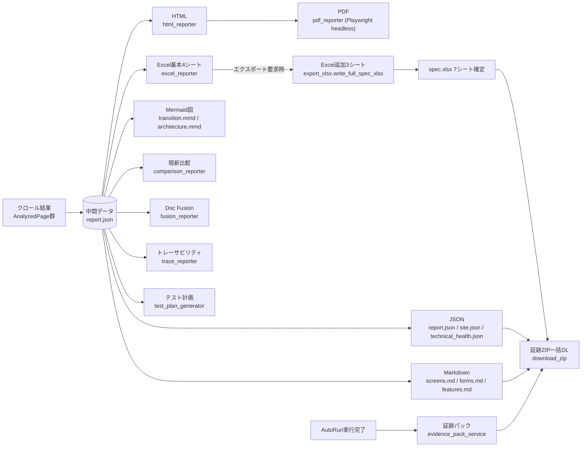
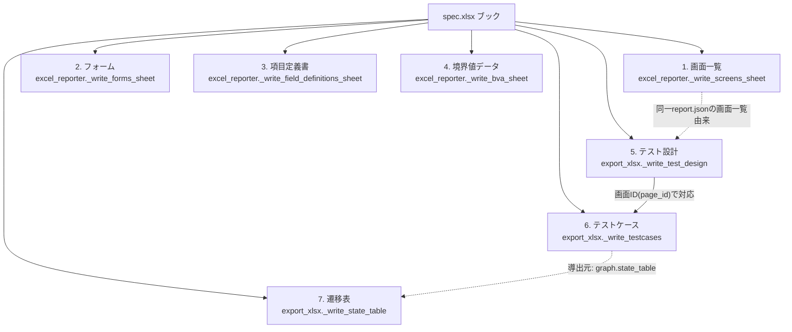

# WS2D-OD-001 帳票出力設計書

- 版数: 2.0 / 作成日: 2026-08-02 / 最終更新: 2026-08-03 / 準拠: IPA 共通フレーム（帳票・出力設計）
- 本書は WebSpec2Doc の主成果物である「生成されるドキュメント」の仕様を定義する。
  `src/generator/`（22ファイル）・`web/services/export_xlsx.py`・
  `web/services/evidence_pack_service.py`・`web/services/openapi_docs.py`・
  `web/services/retention.py`・`templates/autorun-report.html`・
  `docs/sdlc/_asbuilt/routes.json`・`output/` 配下の実物を実測して作成した。
  ソースコードの docstring／実装本体で確認できた項目は断定表記し、確認できなかった
  項目は本文中に**「未確認」**と明記する（実装を読んでいない推測を断定表記しない）。
  未確認事項は §13 に一覧化する。

## 1. 文書概要

### 1.1 目的

本書の目的は、WebSpec2Doc が生成する全ての帳票・出力物（Markdown・Excel・HTML・PDF・
JSON・Mermaid図・CSV・ZIP・JSONLの9形式）について、①生成契機、②出力先パス、
③レイアウト（シート構成・列定義・見出し構成）、④データソース、⑤失敗時の挙動を
一元的に定義することにある。本システムの納品物は「クロール結果そのもの」ではなく
「クロール結果から生成されたドキュメント」であるため、帳票出力設計書は本システムの
主成果物の検収基準として機能する。大手 SIer 案件の納品検査では、帳票のレイアウト・
文字コード・命名規則・世代管理が個別に確認されることが多く、本書はその確認単位に
沿って章立てている。

### 1.2 適用範囲

- **対象**: `src/generator/` 配下の生成モジュール一式（22ファイル）、
  `web/services/export_xlsx.py`（エクスポート要求時に追加する3シート）、
  `web/services/evidence_pack_service.py`（AutoRun証跡パックの配線層）、
  `web/services/retention.py`（スナップショット保持ポリシー）、
  `templates/autorun-report.html`（AutoRun実行結果レポート画面のテンプレート）。
- **対象外（範囲確認済み・帳票ではない）**: `/api/v1/docs`
  （`web/services/openapi_docs.py` が `render_openapi_docs()` で動的生成する
  API リファレンス HTML）は、解析結果から生成される帳票ではなく実装済みエンドポイント
  一覧の提示ページであり、ディスクへ永続化されない。本改訂で実装は確認済みだが、
  性質が異なるため出力物一覧（§2）には計上しない。
- **対象外（別文書）**: 画面 UI 自体のレイアウト仕様は `docs/sdlc/20_design/` の
  画面設計書群、テスト観点・ケースの設計ロジックは `WS2D-UT-001` 系を参照。

### 1.3 関連文書

| 文書 | 関係 |
|---|---|
| `docs/sdlc/10_requirement/` 配下の要件定義書 | 出力物要求の一次情報源 |
| `docs/sdlc/_asbuilt/routes.json` | 実装済みルート一覧（本改訂で実測、ダウンロード系ルートの根拠） |
| `docs/INCIDENT_POSTMORTEM.md`（INC-2026-001） | 「pytest緑=完了」の誤判定是正の記録。本書§11の検証観点にも影響 |
| `docs/sdlc/40_test/WS2D-DL-001_不具合管理台帳.md` | 出力物起因の不具合（DL-009 CSV取込捏造、DL-022サンプル帯混入等）を追跡する対の文書 |

### 1.4 用語

| 用語 | 定義 |
|---|---|
| 出力物 | クロール・解析・AutoRun 実行の結果として生成されるファイル一式の総称。本書では RP-01〜RP-26 の ID を付与する |
| 中間データ | 各種出力の生成元になる `report.json`。画面・フォーム・遷移の実測結果を保持する |
| ドメインディレクトリ | `output/{domain}/`。`domain` は `crawler.url_safety.domain_key_from_url` により URL から正規化されたキー |
| 証跡パック（Evidence Pack） | AutoRun 実行が完了した事実と過程を裏付ける複数ファイルの束（RP-23） |
| エクスポート時生成 | クロール完了時ではなく、ユーザーがダウンロード操作をした時点で組み立てられる出力物の生成方式（例: spec.xlsx のシート5〜7） |

## 2. 出力物一覧

出力先は原則 `output/{domain}/` 配下（`domain` はテナントスコープ済み出力ディレクトリ内、
`crawler.url_safety.domain_key_from_url` でキー化）。文字コードは `write_text` 呼び出しを
実測できた箇所はすべて `encoding="utf-8"` だった。改行コードの明示指定は確認できず（**未確認**）。
本改訂で `src/generator/` 全22ファイルの module docstring と公開関数を実測し、
既存の記載を裏付けた（§13参照）。

| 出力物ID | 名称 | 形式 | 生成契機 | 出力先パス | 文字コード |
|---|---|---|---|---|---|
| RP-01 | 画面仕様 | Markdown | 解析実行時（`markdown_generator.generate_screens_markdown`） | `output/{domain}/screens.md` | 未確認（`write_text`呼び出し箇所は本体未読） |
| RP-02 | フォーム仕様 | Markdown | 解析実行時（`generate_forms_markdown`） | `output/{domain}/forms.md` | 未確認（同上） |
| RP-03 | 機能一覧 | Markdown | 解析実行時（`feature_catalog.generate_features_markdown`） | `output/{domain}/features.md` | 未確認 |
| RP-04 | 実測仕様Excel | Excel(.xlsx) | 解析実行時に基本4シート生成（`excel_reporter.save_excel_output`）。エクスポート要求時に3シート追加（`export_xlsx.write_full_spec_xlsx`） | `output/{domain}/spec.xlsx`（`XLSX_FILE_NAME`定数、実測: `output/www.nict.go.jp/spec.xlsx` 実在） | - (バイナリ) |
| RP-05 | 実測レポートJSON | JSON | 解析実行時（`json_reporter.generate_json_report`） | `output/{domain}/report.json`（実物確認済み） | 未確認（関数本体未読。他モジュールは `ensure_ascii=False, encoding="utf-8"` が通例） |
| RP-06 | HTMLテストベース文書 | HTML | 解析実行時（`html_reporter.generate_html_report`、1228行） | `output/{domain}/report.html`（実物確認済み） | 未確認 |
| RP-07 | PDFレポート | PDF | `report.html` を Playwright headless Chromium でレンダリング（`pdf_reporter.generate_pdf`） | `output/{domain}/report.pdf`（実物確認済み） | - (バイナリ) |
| RP-08 | 画面遷移図 | Mermaid(.mmd) | 解析実行時（`mermaid_generator.generate_mermaid`） | `output/{domain}/transition.mmd`（実物確認済み） | 未確認 |
| RP-09 | アーキテクチャ図 | Mermaid(.mmd) | 解析実行時（`architecture_generator.generate_architecture_mermaid`） | `output/{domain}/architecture.mmd`（実物確認済み） | 未確認 |
| RP-10 | 現新比較 | JSON + HTML | 再クロール時、前回結果との比較（`comparison_reporter.save_comparison_outputs`） | `output/{domain}/comparison.json`, `comparison.html` | UTF-8（`write_text(..., encoding="utf-8")` 実測） |
| RP-11 | Doc Fusion結果 | JSON + Markdown | 文書駆動モードで要件文書と実測を突合時（`fusion_reporter.save_fusion_outputs`） | `output/{domain}/doc_fusion.json`, `doc_fusion.md`（実物確認済み） | UTF-8（実測） |
| RP-12 | トレーサビリティ | JSON + Markdown | 要件文書トレース時（`trace_reporter.save_trace_outputs`） | `output/{domain}/requirement_trace.json`, `traceability_matrix.md`（実物確認済み） | UTF-8（実測） |
| RP-13 | 文書リフレッシュ | Markdown + JSON | Doc Fusion Phase3（`refresh_reporter.save_refresh_outputs`） | `output_dir/refreshed_spec.md`, `refresh_log.json`（呼び出し元引数 `output_dir` の実値は未確認） | UTF-8（実測） |
| RP-14 | テスト計画 | Markdown + Excel(.xlsx) | テスト計画生成時（`test_plan_generator.save_test_plan`） | `output_dir/test_plan.md`, `test_plan.xlsx`（`MD_FILE_NAME`/`XLSX_FILE_NAME`定数） | md: UTF-8（実測）。xlsx失敗時はmdのみ出力 |
| RP-15 | UXレビュー | JSON | 解析実行時（`ux_reporter.save_ux_outputs`） | `output_dir/ux_review.json`（`output_dir` の実際の解決先は未確認） | 未確認 |
| RP-16 | アクセシビリティ監査 | JSON | 解析実行時（`accessibility_reporter.save_accessibility_audit`） | `output/{domain}/accessibility_audit.json`（実物確認済み） | UTF-8, `ensure_ascii=False`（実測） |
| RP-17 | 技術健全性 | JSON | 解析実行時（生成元モジュール未確認） | `output/{domain}/technical_health.json`（実物確認済み） | 未確認 |
| RP-18 | サイト情報 | JSON | 解析実行時（生成元モジュール未確認） | `output/{domain}/site.json`（実物確認済み） | 未確認 |
| RP-19 | テストケースCSV / 汎用フォームCSV | CSV | ダウンロード操作時（`csv_reporter.generate_csv_report` / `generate_testcase_csv`） | ダウンロード応答（ディスク常設パスは未確認） | 未確認 |
| RP-20 | 探索カバレッジ・バーンダウンHTML | HTML | 探索カバレッジ集計時（`burndown_reporter.generate_burndown_html`） | 未確認（呼び出し元・出力先未確認） | 未確認 |
| RP-21 | カバレッジヒートマップHTML | HTML | カバレッジ集計時（`heatmap_reporter.generate_analysis_coverage_html`／`generate_autorun_coverage_html`）。ルート `report.api_coverage_heatmap`（`/api/coverage-heatmap`）から `kind=analysis`／`kind=autorun` で呼び分け（本改訂で routes.json 実測） | 応答本文（ディスク常設は未確認） | 未確認 |
| RP-22 | 差分レポートHTML | HTML | `diff_reporter.generate_diff_report`（434行） | 未確認 | 未確認 |
| RP-23 | AutoRun証跡パック（Evidence Pack） | 複数ファイル | AutoRun実行完了時（`evidence_pack_service.generate_evidence_pack` → `evidence.pack_reporter.save_evidence_pack`） | `output/{domain}/qa_process/` 配下（実物: `output/127.0.0.1:8767/qa_process/` 存在確認。個々のファイル名は `evidence/pack_reporter.py` 本体未読のため**未確認**。ただし材料側の入力ファイルは本改訂で確認: `qa_process/playwright_report.json`・`quality_viewpoints.json`・`autorun.meta.json`・`manual_procedures.md`・`mutation_verification.json`） | 未確認 |
| RP-24 | 証跡ZIP一括ダウンロード | ZIP | ユーザーがダウンロード操作（`web/routes/report.py` の `download_zip`、`paths` パラメータで複数値・カンマ区切り指定可、本改訂で実測） | ダウンロード応答（実体パス生成ロジックは未確認） | - (バイナリ) |
| RP-25 | 監査ログ | JSONL | 各種操作時に追記 | `output/{domain}/audit.jsonl`（実物確認済み） | 未確認 |
| RP-26 | LLM利用ログ／使用量ログ | JSONL | LLM呼び出し・利用実績記録時 | `output/llm_activity.jsonl`, `output/usage_log.jsonl`（テナント非スコープ、`output/` 直下に実在確認） | 未確認 |

出力先ディレクトリの実物調査（本改訂）では、上記に加えて `output/{domain}/screenshots/*.png`
（画面キャプチャ、証跡パックの材料）、`output/{domain}/snapshots/*.json`（世代別スナップショット、
§10参照）、`output/{domain}/work/current-checkpoint.json`（再開用チェックポイント、位置づけは
**未確認**）、`output/{domain}/reference_docs/`（文書駆動モードでアップロードされた参考文書の保存先、
`web/routes/crawl.py` の `upload_reference_docs` が書き込み先と実測一致）の実在を確認した。

## 3. 出力物の生成フロー

**図1の読み方**: WebSpec2Doc の全出力物は例外なく `report.json`（中間データ）を起点に
枝分かれする。中間データを1箇所に固定した設計により、Markdown・Excel・HTML・JSONの
各出力形式が同一の実測結果から生成されることが保証され、出力物間の内容不一致
（例: screens.md の画面数と spec.xlsx の画面一覧シートの行数が食い違う）が構造的に
起こりにくい。ただし spec.xlsx のシート5〜7（テスト設計・テストケース・遷移表）だけは
「クロール時ではなくエクスポート要求時に組み立てる」設計（`export_xlsx.py` docstring）
になっており、これはテストケースが後から生成・編集され実行結果も後から付くための
意図的な例外である。AutoRun 実行系の証跡パックは中間データ経路とは別に、
AutoRun 実行完了というイベントを起点にして独立に生成される（§7参照）。

## 4. Excel 出力（spec.xlsx）の詳細設計

既存4シート＋エクスポート時追加3シートの計7シート構成。既存4シートは解析実行時に
`excel_reporter.save_excel_output`（164行）が生成し、追加3シートはユーザーの
エクスポート操作時に `export_xlsx.py`（246行、本改訂で全文実測）が組み立てる。

### 4.1 シート構成図（図2）

**図2の読み方**: シート1〜4（既存）とシート5〜7（追加）は生成タイミングが異なるが、
すべて同一の `report.json` から導出されるため画面IDで相互に紐付く。シート5は
`web/services/screen_test_design.py` の画面別設計をテスト条件単位で列挙したもので、
シート6（テストケース）とは意図的に内容を分離している（`build_test_design_rows`の
docstring: 「入力値・手順・期待結果はここには載せない。載せるとテストケースシートと
二重になり、どちらが正かが分からなくなる」）。シート7（遷移表）は `graph.state_table`
モジュールが `report.json` の画面遷移から機械導出する。

### 4.2 シート別詳細（列定義）

| # | シート名 | 生成元 | 列定義 |
|---|---|---|---|
| 1 | 画面一覧 | `excel_reporter._write_screens_sheet` | 未確認（関数本体未読） |
| 2 | フォーム | `excel_reporter._write_forms_sheet` | 未確認 |
| 3 | 項目定義書 | `excel_reporter._write_field_definitions_sheet`（SIer標準の「項目定義書」形式、docstring確認） | 未確認 |
| 4 | 境界値データ | `excel_reporter._write_bva_sheet`（実測属性から機械導出、docstring確認） | 未確認 |
| 5 | テスト設計 | `export_xlsx._write_test_design`（本改訂で全文実測） | 画面ID／画面名／No／テスト条件／導出技法／由来／由来の詳細（列幅 10,26,6,52,14,14,30） |
| 6 | テストケース | `export_xlsx._write_testcases`（本改訂で全文実測） | ID／テストケース名／画面／機能／観点／前提条件／手順／期待結果／自動化判定／結果（列幅 18,34,20,14,14,28,40,40,12,10） |
| 7 | 遷移表 | `export_xlsx._write_state_table`（本改訂で全文実測） | 状態＼イベント（行＝状態、列＝イベント。イベント列は動的、セル値は遷移先状態。無効遷移は「（無効）」を付記。状態遷移が適用不可の場合は「遷移表を作成できませんでした」の見出し行＋理由行のみのシートとし、空データのまま確定させる） |

シート5〜7は「実装複雑度を抑えるため、クロール時ではなくエクスポート要求時に組み立てる」設計
（`export_xlsx.py` docstring: テストケースは後から生成・編集され実行結果も後から付くため）。
既存ブックがあれば `ADDED_SHEETS`（テスト設計／テストケース／遷移表）の3シートのみを削除して
から再作成し重複を防止する（本改訂で `build_workbook` 関数を実測: 既存4シートは温存され、
追加3シートだけが差し替え対象）。ヘッダ行は薄青背景（`PatternFill fgColor="E3F2FD"`）＋太字、
`freeze_panes="A2"`、長文列（テスト条件・前提条件・手順・期待結果）はセル内改行の折返し表示
（`Alignment(wrap_text=True)`）。既存ブックが無い場合でも3シートのみのブックとして成立させる
設計であり、「画面では見られるのにエクスポートだけ失敗する」事態を避けている
（`build_workbook` docstring）。

## 5. Markdown 出力の詳細設計

本改訂で `markdown_generator.py`（69行）・`test_plan_generator.py` の `_render_markdown`・
`trace_reporter.py` の `_render_markdown`・`fusion_reporter.py` の `_render_markdown`・
`refresh_reporter.py` の `render_refreshed_markdown` を全文実測し、前版で「未確認」だった
見出し構成の大半を確定させた。

| ファイル | セクション構成（本改訂で実測・確定） |
|---|---|
| `screens.md` | `# 画面一覧` 見出し → `対象URL: {target_url}` → 単一表（`# / 画面ID / URL / タイトル / フォーム数 / 遷移先`）。1画面1行、遷移先は複数ある場合カンマ区切り |
| `forms.md` | `# フォーム一覧` 見出し → 単一表（`画面ID / フィールド名 / 型 / 必須 / placeholder`）。1フィールド1行 |
| `features.md` | 機能一覧（機能ID／種別／画面／概要）の単一表（`feature_catalog.py` docstring確認、本改訂で章立ては未再実測のため見出し文言は前版記載を維持） |
| `test_plan.md` | `# テスト計画ドラフト` → `## スコープ表`（画面ID／タイトル／URL／画面種別／優先度／優先度根拠／テスト条件数／見積(分)、対象0件時は「対象画面 0 件」の1行のみ）→ `## 見積サマリ`（対象画面数／総見積時間／計算根拠として係数4種を列挙） |
| `traceability_matrix.md` | `# RFP要件トレーサビリティマトリクス` → `## サマリ`（要件数／covered件数と率／screen_only件数／unimplemented_suspect件数、および「未実装疑いは断定ではない」旨の注記）→ `## トレーサビリティマトリクス`（要件ID／要件名／対応画面／テスト／状態／文書出所） |
| `doc_fusion.md` | `# 文書×実測 突合レポート（Doc Fusion）` → `## サマリ`（文書記載画面数・項目数／画面対応づけ件数／文書のみ画面件数（内訳: 未実装疑い・未到達）／実測のみ画面件数／項目レベルギャップ件数、および文書鮮度への注記）→ `## 画面の対応表（用語注入）`（page_id／実測タイトル／文書上の正式名称／対応根拠＝URL一致 or 名称類似スコア）。以降「文書のみの画面」等のセクションが続く構成だが、本改訂では関数末尾までは実測範囲外のため**未確認** |
| `refreshed_spec.md` | `# 再生版仕様書（refreshed_spec）` → 生成日時／元文書 → `## サマリ`（更新／実測値未確認／未確認(文書のみ)／新規／変更なしの件数）→ 画面ごとのセクション（マッチ画面は項目名／型／必須／桁数／備考の表＋実測差分の注記、文書のみ画面は「※未確認」の明記、新規画面は「### {タイトル}（実測 evidence: {URL}）」の小見出し＋表）。決定的マージ（LLM不使用）である旨・業務ルールの真偽は実測検証していない旨を明記する設計 |

いずれの Markdown 出力も表セル中の `|` と改行は `_cell` 相当のエスケープ処理
（`replace("|", "\\|").replace("\n", " ")`、`markdown_generator.py`実測）でテーブル崩れを
防止している。

## 6. HTMLレポート出力の詳細設計

### 6.1 `report.html`（解析結果のテストベース文書）

`html_reporter.py`（1228行）の関数一覧（40関数超）から確認できた掲載セクション（出現順は
本体全文の逐次読解までは行っていないため不確定、内容の存在のみ確認）:

- サイドバー／トップバー／サマリカード
- Mermaid図（遷移図等の埋め込みブロック、CSP `script-src 'self'` 配下でアプリ内蔵版を読込）
- 画面カード（スクリーンショット／見出し／フォーム項目行／ボタン／遷移一覧。各項目に根拠バッジ
  `_evidence_badge`＝由来＋confidence）
- 性能観測（Core Web Vitals ラボ計測。合否バッジは付けない設計）
- 技術健全性 ／ アクセシビリティ監査（axe-core違反）
- カバレッジ（ISO/IEC/IEEE 29119-4 準拠）とビジネスフロー優先度
- 差分検出→影響テスト特定→再実行推奨リスト
- 探索カバレッジ（ヒートマップ集計）とチャーター提案
- UXレビュー（axe-core違反＋ニールセン10原則所見、重大度×画面マトリクス。画面ごとの
  rule_id/principle・selector・confidence・source詳細）
- カバレッジギャップ（「どこまで見た/見ていない」の明示）
- テスト設計（技法別）: 境界値分析（BVA）表・デシジョンテーブル（ISTQB標準の真理値表と同じ
  ルール＝列展開）・ペアワイズ表・状態遷移表
- メタ情報／フッタ

### 6.2 AutoRun実行結果レポート（`templates/autorun-report.html`）

本改訂でテンプレート全文（45行）を再実測。構成は次の通り:

- `<header class="arep-topbar">`: 「AutoRunへ戻る」導線、`{{ domain }}` を見出しに表示、
  「テストケースCSV」ダウンロードリンク（`/api/autorun/stages/testcases?domain={domain}&format=csv`）
- `<nav class="arep-nav">`: `sections`（key/label/description の3項目）を Jinja2 の
  `` でループし、セクション切替ボタンを描画。ボタン自体はラベルと説明文のみで
  中身は持たない
- `<main id="arep-main">
`: 実データの描画先。初期表示は
  「読み込んでいます…」のプレースホルダ
- `static/js/autorun-report.js` が `/api/autorun/report/<domain>`（`web/routes/autorun_report.py`
  の `api_autorun_report`、本改訂で routes.json 実測）等から取得して `#arep-content` に
  非同期描画する構成。JS本体は今回未読のため、各セクションの具体的な掲載項目は**未確認**

## 7. JSON / 証跡パック（ZIP）の構造

### 7.1 証跡パック（RP-23）の生成ロジック

`web/services/evidence_pack_service.py`（本改訂で全文実測、128行）は「材料の読み取りと
保存だけを担い、組み立ての判断は `src/evidence/` に置く」配線層と明記されている。
`generate_evidence_pack(job, output_dir)` が集める材料は次の7種:

| 材料 | 読み取り元 | 欠落時の扱い |
|---|---|---|
| Playwright実行結果 | `qa_process/playwright_report.json` | ファイル無ければ `None`（`_read_json`が`is_file()`チェック） |
| 品質観点 | `qa_process/quality_viewpoints.json` | 同上 |
| AutoRunメタ情報 | `qa_process/autorun.meta.json` | 同上 |
| 失敗分類 | `job.failure_classifications`（メモリ上のジョブオブジェクト） | 未設定なら `None` |
| スクリーンショット | `output/{domain}/screenshots/*.png` を `page_id -> 相対パス` で列挙 | ディレクトリ無ければ空dict |
| 手動手順書 | `qa_process/manual_procedures.md` | ファイル無ければ `None` |
| 監査ログ抜粋 | `output/{domain}/audit.jsonl` の末尾50件（`AUDIT_EXCERPT_LIMIT`定数） | JSON行として不正な行はスキップ |
| ミューテーション検証結果 | `qa_process/mutation_verification.json` | ファイル無ければ `None` |
| 実行条件 | `job.run_policy`（exit_criteria／allow_submit／auth_scope／browser_request／note／**unverified一覧**） | 既定値「重大度で整理し、最終判断は人が行う」 |

実際のファイル束の組み立ては `evidence.pack_model.build_evidence_pack` と
`evidence.pack_reporter.save_evidence_pack`（本改訂では未読）が担うため、出力される
個々のファイル名・形式は本書では**未確認**のまま §13 に記載する。`_run_conditions`関数の
コメントには「`unverified` が空でない限り、この実行を『人が全て確認した』と説明しては
ならない」という明示的な設計思想があり、証跡パックが「実行した事実」と「未確認の範囲」を
両方記録する設計であることが読み取れる。

### 7.2 主要JSON出力

| 出力物 | 生成元 | 備考 |
|---|---|---|
| `report.json`（RP-05） | `json_reporter.generate_json_report`（243行、module docstring無し） | 他の全出力物の中間データ（図1参照） |
| `comparison.json`（RP-10） | `comparison_reporter` | 網羅性サマリ（対応付け組数・現行のみ・新のみ・検査不能リンク件数）を含む |
| `doc_fusion.json`（RP-11） | `fusion_reporter.fusion_to_dict` | `_render_markdown`と同一の集計値（meta）をJSON化したもの（本改訂で同一関数群を確認） |
| `requirement_trace.json`（RP-12） | `trace_reporter.trace_to_dict` | `traceability_matrix.md`と同一集計値 |
| `accessibility_audit.json`（RP-16） | `accessibility_reporter.build_accessibility_audit` | axe-core実測のみ（他ソース混在なし、docstring確認） |

### 7.3 証跡ZIP一括ダウンロード（RP-24）

`web/routes/report.py` の `download_zip`（本改訂で routes.json から実測）は `paths`
パラメータ（複数値またはカンマ区切り）でZIP対象を絞り込める。パラメータ省略時の
既定挙動（ドメイン全体か、既定サブセットか）は実装本体未読のため**未確認**。

## 8. 出力項目とデータソースの対応表

| 出力物 | データソース |
|---|---|
| `report.json` / 画面一覧・フォーム・項目定義書・境界値データ（spec.xlsx シート1-4） | クロール結果（`report.json` 由来。画面・フォーム・フィールドの実測属性） |
| テスト設計・テストケース（spec.xlsx シート5-6） | `web/services/screen_test_design.py`（画面別設計）／`web/services/testcase_table_store.py`（テストケース表）※いずれも本体は今回未読、呼び出し関係のみ確認 |
| 遷移表（spec.xlsx シート7） | `graph.state_table.build_state_transition_report`（画面の遷移グラフ） |
| `comparison.json`/`.html` | 2回のクロール結果（現行 vs 新）の比較。網羅性サマリ（対応付け組数・現行のみ・新のみ・検査不能リンク件数）付き |
| `ux_review.json` | axe-core 検査結果＋ニールセン10原則所見 |
| `accessibility_audit.json` | axe-core 実測のみ（他ソースとの混在なし、`accessibility_reporter.py` docstring確認） |
| `requirement_trace.json`/`traceability_matrix.md` | 要件文書（RFP等）とcrawl結果の突合（SPEC-1-3） |
| `doc_fusion.json`/`.md` | 文書駆動モードで入力された要件・仕様文書とクロール実測の突合 |
| `refreshed_spec.md`/`refresh_log.json` | Doc Fusion の `FusionResult.field_gaps`（文書上の項目と実測の差分） |
| `test_plan.md`/`.xlsx` | 画面インベントリ×ROI係数（`usage_tracker` と同一の見積係数）／business_flows.nodes とのURL照合 |
| AutoRun証跡パック | `qa_process/playwright_report.json`・`quality_viewpoints.json`・`autorun.meta.json`・`manual_procedures.md`・`audit.jsonl`（末尾50件）・`mutation_verification.json`・実行条件（`job.run_policy`）・`screenshots/*.png` を統合（§7.1で詳細化） |
| カバレッジヒートマップ（RP-21） | `kind=analysis`: 取得状況3色判定（`heatmap_reporter.classify_analysis_status`）／`kind=autorun`: 実行回数×成否判定（`classify_autorun_status`）。本改訂で関数名を実測 |

## 9. ファイル命名規則

- **出力先ルート**: `output/{domain}/`。`domain` は `crawler.url_safety.domain_key_from_url`
  で正規化されたキー（実測パス例: `output/www.nict.go.jp/`, `output/127.0.0.1:8767/`）。
  ポート番号を含むホストは `host:port` の形式のままディレクトリ名に使われる（コロンを
  含む点は OS 依存のパス制約に注意。本改訂ではエスケープ処理の有無は**未確認**）。
- **固定ファイル名**: 生成物は原則ドメインディレクトリ直下に固定名で置かれる
  （例: `spec.xlsx`, `report.json`, `report.html`, `report.pdf`, `screens.md` ほか）。
  実行回（`run_id`）ごとの世代別ファイル名規則は本調査では確認できず（**未確認**）。
- **衝突時の扱い**: 同一ドメインを再クロールした場合、固定名ファイル（`report.json`等）は
  上書きされる。世代を残す対象はスナップショット（`snapshots/{タイムスタンプ}.json`、
  §10参照）のみで、それ以外は「最新のみ保持」が既定の挙動と推測されるが、上書き時の
  排他制御（同時書き込みの競合）は本調査では確認できず（**未確認**）。
- **世代管理ディレクトリ**: `output/{domain}/work/`・`output/{domain}/snapshots/` の実在は
  確認したが、命名は `YYYYMMDD-HHMMSS.json` 形式（本改訂で `retention.py` の
  `_snapshot_time` 関数の `strptime(path.name[:15], "%Y%m%d-%H%M%S")` から確定）。
- **実行回（run_id）管理**: `web/routes/runs.py` の `/api/runs/<domain>/<run_id>` から
  run_id 単位の参照が存在することは分かるが、ディスク上の実配置は**未確認**。

## 10. 世代管理・保持期間

本改訂で `web/services/retention.py`（272行）を全文実測し、前版で「未確認」だった
保持ポリシーの実装詳細を確定させた。

### 10.1 保持ポリシー（`RetentionPolicy`）

| フィールド | 型 | 説明 |
|---|---|---|
| `mode` | `"unlimited"` / `"generations"` / `"days"` | 既定値 `"unlimited"`（設定ファイル無し・壊れている場合の安全側フォールバック） |
| `generations` | `int \| None`（1〜10,000） | `mode="generations"` 時のみ有効。直近N世代を残す |
| `days` | `int \| None`（1〜3,650） | `mode="days"` 時のみ有効。直近N日以内のスナップショットを残す |
| `updated_at` / `updated_by` | `str` | 設定変更の監査情報 |

設定ファイルの読み込み（`load_retention_policy`）は、ファイル欠損・JSON壊れ・型不正の
いずれの場合も例外を投げずに既定値（`unlimited`）へフォールバックする設計であり、
「保持設定を壊すと全データが消える」事故を構造的に避けている。

### 10.2 世代GC（`prune_snapshots`）の挙動

- 対象は `output/{domain}/snapshots/*.json`。`mode="unlimited"` の場合は何もしない
  （`PruneResult()`＝削除0件を返して早期リターン）。
- `mode="generations"`: ファイル名（`YYYYMMDD-HHMMSS.json`）の降順ソートで先頭
  `generations` 件を残し、それ以降を削除対象とする。
- `mode="days"`: 最新1件は無条件で残し（`snapshots[1:]`）、それ以外は
  スナップショット時刻が `now - days` より古いものを削除対象とする。
- スナップショットJSON削除時、対応する世代別スクリーンショット
  （`diff.snapshot.snapshot_shots_dir` が定める `*-shots/` ディレクトリ）も
  連動削除する。理由はコード内コメントに明記: 「JSONだけ消すと、対応する
  世代別スクリーンショットが参照されないまま残り続け、容量が単調増加する」。
- 削除対象パスは `snapshots_root` 配下かつシンボリックリンクでないことを
  `_is_within`（`resolve(strict=True)` + `relative_to`）で検証してから削除する
  （パストラバーサル・シンボリックリンク経由の意図しない削除を防止）。

### 10.3 容量集計（`collect_storage_usage`）

`output/` と instance ディレクトリの実ファイル容量をサイト別に集計し、
`SiteStorageUsage`（domain／snapshot_count／snapshot_bytes／total_bytes／updated_at）を
返す。`web/routes/admin.py` の `/api/admin/storage`（GET）・`/api/admin/retention`
（GET/PUT）から参照される（本改訂で routes.json 実測、admin blueprintの
`get_storage`/`get_retention`/`put_retention` に対応）。

## 11. 出力失敗時の挙動

| 出力物 | 失敗時の挙動（実装確認済み） |
|---|---|
| AutoRun証跡パック（RP-23） | `attach_evidence_pack` が `OSError`/`ValueError`/`TypeError` を捕捉し、`logger.warning` でログ出力＋`job.add_log("証跡パックの生成に失敗しました（実行結果は保持）: …")`。**AutoRun本体（実行結果）は止めない**設計（証跡は付加価値、実行結果は既に `job.outputs` に保持済みのため）。本改訂で `evidence_pack_service.py` 全文を再確認し例外種別を確定 |
| テスト計画Excel（RP-14） | `save_test_plan` は `test_plan.md` を先に書き出した後に `.xlsx` を書き込む。xlsx書き込み失敗時は `logger.warning("test_plan.xlsx の書き込みに失敗しました（test_plan.md は出力済みです）: %s", exc)` を出し、**mdのみの部分成功として扱う** |
| Excel追加3シート（RP-04シート5〜7） | `export_xlsx.py` の `_load_report` が `report.json` 欠損時に `ExportError` を送出（`OSError`/`json.JSONDecodeError` を捕捉して独自例外へ変換）。呼び出し元（`web/routes/report.py` の `export_spec_xlsx`）でのユーザー向けエラー表示は本改訂では未確認。遷移表（シート7）は状態遷移が適用不可の場合に例外を出さず「遷移表を作成できませんでした」の説明行のみのシートとして**正常終了**する設計（空データと生成失敗を区別するための意図的な設計、§4.2参照） |
| 保持ポリシー設定（§10） | `load_retention_policy` は設定ファイルの欠損・破損時に例外を出さず既定値（`unlimited`）へフォールバック。`save_retention_policy` は不正な `mode`／範囲外の `generations`・`days` に対して `RetentionPolicyError`（`ValueError`のサブクラス）を送出する（本改訂で実測、前版には未記載の追加情報） |
| 上記以外（`report.json`本体／HTMLレポート等） | 失敗時の挙動は本調査では確認できず（**未確認**） |

## 12. 多言語・文字コードの扱い

- **文字コード**: `write_text` 呼び出しを実測できた箇所（`accessibility_reporter.py`,
  `comparison_reporter.py`, `fusion_reporter.py`, `refresh_reporter.py`, `trace_reporter.py`,
  `test_plan_generator.py`, `ux_reporter.py`, `retention.py`）はすべて `encoding="utf-8"`。
  JSON出力は `ensure_ascii=False`（日本語をエスケープしない）を確認。
- **改行コード**: 明示的な指定は確認できず（**未確認**。Python `Path.write_text` の既定
  挙動に従うと推測）。
- **多言語UI対応**: 出力物のラベル・見出し文言はすべて日本語ハードコード
  （例: 「画面一覧」「フォーム一覧」「テスト計画ドラフト」）であり、英語等への切替機構は
  本改訂で確認した範囲では見当たらない（**未確認**。国際化(i18n)フレームワークの利用有無を
  含め断定できない）。
- **対象サイト側の言語**: クロール対象サイトの言語（例: 日本語サイトの `validationMessage`）
  に起因する不具合は DL-001（不具合管理台帳）で報告・是正済み。出力物自体の生成ロジックは
  対象サイトの言語に依存しない設計と推測されるが、本書の調査範囲では出力物側の多言語対応
  方針そのものは**未確認**。

## 13. 未確認事項

大手SIer案件の納品検査では「確認した」と「確認していない」の区別が検収可否に直結するため、
本書内で**「未確認」**と記載した項目を一覧化する。

| # | 未確認事項 | 該当章 |
|---|---|---|
| 1 | シート1〜4（画面一覧／フォーム／項目定義書／境界値データ）の列定義詳細 | §4.2 |
| 2 | `screens.md`/`forms.md`/主要JSON出力の文字コード明示指定（`write_text`呼び出し箇所未読） | §2, §12 |
| 3 | `html_reporter.py`（1228行）の掲載セクション出現順序 | §6.1 |
| 4 | AutoRunレポートJS（`autorun-report.js`）が描画する各セクションの具体的な項目 | §6.2 |
| 5 | 証跡パック内の個々のファイル名・形式（`evidence/pack_reporter.py`本体） | §7.1 |
| 6 | `doc_fusion.md` の「文書のみの画面」以降のセクション構成 | §5 |
| 7 | `download_zip` の `paths` パラメータ省略時の既定挙動 | §7.3 |
| 8 | 実行回（run_id）ごとの世代別ファイル名規則・ディスク実配置 | §9 |
| 9 | ドメイン名衝突（ポート番号を含むホスト名のコロン等）のエスケープ有無 | §9 |
| 10 | 出力物再生成時の排他制御（同時書き込みの競合） | §9 |
| 11 | `report.json`本体・HTMLレポート等、明記した以外の出力物の失敗時挙動 | §11 |
| 12 | 出力物ラベルの多言語対応方針 | §12 |
| 13 | RP-17〜RP-22（技術健全性・サイト情報・CSV・バーンダウン・ヒートマップ・差分レポート）の生成元モジュール内部ロジック | §2 |

## 14. 改訂履歴

| 版 | 日付 | 内容 | 作成者 |
|---|---|---|---|
| 1.0 | 2026-08-02 | 新規作成。`src/generator/`・`export_xlsx.py`・`evidence_pack_service.py`・`output/`実物の実測に基づき出力物一覧・レイアウト定義・データソース対応・命名規則・失敗時挙動を記載 | 開発チーム |
| 2.0 | 2026-08-03 | 大手SIer納品水準へ拡充。生成フロー図・Excelシート構成図（mermaid 2点）を新設。`markdown_generator.py`／`test_plan_generator.py`／`trace_reporter.py`／`fusion_reporter.py`／`refresh_reporter.py` の `_render_markdown` 系関数、`retention.py`（世代管理）、`evidence_pack_service.py`（証跡パック材料一覧）を本改訂で全文実測し、Markdown出力の見出し構成・世代管理・失敗時挙動を確定情報へ格上げ。未確認事項一覧（§13）・用語集（§1.4）・多言語/文字コード章（§12）を新設 | 開発チーム |
