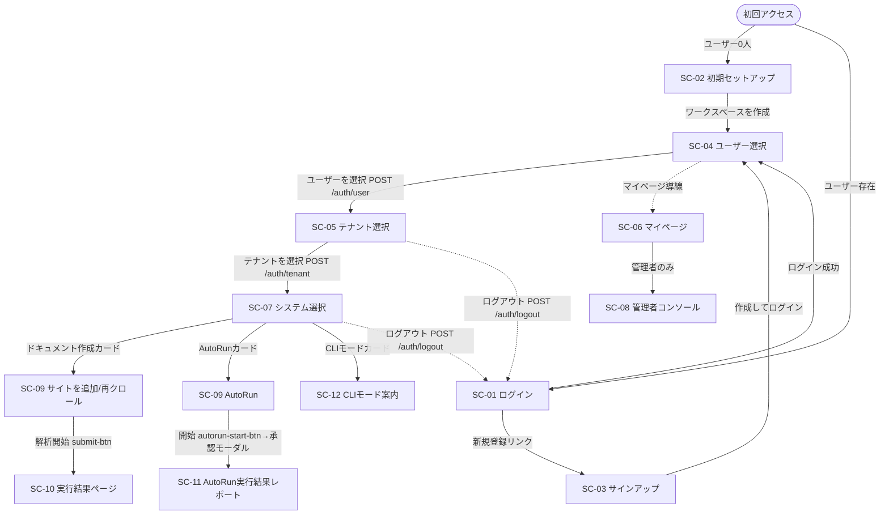
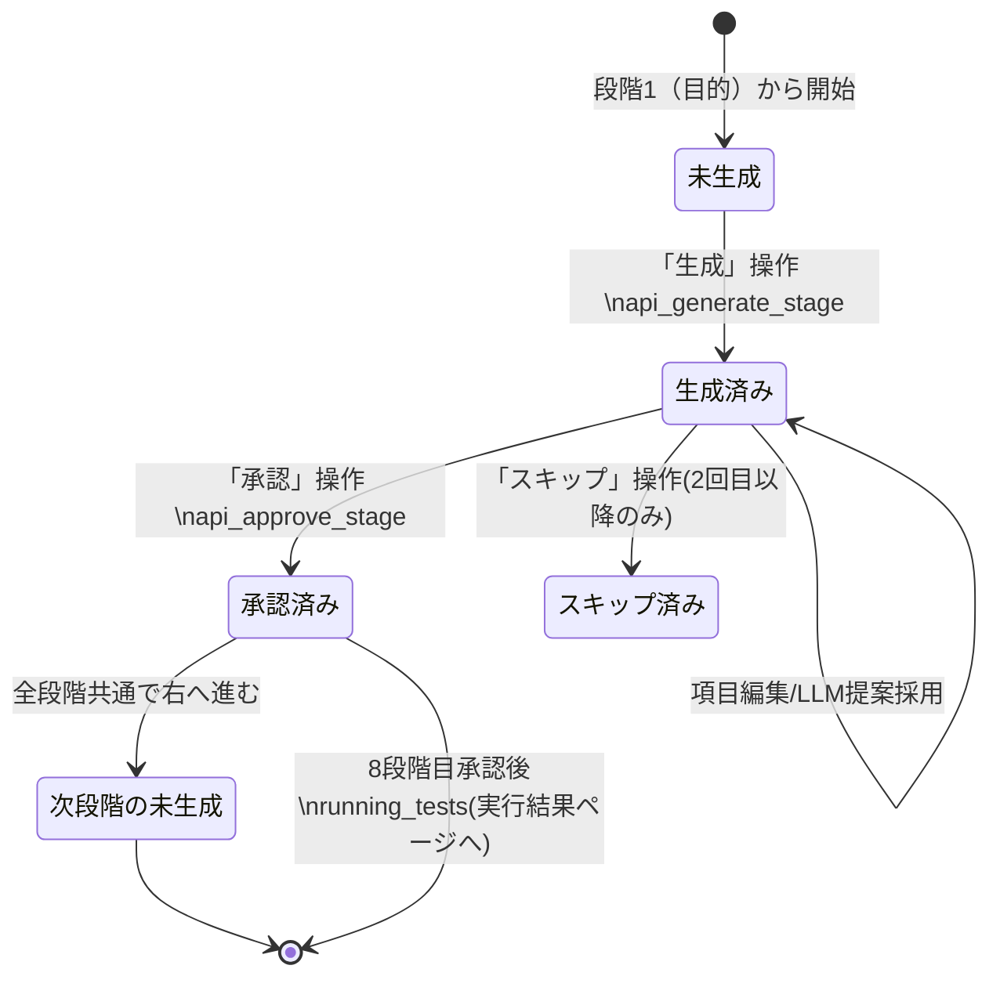
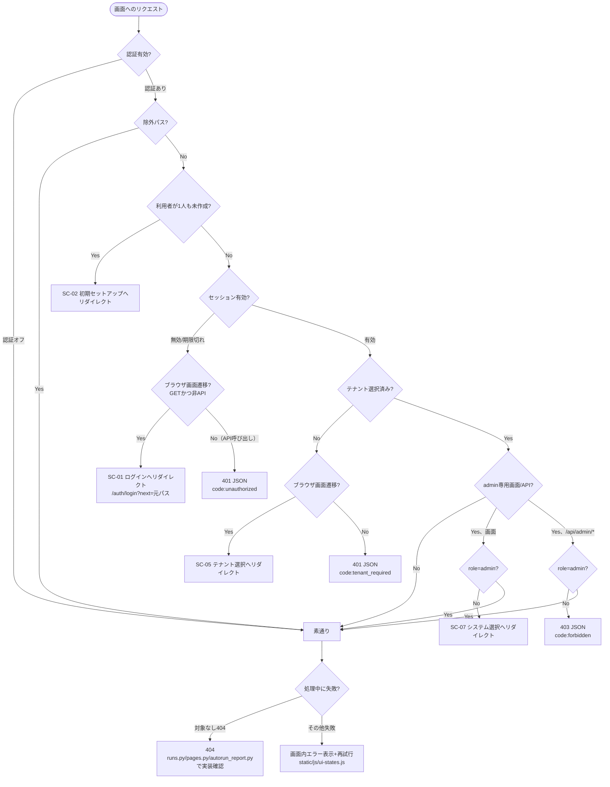

# WS2D-SD-001 画面設計書

- 版数: 3.1 / 作成日: 2026-07-16 / 最終更新: 2026-08-02 / 準拠: IPA 共通フレーム（画面設計）
- UI フローの用語は `CONTEXT.md`。刷新計画（Phase A〜F）は実装完了につき本書へ吸収済み。
- 本版の実測方法: `docs/sdlc/_asbuilt/routes.json`（Flask エンドポイント 196 本）と
  `docs/sdlc/_asbuilt/templates.json`（Jinja2 テンプレート 30 件）を Python/AST で突合。
  GET かつ `render_template` を呼ぶ関数を画面候補として抽出し、権限判定は各ブループリントの
  `before_request` / 個別ガードのソースを直接確認した。確認できなかった項目は
  「未確認」と明記する（捏造しない）。

## 1. 画面構成（シェル）

サイドバー（`nav.html`）＋トップバー（`topbar.html`）＋コンテンツ（SPA ビュー切替）。
クライアント側 `switchView(name)`（`static/js/core.js` ほか `static/js/view-*.js`）でビューを出し分ける。

- トップバー: パンくず・タイトル・**クイック検索**（⌘K・画面/サイト横断）・
  テーマ切替・ショートカット・**アバター**（認証 ON 時のみ）。
- 状態表示は `static/js/ui-states.js`（空 / ローディング / エラー＋再試行）に統一。
- 実 JS は `static/js/` 配下に分割されている（35 ファイル）。`static/app.js` は
  `/* split into static/js/ — see templates/index.html */` という 1 行のみの案内ファイル
  （実測: `cat static/app.js`）であり、実装の実体ではない。

## 2. 画面一覧

`routes.json` の GET エンドポイントのうち `render_template` を呼ぶもの 14 本を
実データから抽出し、`account.py` の `_SELECTION_ENDPOINTS`（ユーザー選択・テナント選択の
ガード対象一覧）と突き合わせて 2 画面（ユーザー選択・テナント選択）を追加した。

| 画面ID | 画面名 | URL | テンプレート | アクセス権限 | 概要 |
|---|---|---|---|---|---|
| SC-01 | ログイン | `/auth/login` | `templates/auth/login.html` | 未認証可 | メールアドレス＋パスワードでログイン（ロックアウトあり） |
| SC-02 | 初期セットアップ | `/auth/setup` | `templates/auth/setup.html` | 未認証可（ユーザー0人時のみ有効） | 最初のワークスペース＋オーナー作成 |
| SC-03 | サインアップ | `/auth/signup` | `templates/auth/signup.html` | 未認証可 | 新規ユーザーの自己登録 |
| SC-04 | ユーザー選択 | `/auth/user` | `templates/auth/user.html` | 要ログイン | ログイン後、操作するユーザー（アカウント）を選択 |
| SC-05 | テナント選択 | `/auth/tenant` | `templates/auth/tenant.html` | 要ログイン | 所属テナント（ワークスペース）を選択 |
| SC-06 | マイページ | `/auth/account` | `templates/auth/account.html` | 要ログイン | プロフィール・パスワード変更。管理者はメンバー管理・APIトークンも表示 |
| SC-07 | システム選択 | `/systems` | `templates/system-select.html` | 要ログイン（*1） | ドキュメント作成／AutoRun／CLIモードを選ぶハブ画面 |
| SC-08 | 管理者コンソール | `/admin/console` | `templates/admin/console.html` | 要admin | テナント・ユーザーの管理（管理者専用。`role != ROLE_ADMIN` は `/systems` へリダイレクト） |
| SC-09 | メインSPAシェル | `/`、`/<view_name>`、`/settings/<tab>` | `templates/index.html` | 要ログイン（*1） | ダッシュボード等 11 ビューをクライアント側で出し分け（内訳は 2.1） |
| SC-10 | 実行結果ページ | `/runs/<domain>/<run_id>` | `templates/index.html`（`view-run-result` ビュー） | 要ログイン（*1） | 実行回のハブ。実行結果／解析結果／実行結果レポートの 3 成果物を 1 回分揃えて表示 |
| SC-11 | AutoRun実行結果レポート | `/autorun/report/<domain>` | `templates/autorun-report.html` | 要ログイン（*1） | 独立ページ。テストケースCSVダウンロード導線あり |
| SC-12 | CLIモード案内 | `/cli` | `templates/cli.html` | 要ログイン（*1） | CLIモード（System 03）の案内 |
| SC-13 | トレーサビリティ（単独ページ） | `/traceability/view` | `templates/traceability.html` | 要ログイン（*1） | 要件⇔テストのトレーサビリティマトリクス（単独描画） |

*1: `web/routes/pages.py`・`traceability.py`・`runs.py`・`autorun_report.py` の
個別 `before_request` は本調査で確認できていない（**未確認**）。SC-04〜SC-06・SC-08 は
`web/routes/account.py`・`tenant_admin.py` のソースを直接確認して「要ログイン／要admin」を
断定した。認証そのものの ON/OFF は `WEBSPEC2DOC_AUTH_MODE`（`auto`/`required`）に依存し、
`auto` かつユーザー未作成の間は認証なしで動作する（`docs/AUTH_TENANCY.md` 参照）。

### 2.1 メインSPAシェル（SC-09）内のビュー一覧

`index.html` が読み込む `templates/partials/view-*.html` の実測一覧。既存版になかった
`references`・`run-result` を今回追加で検出した。

| data-view | 名称 | パーシャル | 行数 | 備考 |
|---|---|---|---|---|
| dashboard | ホーム | `view-dashboard.html` | 58 | KPIカード＋解析履歴 |
| generate | サイトを追加 / 再クロール | `view-generate.html` | 303 | 項目定義は 3.4 参照 |
| auto-run | AutoRun | `view-auto-run.html` | 378 | 項目定義は 3.5 参照 |
| run-history | 実行履歴 | `view-run-history.html` | 66 | |
| testcases | テストケース | （対応パーシャル無し） | - | `static/js/view-testcase-grid.js` がクライアント側でDOM構築していると推測（**未確認**） |
| qa-quality | 品質観点 | `view-qa-quality.html` | 31 | |
| viewpoints | 観点管理 | `view-viewpoints.html` | 296 | |
| user-guide | ユーザーガイド | `view-user-guide.html` | 181 | |
| settings | 設定 | `view-settings.html` | 313 | |
| traceability | トレーサビリティ（タブ内） | `view-traceability.html` | - | SC-13（単独ページ `/traceability/view`）とは別実体。使い分けの理由は**未確認** |
| usage | ROIダッシュボード | `partials/view-usage.html` | - | `/usage` は他ビューと異なり専用GETルート（`usage.view_usage`）が本パーシャルを直接 `render_template` している（実測。`index.html` 経由かは**未確認**） |
| references | 参考 | `view-references.html` | 227 | 依拠した国際標準・先行研究・参考事例の一覧（新規発見・既存版未記載） |
| run-result | 実行結果（ハブ） | `view-run-result.html` | 11 | SC-10 の実体。`rr-runbar`/`rr-artifacts`/`rr-body` の3領域をJSが描画 |

### 2.2 共通部品一覧（`templates/partials/` ほか）

| 部品 | 用途 |
|---|---|
| `partials/nav.html` | サイドバー（共通ナビゲーション） |
| `partials/topbar.html` | トップバー（パンくず・検索・テーマ切替） |
| `partials/modal-autorun-login.html` | AutoRun 実行前のログイン情報入力モーダル |
| `partials/modal-file-preview.html` | ファイルプレビューモーダル |
| `partials/result-panel.html` | 結果表示パネル（123行） |
| `auth/_shell.html` | 認証画面共通レイアウト（`login`/`setup`/`signup`/`account`/`tenant`/`user` が `extends`） |

## 3. 画面遷移図

契機（ボタン名・条件）をエッジラベルに明記する。`account.py` のコメント
「ログイン後の遷移は常に ログイン → ユーザー選択 → テナント選択 → システム選択」を主線とする。

## 4. 画面項目定義

対象: ログイン（SC-01）・テナント選択（SC-05）・システム選択（SC-07）・
ドキュメント作成メイン画面（generate ビュー）・AutoRun（auto-run ビュー）の 5 画面。
実装確認元: 各テンプレートの `<input>`/`<select>`/`<button>` と `web/validation.py`。
`web/validation.py` にはドメイン形式（`_valid_domain`）・URL形式（`_valid_url`、http/https
スキームのみ）・パストラバーサル対策（`_safe_output_path` 等）はあるが、**項目別の文字数・
文字種チェックのサーバ側関数は本ファイル内に見当たらなかった**（未確認。クライアント側
HTML5 属性が主体と推測される）。

### 4.1 SC-01 ログイン（`auth/login.html`）

| 項目ID | 項目名 | 種別 | 必須/任意 | 入力可能値/桁数 | 初期値 | イベント | バリデーション |
|---|---|---|---|---|---|---|---|
| LG-01 | email | 入力(text) | 必須 | `autocomplete="username"`。桁数制限は未確認 | `{{ email }}`（直前入力値を再表示） | `autofocus` | HTML5 `required` のみ確認。サーバ側の形式チェックは未確認 |
| LG-02 | password | 入力(password) | 必須（`mock_auth` 有効時のみ任意） | `autocomplete="current-password"` | 空 | - | HTML5 `required`（``条件） |
| LG-03 | ログインボタン | ボタン(submit) | - | - | - | `POST /auth/login` | - |

### 4.2 SC-05 テナント選択（`auth/tenant.html`）

| 項目ID | 項目名 | 種別 | 必須/任意 | 入力可能値 | 初期値 | イベント | バリデーション |
|---|---|---|---|---|---|---|---|
| TN-01 | tenant_id | 入力(hidden) | 必須 | `membership.tenant_id`（サーバ側で埋め込み） | 所属テナントのID | - | - |
| TN-02 | テナントカード | ボタン(submit) | - | - | - | `POST /auth/tenant` | 選択中は `is-current` クラスで強調 |
| TN-03 | ログアウトボタン | ボタン(submit) | - | - | - | `POST /auth/logout` | - |

### 4.3 SC-07 システム選択（`system-select.html`）

| 項目ID | 項目名 | 種別 | 必須/任意 | 入力可能値 | 初期値 | イベント | バリデーション |
|---|---|---|---|---|---|---|---|
| SS-01 | ログアウトボタン | ボタン(submit) | - | - | - | `POST /auth/logout` | - |
| SS-02 | ドキュメント作成／AutoRun／CLIモード カード | ボタン | - | - | - | 各システムへ遷移 | カードのリンク先属性は今回のgrep範囲（input/select/button/form）に含まれず**未確認** |

### 4.4 ドキュメント作成メイン画面（`generate` ビュー, `view-generate.html`）

| 項目ID | 項目名 | 種別 | 必須/任意 | 入力可能値/桁数 | 初期値 | イベント | バリデーション |
|---|---|---|---|---|---|---|---|
| GN-01 | url-input | 入力(url) | 必須（`required`属性の有無は未確認） | `placeholder="https://example.com"` | 空。`url-history-list` でオートコンプリート | - | サーバ側 `_valid_url`（http/https スキームのみ） |
| GN-02 | discover-btn | ボタン | - | - | - | クリックで画面解析を実行 | - |
| GN-03 | discover-scope | 入力(radio) | 必須（グループ） | プリセット値＋`custom` | `p.checked` のプリセットが初期選択 | - | - |
| GN-04 | discover-depth | 入力(number) | 任意 | 1〜10 | 2 | - | HTML5 `min="1" max="10"` |
| GN-05 | discover-max-pages | 入力(number) | 任意 | 1〜500 | 30 | - | HTML5 `min="1" max="500"` |
| GN-06 | login-url | 入力(url) | ログイン必要時のみ表示 | `placeholder="https://example.com/login"` | 空 | 「フォームを取得」ボタンでスクレイプ | - |
| GN-07 | crawl-target-mode | 入力(radio) | 必須（グループ） | `selected`／`auto` | `selected` | - | - |
| GN-08 | crawl-depth | 入力(number) | 任意 | 1〜10 | 2 | - | HTML5 `min`/`max` |
| GN-09 | max-pages | 入力(number) | 任意 | 1〜500 | 30 | - | HTML5 `min`/`max` |
| GN-10 | reference-doc-input | 入力(file, multiple) | 任意 | 複数ファイル選択可 | - | - | サーバ側 `_safe_reference_doc_paths`（`output/{domain}/reference_docs/` 配下の実在ファイルのみ許可。拡張子制限は未確認） |
| GN-11 | compare | 入力(checkbox) | 任意 | - | 未チェック | 前回との差分を出力 | - |
| GN-12 | crawl-parallelism | 選択(select) | 任意 | 選択肢の中身は未確認 | - | - | - |
| GN-13 | submit-btn | ボタン(submit) | - | - | - | フォーム送信、解析開始 | - |

### 4.5 AutoRun（`auto-run` ビュー, `view-auto-run.html`）

| 項目ID | 項目名 | 種別 | 必須/任意 | 入力可能値/桁数 | 初期値 | イベント | バリデーション |
|---|---|---|---|---|---|---|---|
| AR-01 | autorun-mode | 入力(radio) | 必須（グループ） | `url`／`document` | `url` | 切替でURL駆動/文書駆動カードを出し分け | - |
| AR-02 | autorun-url | 入力(url) | url駆動時必須（属性上の`required`有無は未確認） | `placeholder="https://example.com"` | 空。`autorun-url-suggestions` でオートコンプリート | - | - |
| AR-03 | autorun-preflight-btn | ボタン | - | - | - | 「先に到達確認」を実行 | - |
| AR-04 | autorun-reference-doc-input | 入力(file, multiple) | 文書駆動時使用 | 複数ファイル | - | - | 未確認 |
| AR-05 | autorun-selection-criterion | 選択(select) | 任意 | 頂点網羅／エッジ網羅／プライムパス／到達目標 | 未確認 | - | - |
| AR-06 | autorun-target-page-id | 入力(text) | 「到達目標」選択時 | `placeholder="例: checkout_complete"` | 空 | - | 未確認 |
| AR-07 | autorun-observe-validation | 入力(checkbox) | 任意 | - | 未チェック | 入力検証の観測を有効化 | - |
| AR-08 | autorun-viewpoint-set | 選択(select) | 任意 | 選択肢の中身は未確認 | - | - | - |
| AR-09 | autorun-depth | 入力(number) | 任意 | 1〜10 | 10 | - | HTML5 `min`/`max` |
| AR-10 | autorun-max-pages | 入力(number) | 任意 | 1〜500 | 500 | - | HTML5 `min`/`max` |
| AR-11 | autorun-start-btn | ボタン | - | - | - | 承認モーダル（実行対象/デバイス/制限時間・出力形式等）を開き実行開始 | - |

## 5. 共通仕様

- **共通ヘッダ/フッタ**: サイドバー `partials/nav.html` ＋トップバー `partials/topbar.html`。
  専用フッタパーシャルは今回の実測範囲では確認できず（**未確認**）。
- **エラー表示方式**: `static/js/ui-states.js` による「空 / ローディング / エラー＋再試行」の
  統一状態表示（既存文書の記載を踏襲。`ui-states.js` 本体の内部実装までは未確認）。
- **ローディング表示**: 同上 `ui-states.js`。個別画面でも `arep-loading`（`autorun-report.html`）
  のような「読み込んでいます…」表示を確認。
- **トースト/通知**: `static/js/` 一覧に専用のトースト実装ファイルは見当たらず、
  方式・有無は**未確認**。
- **キーボード操作**: トップバーの**クイック検索（⌘K）**（既存文書記載）。個別画面の
  ショートカット詳細は**未確認**。
- **レスポンシブ方針**: **本プロダクトはPC専用。モバイル/タブレット対応は行わない方針**
  （ユーザー確定方針。デバイス分岐の実装は意図的に持たない）。

## 6. 権限と画面の対応表

| アクセス権限 | 該当画面 |
|---|---|
| 未認証可 | SC-01 ログイン、SC-02 初期セットアップ（ユーザー0人時のみ）、SC-03 サインアップ |
| 要ログイン | SC-04 ユーザー選択、SC-05 テナント選択、SC-06 マイページ、SC-07 システム選択（*1）、SC-09 メインSPAシェル（*1）、SC-10 実行結果ページ（*1）、SC-11 AutoRun実行結果レポート（*1）、SC-12 CLIモード案内（*1）、SC-13 トレーサビリティ単独ページ（*1） |
| 要admin | SC-08 管理者コンソール（`role != ROLE_ADMIN` は `/systems` へリダイレクト。`/api/admin/*` も `require_admin()` でガード） |

*1: 個別 `before_request` 未確認（2.表の注記と同じ）。

## 7. デザインシステム

- トークン: `static/tokens.css`（色・間隔・角丸・影・ライト/ダーク）。
- 主色 `#1976D2` / `#0D47A1`、地色 `#F4F6F9`。バッジは `--c` 基準色＋`color-mix`
  の soft パターンでダーク自動追従。
- 生 hex はエクスポート下地の白のみ（テーマ非依存）。UI のダーク gap ゼロ。

## 8. 付録: ドッグフーディング証跡

WebSpec2Doc 自身を WebSpec2Doc でクロールした生成物（画面仕様・遷移図）を
`WS2D-ST-001` のシステムテスト証跡として採用する（自製品での自己検証）。

## 9. AutoRun画面内状態遷移とエラー時画面遷移

3章の画面遷移図（画面間）を補完し、(1) SC-09内 `auto-run` ビューの段階承認UIの状態遷移、(2) 未ログイン・権限不足・セッション切れ・処理失敗時の遷移先を実装確認の上で追加する。

### 9.1 AutoRun 画面内の状態遷移

`view-auto-run.html`（378行）が提示する8段階パイプラインのUI状態。サーバ側の実装（`Stage.status`、`WS2D-BA-001` 6.2節）を正とする。クライアント側JS（`static/js/`）の描画詳細（ボタン活性/非活性の具体条件等）までは本書の実測範囲では**未確認**。

補足: 「features（FE）」段階のみ、`Stage`全体の承認に加え配下の全 `StageItem` 承認が求められる（2.3節・`WS2D-BA-001` 6.2節）。段階1〜7がすべて承認/スキップ済みになると8段階目（Playwright自動化計画）が提示される（`design_stages_approved()`）。

### 9.2 エラー・例外時の画面遷移

`web/auth.py`（`auth_guard()`, `require_admin()`）の実装を直接確認して作成（未確認箇所は個別に注記）。

補足:

- 「未ログイン」と「セッション切れ」は `auth_guard()` 上で区別されず、同じ分岐（セッション無効）として扱われる（実装上、理由別のメッセージ出し分けはない）。
- `/api/v1/*` はBearer APIトークン専用の別経路（Cookieセッションとは独立）で、トークン無効時は401 JSON、読み取り専用トークンで書き込みを試みた場合は403 JSON（`forbidden_scope`）。本図では簡略化のため割愛。
- 管理者専用の**画面**（SC-08）は非admin時 `/systems` へ、管理者専用**API**（`require_admin()`）は非admin時403 JSONと、同じ「権限不足」でも画面とAPIで応答方式が異なる（実装確認済み）。
- 「処理中の失敗」のうち `abort(404)` は `runs.py`（実行回未検出）・`pages.py`・`autorun_report.py` で実装確認済み。それ以外の失敗経路（タイムアウト・部分結果等）の画面遷移詳細は本書の実測範囲では**未確認**。

## 改訂履歴

| 版 | 日付 | 内容 | 作成者 |
|---|---|---|---|
| 1.0 | 2026-07-16 | 初版 | 開発チーム |
| 2.0 | 2026-07-19 | SPA刷新計画（Phase A〜F）の反映 | 開発チーム |
| 3.0 | 2026-08-02 | routes.json/templates.json の実測突合により画面一覧・遷移図・画面項目定義・共通仕様・権限対応表を全面拡充。ユーザー選択/テナント選択/参考/実行結果ハブの4画面を新規記載 | 開発チーム |
| 3.1 | 2026-08-02 | AutoRun画面内の状態遷移図・エラー/例外時の画面遷移図（mermaid）を追加。`web/auth.py`の実装確認により未ログイン/権限不足/セッション切れの分岐を明記 | 開発チーム |
