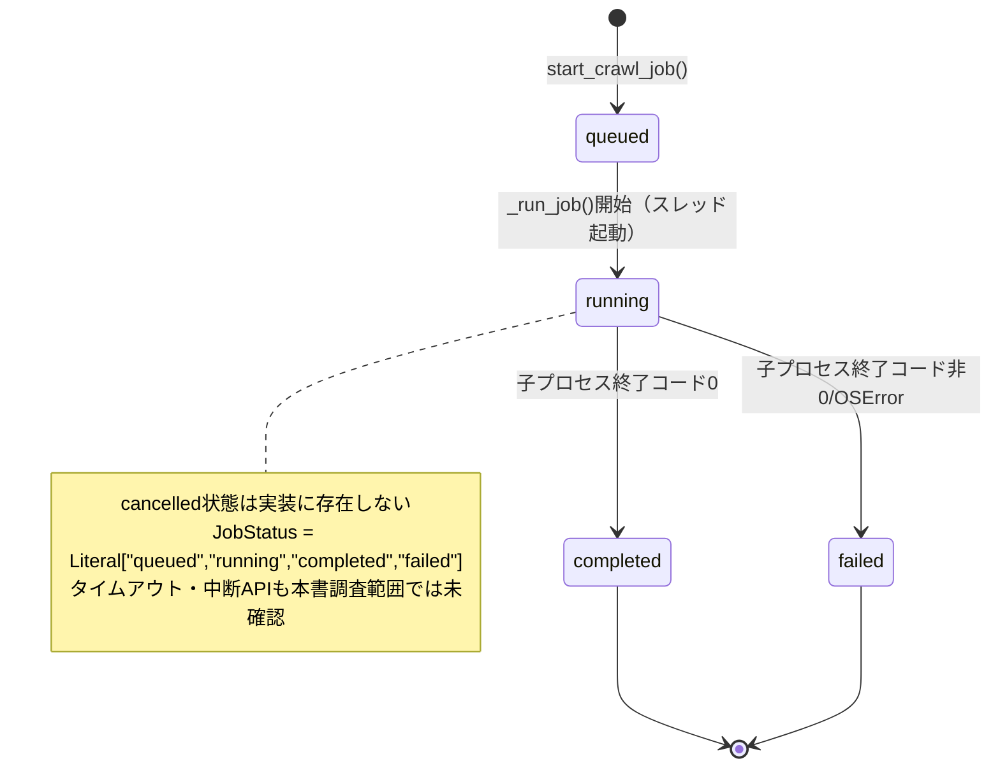
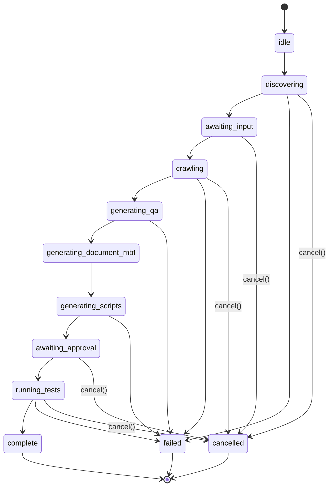
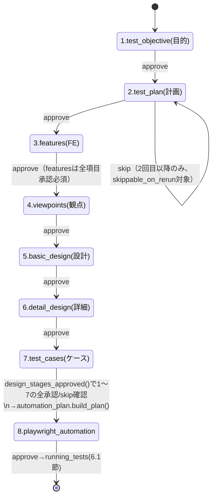
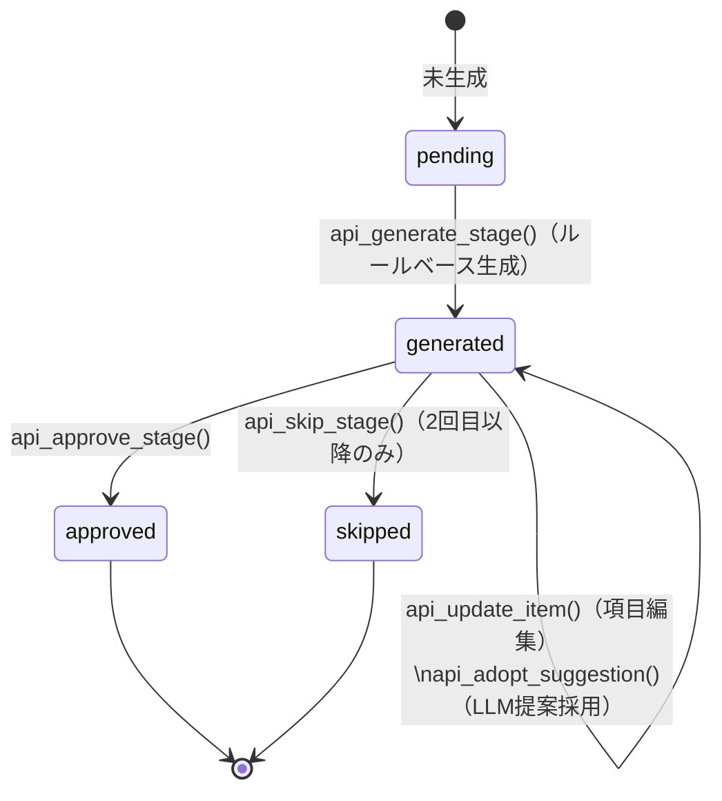
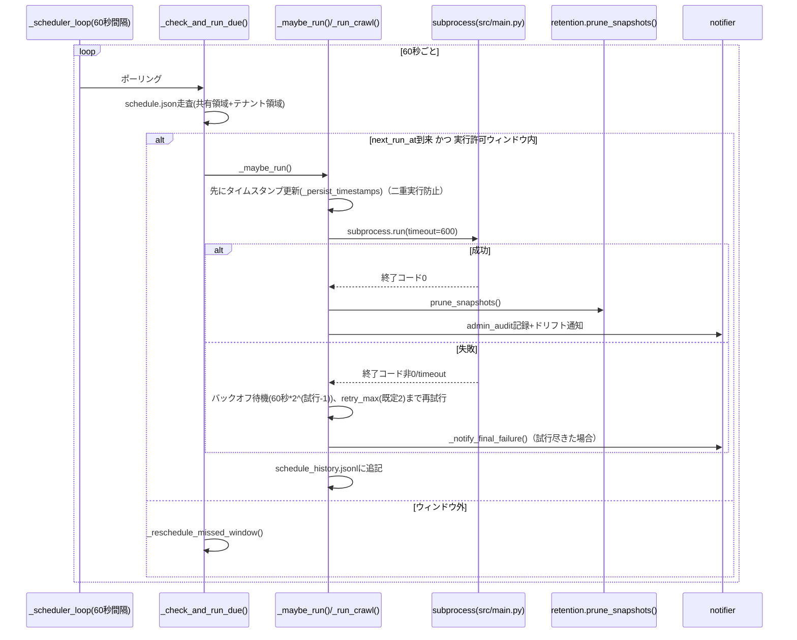

# WS2D-BA-001 バッチ設計書

- 版数: 1.1 / 作成日: 2026-08-02 / 準拠: IPA 共通フレーム（バッチ処理設計）
- 対象: AutoRun 実行ジョブ・スケジュール実行デーモン・非同期クロールジョブ・保持ポリシーGC。
- 参照実装: `web/services/auto_run_job.py`, `web/services/scheduler.py`,
  `web/services/job_queue.py`, `web/services/retention.py`, `src/autorun/stages.py`。

## 1. バッチ一覧

| バッチID | 名称 | 起動方式 | 起動契機 | 想定実行時間 | 多重起動可否 |
|---|---|---|---|---|---|
| BA-01 | 非同期クロールジョブ | アプリ内バックグラウンドスレッド（`threading.Thread(daemon=True)`） | API `POST /api/v1/sites/<domain>/crawl` 等（利用者操作） | 未確認（`subprocess.Popen` にタイムアウト指定なし） | ドメイン単位で保持上限20件（`MAX_JOBS_PER_DOMAIN`）。**ジョブ起動自体の排他制御は実装上確認できず**、同一ドメインへの連続リクエストで複数ジョブが並行実行され得る |
| BA-02 | スケジュール実行デーモン | アプリ起動時に自動起動する常駐デーモンスレッド（`start_scheduler()`） | アプリ起動 → 以後60秒間隔（`SCHEDULER_POLL_INTERVAL`）でポーリングし `schedule.json` の `next_run_at` 到来分を実行 | 1ドメインあたり最大600秒（`subprocess.run(timeout=600)`）×試行回数（既定 retry_max=2 → 最大3試行、バックオフ込みで理論上約20分強） | **単一デーモンスレッドのみ**。`_started_lock`（`threading.Lock`）と `_scheduler_started` フラグで二重起動を防止 |
| BA-03 | AutoRun 実行ジョブ | アプリ内バックグラウンドスレッド | API `auto_run`/`autorun_stages` Blueprint 経由の利用者操作（起動・承認・再開） | 未確認（段階承認区間はユーザー操作待ちのため不定。待機期限は `awaiting_deadline_epoch` で管理） | ジョブは `job_id` 単位で独立管理。同時実行数の明示的な上限は本書調査範囲では**未確認** |
| BA-04 | 保持ポリシーGC（スナップショット世代整理） | 独立デーモンではなく、BA-02成功時に呼び出される同期関数（`prune_snapshots`） | スケジュールクロール成功直後（`scheduler.py` 内） | 未確認（対象ファイル数・容量に依存） | BA-02の多重起動不可の制約をそのまま継承（BA-02のスレッド内でのみ実行） |

## 2. 各バッチの処理設計

### 2.1 BA-01: 非同期クロールジョブ（`job_queue.py`）

- **入力**: `domain`, `site_url`, `depth`, `max_pages`, `formats`, `compare`, `auth_path`, `output_dir`。
- **処理ステップ**:
  1. `start_crawl_job()` が `uuid4` で `job_id` を発行し `CrawlJob(status="queued")` を
     `_JOBS`（`dict`、`_JOBS_LOCK` で保護）へ登録、`_evict_old_jobs()` で同ドメインの超過分
     （`MAX_JOBS_PER_DOMAIN=20`）を古い順に削除。
  2. バックグラウンドスレッドで `_run_job()` を起動し `status="running"` に更新。
  3. `subprocess.Popen(["python","src/main.py",...])` を起動し、標準出力を1行ずつ読み取って
     ログバッファへ蓄積（`MAX_LOG_BYTES=4096` で末尾のみ保持）。
  4. `proc.wait()` の終了コードで `status="completed"|"failed"` を確定。
  5. `compare=True` かつ成功時、`_try_slack_notify()` がドリフト有無を判定しSlack通知を試行。
- **出力**: `output/{domain}/` 配下の生成物（`src/main.py` 側の責務）。ジョブ状態は
  メモリ上の `_JOBS` のみ（永続化されない。プロセス再起動で消失する設計）。
- **エラー時の挙動**: `subprocess.Popen` の起動自体が `OSError` で失敗した場合のみ
  `status="failed"` を記録。子プロセス内部のエラーは終了コード非0として `status="failed"`
  に反映されるのみで、個別のエラー分類は行わない。
- **リトライ**: **なし**（実装上、`job_queue.py` にリトライロジックは存在しない）。
- **タイムアウト**: **なし**（`subprocess.Popen` にタイムアウト指定が無く、子プロセスが
  無応答でもジョブは `running` のまま残り得る。BA-02の `subprocess.run(timeout=600)` との
  非対称性であり、リスクとして明記する）。
- **中断/キャンセル**: **API未確認**（`CrawlJob` および `job_queue.py` に `cancel` 相当の
  関数は見当たらない）。

### 2.2 BA-02: スケジュール実行デーモン（`scheduler.py`）

- **入力**: 各ドメインの `schedule.json`（`interval`, `next_run_at`, `timezone`, `weekdays`,
  `window_start/end`, `retry_max`, `retry_backoff_seconds`, 通知設定等）。
- **処理ステップ**:
  1. `_scheduler_loop()` が `_stop_event` がセットされるまで1秒刻みでスリープしつつ
     `SCHEDULER_POLL_INTERVAL=60` 秒ごとに `_check_and_run_due()` を実行。
  2. 共有領域（`output/`）とテナント領域（`output/tenants/{slug}/`）の両方を走査し、
     ドメインごとの `schedule.json` を確認。
  3. `_maybe_run()`: `next_run_at` 到来かつ実行許可ウィンドウ（曜日・時間帯）内であれば、
     **先にタイムスタンプを更新してから**（`_persist_timestamps`）クロールを起動する
     ことで二重実行を防止。ウィンドウ外なら次回ウィンドウへ再スケジュール
     （`_reschedule_missed_window`）。
  4. `_run_crawl()` で `subprocess.run(["python","src/main.py",...], timeout=600)` を実行。
  5. 失敗時は指数バックオフ（`backoff * 2**(attempt-1)`、既定 backoff=60秒）で待機し
     `retry_max`（既定2、0〜5にクランプ）回まで再試行。
  6. 成功時: `retention.prune_snapshots()` で保持ポリシー適用 →
     `admin_audit.append_admin_audit()` で監査ログ記録 → ドリフトサマリ通知
     （`_notify_drift_summary`）。失敗確定時: `_notify_final_failure()` で通知。
  7. 実行結果（成否・試行回数・所要時間・エラー）を `schedule_history.jsonl` に追記。
- **出力**: `output/{domain}/`（クロール成果物）、`schedule.json`（`last_run_at`/`next_run_at`
  更新）、`schedule_history.jsonl`（実行履歴）、`admin_audit.jsonl`（GC発生時）。
- **エラー時の挙動**: 個別ドメインの例外は `try/except` で捕捉しログ出力のみ（他ドメインの
  処理継続を妨げない）。保持GCの失敗はクロール成功の確定を妨げない
  （`except Exception as exc: logger.warning(...)`）。
- **リトライ**: **あり**。`retry_max`（既定2、上限5）× 指数バックオフ
  （`retry_backoff_seconds` 既定60秒、上限3600秒）。
- **タイムアウト**: **あり**。`subprocess.run(timeout=600)`（10分）。超過時
  `subprocess.TimeoutExpired` を捕捉し失敗として記録。
- **中断/キャンセル**: `stop_scheduler()` が `_stop_event.set()` によりポーリングループを
  終了させる（次の1秒スリープ境界で応答。実行中のクロール自体を強制終了する機構は無い）。

### 2.3 BA-03: AutoRun 実行ジョブ（`auto_run_job.py` + `src/autorun/stages.py`）

- **入力**: 対象URL、モード（`mode`）、実行ポリシー（`run_policy`）、観点セット選択、
  段階承認要否（`require_stage_approval`）。
- **処理ステップ**:
  1. `AutoRunJob` を生成（`status="idle"`）。以後 `discovering → (awaiting_input) → crawling
     → generating_qa → generating_document_mbt → generating_scripts → awaiting_approval →
     running_tests → complete` の順で進行（状態一覧はクラス定義コメントに基づく静的な
     列挙。個々の遷移を駆動する具体的な呼び出し元は本書調査範囲では**未確認**）。
  2. `src/autorun/stages.py` の8段階パイプライン（`test_objective, test_plan, features,
     viewpoints, basic_design, detail_design, test_cases, playwright_automation`）を
     `build_stage()` でルールベース生成し、`Stage`／`StageItem` 単位で提示・承認を受ける。
  3. 承認待ちは `awaiting_stage_id` と `awaiting_deadline_epoch`（待機期限）で管理し、
     `awaiting_remaining_sec()` が残り秒数を返す。
  4. 設計段階（1〜7）が全承認/スキップ済みになると（`design_stages_approved()`）、
     自動化計画（`automation_plan.build_plan()`）を経て8段階目を提示、承認後にスクリプト
     実行（`status="running_tests"`）。
  5. 人が確認していない事項は `add_unverified()` で `unverified` リストに記録し、
     成果物に「未確認」として残す（黙って確認済み扱いにしない設計方針）。
- **出力**: `AutoRunJob.outputs`（生成物パス群）、`test_results`、`failure_classifications`、
  `unverified` を含む `to_dict()` のJSON表現。ログは `add_log()` により
  `MAX_LOG_LINES=1000` / `MAX_LOG_BYTES=256KB` に制限したリングバッファで保持。
- **エラー時の挙動**: `error` フィールドに記録し `status="failed"`（記録箇所は
  `to_dict()` からのみ確認でき、設定元の呼び出し箇所は本書調査範囲では未確認）。
- **リトライ**: **実装確認できず**（`auto_run_job.py` 自体にリトライロジックは無い）。
- **タイムアウト**: 承認待ちについては `awaiting_deadline_epoch` による期限管理あり。
  クロール・生成処理自体の時間上限は本書調査範囲では未確認。
- **中断/キャンセル**: `cancel()` が `_cancelled=True` を設定し、登録済み子プロセス
  （`register_proc()` で登録）を `terminate()` → 5秒待機 → 失敗時 `kill()`。あわせて
  入力待ち（`_input_event`）・段階承認待ち（`_stages_event`）の `threading.Event` を
  `set()` して、待機中のスレッドを解放する（待ったまま停止しない設計）。

### 2.4 BA-04: 保持ポリシーGC（`retention.py`）

- **入力**: `output_dir`（サイト別 `snapshots/` を含む）、`RetentionPolicy`
  （`mode`: unlimited/generations/days）。
- **処理ステップ**:
  1. `load_retention_policy()` が設定JSONを読み込み、欠落・破損時は安全側の `unlimited`
     （削除しない）にフォールバック。
  2. `prune_snapshots()`: `mode="generations"` なら最新N件（`policy.generations`）を残し
     それ以外を削除。`mode="days"` なら最新1件を必ず残しつつ `cutoff`（`days` 日前）より
     古いものを削除。
  3. 削除対象のスナップショットJSONに対応する世代別スクリーンショットディレクトリ
     （`*-shots/`）も連動削除（`_remove_snapshot_shots`）し、容量の単調増加を防ぐ。
  4. パス正規化（`_is_within`）により `snapshots/` の範囲外・シンボリックリンクは保護し、
     設定ミスによる誤削除を防止。
- **出力**: `PruneResult`（削除件数・削除バイト数・削除パス一覧）。呼び出し元（BA-02）が
  `admin_audit.jsonl` へ記録。
- **エラー時の挙動**: 個別ファイルの削除失敗（`OSError`）はログ警告のみで処理継続。
- **リトライ**: なし（都度呼び出しのため次回GC機会で再試行される形）。
- **中断/キャンセル**: 該当なし（同期関数として1回のクロール成功ごとに実行完結）。

## 3. ジョブ状態遷移

### 3.1 BA-01 `CrawlJob.status`（`JobStatus` Literal定義）

| 現在状態 | イベント | 遷移先 | 備考 |
|---|---|---|---|
| （なし） | `start_crawl_job()` 呼び出し | queued | ジョブ生成直後 |
| queued | `_run_job()` 開始 | running | スレッド起動 |
| running | 子プロセス終了コード0 | completed | |
| running | 子プロセス終了コード非0 / `OSError` | failed | |

`cancelled` 状態は定義されていない（`JobStatus = Literal["queued","running","completed","failed"]`）。

### 3.2 BA-03 `AutoRunJob.status`（クラス定義コメントの静的列挙）

| 状態 | 意味 |
|---|---|
| idle | 未開始 |
| discovering | 対象探索中 |
| awaiting_input | 利用者入力待ち |
| crawling | クロール実行中 |
| generating_qa | QA生成中 |
| generating_document_mbt | ドキュメント/MBT生成中 |
| generating_scripts | 自動化スクリプト生成中 |
| awaiting_approval | 承認待ち |
| running_tests | テスト実行中 |
| complete | 完了 |
| cancelled | 中断済み |
| failed | 失敗 |

遷移条件を駆動する具体的な呼び出し箇所（どの処理がどの状態間遷移を発生させるか）は、
本書が対象とした読解範囲（`auto_run_job.py` 本体）では確認できず**未確認**。

### 3.3 BA-03 段階（`Stage`）状態（`src/autorun/stages.py`）

| 状態 | 意味 |
|---|---|
| pending | 未生成 |
| generated | ルールベース生成済み・提示前/提示中 |
| approved | 承認済み |
| skipped | スキップ（`skippable_on_rerun` な段階の再実行時のみ） |

## 4. 排他制御・タイムアウト・リソース制限の実装状況

| 項目 | BA-01 | BA-02 | BA-03 | BA-04 |
|---|---|---|---|---|
| 排他制御 | `_JOBS_LOCK`（`threading.Lock`）でジョブ辞書を保護。**ジョブ起動自体の重複防止なし** | `_started_lock` + `_scheduler_started` フラグで二重起動防止 | 明示的なロックは未確認（`job_id` 単位で独立と推測） | 呼び出し元（BA-02）のシングルスレッド性に依存 |
| タイムアウト | **なし** | `subprocess.run(timeout=600)` | 承認待ちのみ `awaiting_deadline_epoch` で期限管理 | なし |
| リトライ | なし | `retry_max`（既定2・上限5）+ 指数バックオフ | 未確認 | なし |
| リソース制限 | ログ4096byte切詰め、ドメイン単位ジョブ数上限20件 | なし（ポーリング間隔60秒のみ） | ログ1000行/256KB切詰め | なし |
| 多重起動 | 可（意図せず並行実行され得る） | 不可（デーモン単一） | 未確認 | 不可（BA-02に従属） |

## 5. 保持期間・世代管理（`retention.py`）

| モード | 設定値 | 挙動 |
|---|---|---|
| unlimited（既定・安全側） | — | 削除しない |
| generations | 1〜10,000（`_bounded_int` でクランプ） | 最新N件のスナップショットを残し、それ以外と対応する世代別スクリーンショットを削除 |
| days | 1〜3,650（`_bounded_int` でクランプ） | 最新1件は必ず保持。`cutoff`（現在時刻−days）より古いものを削除 |

設定が存在しない・JSONとして壊れている・値域外の場合は例外を投げず `RetentionPolicy()`
（＝unlimited）にフォールバックする設計（「安全側に倒す」方針。データ消失より保持過多を選ぶ）。
保存設定には `version: 1` の形式バージョンと `updated_at`/`updated_by` の変更履歴を持つ。

## 6. 状態遷移図・シーケンス図

3章の状態一覧表（実装から確認済み）を mermaid の状態遷移図として可視化する。状態名・遷移条件は3章の記載を正とし、本節はその図示である。

### 6.1 ジョブ状態遷移図

#### BA-01: CrawlJob.status

#### BA-03: AutoRunJob.status

補足: `failed`/`cancelled` への遷移元は、クラス定義コメントの静的列挙のみが根拠であり、3.2節既述のとおり**個々の遷移を駆動する具体的な呼び出し箇所は未確認**。上図の遷移元は「主要な待機・実行状態からいつでも発生し得る」という保守的な想定で描いており、実装上その状態から実際には遷移しない場合を含む可能性がある（未確認）。`cancel()` は5秒待機後 `kill()` する子プロセス終了と、入力待ち・段階承認待ちの `threading.Event` 解除を伴う（2.3節）。

### 6.2 AutoRun 段階承認の状態遷移図

`src/autorun/stages.py` の8段階パイプライン。目的→計画→FE→観点→設計→詳細→ケースの7段階（設計段階1〜7）に、8段階目（Playwright自動化計画）が続く。各段階は独立して pending/generated/approved/skipped の状態を持つ（3.3節）。

各段階内部の項目状態:

補足: API対応は `web/routes/autorun_stages.py`（14EP、実測）。`api_reset_stages` により状態を初期化（作り直し）できる（常時遷移可能なため図には示していない）。`features` 段階は `requires_item_approval=True` のため、`Stage`単位の承認に加え配下 `StageItem` 全件の承認が前提となる（2.3節・`WS2D-MD-001` 6.2節）。

### 6.3 スケジューラの動作シーケンス（BA-02）

補足: 排他制御は `_started_lock`+`_scheduler_started` フラグによるデーモン単一起動保証（4章既述）であり、上記シーケンスはそのデーモン内で直列に実行される。保持GC（`Ret`）の失敗はクロール成功の確定を妨げない（`except Exception` でログ警告のみ、2.2節）。

## 改訂履歴

| 版 | 日付 | 内容 | 作成者 |
|---|---|---|---|
| 1.0 | 2026-08-02 | 初版作成 | 開発チーム |
| 1.1 | 2026-08-02 | ジョブ状態遷移図（CrawlJob/AutoRunJob）・AutoRun段階承認の状態遷移図・スケジューラ動作シーケンス図（mermaid）を追加 | 開発チーム |
