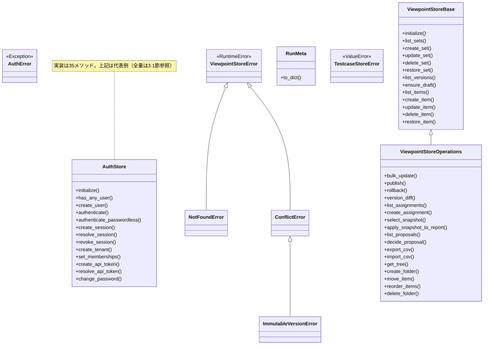
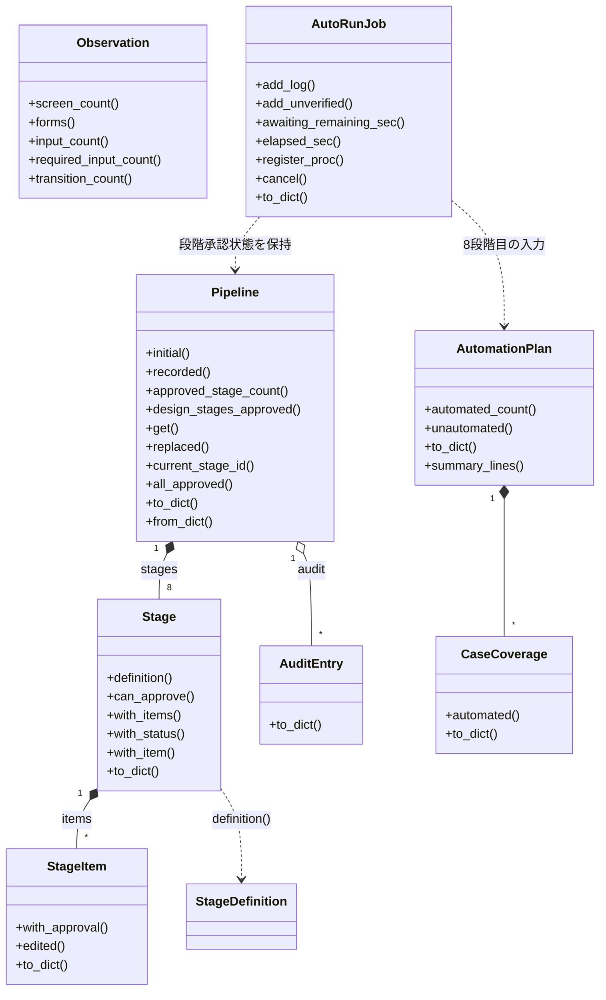
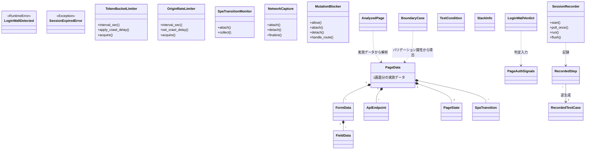
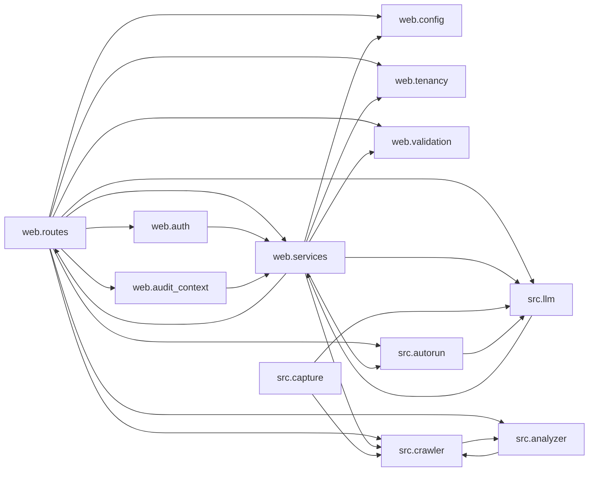

# WS2D-MD-001 モジュール設計書

- 版数: 1.1 / 作成日: 2026-08-02 / 準拠: IPA 共通フレーム（ソフトウェア詳細設計）
- 位置づけ: `WS2D-BD-001`（基本設計書）の3層アーキテクチャを、実装済みモジュール単位に落とし込む。
- 実測元: `docs/sdlc/_asbuilt/modules.json`（src/・web/ 配下 237 モジュール機械抽出）、
  `docs/sdlc/_asbuilt/routes.json`（Flask エンドポイント 200 本。`app.url_map` 実測）。
  取得コマンド: `venv/bin/python3 -c "import json; print(len(json.load(open('docs/sdlc/_asbuilt/modules.json'))))"` → 237。

## 1. パッケージ構成一覧

実測コマンド: `docs/sdlc/_asbuilt/modules.json` を `path` の先頭2要素（`src/analyzer` 等）で
集計（`venv/bin/python3` によるサマリ集計、本書作成時に実行・出力を本節へ転記）。

| パッケージ | 責務 | モジュール数 | 総LOC |
|---|---|---|---|
| `src`（直下） | エントリポイント・共通設定（`main.py` 等） | 5 | 2,666 |
| `src/analyzer` | 実測データからのテスト条件・境界値・画面同定・ログイン壁判定・技術スタック検出 | 10 | 1,158 |
| `src/apispec` | 傍受した API 呼び出しの仕様化 | 3 | 370 |
| `src/archive` | 過去データのアーカイブ関連ユーティリティ（詳細は本書調査範囲では未確認） | 3 | 246 |
| `src/autorun` | AutoRun の8段階承認パイプライン・テスト技法（原因結果グラフ・分類ツリー・直交表等）の実適用 | 14 | 4,175 |
| `src/capture` | 画面キャプチャ・証跡収集 | 6 | 1,110 |
| `src/crawler` | サイトクロール・ページ探索・自動ログイン・レート制御（politeness）・SPA遷移監視 | 18 | 4,679 |
| `src/diff` | 現新比較・差分検出・リンク検査・影響分析 | 10 | 2,899 |
| `src/evidence` | 証跡（エビデンス）管理 | 3 | 487 |
| `src/generator` | テスト設計・テスト計画・テストケース表・ドキュメント生成 | 24 | 6,271 |
| `src/graph` | 状態遷移表・遷移グラフ・N-switch カバレッジ | 3 | 909 |
| `src/health` | ヘルスチェック | 2 | 61 |
| `src/ingest` | 外部データ取り込み | 12 | 2,066 |
| `src/llm` | LLM 連携（OpenAI／未設定時はルールベースへフォールバック） | 8 | 1,696 |
| `src/mbt` | モデルベーステスト（MBT） | 8 | 1,679 |
| `src/registry` | テスト観点テンプレート等のレジストリ | 3 | 113 |
| `src/techniques` | テスト技法カタログ（`techniques.apply_all` の実体） | 3 | 323 |
| `src/ux` | UX評価関連 | 4 | 658 |
| `src/viewport` | ビューポート／レスポンシブ関連 | 6 | 679 |
| `src/wording` | 文言・表現関連 | 2 | 222 |
| `web`（直下） | Flask アプリ共通設定・テナント制御（`config.py`, `tenancy.py` 等） | 11 | 964 |
| `web/routes` | REST/画面 API エンドポイント定義（26 Blueprint・196 EP） | 27 | 7,722 |
| `web/services` | ジョブ制御・永続化・LLM連携・通知等のアプリケーションサービス | 52 | 15,987 |
| **合計** | | **237** | **57,140** |

補足: 上表のパッケージ一覧はユーザー提示の構成に加え、実データにのみ存在する `src`（直下）・
`src/archive`・`web`（直下）を漏れなく含めている（実測に対する網羅性を優先し、指示リストにない
パッケージも記載）。

### Blueprint別エンドポイント数（実測、`routes.json` 集計）

| Blueprint | EP数 | Blueprint | EP数 | Blueprint | EP数 |
|---|---|---|---|---|---|
| account | 19 | history | 7 | schedule | 6 |
| admin | 5 | llm_chat | 1 | settings | 8 |
| api_v1 | 11 | login | 7 | site | 1 |
| api_v1_schedule | 5 | metrics | 1 | tenant_admin | 9 |
| auto_run | 10 | oidc | 2 | traceability | 2 |
| autorun_report | 2 | pages | 5 | usage | 2 |
| autorun_stages | 14 | qa_process | 17 | viewpoints | 37 |
| crawl | 5 | report | 10 | | |
| discover | 2 | review | 3 | | |
| | | runs | 5 | **合計** | **196** |

`docs/sdlc/README.md` の実測サマリ（2026-07-16時点、17 Blueprint／121 EP）より本数が増えている。
これは 2026-07-16 以降の機能追加（AutoRun段階承認・テナント管理等）の反映であり、本書は
2026-08-02 時点の `routes.json` を正とする。

## 2. レイヤ構造

`WS2D-BD-001` の3層（プレゼンテーション／アプリケーション／ドメイン中核）に、永続化を横断的に
扱う「インフラ関心事」を加えて整理する。**インフラ層は独立パッケージとして分離されておらず、
アプリケーション層・ドメイン層の中に横断的に実装されている**点に注意（実装をそのまま反映）。

| レイヤ | 実体 | モジュール数 | LOC | 責務 |
|---|---|---|---|---|
| プレゼンテーション | `templates/`, `static/js/*`, `static/css/*` | 対象外（非Pythonのため`modules.json`に含まれない） | — | SPA・画面状態表示 |
| アプリケーション | `web`（直下）+ `web/routes` + `web/services` | 90 | 24,673 | 入力検証・ジョブ制御・API・LLM連携 |
| ドメイン中核 | `src/*` 全パッケージ | 147 | 32,467 | クロール・解析・差分・生成・グラフ・AutoRun（Flask非依存） |
| インフラ関心事（横断） | `web/services/*_store.py`（`auth_store.py`, `viewpoint_store.py`, `run_store.py`, `testcase_table_store.py` 等）、`retention.py` | アプリケーション層の内数 | 同上内数 | SQLite永続化・ファイルI/O・保持ポリシー |

検算: 90 + 147 = 237（総モジュール数と一致）、24,673 + 32,467 = 57,140（総LOCと一致）。

## 3. 主要クラス設計

全237モジュールの列挙ではなく、各レイヤの中核クラスをレイヤ別に示す。

### 3.1 アプリケーション層

| クラス | モジュール | 責務 | 主要メソッド | 協調相手 |
|---|---|---|---|---|
| `AutoRunJob` | `web/services/auto_run_job.py` | AutoRun 1実行分の状態・ログ・未確認事項を保持 | `add_log`, `add_unverified`, `awaiting_remaining_sec`, `register_proc`, `cancel`, `to_dict` | `src/autorun/stages.Pipeline`, ルート層 `auto_run`/`autorun_stages` |
| `CrawlJob` | `web/services/job_queue.py` | 手動クロールジョブ1件の状態管理 | （dataclass。状態遷移は `job_queue._update` が担う） | `src/main.py`（子プロセス） |
| `AuthStore` | `web/services/auth_store.py` | 利用者認証・テナント・セッション・APIトークンの永続化 | `authenticate`, `create_session`, `resolve_session`, `create_tenant`, `set_memberships`, `create_api_token` | `instance/auth.db`、`web/auth.py` |
| `ViewpointStoreBase` | `web/services/viewpoint_store.py` | テスト観点セット／バージョン／項目のCRUDと版管理 | `create_set`, `ensure_draft`, `create_item`, `update_item`, `restore_item` | `instance/viewpoints.db` |
| `RetentionPolicy` / `PruneResult` | `web/services/retention.py` | 保持ポリシーの表現と適用結果 | （frozen dataclass）`load_retention_policy`, `prune_snapshots`（モジュール関数） | `output/{domain}/snapshots/` |
| `CrawlRunResult` | `web/services/scheduler.py` | スケジュール実行1回分の成否・所要時間 | （frozen dataclass） | `src/main.py`（子プロセス）、`retention.py`, `notifier.py` |

### 3.2 ドメイン層

| 分類 | 代表クラス | モジュール | 責務 |
|---|---|---|---|
| クロール | `PageData`, `FormData`, `FieldData`, `ApiEndpoint`, `PageState`, `SpaTransition` | `src/crawler/page_crawler.py` | 1画面分の実測データ（フォーム・API・状態・SPA遷移）を保持 |
| クロール | `LoginWallDetected`（例外）, `SessionExpiredError` | `page_crawler.py`, `session_guard.py` | 認証壁・セッション失効の検出通知 |
| クロール | `TokenBucketLimiter`, `OriginRateLimiter` | `src/crawler/politeness.py` | オリジン単位のレート制御（token bucket） |
| クロール | `SpaTransitionMonitor` | `src/crawler/spa_monitor.py` | pushState/replaceState/hashchange のフック収集 |
| 解析 | `BoundaryCase`, `AnalyzedPage`, `CanonicalInfo`, `TestCondition`, `StackInfo`, `LoginWallVerdict` | `src/analyzer/*` | 実測属性からの境界値・正準化・テスト条件・技術スタック判定 |
| 差分 | `ComparisonResult`, `ComparisonFinding`, `DiffResult`, `ScreenPair`, `LinkCheckResult` | `src/diff/*` | 現新比較の結果・指摘・画面対応・リンク検査 |
| 生成 | `TestDesign`, `ScreenTestDesign`, `TestPlan`, `TestCaseRow`, `CoverageGap` | `src/generator/*` | テスト技法適用結果・テスト計画・テストケース表・未確認領域 |
| グラフ | `StateTable`, `Transition`, `InvalidTransition`, `SwitchCoverage`, `BusinessFlow` | `src/graph/*` | 状態遷移表・N-switchカバレッジ（ISO/IEC/IEEE 29119-4準拠と自称するコメントあり） |
| AutoRun | `Pipeline`, `Stage`, `StageItem`, `StageDefinition`, `AuditEntry`, `Observation` | `src/autorun/stages.py` | 8段階パイプラインの状態・承認記録・実測サマリ |
| AutoRun技法 | `CauseEffectGraph`, `ClassificationTree`, `OrthogonalArray`, `DomainRow`, `DefectGuess`, `UseCase` | `src/autorun/*.py` | 原因結果グラフ・分類ツリー・直交表等の技法別モデル |

## 4. モジュール間依存関係

実測コマンド: `modules.json` の `internal_deps` をトップレベルパッケージ（`src`/`web`）単位で
集計（本書作成時に `venv/bin/python3` で実行）。

| 依存元 → 依存先 | 件数 |
|---|---|
| `web/routes` → `web` | 26 |
| `web/services` → `web` | 26 |
| `src` → `web` | 1 |
| `src/llm` → `web` | 1 |

サブパッケージ単位（`s != d`）での相互依存（循環依存）候補は**検出されなかった**。

**この実測値の限界（未確認事項）**: `internal_deps` フィールドはトップレベルパッケージ名
（`"web"` 等の文字列）単位の粗い抽出であり、`web/services → src/crawler` のようなサブパッケージ
間の詳細な依存はこのデータからは確認できない。追加で以下を実測したが、いずれも 0 件だった。

```bash
grep -rn "^from web\.\|^from web import\|^import web\b" --include='*.py' src/   # 0件
grep -lE "^from (crawler|analyzer|generator|diff|graph)\." web/routes/*.py     # 0件
grep -lE "^from (crawler|analyzer|generator|diff|graph|autorun)\." web/services/*.py  # 0件
```

`web/routes` や `web/services` が実際には `src/*` を利用していることはソースコード読解
（3章）から明らかであり、上記grepパターンが実際のimport記法（`from src.crawler...` 形式や
遅延import等）と一致していない可能性が高い。**依存の有無自体は事実として存在するが、
正確な依存本数・循環依存の完全な有無は本書の調査範囲では未確認。** 設計上の依存方向は
`WS2D-BD-001` のアーキテクチャ図（`UI → APP → CORE → STORE` の一方向）を正とする。
`src → web`（2件）の逆依存は上記grepでは実体を確認できず、抽出ツール側の検出ノイズの
可能性があるが、これも断定はできない（未確認）。

## 5. 主要処理フロー

### 5.1 サイトクロール → 解析 → ドキュメント生成

- ① `web/routes/crawl.py`（`crawl` Blueprint・5EP）が `POST /api/.../crawl` を受理。
- ② `web/services/job_queue.start_crawl_job()` が `job_id` を発行し `CrawlJob(status="queued")`
  を登録、`daemon=True` のバックグラウンドスレッドで `_run_job()` を起動。
- ③ `_run_job()` が `subprocess.Popen(["python","src/main.py","--url",...])` を起動し
  `status="running"` へ遷移。
- ④ `src/main.py`（子プロセス）内で `src/crawler/page_crawler.py` がページを巡回し
  `PageData`（フォーム・API・状態・SPA遷移を含む）を収集。`politeness.py` がオリジン単位で
  レート制御。
- ⑤ `src/analyzer/*` が `PageData` から境界値・テスト条件・技術スタックを解析。
- ⑥ `--compare` 指定時、`src/diff/*` が前回スナップショットとの差分（`ComparisonResult`,
  `DiffResult`）を算出。
- ⑦ `src/generator/*` がテスト設計・テストケース表・ドキュメントを生成し `output/{domain}/`
  へ書き出す。
- ⑧ 子プロセス終了後 `_update()` が `status="completed"|"failed"` を確定し、Slack通知
  （ドリフトあり・`compare=True` の場合）を試行。

### 5.2 AutoRun実行（8段階承認パイプライン）

- ① `web/routes/auto_run.py`（10EP）・`autorun_stages.py`（14EP）が起動を受理し
  `AutoRunJob`（`status="idle"`）を生成。
- ② `status` が `discovering → (awaiting_input) → crawling → generating_qa` 等へ進みながら
  実測データを収集（コメントに列挙された状態一覧に基づく。個々の遷移条件の駆動元関数は
  本書の読解範囲では**未確認**）。
- ③ `src/autorun/stages.build_stage()` が段階ID順（`test_objective → test_plan → features →
  viewpoints → basic_design → detail_design → test_cases → playwright_automation`）に
  `Stage` をルールベース生成し、`Pipeline` に格納。
- ④ 各段階はUIへ提示され、`StageItem.with_approval()` で項目単位の承認・修正を受ける。
  `features` 段階は `requires_item_approval=True` のため全項目承認が必須。
- ⑤ 設計段階（1〜7）が `design_stages_approved()` で全承認済みと判定されると、
  `automation_plan.build_plan()` がPlaywright自動化対象を選定し、8段階目
  （`playwright_automation`）を提示。
- ⑥ 8段階目承認後 `status="running_tests"` へ遷移し、生成済みスクリプトを実行、完了で
  `status="complete"`。
- ⑦ いつでも `AutoRunJob.cancel()` により中断可能（子プロセスへ `terminate()`→5秒待機→
  `kill()`、入力待ち・段階承認待ちの `threading.Event` を解除して待機を中断）。

## 6. クラス図

本章は `docs/sdlc/_asbuilt/modules.json` の実データ（クラス名・基底クラス・メソッド一覧）のみを用いる。存在しないクラス・メソッドは描かない。メソッド数が多いクラスは代表例を抜粋し、その旨を注記する。

### 6.1 ストア層クラス図

対象: `web/services/auth_store.py`, `web/services/viewpoint_store.py`, `web/services/viewpoint_store_operations.py`, `web/services/run_store.py`, `web/services/testcase_table_store.py`（2章のインフラ関心事に対応）。



補足:

- `AuthStore`・`ViewpointStoreBase`/`Operations` は、継承以外の関連（他クラスの生成・保持）を実データからは確認できないため矢印を追加していない（推測での関連線を引かない）。
- `testcase_table_store.py`（399LOC）は例外クラス `TestcaseStoreError` 以外にクラスを持たない。実装はモジュール関数中心（`retention.py` の `RetentionPolicy`/`PruneResult` と同様、この codebase に一貫した傾向）。
- `ViewpointStoreOperations` は `ViewpointStoreBase` を継承し、CRUD（基底）と版運用・提案・ツリー操作（派生）を分離している。版管理の詳細は本書8章のバージョニング概念図（`WS2D-DD-001`）を参照。

### 6.2 AutoRun 系クラス図

対象: `src/autorun/stages.py`（8段階パイプラインの中核）, `src/autorun/automation_plan.py`, `web/services/auto_run_job.py`。



補足: `Pipeline`/`Stage`/`StageItem` は不変更新（`with_items`/`with_status`/`with_item`/`with_approval` が新しいインスタンスを返す）。8段階の順序・状態遷移は `WS2D-BA-001` 6.2節の状態遷移図を参照。原因結果グラフ・分類ツリー・直交表・ドメイン分析・エラー推測・ユースケーステスト等の技法別モデル（`CauseEffectGraph`, `ClassificationTree`, `OrthogonalArray`, `DomainRow`, `DefectGuess`, `UseCase` 等、3.2節参照）は `viewpoints`/`features` 段階が内部的に呼び出す実装でありパイプライン構造そのものではないため、本図では割愛する。

### 6.3 クローラ・解析系クラス図

対象: `src/crawler/page_crawler.py`（中核）, `src/crawler/politeness.py`, `src/crawler/spa_monitor.py`, `src/crawler/network_interceptor.py`, `src/analyzer/*`, `src/capture/session_recorder.py` ほか。



補足: `PageData`・`FormData` 等の内包関係は、既存3.2節の記述（「1画面分の実測データ（フォーム・API・状態・SPA遷移）を保持」）に基づく。dataclass の実属性・厳密な多重度までは本書の読解範囲では**未確認**であり、`*`/`1` は自然な解釈による概算である。`src/capture/*` はセッション記録→テストケース逆生成（`reverse_generator.py`）→気づきからのバグ票起票（`finding_reporter.py`）の順で使われる設計だが、`RecordedTestCase` への逆生成ロジックの内部実装は本図の範囲では未確認。

### 6.4 パッケージ依存図

`modules.json` の `internal_deps` を実測したところ、この値は**トップレベルパッケージ名（`"web"`）のみを記録する粗い抽出**であることが判明した（4章に既存の記載あり）。本節では同じ実測目的を、ソース中の `import`/`from` 文を走査する方法（`sys.path` に `src/` が直接追加されているため `from crawler import ...` 等の無接頭辞 import も `src.crawler` として集計）で補完し、4章が「未確認」としていたサブパッケージ間の依存とサイクルの有無を実測した。



**循環依存（実測で検出。4章の「サブパッケージ間はデータから確認できず」を、import文の直接走査で補完した結果）**:

| # | サイクル | 実測件数（エッジ別） |
|---|---|---|
| 1 | `web.services` ⇄ `web.routes` | services→routes 1件、routes→services 82件 |
| 2 | `web.services` → `web.routes` → `web.auth` → `web.services` | 1件・8件・3件 |
| 3 | `web.services` → `web.routes` → `web.audit_context` → `web.services` | 1件・5件・1件 |
| 4 | `web.services` ⇄ `src.llm` | services→llm 1件、llm→services 1件 |
| 5 | `src.crawler` ⇄ `src.analyzer` | crawler→analyzer 8件、analyzer→crawler 5件 |

`src.capture` は `src.crawler`・`src.llm` へ依存するのみで、`web.*` からの直接 import は実測されなかった（web層からの起動経路は本図の実測範囲では未確認。CLI経由の可能性がある）。

**#1〜#3 の解消状況（2026-08-03 対応、同日中に全3箇所を解消）**: 循環の本質原因だった `web.services → web.routes` の逆依存（レイヤ逆転）は3箇所あったが、**全て解消した**。

- `web/services/document_autorun.py`: `_load_report` の import 元を `web.routes.qa_process`（re-export 経由）から、実体のある `web.services.qa.helpers` へ変更した。
- `web/services/testcase_table_store.py`: `_test_design_params`（Flask に依存しない純粋関数）を `web.routes.qa_process` から `web.services.test_design_settings` へ移設し、そちらから直接 import するよう変更した。`web/routes/qa_process.py` は後方互換のため従来通り同名で re-export している。
- `web/services/cli_runner.py` の `_run_job`（旧・実装は `web.routes.auto_run` 側）: 当初は `_phase_*` 群（約900行）との密結合を理由に対象外としていたが、同日中に AutoRun パイプライン本体（`_run_job` と 21 個の `_phase_*`/補助関数、および段階承認まわりの `_await_stage_approval` 等）を新設の `web/services/auto_run_pipeline.py` へ移設した。このパイプラインは Flask のリクエストコンテキスト（`request`/`session`/`g`/`current_app`）に一切依存していないことを AST 走査で確認済みで、移設は純粋な切り出しで済んだ。`logger`/`_job_out`（routes 側・pipeline 側の双方から呼ばれる下位関数）は既存の `web/services/auto_run_job.py` に集約した。`web/routes/auto_run.py` は後方互換のため移設した名前を同名で re-export しており（`_await_stage_approval` 等、外部テストからの直接参照が複数あったため）、`web/services/cli_runner.py` は `web.services.auto_run_pipeline` からトップレベルで直接 import するよう変更し、循環を承知で残していた遅延 import と弁明コメントは削除した。

`scripts/extract_asbuilt.py` の循環検出はサブパッケージ単位（`web.services` 全体 vs `web.routes` 全体）でエッジの有無を判定する。上記の移設により `web/services/*.py` から `web.routes.*` を import する行はコードベース全体で 0 本になり、実行結果は `cycles: 0 経路 / 原因 import: 0 本`（`docs/sdlc/_asbuilt/dependency_cycles.json` も cycles: [] / offending_modules: [] ）。#1〜#3 は名実ともに解消済み。

**この実測の限界（未確認事項）**: 上記は同一ファイル内の `import`/`from` 文の静的走査であり、関数内の遅延 import・動的 import・`TYPE_CHECKING` 専用 import を区別せず数えている。件数は実行時依存の強さを正確には反映しない可能性がある。また `src/main.py`・`src/generator/*`・`src/diff/*` 等、Webアプリ層と直接依存しない CLI側パイプライン（3章のドメイン層一覧のうち本書スコープ外の部分）は本図に含めていない。

## 改訂履歴

| 版 | 日付 | 内容 | 作成者 |
|---|---|---|---|
| 1.0 | 2026-08-02 | 初版作成 | 開発チーム |
| 1.1 | 2026-08-02 | クラス図4種（ストア層/AutoRun系/クローラ・解析系/パッケージ依存）を追加。パッケージ依存はimport文の実測により4章の未確認事項を補完し、循環依存5件を検出 | 開発チーム |
| 1.2 | 2026-08-03 | 循環依存#1〜#3の本質原因（web.services→web.routesの逆依存3箇所）のうち2箇所を解消（document_autorun.py・testcase_table_store.py）。残り1箇所（cli_runner.py→auto_run._run_job）は_phase_*群との密結合により大規模リファクタリング相当のため意図的に残置し、理由をコード内コメントで明記。pytest 3239件は全件通過を確認 | 開発チーム |
| 1.3 | 2026-08-03 | 残っていた最後の循環依存1本（cli_runner.py→auto_run._run_job）を解消。AutoRunパイプライン本体（_run_job・21関数・_await_stage_approval等）を新設の web/services/auto_run_pipeline.py へ移設し、logger/_job_out は既存の web/services/auto_run_job.py に集約。web/routes/auto_run.py は後方互換のため同名re-export、web/services/cli_runner.py はトップレベルで直接importするよう変更。scripts/extract_asbuilt.py の結果は cycles 0経路・原因import 0本。quality/feature_contracts.yml のautorun契約にauto_run_pipeline.pyを登録 | 開発チーム |
