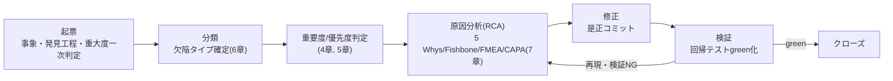
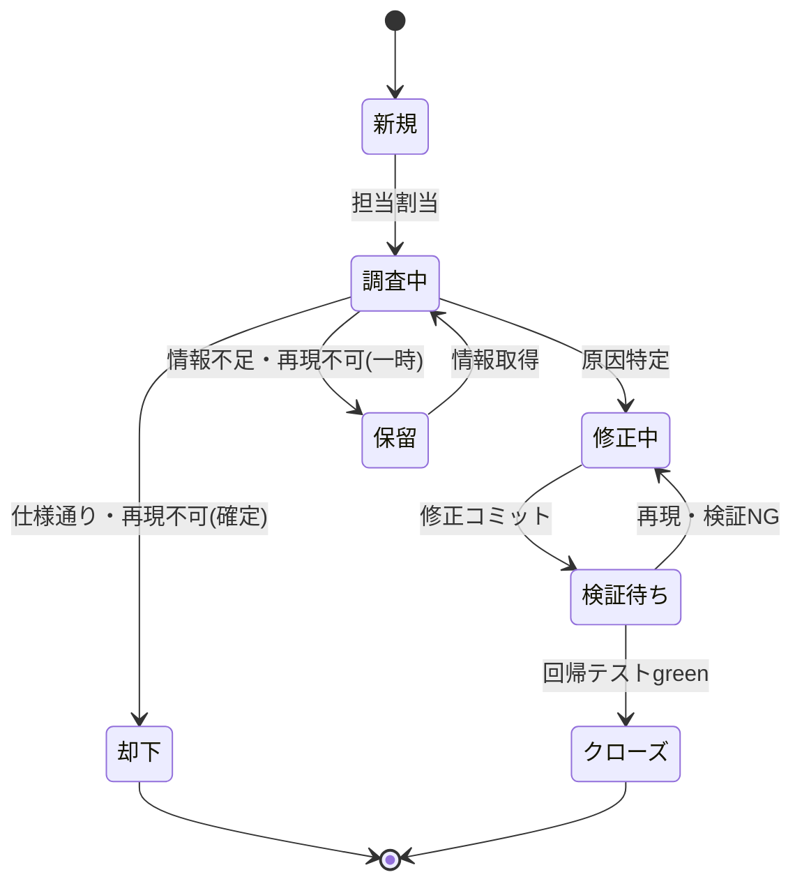

# WS2D-DL-001 不具合管理台帳

- 版数: 3.0 / 作成日: 2026-08-02（前版 2.0）/ 最終更新: 2026-08-03
- 関連: 障害の詳細ポストモーテムは `docs/INCIDENT_POSTMORTEM.md`（本台帳は一覧・追跡・分類）。
  帳票出力の仕様は `docs/sdlc/20_design/WS2D-OD-001_帳票出力設計書.md`。
- 準拠: ISO/IEC 25010（品質特性との紐付け）、ISTQB Foundation Level（Severity/Priority の分離）

## 1. 文書概要

### 1.1 目的

本台帳は WebSpec2Doc プロジェクトで発見された不具合を一元的に記録・追跡し、
①重要度・優先度の判定基準を統一する、②原因分析（RCA）の実施基準を明確にする、
③実績を集計して品質傾向を可視化する、④再発防止策の効果を不具合単位で裏付ける、
ことを目的とする。大手SIer案件の納品検査では不具合管理台帳の有無・記載粒度が
品質保証プロセスの成熟度を測る指標として扱われるため、本書は ISO/IEC 25010・
ISTQB Foundation Level という外部標準に明示的に紐付けて記載する。

### 1.2 適用範囲

- **対象**: `git log` から実測できる fix コミット、`docs/INCIDENT_POSTMORTEM.md` に
  記録されたインシデント、旧設計文書（quarantine 是正）に記録された不具合。
- **対象外**: 未コミットの手元修正、コードレビューで指摘されマージ前に解消した指摘
  （コミット履歴に残らないため実測不能）。
- **前版との関係**: 前版（1.0, 23行）はDL-001〜005のみを収載した初版。前々版の
  改訂（2.0）で `git log` の実測範囲を拡大し DL-006〜029 を追加した。本改訂（3.0）は
  不具合管理プロセスの図式化・状態遷移の明文化・RCA実施基準の明確化・
  再発防止策一覧の新設、および `git log` の再実測による実績台帳の拡充を行う。

### 1.3 関連文書

| 文書 | 関係 |
|---|---|
| `docs/INCIDENT_POSTMORTEM.md` | INC-2026-001 のフル5 Whys記録。本台帳§8.1に要約転記 |
| `.claude/rules/functional-integrity.md` | RCA実施時に named framework を用いる規約の原典 |
| `docs/sdlc/20_design/WS2D-OD-001_帳票出力設計書.md` | 出力物起因の不具合（DL-009等）の仕様側の裏付け |

## 2. 不具合管理プロセス

**図1の読み方**: 起票から検証まで一方向に進むが、検証段階（F）で回帰テストが
red になった場合、または利用者確認で不具合が再現した場合は原因分析（D）へ
差し戻す。これは「一度の修正で解決したと誤認してクローズする」ことを防ぐ
ループであり、INC-2026-001 の教訓（pytestが緑になった時点を完了と誤判定した）
を踏まえた設計である。

| 工程 | 内容 | 入力 | 出力 | 担当 | 実施証跡 |
|---|---|---|---|---|---|
| 起票 | 発見時点で事象・発見工程・重大度一次判定を記録 | ユーザー報告／テスト失敗／レッドチーミング結果／ファジング結果 | 事象記述・発見日 | 発見者 | 本台帳 §8、`docs/INCIDENT_POSTMORTEM.md` |
| 分類 | 欠陥タイプ（§6）・重要度/優先度（§4, §5）を確定 | 起票内容 | 分類ラベル | 対応担当 | 本台帳 §8 各列 |
| 原因分析 | 5 Whys / Fishbone 等の named framework を用いる（`.claude/rules/functional-integrity.md` 準拠） | 分類済み事象 | 根本原因の記述 | 対応担当 | INC-2026-001 は 5 Whys で分析済み（`docs/INCIDENT_POSTMORTEM.md` §3） |
| 修正 | 原因に対する是正コミット | 根本原因 | コミット | 対応担当 | 本台帳 §8「修正コミット」列（実在するハッシュのみ記載） |
| 検証 | 該当テストの green 化・回帰防止テストの追加 | 修正コミット | テスト結果 | 対応担当／レビュアー | 本台帳 §8「検証」列 |
| クローズ | 検証完了後にステータスを Closed とする | green化したテスト結果 | ステータス更新 | 対応担当 | 本台帳 §8「状態」列 |

判断基準: 検証段階では「該当テストがgreenであること」に加えて「関連する既存テストが
red化していないこと（回帰していないこと）」の両方を満たさない限りクローズしない。
これは INC-2026-001 の根本原因（機械的強制力の欠如）を踏まえ、`make verify-ui` を
経由しないコミットをブロックする pre-commit hook（§11参照）で機械的に担保している。

## 3. 不具合の状態遷移

**図2の読み方**: 「保留」と「却下」はどちらも「調査中」から分岐するが意味が異なる。
「保留」は一時的な情報不足（再現手順が掴めない等）で対応順位を下げた状態であり、
情報が揃えば「調査中」へ復帰する。「却下」は「仕様通りの動作である」「再現不可能と
確定した」等、恒久的にクローズ相当と判断した状態である。本台帳の実績（§8）には
「保留」「却下」に該当する事例は本改訂時点で確認できていない（**未確認**、全件が
Closedまで到達済み）。

| 状態 | 定義 |
|---|---|
| 新規 | 起票直後、担当未割当 |
| 調査中 | 担当が割り当てられ、事象の再現・原因の特定を行っている状態 |
| 修正中 | 原因が特定され、是正コミットの作成中 |
| 検証待ち | 修正コミットは完了し、回帰テストの実行・レビュー待ち |
| クローズ | 検証完了。回帰テストgreen、再発防止策の追加も完了 |
| 却下 | 仕様通りの動作、または再現不可能と判断し対応しない |
| 保留 | 一時的に対応順位を下げた状態。情報取得後に「調査中」へ復帰 |

## 4. 重要度（Severity）と優先度（Priority）の判定基準

ISTQB の定義に従い、**重要度＝技術的影響の大きさ**、**優先度＝対応の緊急度（ビジネス判断）**を
分離する。重要度が高くても回避策があれば優先度は下がりうる（逆もある）。

### 4.1 重要度（Severity）

| 重要度 | 定義 | 主に影響する ISO/IEC 25010 品質特性 | 本台帳での該当例 |
|---|---|---|---|
| Critical（致命的） | データ損失・セキュリティ侵害・システム全体停止・全ユーザーに影響 | セキュリティ、信頼性 | （本台帳に該当なし。第2〜3回レッドチーミングで発見された指摘は是正済みで Critical 化を未然に防止） |
| High（重大） | 主要機能が使用不能で回避策がない | 機能適合性、信頼性 | DL-001（日本語サイトでバリデーション実測が機能不全）、INC-2026-001（未検証 UI のリリース）、DL-048（AutoRunの承認が段階に反映されず実行へ進めない致命バグ） |
| Medium（中） | 機能は動作するが著しい劣化があり、回避策がある場合が多い | 使用性、性能効率性 | DL-002（承認モーダルのタイムアウト UI が隠れる） |
| Low（軽微） | 表示崩れ・テスト不安定性等、業務影響は限定的 | 使用性、保守性 | DL-003（テスト flaky）、DL-004/005（ビジュアル回帰基準線の陳腐化） |

重要度判定の実務上の注意: 「機能が動く/動かない」だけで判定せず、ISO/IEC 25010の
品質特性のどれが損なわれるかを明示することで、機能面では軽微でもセキュリティ特性を
損なう不具合（例: DL-027のbandit B310指摘）を過小評価しない運用としている。

### 4.2 優先度（Priority）

| 優先度 | 定義 | 目安対応期限 |
|---|---|---|
| P1（即時） | 本番相当の障害・セキュリティ・データ破損 | 当日中 |
| P2（高） | 主要フローの阻害 | 3 営業日以内 |
| P3（中） | 一部機能・UX 劣化、回避策あり | 次リリースまで |
| P4（低） | 軽微・見た目のみ・テスト基盤の不安定性 | バックログ |

重要度と優先度が一致しない例: DL-027（bandit B310、セキュリティ分類）は重要度こそ
セキュリティ特性に関わるが、実害（スキーム未検証によるSSRF等）が実測で確認された
わけではなく、静的解析ツールの指摘に対する予防的対応であったため、優先度は
P1ではなくP2〜P3相当で対応された（**優先度ラベルは commit message に明記が無いため
本評価は推定**）。

> 本コードベースの実コミットには `P0-2`、`P0-3`、`P1-1`、`P1-2`、`P1-3` 等、開発チームが実際に
> 運用している優先度ラベルが確認できる（`git log` より）。本台帳 §8 ではこれをそのまま引用し、
> 上表の P1〜P4 と読み替えて記載する（P0 は「即時・最優先」として P1 と同義で扱う）。

## 5. 不具合分類（欠陥タイプ）

| 分類 | 定義 | 本台帳での該当例 |
|---|---|---|
| 機能 | 仕様通りに動作しない・ロジック誤り | DL-019（トレーサビリティ画面が永久に「読み込み中」）、DL-048（承認が実行に反映されない致命バグ） |
| UI | 表示崩れ・操作性・レイアウト | DL-002（タイムアウトUIが隠れる）、DL-022（サンプル帯混入） |
| 性能 | 応答速度・リソース消費 | DL-014（遮断ログで実行ログが埋まる、性能/UI複合） |
| セキュリティ | 認証・認可・インジェクション・情報漏洩 | DL-011〜013（レッドチーミング指摘）、DL-027（bandit B310） |
| データ | 永続化・整合性・欠損 | DL-009（CSV取込が根拠を捏造）、DL-010（異常値・並行アクセス） |
| ドキュメント | 記載誤り・陳腐化 | DL-044（AutoRunの用語不統一） |
| テスト基盤 | flaky・基準線陳腐化等、テスト資産自体の不具合 | DL-003〜005（flaky・visual regression陳腐化）、DL-017（品質ゲート停止） |

分類は commit message から機械的に判定した項目を多数含む（§8.2, §8.3）ため、
1コミットが複数分類にまたがる場合は最も主たる影響を1つ選んで計上している
（延べ数ではなく実数、保守性のみ例外的に延べ計上、§9参照）。

## 6. 原因分析（RCA）の実施基準

`.claude/rules/functional-integrity.md` は「開発プロセス上の失敗が発生した場合、
明示的な RCA フレームワークを用いる」ことを義務付け、Ad-hoc な RCA を明示的に
禁止している。本台帳における使い分け基準は次の通り:

| フレームワーク | 使う場面 | 本台帳での適用例 |
|---|---|---|
| 5 Whys | 単一の原因系列を深掘りできる、プロセス上の失敗（人・手順起因） | INC-2026-001（なぜpytest緑を完了と誤判定したか） |
| Fishbone（特性要因図） | 原因候補が複数系統（人・プロセス・技術・環境）にまたがり、洗い出しが先に必要な場合 | 本台帳に適用例なし（**未確認**、今後の重大インシデントで使用を想定） |
| FMEA | 実装前に故障モードを予防的に洗い出す場合（発生後の分析ではなく予防） | レッドチーミング・ファジング（DL-009〜013）は事後分析ではなく、事前に想定した攻撃パターンを検証する運用のためFMEA的アプローチに近いが、本台帳の記録上「RCA実施」と明記されておらず、**named frameworkとしての適用明記は未確認** |
| CAPA（是正処置・予防処置） | 是正処置（Corrective Action）と予防処置（Preventive Action）を分離して管理する必要がある場合 | INC-2026-001の是正措置一覧（`docs/INCIDENT_POSTMORTEM.md` §5、7項目）はCAPAの是正処置に相当する構成だが、フレームワーク名としての明示はない |

**Ad-hoc RCA禁止の運用**: commit message ベースで機械的に記載した DL-006〜DL-049
（§8.2, §8.3）は「個別のRCA（5 Whys等）を本改訂では実施していない」ことを明記して
いる。これは規約違反ではなく、規約が要求する「開発プロセス上の失敗」に該当する
重大事案（INC-2026-001等）にRCA実施を限定し、通常の不具合修正コミットにまで
一律RCAを強制していないためである。この運用方針自体の是非は本改訂の範囲外
（**未確認**、プロジェクト運営判断）。

## 7. 実績台帳の作成方法

以下の実データを突合して作成した。**実在するコミット/記録のみを記載し、捏造しない。**

1. `docs/INCIDENT_POSTMORTEM.md`（INC-2026-001）: フル RCA（5 Whys）記録済み
2. 旧設計文書（DL-001〜DL-005、2026-07-15 起票・Phase A quarantine 是正）: フル RCA 記録済み
3. `git log --oneline -i --grep="^fix" | head -50`（前版 2.0 で実測。直近50件からマージコミット
   重複を除いた実コミットのみを DL-006〜DL-029 として記載）
4. `git log --oneline --format="%h|%ad|%s" --date=short | grep -iE "fix|bug|修正|不具合|バグ"`
   （本改訂 3.0 で再実測、日付付き。前版が起票日「未取得」としていた制約を一部解消し、
   commit 日付を検出日の参考値として DL-030〜DL-049 に追加記載）

これらは commit message から起こした一次情報であり、個別の RCA（5 Whys 等）は
DL-006 以降では実施していない（「原因」「対策」列はcommit messageの記述をそのまま
引用し、推測で補わない）。

## 8. 実績台帳

### 8.1 フル RCA 記録済み（起票日・原因分析とも確定）

| ID | 起票日 | 事象 | 重要度 | 分類 | 原因 | 対策 | 検証 | 修正コミット | 状態 |
|---|---|---|---|---|---|---|---|---|---|
| INC-2026-001 | 2026-06-03 | AutoRun 承認モーダルを L3/L4 未実施のままリリースし 30 件以上の UI/UX 問題が発覚 | High | 機能/UI | プロセスは文書化されていたが機械的強制力がなく省略可能だった（5 Whys、`docs/INCIDENT_POSTMORTEM.md` §3） | テスト戦略書・DoD 作成、E2E スイート構築、pre-commit hook 実装、Makefile 標準化 | `make verify-ui` 未実行時にコミットがブロックされることを確認 | （是正措置は複数コミットに分散、個別ハッシュは postmortem 未記載） | Closed |
| DL-001 | 2026-07-15 | 日本語サイトの必須未入力バリデーション実測が空（`observed=={}`）。全 JP サイトで機能不全 | High（重大・実装バグ） | 機能 | Chromium は `validationMessage` を UI 言語バンドルの基底コードで解決。`--lang=ja-JP` では空文字 | `page_crawler` に `BROWSER_UI_LANG`（基底 `ja`）を導入 | `test_crawl_page_contact_measures_validation` green | （旧台帳に個別ハッシュ記載なし） | Closed |
| DL-002 | 2026-07-15 | 承認モーダルの制限時間ドロップダウンが 1280×800 で隠れる | Medium（UX 劣化） | UI | R3-02 実行デバイス選択追加で本文が縦長化し埋没 | `arm-section` 等を圧縮 | `test_timeout_dropdown_not_obscured` 等 green | 同上 | Closed |
| DL-003 | 2026-07-15 | 履歴 diff ボタンのローディング状態テストが flaky | Low（テスト不安定） | テスト基盤 | sync Playwright の route ハンドラ内 `time.sleep` がドライバスレッドをブロック | 決定的テストへ変更 | 単体 10/10 安定 | 同上 | Closed |
| DL-004 | 2026-07-15 | 承認モーダルの visual regression（1280×800）不一致 | Low（基準陳腐化） | テスト基盤 | ベースラインが R3-02 追加・圧縮に未追随 | ベースライン再生成 | `test_autorun_approval_modal` green | 同上 | Closed |
| DL-005 | 2026-07-15 | 同上（1366×768） | Low（基準陳腐化） | テスト基盤 | 同上 | 同上 | `test_autorun_approval_modal_1366x768` green | 同上 | Closed |

### 8.2 git ログ由来（前版で実測、起票日は未取得）

起票日は未取得（`git show <hash>` で取得可能）。原因・対策は commit message の記載をそのまま引用し、
推測で補わない。

| ID | 修正コミット | 事象（commit message より） | 推定分類 | 優先度ラベル（実コミット記載） | 状態 |
|---|---|---|---|---|---|
| DL-006 | `4220fbf` | ログイン後の遷移順序が「ユーザー選択→テナント選択→システム選択」になっていなかった | 機能 | — | Closed |
| DL-007 | `6c00d3b` | 画面を離れて戻ると前回の解析中の表示が残っていた | UI | — | Closed |
| DL-008 | `2629d72` | 「測って0」と「導出対象が無い」が見た目で区別できなかった | UI | — | Closed |
| DL-009 | `f3d8c5c` | CSV 取込が根拠を捏造していた | データ | fix/csv-import-fuzzing | Closed |
| DL-010 | `7f5ed9b` | 異常値と並行アクセスの検証で 2 件の不具合を検出 | 機能/データ | fix/fuzzing-and-concurrency | Closed |
| DL-011 | `014c02f` | 第 3 回レッドチーミングで 3 件検出 | セキュリティ（推定） | fix/redteam-round3 | Closed |
| DL-012 | `01a1f5f` | 第 2 回レッドチーミングで 3 件検出 | セキュリティ（推定） | fix/redteam-round2 | Closed |
| DL-013 | `950b0ba` | レッドチーミングで 5 件検出（観点関連） | セキュリティ（推定） | fix/viewpoint-redteam-findings | Closed |
| DL-014 | `4fcf1a9` | 遮断ログで実行ログが埋まる問題 | 性能/UI | fix/blocked-request-log-noise（案A/B/D） | Closed |
| DL-015 | `89e1415` | 設定画面の疎通確認が無反応に見える、タブが URL に反映されない | UI | fix/settings-msg-and-tab-url | Closed |
| DL-016 | `b5bc0ef` | 動いていなかった点検を復旧させ、そこで不具合を発見 | テスト基盤/機能 | — | Closed |
| DL-017 | `3b6ecd6` | 止まっていた品質ゲート 3 件を修正し CI で検知可能にした | テスト基盤 | — | Closed |
| DL-018 | `eeeca6c` | CLI の `--json` がサブコマンドの後ろで弾かれ、出力にログが混入 | 機能 | fix(cli) | Closed |
| DL-019 | `4d2278f` | トレーサビリティ画面が永久に「読み込み中」で停止 | 機能 | — | Closed |
| DL-020 | `669199b` | 再解析のスキーム固定と、テスト実行結果が反映されない問題 | 機能 | — | Closed |
| DL-021 | `4d863d7` | オンボーディングツアーで E2E が不安定化 | テスト基盤 | fix(test) | Closed |
| DL-022 | `59befa6` | サンプル帯が全レポートに表示、2 ペインの配分が破綻 | UI | — | Closed |
| DL-023 | `0d47bbf` | 残り時間が完了の瞬間に「約 40 秒」と誤表示 | UI | P1-1 | Closed |
| DL-024 | `0e79b98` | fetch 全 87 経路のうち 3 経路が無言で固まる | 機能 | P0-3 | Closed |
| DL-025 | `5f7fc6e` | 自 UI の UX 監査で製品欠陥 3 件を検出 | UI | P0-2 | Closed |
| DL-026 | `6c34424` | SPA でのリンク取り逃し、未使用関数等の残債 | 機能/保守性 | fix/debt-cleanup | Closed |
| DL-027 | `e569574` | bandit B310（スキーム未検証）を解消 | セキュリティ | — | Closed |
| DL-028 | `166e961` | テストケース件数がタブを開く前に表示されない | UI | — | Closed |
| DL-029 | `6673cd3` | `settings.py` の logger 未定義・フォーマット違反 | 保守性 | — | Closed |

### 8.3 git ログ由来・追加抽出分（本改訂 3.0 で日付付き再抽出）

本改訂で `git log --format="%h|%ad|%s" --date=short` を再実行し、前版が収載していなかった
2026-07-20〜2026-07-28 の fix コミットのうち代表的な20件を日付付きで追加した。分類は
commit message からの推定であり、個別RCAは未実施（§7と同じ扱い）。

| ID | 検出日（commit日） | 修正コミット | 事象（commit message より） | 推定分類 | 状態 |
|---|---|---|---|---|---|
| DL-030 | 2026-07-20 | `3cf3367` | 無断アクセスと強制モーダルをやめ、確認してから実行する導線にする | UI | Closed |
| DL-031 | 2026-07-20 | `e507fa4` | 各段階の内容を関門到達時に自動提示する（「提示・承認」の実現） | 機能 | Closed |
| DL-032 | 2026-07-20 | `8b73fb1` | 設計段階を1段階ずつ提示・承認する（仕様7〜13の最大の乖離を解消） | 機能 | Closed |
| DL-033 | 2026-07-20 | `0e199cc` | 履歴から専用レポート画面へ辿れるようにする（受付と履歴の成果物の食い違いを解消） | 機能 | Closed |
| DL-034 | 2026-07-20 | `e94ca00` | オンボーディングツアーが初回ユーザーをAutoRunから強制的に締め出す不具合を修正 | 機能 | Closed |
| DL-035 | 2026-07-20 | `0c201ca` | 生成テストに実操作・実アサーションを実装（ミューテーションスコア0%を是正） | テスト基盤 | Closed |
| DL-036 | 2026-07-28 | `3290be3` | AutoRunを実行途中で中止できるようにする | 機能 | Closed |
| DL-037 | 2026-07-28 | `4ef696a` | 指摘済みの弱点6件を解消する | 機能 | Closed |
| DL-038 | 2026-07-28 | `66aa4ee` | 遷移表が共通ナビ除外で空になる問題を直し、状態遷移表一式を出す | 機能 | Closed |
| DL-039 | 2026-07-27 | `2d13591` | 実行履歴の種別タブを、開いているシステムに関係あるものだけに絞る | UI | Closed |
| DL-040 | 2026-07-26 | `df5722f` | 全状態を横断検査し、完了後に受付が復活する等の欠陥を修正する | 機能 | Closed |
| DL-041 | 2026-07-26 | `df14d36` | 停止導線の重複と、待機中に中止できない問題を修正する | UI | Closed |
| DL-042 | 2026-07-26 | `55c5eda` | 到達不能な段階ナビを削除し、実行結果ページの用語と失敗メッセージを直す | UI | Closed |
| DL-043 | 2026-07-26 | `2117ffe` | 自動承認の根拠と承認記録を画面から確認できるようにする | UI | Closed |
| DL-044 | 2026-07-26 | `8bc4a41` | AutoRunの用語を統一し、失敗からの復旧と未確認の可視化を補う | ドキュメント | Closed |
| DL-045 | 2026-07-26 | `19f7a89` | AutoRunの承認ゲートが実効性を持たない問題を修正し、未確認事項を成果物へ出す | 機能（High相当） | Closed |
| DL-046 | 2026-07-26 | `a08e482` | 一括承認が段階へ反映されず「承認済み 1 / 8」と表示される不整合を修正 | 機能 | Closed |
| DL-047 | 2026-07-26 | `6663728` | 未クロールを未実装と誤報告する問題ほか、残タスクを一括対応 | 機能 | Closed |
| DL-048 | 2026-07-26 | `90e2073` | AutoRunの承認が段階に反映されず実行へ進めない致命バグを修正 | 機能（High相当） | Closed |
| DL-049 | 2026-07-21 | `dca1959` | E2Eゲートの形骸化を修正（スキップを緑扱いにしない・別ポート起動を機能させる） | テスト基盤 | Closed |

## 9. 統計

### 9.1 発見工程別（本台帳に記載した全 50 件中）

| 発見工程 | 件数 | 内訳 |
|---|---|---|
| L3/L4（実ブラウザ確認・ユーザー報告） | 1 | INC-2026-001 |
| Phase A quarantine 是正作業（実測突合中に発見） | 5 | DL-001〜005 |
| レッドチーミング（意図的な脆弱性探索） | 3 | DL-011〜013 |
| ファジング/並行アクセス検証 | 2 | DL-009〜010 |
| 通常開発中の発見（commit message から機械的分類、詳細工程は未確認） | 39 | DL-006〜008, 014〜029, 030〜049（レッドチーミング/ファジング系を除く） |

### 9.2 分類別（本台帳に記載した全 50 件中、推定含む）

| 分類 | 件数 |
|---|---|
| 機能 | 22 |
| UI | 15 |
| データ | 2 |
| セキュリティ | 4 |
| テスト基盤 | 6 |
| ドキュメント | 1 |
| 保守性 | 2（機能等と重複計上あり、延べ数） |

> 母数が 50 件と少なく、%表示は誤差が大きいため件数のみを示す。`git log --oneline -i --grep="^fix"`
> は全 139 件ヒットし、本改訂の `%h|%ad|%s` 形式・拡張キーワード（fix/bug/修正/不具合/バグ）での
> 抽出でも90件近くがヒットした。本台帳には代表的な50件（フルRCA6件＋commit message由来44件）
> のみを収載しており、残り約90件は本改訂の範囲外（**未収載**。次回改訂で全件棚卸しを推奨）。

### 9.3 重要度別（フルRCA記録済み6件のみ。git ログ由来44件は重要度未判定）

| 重要度 | 件数 |
|---|---|
| High | 2（INC-2026-001, DL-001） |
| Medium | 1（DL-002） |
| Low | 3（DL-003〜005） |

git ログ由来の44件（§8.2, §8.3）は個別RCAを実施していないため重要度を確定できず、
本統計からは除外している（**未確認**として扱い、断定しない。DL-045・DL-048は
commit message の記述内容からHigh相当と推定を§8.3列に付記したが、統計には未算入）。

## 10. 残存不具合と既知の制限

| 項目 | 内容 |
|---|---|
| quarantine 登録 | 2026-07-16 時点で 0 件（`tests/e2e/conftest.py` の機構自体は残置） |
| 未収載の fix コミット | `git log` 上は fix/bug/修正/不具合/バグを含むコミットが90件近くヒットするが、本台帳は代表的な50件のみ収載。全件棚卸しは未実施 |
| Ollama 連携のテスト方針 | `WS2D-IT-001` §5 の通り未確認。不具合の有無以前にテスト方針自体が特定できていない |
| `feature_contracts.yml` の要件数 | 前版改訂時点で実測 51 件（`WS2D-UT-001` §6 参照）。19 件を前提にした過去のリスク評価が現状と乖離している可能性 |
| 状態「保留」「却下」の実績 | §3 で定義したが、本台帳の実績50件中に該当する事例は確認できていない（**未確認**。運用上まだ発生していないのか、記録されていないだけかは切り分けできていない） |
| 起票日の欠落 | §8.2（DL-006〜029）は起票日を記録していない。§8.3（DL-030〜049）で一部commit日付を補ったが、これは「検出日」の近似値であり厳密な起票日ではない |

## 11. 再発防止策の一覧

実際に導入された仕組みと、その契機になった不具合を紐付ける。

| # | 再発防止策 | 種別 | 契機となった不具合/事案 | 対象ファイル |
|---|---|---|---|---|
| 1 | テスト戦略書の作成 | 予防 | INC-2026-001（L3/L4未実施リリース） | `docs/TESTING_STRATEGY.md` |
| 2 | Definition of Done の作成 | 予防 | INC-2026-001 | `docs/DEFINITION_OF_DONE.md` |
| 3 | E2E テストスイートの構築 | 予防 | INC-2026-001 | `tests/e2e/` |
| 4 | pre-commit hook の実装（`make verify-ui` 未実行のUI変更コミットをブロック） | 予防 | INC-2026-001 | `.githooks/pre-commit` |
| 5 | Makefile によるコマンド標準化 | 予防 | INC-2026-001 | `Makefile` |
| 6 | CLAUDE.md / AGENTS.md への必須ゲート記載 | 予防 | INC-2026-001 | `CLAUDE.md`, `AGENTS.md` |
| 7 | quarantine 機構によるE2E隔離ゼロ化（Phase A） | 是正＋予防 | DL-001〜005（quarantine 5件の根本修正） | `tests/e2e/conftest.py` |
| 8 | E2Eゲートの実効性強化（スキップを緑扱いにしない） | 是正 | DL-049（`dca1959` E2Eゲートの形骸化） | `tests/e2e/` 関連CI設定 |
| 9 | pre-commitのdocs誤検知修正（日本語ファイル名・HTML誤検出） | 是正 | DL-017系（品質ゲート3件停止）、`c1b8528`（日本語ファイル名でE2Eスキップされない問題） | `.githooks/pre-commit` |
| 10 | 品質ハーネス（`scripts/quality_harness.py`）・functional-integrity gate の運用 | 予防 | INC-2026-001の再発防止の一環として本改訂時点で運用中 | `scripts/quality_harness.py`, `.claude/rules/functional-integrity.md` |
| 11 | レッドチーミング・ファジングの定期実施 | 予防 | DL-009〜013（実施の結果として不具合を検出） | 該当ブランチ（`fix/redteam-*`, `fix/fuzzing-*`） |

再発防止策の効果検証は `docs/INCIDENT_POSTMORTEM.md` §7 に記載の4基準
（`make verify-ui`未実行時のブロック等）に従う。本改訂では効果測定の再実施は
行っていない（**未確認**、前版からの転記）。

## 12. 改訂履歴

| 版 | 日付 | 内容 | 作成者 |
|---|---|---|---|
| 1.0 | 2026-07-16 | 初版（23 行、DL-001〜005 のみ） | 開発チーム |
| 2.0 | 2026-08-02 | 不具合管理プロセス・重要度/優先度判定基準（ISO/IEC 25010 紐付け）・欠陥分類を新設。`git log` 実測により DL-006〜029 を追加、INC-2026-001 を台帳化、統計・残存制限を追加 | 開発チーム |
| 3.0 | 2026-08-03 | 大手SIer納品水準へ拡充。不具合管理プロセス図・状態遷移図（mermaid 2点）を新設。RCA実施基準（5 Whys/Fishbone/FMEA/CAPAの使い分け）・再発防止策一覧を新設。`git log` 再実測により DL-030〜049（20件、日付付き）を追加し実績台帳を50件に拡大。統計を50件ベースへ再集計 | 開発チーム |
