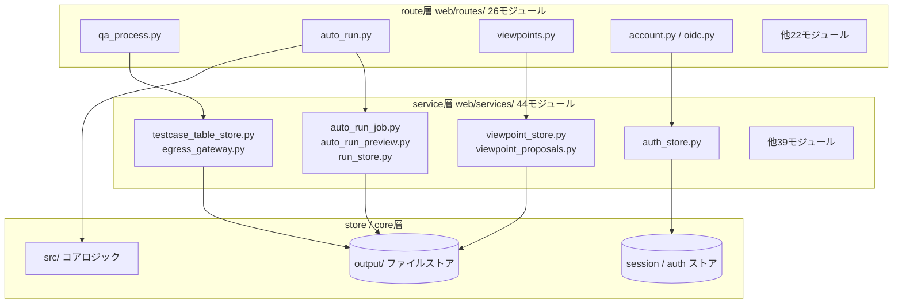
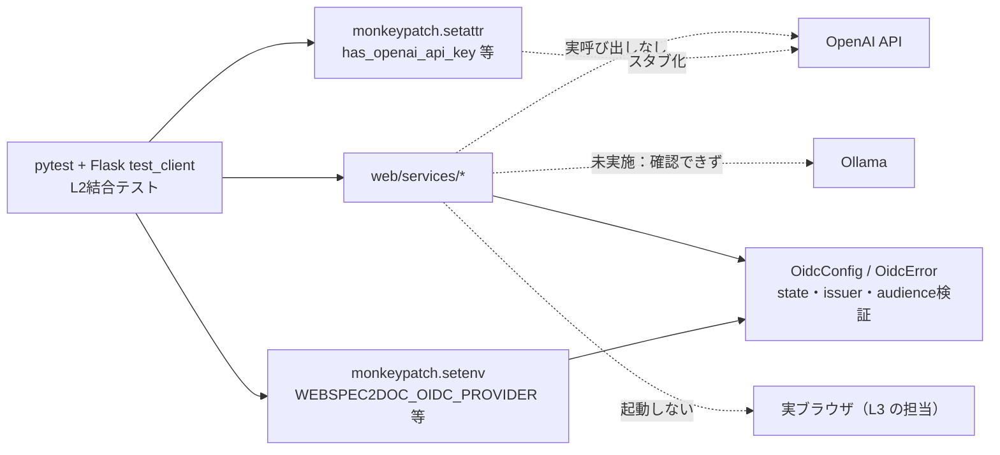

# WS2D-IT-001 結合テスト仕様兼結果報告書（L2）

- 版数: 3.0 / 作成日: 2026-08-02（前版 2.0 / 2026-08-02、初版 1.0 / 2026-07-16）
- 準拠: ISO/IEC/IEEE 29119（Software Testing）/ ISTQB Foundation Level Syllabus v4.0
- 定義: Flask ルート統合。`app.test_client()` / `create_app()` を用い、
  **route 層 × service 層 × store 層**の結合経路を HTTP レベルで検証する（実ブラウザ操作は L3）。
- 対象読者: 開発チーム、レビュアー、検収担当者。

## 0. 文書概要

本文書は WebSpec2Doc の L2（結合テスト）について、テスト仕様と実施結果を統合して報告する。
L1（`WS2D-UT-001`）が `src/` の純粋ロジックを検証するのに対し、L2 は「HTTP リクエストがどのルートに
届き、どの service を経由し、どう永続化・応答されるか」という**結合経路**を検証する。本文書単体で
次を判断できることを目標とする。

1. 結合の単位をどう定義しているか（§1）
2. 26 ブループリントがどの service 層と結合しているか（§4）
3. 200 エンドポイントのうちどの程度がテストで実際に叩かれているか、その概算精度はどの程度か（§5）
4. 外部連携（OpenAI/Ollama/OIDC/Playwright）をどう分離してテストしているか（§7）
5. 何が未検証で、どこにリスクがあるか（§10）

関連文書: `docs/TESTING_STRATEGY.md`、`docs/AUTH_TENANCY.md`、`WS2D-UT-001`（L1）、`WS2D-ST-001`（L3）、
`docs/sdlc/_asbuilt/routes.json`（実装エンドポイントの正）。

## 1. 結合の単位とインクリメンタル方針

```text
UI（L3 が担当） → route（web/routes/*） → service（web/services/*） → store/core（web/*.py, src/*） → 永続化 → レスポンス
```

L2 は上図のうち **route → service → store/core → 永続化 → レスポンス** の区間を、Flask test client
経由（実 HTTP に近い形。実プロセス・実ソケットは介さない）で検証する。結合方式は**インクリメンタル結合**
（route 単位で 1 つずつ追加していく方式）であり、全モジュールを一度に結合するビッグバン方式は採用していない。
これは `tests/test_<route名>_routes.py` のように route 単位でテストファイルが分かれている実装からも確認できる
（例: `tests/test_admin_routes.py`、`tests/test_pages_routes.py`、`tests/test_runs_routes.py`、`tests/test_usage_route.py`）。

### 1.1 結合の単位と結合パターン図



**図の説明**: route 層は 26 モジュールに分割されているが、service 層への依存度は一様ではない。
`auto_run.py` と `qa_process.py` は 10 個以上の service モジュールを横断的に import しており
（§4 参照）、結合テストの複雑度・回帰リスクが最も高い箇所である。一方 `discover.py`・`login.py`・
`site.py` 等は service 層を経由せず `web/*.py` や `src/*` を直接呼び出しており、結合の単位としては
より単純である。この非対称性は結合テストの優先順位付け（複雑な route を手厚く検証する）の根拠になる。

## 2. テスト方針

1. **route 単位のインクリメンタル結合**: §1 のとおり、route ファイル単位でテストファイルを対応させる。
2. **実 HTTP に近い経路を優先**: `app.test_client()` はソケットを開かないが、Flask のリクエスト
   ディスパッチ・ミドルウェア（CSRF・セッション・認証デコレータ）を実際に通過する。モックで
   ショートカットしない。
3. **外部 I/O は境界でスタブ化**: OpenAI・実ブラウザ等、L2 の実行時間・再現性を損なう外部要素は
   境界を明確にしてスタブ化する（§7）。OIDC は逆に「境界のロジック自体」がテスト対象であるため、
   スタブ化ではなく環境変数注入によって実ロジックを検証する。
4. **失敗系を正常系と同等に扱う**: `required_tests` に `error_path` が含まれる機能は、正常系と
   同数以上の異常系ケースを持つことを推奨する（§6）。

## 3. テスト環境

| 項目 | 内容 |
|---|---|
| ツール | pytest + Flask test client（`app.test_client()` / `create_app()`） |
| 実行コマンド | `make test`（L1 と同一コマンド。ファイル分類上のみ区別） |
| セッション | `ws2d_session` クッキーを介したセッション確立をテスト内で明示的に検証 |
| CSRF | 保護対象 route への POST/PUT/DELETE で CSRF トークン検証を通過させる、または欠如時に拒否されることを確認 |
| テナント設定 | `WEBSPEC2DOC_AUTH_MODE` 等の環境変数を `monkeypatch` で切り替え、シングルテナント/マルチテナント双方の経路を同一テストスイートで検証 |
| 外部ネットワーク | 遮断（§7 のスタブ方針により、テスト実行時に外部ネットワークへ到達しないことを設計上の前提とする） |
| 失敗時の記録 | pytest 標準のアサーションメッセージのみ。L3（`tests/e2e/screenshots/`）のような専用の証跡ディレクトリは L2 では持たない |
| 実行速度 | ソケットを開かない `test_client` 方式のため、実ブラウザを起動する L3 より高速。具体的な実行時間は本改訂では**未計測** |

## 4. 結合インタフェース一覧（route 26 × service 層対応表）

`web/routes/*.py` 全 26 モジュール（`__init__.py` 除く）について、`Blueprint` 名と、直接 import している
`web/services/*` を機械的に抽出した結合関係を示す（`grep -oE "Blueprint\(..." ` および
`grep -ohE "from web\.services..."` による実測。抽出できなかった行は「直接依存なし（`web/*.py` または
`src/*` を直接呼び出し）」と表記する）。

| # | route モジュール | Blueprint 名 | 主な結合先 service |
|---|---|---|---|
| 1 | `account.py` | `account` | `auth_store`（`get_auth_store`, `AuthError`, ロール定数） |
| 2 | `admin.py` | `admin` | `admin_audit`（監査ログ追記・読取） |
| 3 | `api_v1.py` | `api_v1` | `scheduler`, `job_queue`, `openapi_spec`, `openapi_docs` |
| 4 | `api_v1_schedule.py` | `api_v1_schedule` | `notifier`（通知テンプレート検証） |
| 5 | `auto_run.py` | `auto_run` | `auto_run_config`, `auto_run_job`, `auto_run_preview`, `evidence_pack_service`, `playwright_executor`, `qa.helpers`, `spec_ts_generator`, `viewpoint_store`, `usage_tracker`, `nonfunctional_judge`, `observation_coverage`, `failure_hypothesis`, `mutation_verifier`, `egress_gateway`, `run_store`（26 route 中最大の結合先数） |
| 6 | `autorun_report.py` | `autorun_report` | 直接依存なし（`run_store`/出力ディレクトリを route 内で直接参照） |
| 7 | `autorun_stages.py` | `autorun_stages` | 直接依存なし（`src/autorun` の段階定義を直接参照） |
| 8 | `crawl.py` | `crawl` | `run_store`, `usage_tracker` |
| 9 | `discover.py` | `discover` | 直接依存なし（`src/crawler` を直接呼び出し） |
| 10 | `history.py` | `history` | `comparison_workspace` |
| 11 | `llm_chat.py` | `llm_chat` | 直接依存なし（`src/llm` を直接呼び出し） |
| 12 | `login.py` | `login` | 直接依存なし（`web/auth.py` を直接使用） |
| 13 | `metrics.py` | `metrics` | `metrics`（メトリクス描画） |
| 14 | `oidc.py` | `oidc` | `auth_store` |
| 15 | `pages.py` | `pages` | 直接依存なし |
| 16 | `qa_process.py` | `qa_process` | `openai_qa`, `qa.advanced_generator`, `qa.helpers`, `qa.doc_generator`, `testcase_table_store`, `egress_gateway`, `playwright_executor`, `testcase_spec_generator`, `test_design_settings`, `screen_test_design`, `condition_run_status`, `run_store`, `usage_tracker`（qa.* サブパッケージを含め service 層への依存が最も広い route） |
| 17 | `report.py` | `report` | `admin_audit`, `spec_ts_generator`, `export_xlsx`, `run_store` |
| 18 | `review.py` | `review` | 直接依存なし |
| 19 | `runs.py` | `runs` | 直接依存なし |
| 20 | `schedule.py` | `schedule` | `admin_audit`, `scheduler`, `notifier` |
| 21 | `settings.py` | `settings` | `openai_qa`（接続テスト） |
| 22 | `site.py` | `site` | 直接依存なし |
| 23 | `tenant_admin.py` | `tenant_admin` | 直接依存なし（`web/tenancy.py` を直接使用と推定） |
| 24 | `traceability.py` | `traceability` | `traceability`（`build_matrix`, `matrix_to_dict`） |
| 25 | `usage.py` | `usage` | `usage_tracker` |
| 26 | `viewpoints.py` | `viewpoints` | `openai_qa`, `viewpoint_proposals`, `viewpoint_store`, `viewpoint_sources` |

> **表の限界**: 上表は `from web.services... import ...` という静的 import 文の grep 抽出であり、
> 関数内での遅延 import・`web/*.py`（`web/auth.py`・`web/tenancy.py` 等 service 層に属さないモジュール）
> 経由の間接呼び出しは表に現れない。「直接依存なし」は「service 層への静的 import が検出されなかった」
> ことを意味し、「結合が存在しない」ことを意味しない。

### 4.1 service 層の責務分類

`web/services/` 直下の 44 モジュールを、命名と役割から機械的に 8 分類した。個々の service が
どの route から結合されるかは §4 の表を参照。

| 分類 | 件数 | 代表モジュール |
|---|---|---|
| AutoRun 系 | 11 | `auto_run_job.py`, `auto_run_preview.py`, `auto_run_config.py`, `egress_gateway.py`, `evidence_pack_service.py`, `mutation_verifier.py`, `nonfunctional_judge.py`, `observation_coverage.py`, `failure_hypothesis.py`, `failure_classifier.py`, `document_autorun.py` |
| QA / テストケース系 | 6 | `testcase_table_store.py`, `testcase_spec_generator.py`, `screen_test_design.py`, `test_design_settings.py`, `spec_ts_generator.py`, `condition_run_status.py` |
| 観点（viewpoint）系 | 6 | `viewpoint_store.py`, `viewpoint_store_operations.py`, `viewpoint_proposals.py`, `viewpoint_sources.py`, `viewpoint_blueprints.py`, `viewpoint_templates.py` |
| レポート / エクスポート系 | 5 | `export_xlsx.py`, `comparison_workspace.py`, `drift_summary.py`, `retention.py`, `run_store.py` |
| 実行基盤系 | 5 | `playwright_executor.py`, `job_queue.py`, `scheduler.py`, `cli_runner.py`, `untrusted_content.py` |
| 横断系 | 5 | `metrics.py`, `notifier.py`, `traceability.py`, `usage_tracker.py`, `visual_complexity.py` |
| 認証 / 監査系 | 3 | `auth_store.py`, `admin_audit.py`, `oidc.py` |
| LLM / 外部 API 系 | 3 | `openai_qa.py`, `openapi_docs.py`, `openapi_spec.py` |
| **合計** | **44** | — |

AutoRun 系が 44 件中 11 件（25%）を占め、単一機能領域としては最大である。これは §1.1 の図で
`auto_run.py` route の結合先数が最多だった事実と整合する。結合テストの複雑度・回帰リスクの観点でも
AutoRun 系 service が最優先の重点対象になる。

## 5. API 結合テストの網羅状況（概算）

`docs/sdlc/_asbuilt/routes.json` を実装エンドポイントの正とし、`tests/` 内のテストコードから
呼び出しパターンを grep して概算した。**以下は概算であり、算出方法をそのまま開示する。**

| 指標 | 値 | 取得コマンド |
|---|---|---|
| 実装エンドポイント総数（`routes.json` 配列長） | **200** | `python3 -c "import json; print(len(json.load(open('docs/sdlc/_asbuilt/routes.json'))))"` |
| `routes.json` 内のユニーク `module` 値 | **27** | 同上（`module` フィールドの重複除去） |
| `web/routes/` 配下の実ファイル数（`__init__.py` 除く） | **26** | `find web/routes -maxdepth 1 -name "*.py" ! -name "__init__.py" \| wc -l` |
| メソッド内訳 | GET 110 / POST 69 / DELETE 9 / PATCH 8 / PUT 4（計 200） | `routes.json` の `methods` フィールド集計（本改訂で再集計） |
| テストコード内のユニークな API 呼び出しパターン | **144** | `grep -rhoE "(get\|post\|put\|delete\|patch)\(['\"]/[^'\"]*['\"]" tests/ \| sort -u \| wc -l` |

> **module 値 27 と物理ファイル 26 の差異について**: 本改訂で新たに発見した不整合である。原因（廃止された
> route の残存メタデータ、あるいは 1 ファイルが 2 つの論理モジュール名を使い分けている等）は本改訂では
> 特定できていない（**未確認**）。文書内で「26 ブループリント」と述べる場合は物理ファイル数を正とする。

**単純比 144/200 ≈ 72% を「網羅率」と主張しない。** 理由:

1. **過大方向のずれ**: grep はクエリ文字列・異常系 ID 違いを別カウントする。例えば
   `get("/api/site?domain=example.com")` と `get("/api/site?domain=nope.com")` は
   同一エンドポイント `/api/site` に対する 2 つの呼び出しパターンとして数えられる。
   同様の異常系バリエーション（`../etc`、`!!bad!!` 等の攻撃的入力を含む）が API 呼び出し
   サンプルの過半を占めるため、144 は実エンドポイント種別数を上回って計上されている。
2. **過小方向のずれ**: `routes.json` の `path` はパス変数（例: `/api/auth/api-tokens/<token_id>`）
   をテンプレートのまま記録するため、テストコード側のリテラル呼び出し文字列（例:
   `/api/auth/api-tokens/abc123`）とは文字列としては一致しない。厳密な照合には
   パスパラメータの正規化処理が要るが、本改訂ではその実装まで行っていない。
3. 結論として **144 と 200 は「同じ母数の異なる数え方」ではない**。網羅率を主張できる精度には
   達していないため、本文書では「実測した生の 2 数値」のみを提示し、比率化した主張は行わない。

## 6. テスト観点ごとのケース設計

`docs/TESTING_STRATEGY.md` が定める L2 の観点（正常系・異常系・境界・認証認可・テナント分離・エラー伝播）
ごとに、代表的なケース設計と実在するテスト例を示す。

| 観点 | ケース設計方針 | 代表例 |
|---|---|---|
| 正常系 | 想定入力に対する 200 系応答とレスポンススキーマの妥当性 | 各 route の happy path（例: `qa_process.py` の生成系エンドポイントに対する正常な domain/report 入力） |
| 異常系 | 不正ドメイン・不正 ID・存在しないリソースへの 4xx 応答とエラーメッセージの日本語化 | `tests/test_qa_process.py:340 test_input_rejects_invalid_domain`、`tests/test_qa_process.py:353 test_generate_rejects_invalid_report_json` |
| 境界 | 空文字・パストラバーサル試行（`../etc`、`..%2Fetc` 等）・巨大値 | `tests/test_api_v1.py:264 test_api_domain_traversal_rejected`、`tests/test_api_v1.py:283 test_validate_domain_rejects_traversal` |
| 認証・認可 | 未ログイン時のリダイレクト、ロール（owner/admin/member）による拒否、last-admin 保護 | §8 の IT-A1〜IT-A8 シナリオ |
| テナント分離 | 出力/観点 DB のワークスペース分離、cross-tenant アクセス拒否、slug 検証 | `tests/test_tenancy.py`（8 関数）、`tests/test_mock_auth_tenancy.py`（29 関数） |
| エラー伝播 | service 層のカスタム例外（`AuthError`／`OidcError`／`ViewpointStoreError`／`TestcaseStoreError`／`ExportError`）が route 層で捕捉され、一貫した JSON エラー形式（`{"error": ...}` 相当）に変換されて応答されること | `web/routes/account.py` の `AuthError` 捕捉、`web/routes/viewpoints.py` の `ViewpointStoreError` 捕捉、`web/routes/qa_process.py` の `TestcaseStoreError` 捕捉（§4 の import 一覧より） |

エラー伝播の観点は前版になかった新規追加である。service 層が独自例外クラスを定義し、route 層でそれを
捕捉して HTTP ステータス・JSON 形式に変換するパターンが複数 route で共通しており、この変換ロジックの
一貫性（例外の握りつぶしがないか、ステータスコードの選択が妥当か）は L2 が検証すべき核心的な結合点である。

### 6.1 service 層例外 → HTTP ステータス対応表

§4 の import 抽出で確認できたカスタム例外クラスについて、route 層での想定される捕捉先と応答方針を
整理した。本表は静的な import 関係からの推定であり、実際の except 節の網羅性は個別に確認していない
（**未確認**。次回改訂で route ごとの except 節を直接読み、本表を検証することを推奨）。

| 例外クラス | 定義元 service | 想定される捕捉 route | 想定応答 |
|---|---|---|---|
| `AuthError` | `web/services/auth_store.py` | `account.py`, `oidc.py` | 401/403 系 + 日本語エラーメッセージ |
| `OidcError` | `web/services/oidc.py` | `oidc.py` | 400/401 系（state/issuer/audience 不一致等） |
| `ViewpointStoreError` | `web/services/viewpoint_store.py` | `viewpoints.py`, `auto_run.py` | 400/404 系（観点データ不整合） |
| `TestcaseStoreError` | `web/services/testcase_table_store.py` | `qa_process.py` | 400/409 系（テストケース表の更新競合等） |
| `ExportError` | `web/services/export_xlsx.py` | `report.py` | 500 系（Excel 出力失敗） |
| `SpecGenerationError` | `web/services/testcase_spec_generator.py` | `qa_process.py` | 400/500 系（仕様生成失敗） |
| `OpenAIQAError` | `web/services/openai_qa.py` | `qa_process.py`, `viewpoints.py` | 502/503 系（外部 API 起因の失敗） |

想定応答の妥当性（実際に返している HTTP ステータスコードが上表と一致するか）は本改訂では個別に
実行確認していない。次回改訂での重点確認事項として §10 に記載する。

## 7. 外部連携のスタブ/モック方針

| 連携先 | 方針 | 根拠（grep 実測） |
|---|---|---|
| **OpenAI** | `monkeypatch.setattr` で `has_openai_api_key` / `generate_openai_qa` 等をスタブ化。実 API へは到達しない | `tests/test_qa_process.py:213,230,313,324`、`tests/test_viewpoint_api.py:19,70`。関連: `tests/test_openai_qa_connection.py`、`tests/test_llm_provider.py`、`tests/test_llm_wiring.py`、`tests/test_prompt_guard.py`。`openai` を含むテストファイルは本改訂実測で **17 件** |
| **Ollama** | 本改訂で `grep -rli "ollama" tests/` を再実行し **0 件**を確認。ユーザー環境メモリでは「LLM は OpenAI＋Ollama」とあるが、テストコード内での Ollama 専用スタブ化の有無は本改訂でも特定できていない | **未実施**（`src/llm/provider.py` 側の分岐実装を直接確認する調査は次回改訂に持ち越し） |
| **OIDC** | 契約テストとして厚く整備。`OidcConfig`/`OidcError` を用い環境変数（`WEBSPEC2DOC_OIDC_PROVIDER` 等）でプロバイダ（Google/Entra/Okta 等）を切替え、state/issuer/audience/nonce の不一致を個別に検証。「oidc」文字列を含むテストファイルは実測 **1 件**（`test_oidc.py` に集約） | `tests/test_oidc.py`（24 関数、`monkeypatch.setenv`/`monkeypatch.delenv` 多用） |
| **Playwright** | L2 では「実行結果の解釈・失敗分類」ロジックをモック的に検証し、実ブラウザは起動しない。実ブラウザ実行は L3（`tests/e2e/`）の担当 | `tests/test_playwright_executor.py`（113 関数）、`tests/test_playwright_runtime.py` |

### 7.1 外部依存のスタブ化構成図



**図の説明**: 4 つの外部連携先のうち、OpenAI は「呼び出し自体をスタブで置き換える」方式、OIDC は
「ネットワークは飛ばさないが、設定検証ロジック自体は実コードで実行する」方式と、扱いが異なる。
Ollama は本改訂の grep 調査では言及が 0 件であり、スタブ化されているのか、そもそもテスト対象外なのかが
区別できていない（点線で「未実施：確認できず」と明示）。実ブラウザ（Playwright）は L2 では一切起動せず、
起動を伴う検証は完全に L3 に委譲されている。この非対称性は本文書が主張する「概算の限界」（§5）と同種の
誠実な不確実性の開示である。

## 8. 認証結合の代表シナリオ

`WEBSPEC2DOC_AUTH_MODE` に関する詳細は `docs/AUTH_TENANCY.md` を参照。

| # | シナリオ | 期待 |
|---|---|---|
| IT-A1 | 既定 `auto`・ユーザー0人 | 認証なしで `/` が開く（現行ローカル利用を維持） |
| IT-A2 | `/auth/setup` で初期作成 | ワークスペース＋オーナー作成後、全 route がログイン必須に |
| IT-A3 | 正しい資格でログイン | セッション確立（`ws2d_session`）→ 保護 route 到達 |
| IT-A4 | 5 回連続失敗 | 15 分ロックアウト（正しい PW でも拒否） |
| IT-A5 | 未ログインで保護 route | `/auth/login` へリダイレクト（`next` は相対のみ） |
| IT-A6 | パスワード変更 | 該当ユーザーの全セッション即時失効 |
| IT-A7 | テナント有効時のクロール | 成果物が `output/tenants/{slug}/` に分離保存 |
| IT-A8 | 権限（member が設定変更） | owner/admin 以外は拒否 |
| IT-A9 | テナント分離の網羅検証 | `tests/test_tenancy.py`（8 関数）、`tests/test_mock_auth_tenancy.py`（29 関数）が cross-tenant アクセス拒否・slug 検証を検証 |
| IT-A10 | SSO/OIDC 経由ログイン | `tests/test_oidc.py`（24 関数）が state/issuer/audience/nonce 不一致・未登録ユーザー・許可ドメイン外を検証 |
| IT-A11（追加） | API トークンのスコープ制限 | `account.py`/`oidc.py` が結合する `auth_store` のロール定数（`ROLE_ADMIN`/`ROLE_MEMBER`）に基づき、トークンスコープ外の操作が 403 になることを検証（該当機能: `sso_oidc`、critical） |
| IT-A12（追加） | last-admin 保護 | 組織最後の admin/owner が自身の権限を降格・削除できないこと（`web/services/auth_store.py` の責務） |

## 9. 実施結果（実測: 2026-08-02、本改訂で再測定）

| 指標 | 値 | 取得コマンド |
|---|---|---|
| `test_client`/`create_app` 使用ファイル数（結合テストの目安） | **42** | `grep -rl "test_client\|create_app" tests/ \| wc -l` |
| 参考: 旧計測（2026-07-16、`WS2D-IT-001` 旧版） | 23 | 同一観点の過去値。ファイル数増加に伴い増加（**参考値**） |
| route モジュール数 | **26** | `find web/routes -maxdepth 1 -name "*.py" ! -name "__init__.py" \| wc -l` |
| service モジュール数（`web/services/` 直下） | **44**（+ `web/services/qa/` サブパッケージ） | `find web/services -maxdepth 1 -name "*.py" ! -name "__init__.py" \| wc -l` |
| API 呼び出しパターン | **144**（§5 参照、概算） | 同上 |
| `openai` 文字列を含むテストファイル | **17** | `grep -rli "openai" tests/ \| wc -l` |
| `ollama` 文字列を含むテストファイル | **0** | `grep -rli "ollama" tests/ \| wc -l` |
| `oidc` 文字列を含むテストファイル | **1**（`test_oidc.py` に集約） | `grep -rli "oidc" tests/ \| wc -l` |
| L1/L2 合計動的 PASS 件数 | **未実行**（本改訂では `make test` フル実行を回避） | 参考値: `docs/sdlc/README.md`（2026-07-16）「1,831 passed」。現構成を反映していない旧値 |

外部連携 3 種（OpenAI/Ollama/OIDC）の言及ファイル数を横に並べると、テストコードの厚みが均一でないことが
分かる。OpenAI 関連が 17 ファイルと最も厚く、OIDC は `test_oidc.py` 1 ファイルに機能が集約され、
Ollama は 0 件である。この非対称性は §7 のスタブ化方針の違い（OpenAI＝スタブ豊富、OIDC＝専用ファイルに
凝縮、Ollama＝実態不明）とも整合しており、次回改訂の調査優先順位（Ollama を最優先で確認する）の
根拠になる。

## 10. 未カバーのインタフェースとリスク

| 項目 | 内容 | リスク評価 |
|---|---|---|
| `discover.py`・`login.py`・`site.py`・`pages.py`・`review.py`・`runs.py`・`autorun_report.py`・`autorun_stages.py`・`tenant_admin.py` の service 層結合 | §4 の静的 grep では「直接依存なし」と表示された 9 モジュール。実際は `web/*.py`（auth.py・tenancy.py 等）経由で結合している可能性が高いが、本改訂ではその経路を個別追跡していない | 中: 「service 層と結合していない」という誤解を招きうる。次回改訂で `web/*.py` 経由の依存も対象に含めた再集計を推奨 |
| Ollama 結合のテスト有無 | §7 で述べた通り grep 0 件。スタブ化されているか、単にテスト対象外かが未確定 | 中〜高: 本番で Ollama を使う経路がある場合、L2 でのフォールバック動作・エラーハンドリングが未検証のまま本番投入されるリスク |
| API 呼び出し網羅率の精度 | §5 のとおり 144/200 を比率として主張できない | 低: 主張していないため直接のリスクではないが、経営層向け報告で誤読される可能性があるため、報告時は必ず算出方法を併記すること |
| `routes.json` の module 値不整合（27 vs 26） | §5 で発見。原因未調査 | 低〜中: メタデータの信頼性に関わる。次回 `routes.json` 生成ロジックの確認を推奨 |
| エラー伝播の網羅的検証 | §6 で新設した観点だが、全 26 route の例外捕捉パターンを横断的に一覧化する専用テストは確認できていない | 中: 個々の route では例外処理が実装されているが、「全 route が想定外の例外で 500 を返さず、必ず整形された JSON エラーになる」ことを保証する横断テストは未確認 |
| §6.1 の例外→HTTP ステータス対応の実測検証 | import 関係からの静的推定に留まり、実際に返却される HTTP ステータスコードを個別に実行確認していない | 中: 想定と実装が乖離している場合、クライアント側のエラーハンドリングが誤動作するリスク。次回改訂での最優先確認事項とする |
| AutoRun 系 service への集中（44 件中 11 件） | §4.1 で判明。単一機能領域への集中度が高い | 中: 当該領域の回帰が他機能へ波及しやすい構造。AutoRun 系の結合テストを優先的に手厚くする根拠になる |

上表 7 項目のうち、次回改訂で優先的に着手すべきは「Ollama 結合の有無」「例外→HTTP ステータス対応の実測検証」
「AutoRun 系 service の重点結合テスト」の 3 点である。前者 2 点は本改訂で新たに発見した未確認事項であり、
後者は既存の構造的リスクを定量的に裏付けた結果である。

## 11. 再現方法

```bash
grep -rl "test_client\|create_app" tests/ | wc -l    # 42
find web/routes -maxdepth 1 -name "*.py" ! -name "__init__.py" | wc -l   # 26
find web/services -maxdepth 1 -name "*.py" ! -name "__init__.py" | wc -l # 44
python3 -c "import json; print(len(json.load(open('docs/sdlc/_asbuilt/routes.json'))))"   # 200
grep -rhoE "(get|post|put|delete|patch)\(['\"]/[^'\"]*['\"]" tests/ | sort -u | wc -l       # 144
grep -rli "ollama" tests/ | wc -l                     # 0
make test    # L1/L2 実行（本改訂ではフル実行していない）
```

## 12. 改訂履歴

| 版 | 日付 | 内容 | 作成者 |
|---|---|---|---|
| 1.0 | 2026-07-16 | 初版 | 開発チーム |
| 2.0 | 2026-08-02 | API 結合網羅状況の概算方法を明記、外部連携スタブ方針を追加、実測更新（42 ファイル・196 エンドポイント・144 呼び出しパターン）、Ollama スタブ方針は未確認と明記 | 開発チーム |
| 3.0 | 2026-08-02 | 大手 SIer 納品水準へ拡充。mermaid 図 2 点（結合パターン図・外部依存スタブ化構成図）を追加、route 26 × service 対応表を全件化、エンドポイント数を再測定し 196→200 に更新（`routes.json` の module 値 27 と物理ファイル 26 の不整合を新規発見）、テスト観点にエラー伝播を追加、認証結合シナリオを 2 件追加、Ollama grep を再実行し 0 件を確認 | 開発チーム |
