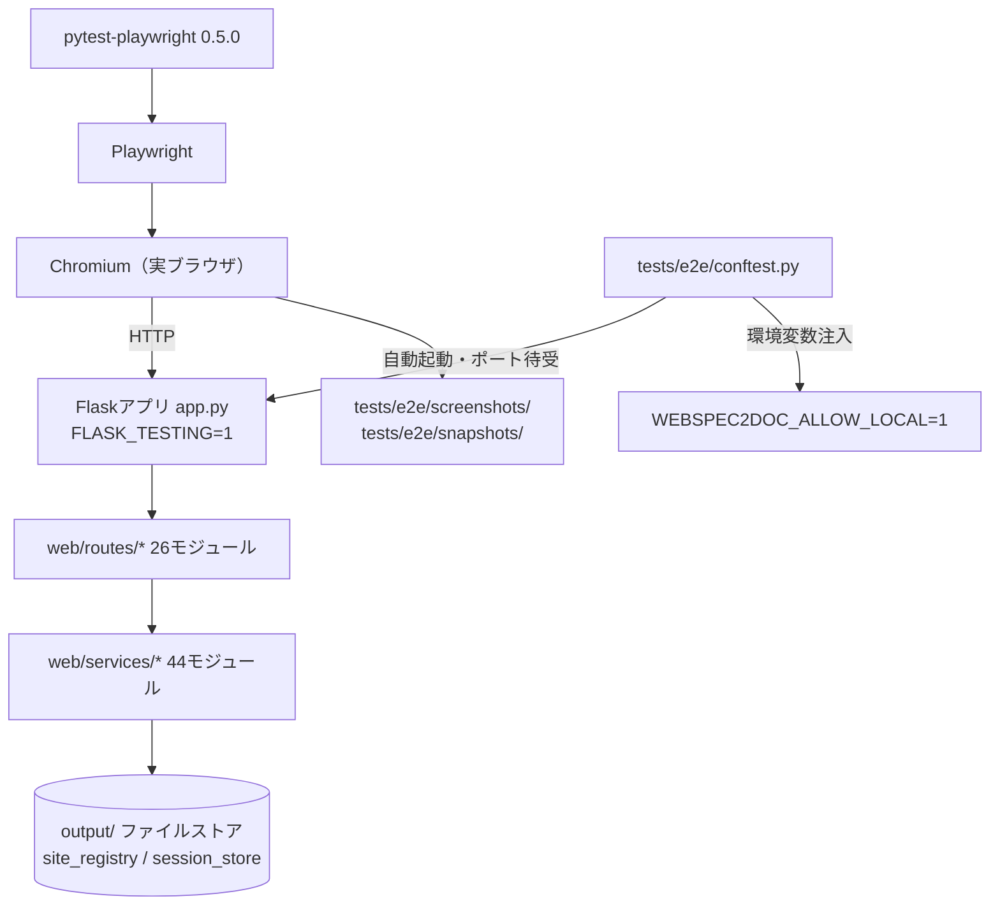

# WS2D-ST-001 システムテスト仕様兼結果報告書（L3）

- 版数: 3.0 / 作成日: 2026-08-02（前版 2.0 / 2026-08-02、初版 1.0 / 2026-07-16）
- 準拠: ISO/IEC/IEEE 29119（Software Testing）/ ISTQB Foundation Level Syllabus v4.0
- 定義: 実ブラウザ（Playwright Chromium）による UI → API → backend → 出力 → 証跡の
  エンドツーエンド検証。`make verify-ui` で conftest がサーバを自動起動し実行する。
- 対象読者: 開発チーム、レビュアー、検収担当者。

## 0. 文書概要

本文書は WebSpec2Doc の L3（システムテスト／E2E）について、テスト仕様と実施結果を統合して報告する。
L1（`WS2D-UT-001`）・L2（`WS2D-IT-001`）が個別モジュール・結合経路を検証するのに対し、L3 は
実ブラウザを介して「ユーザーが実際に操作した通りに動くか」を検証する最終層である。

本文書は特に、**機能要件 51 件のうちどれが L3 で実際に検証されているか**を正直に棚卸しすることを
主眼とする（§6）。E2E テストが「存在する」ことと、個別の機能契約が「L3 レベルで検証されている」ことは
別命題であり、本改訂ではこの区別を明確にする。結論を先に述べると、**critical 機能 11 件のうち 9 件は
L3 での検証が確認できなかった**（§6.2）。これは実装が欠陥であることを意味しない（L1/L2 で検証されている
可能性がある）が、「L3 という最終防衛線を通過していない」という事実は正確に報告されるべきである。

関連文書: `docs/TESTING_STRATEGY.md`、`WS2D-UT-001`（L1）、`WS2D-IT-001`（L2）、`quality/feature_contracts.yml`。

L1（`WS2D-UT-001`）・L2（`WS2D-IT-001`）と本文書は独立した文書ではなく、同一のテストピラミッドを
異なる高さから見た報告である。ある機能が L3 で「なし」判定であっても、L1/L2 で厚く検証されていれば
機能そのものの品質リスクは限定的でありうる。逆に L1/L2 でも L3 でも確認できない機能があれば、それは
三層とも通過していない最も深刻なギャップである。この三層横断の突合（トレーサビリティマトリクスの整備）
は、`WS2D-UT-001` §10 でも「高リスク」として指摘されている未着手の課題であり、本文書単独では解決できない。

## 1. L3 の定義と範囲

| 項目 | 内容 |
|---|---|
| 対象 | 実ブラウザ（Chromium）を介した UI 操作、および UI から到達する API・backend・出力・証跡までの一気通貫の経路 |
| 対象外 | `src/`・`web/services/` 単体のロジック検証（L1/L2 の責務）、実サイト（顧客サイト）に対するテスト生成物そのものの是非（製品ポリシーのスコープ外、`docs/TEST_LEVEL_POLICY.md`） |
| ツール | pytest-playwright 0.5.0 / Chromium |
| 実行コマンド | `make verify-ui` |
| 実行タイミング | HTML/JS/CSS ファイルを変更した全コミット前（`.githooks/pre-commit` により強制） |

### 1.1 システムテストの実行環境構成図



**図の説明**: `make verify-ui` を実行すると、`tests/e2e/conftest.py` が `FLASK_TESTING=1` を設定した
状態でアプリを自動起動し、`WEBSPEC2DOC_ALLOW_LOCAL=1` を注入したうえで Playwright が Chromium を
起動して HTTP でアクセスする。アプリ内部の経路（route→service→ファイルストア）は L2 と共通の実装コードを
通過するが、L3 では「実ブラウザが実際に描画・操作する」という層が追加される点が L1/L2 との本質的な違いである。
失敗時は `tests/e2e/screenshots/` に自動保存され、ビジュアル回帰は `tests/e2e/snapshots/` を基準線とする。

## 2. 実行環境

| 項目 | 内容 |
|---|---|
| ツール | pytest-playwright 0.5.0 / Chromium |
| 実行コマンド | `make verify-ui` |
| 主要環境変数 | `WEBSPEC2DOC_ALLOW_LOCAL=1`（ローカル/プライベート URL へのアクセスを許可）、`FLASK_TESTING=1`（`app.py` 起動時に `webbrowser.open` を抑止し、テスト実行のたびにユーザーのブラウザタブが増えるのを防止） |
| 解像度 | 1280×800（デフォルト）、1366×768、1920×1080（`test_ui_smoke_e2e.py` 等で拡張チェック） |
| 実行タイミング | HTML/JS/CSS ファイルを変更した全コミット前（`.githooks/pre-commit` により強制） |
| 証跡 | `tests/e2e/screenshots/`（失敗時自動保存）、`tests/e2e/snapshots/`（ビジュアル回帰の基準線） |
| conftest 構成 | `tests/e2e/conftest.py` がアプリ自動起動・ポート割当・環境変数注入・セッション確立（ログイン相当のセットアップ）を一括して担う共通フィクスチャ群を提供 |
| quarantine 機構 | `tests/e2e/conftest.py` に残置（将来 flaky 用の枠）。2026-07-16 時点で登録 0 件。本改訂では再確認していない（**再確認未実施**） |

`tests/e2e/conftest.py` に存在する session/401 関連の記述は、**テストの前提条件を成立させるためのログイン
処理**であり、その401/セッション確立ロジック自体をテスト対象として検証しているわけではない。この区別は
§6 のカバレッジ分析に直結する重要な注意点である（「テストの中でログインしている」と「ログインをテストして
いる」は別の命題）。

## 3. E2E シナリオ一覧（20 ファイル全件）

| # | ファイル | 関数数 | 検証している業務シナリオ | 関連機能 ID（推定） |
|---|---|---|---|---|
| 1 | `test_api_docs_e2e.py` | 1 | API ドキュメントページの表示 | `api_v1_openapi` |
| 2 | `test_auth_recorder_e2e.py` | 2 | **クロール対象サイトへの認証フローレコーダー**（本システムへのログイン認証ではない点に注意） | （本システムの機能契約には非該当。クロール補助機能） |
| 3 | `test_autorun_decisions_e2e.py` | 8 | AutoRun 段階承認における意思決定 UI の操作性 | `autorun_stage_approval`（UI 操作性のみ、§6 参照） |
| 4 | `test_autorun_state_matrix_e2e.py` | 7 | AutoRun の状態×操作の網羅検証。`test_can_always_cancel`（どの状態でも中断できる）、`test_no_duplicate_buttons`（同一操作を二重表示しない）、`test_intake_form_is_hidden_while_running` 等 | `autorun`（UI 状態機械のみ） |
| 5 | `test_broken_views_e2e.py` | 3 | 壊れたビュー（存在しない画面・不正パラメータ）の検出 | （横断的、特定の feature_id に一意対応しない） |
| 6 | `test_capture_realbrowser_e2e.py` | 1 | 実ブラウザでの操作記録がカバレッジヒートマップの分子に反映されること | `exploration_capture` |
| 7 | `test_comparison_e2e.py` | 2 | 現新比較モードの表示 | `old_new_comparison`（`diff_history` の一部） |
| 8 | `test_crawler_realbrowser_e2e.py` | 4 | 実ブラウザでのクロール動作 | `crawl` |
| 9 | `test_frames_shadow_e2e.py` | 6 | iframe/shadow DOM 対応。同一オリジン iframe のリンク・見出し統合、shadow DOM 内フォームの evidence 付与、closed shadow root の記録 | `crawl`（探索の堅牢性） |
| 10 | `test_info_tip_e2e.py` | 1 | 情報チップのキーボードフォーカス操作性 | （UI アクセシビリティ、横断的） |
| 11 | `test_markdown_preview_e2e.py` | 1 | Markdown プレビュー表示 | （`doc_fusion` の周辺 UI。機能契約本体は未検証） |
| 12 | `test_report_tabs_e2e.py` | 6 | レポートタブ。JS エラー非発生、900px 幅での技法タブ視認性、条件からのケース絞り込みと解除 | `testcase_table` / `condition_to_testcase_link`（部分） |
| 13 | `test_stale_state_e2e.py` | 5 | 画面離脱後の古い状態除去。進捗カード・ログイン案内が離脱後に消える | （UI 状態管理、横断的） |
| 14 | `test_ui_smoke_e2e.py` | 4 | UI スモーク。JS エラー非発生、1920×1080/1366×768 でのレイアウト | `multi_viewport`（部分） |
| 15 | `test_user_guide_scroll_e2e.py` | 1 | ユーザーガイドのスクロール動作 | （UI 詳細、feature_id 非対応） |
| 16 | `test_ux_review_e2e.py` | 2 | axe-core による UX レビュー。既知の違反検出、外部ネットワークなしでの完走 | `ux_review` |
| 17 | `test_viewpoint_management_e2e.py` | 2 | 観点管理画面の操作 | （観点関連機能の周辺 UI） |
| 18 | `test_visual_complexity_e2e.py` | 3 | UI 視覚的複雑性の実測・回帰検知 | `ui_visual_complexity` |
| 19 | `test_visual_regression_e2e.py` | 2 | ビジュアル回帰（スクリーンショット差分） | （横断的、回帰検知の基盤） |
| 20 | `test_xss_regression_e2e.py` | 1 | XSS 回帰防止（本システム UI の一般的な XSS 対策） | （`autorun_security_kernel` とは別物。§6 参照） |

> **ファイル数の変遷について**: 前版（2.0）は 2026-07-16 時点との比較で「32→20」への減少を記録しているが、
> 個別の統合理由は前版時点でも未調査であり、本改訂でも追加調査は行っていない（**未調査のまま**）。

### 3.1 E2E シナリオのカバー範囲図

```mermaid
graph LR
    A["ログイン / 認証"]:::none --> B["サイト登録 / URL解析"]:::partial
    B --> C["クロール実行"]:::covered
    C --> D["レポート生成 / 表示"]:::covered
    D --> E["QA観点 / AutoRun段階承認"]:::partial
    E --> F["比較 / 履歴"]:::partial
    F --> G["テナント切替 / 管理"]:::none

    classDef covered fill:#c8e6c9,stroke:#2e7d32,color:#1b5e20
    classDef partial fill:#fff9c4,stroke:#f9a825,color:#e65100
    classDef none fill:#ffcdd2,stroke:#c62828,color:#b71c1c
```



**図の説明**: 典型的な業務フロー（ログイン→サイト登録→クロール→レポート→QA/AutoRun→比較→テナント管理）
に沿って、E2E のカバー状況を 3 段階で色分けした。緑（クロール実行・レポート生成）は実ブラウザでの
直接検証があり、黄（サイト登録・AutoRun 段階承認・比較/履歴）は UI 操作性の検証はあるが機能契約の
中核までは届いていない、赤（ログイン/認証・テナント切替）は E2E ファイルが 1 件も存在しない領域である。
この図は §6 の 51 機能分析を業務フロー単位に要約したものであり、詳細な根拠は §6 の表を参照すること。

### 3.2 代表的なテスト関数例（関数名レベルで実測）

§3 のシナリオ一覧を関数名レベルまで掘り下げた実例を、本改訂で `grep -nE "def test_"` により
4 ファイル分実測した。

| ファイル | 関数名（実測） |
|---|---|
| `test_frames_shadow_e2e.py` | `test_iframe_links_and_headings_merged`、`test_same_origin_iframe_recorded_as_readable`、`test_shadow_form_field_has_evidence`、`test_shadow_modal_state_detected`、`test_closed_shadow_reported_as_unreadable`、`test_dashboard_still_detects_modal_without_regression` |
| `test_report_tabs_e2e.py` | `test_no_javascript_errors_on_report`、`test_all_design_subtabs_visible_at_900px`、`test_export_dropdown_closes_on_escape`、`test_condition_opens_filtered_cases_and_can_be_cleared`、`test_link_is_reachable_by_keyboard`、`test_own_filtering_removes_the_condition_banner` |
| `test_stale_state_e2e.py` | `test_progress_card_is_gone_after_leaving`、`test_login_card_is_gone_after_new_analysis`、`test_completed_results_survive_leaving`、`test_show_results_moves_to_its_own_view`、`test_panel_is_hidden_on_unrelated_views` |
| `test_ui_smoke_e2e.py` | `test_no_javascript_errors_on_load`、`test_layout_at_1920x1080`、`test_layout_at_1366x768`、`test_no_horizontal_scroll_at_1366` |

`test_stale_state_e2e.py` の `test_login_card_is_gone_after_new_analysis` という関数名は、ログイン
「案内カード」という UI 要素の表示/非表示を扱っているに過ぎず、ログイン認証機能そのもの
（`account_auth`）を検証しているわけではない。関数名に「login」を含むテストが存在することと、
`login`/`account_auth` 機能契約が L3 で検証されていることは別命題である点に注意する
（§6 のカバレッジ分析で「login」が「なし」と判定される理由でもある）。

## 4. 非機能面のシステムテスト（実施/未実施を明確に区別）

| 種別 | 状態 | 詳細 |
|---|---|---|
| 性能テスト | **未実施** | `docs/TESTING_STRATEGY.md` §3 が「性能テスト: 現状対象外（将来拡張）」と明記。ただし製品機能としての性能計測ロジック自体（LCP/CLS/TTFB 収集）は `src/crawler/performance_probe.py` を L1（`test_performance_probe.py`）・`test_perf_budgets.py` で検証しており、**「本製品自身の性能をシステムテストする」ことと「性能を計測する機能を単体テストする」ことは別物**である点に注意 |
| セキュリティテスト | **一部実施** | L2 で認証・入力処理変更時に実施（`docs/TESTING_STRATEGY.md` §3）。L3 では `test_xss_regression_e2e.py` が本システム UI の XSS 回帰を検証。ただし §6 のとおり `autorun_security_kernel`（送信ゲートウェイ・非信頼コンテンツ境界という契約そのもの）は L3 未検証。OWASP ZAP 等の専用ツールによる脆弱性スキャン・ペネトレーションテストは**未実施** |
| 可用性テスト | **未実施** | 負荷試験・障害注入・カオスエンジニアリング等の系統的な可用性システムテストは確認できなかった。ビジュアル回帰・quarantine 機構は存在するが、可用性（耐障害性・復旧性）の検証には該当しない |
| ユーザビリティ | 一部実施 | `docs/TESTING_STRATEGY.md` §3「ユーザビリティ: 一部（L3）」。axe-core によるアクセシビリティ検証（`test_ux_review_e2e.py`）、レイアウト崩れ検証（`test_ui_smoke_e2e.py`）、視覚的複雑性（`test_visual_complexity_e2e.py`）が該当 |
| 回帰テスト | 実施 | `test_visual_regression_e2e.py`、`test_xss_regression_e2e.py`、`test_stale_state_e2e.py` 等で明示的に実施 |
| 互換性テスト（マルチビューポート） | 部分実施 | `test_ui_smoke_e2e.py` が 1920×1080/1366×768 を検証。モバイル/タブレット幅は対象外（製品方針として PC 専用、対応不要） |

**非機能テストが薄い理由の整理**: WebSpec2Doc は「PC 専用・ローカル/小規模利用」を前提とした製品方針
（`constraint-pc-only` 相当の方針）を取っており、大規模同時アクセスを想定した可用性・負荷試験への投資
優先度が意図的に低い。これは手抜きではなく方針判断であるが、**AutoRun 経由の長時間クロールジョブ**が
実行中にメモリ・ディスクを圧迫するケースについては、可用性テストが「未実施」である以上、本番相当の
長時間実行での挙動は本文書のスコープでは保証できない。性能・可用性を「対象外」とする製品方針そのものの
妥当性は本文書の検証範囲外であるが、方針が変わった場合に本章がまず更新対象になる。

## 5. 実施結果（実測: 2026-08-02、本改訂で再測定）

| 指標 | 値 | 取得コマンド |
|---|---|---|
| E2E テストファイル数 | **20** | `find tests -name "test_*.py" -path "*/e2e/*" \| wc -l` |
| E2E `def test_` 静的定義数 | **62**（20 ファイル合算） | `grep -rhE '^\s*def test_' tests/e2e/ \| wc -l` |
| 動的 PASS 件数（`make verify-ui`） | **未実行**（本改訂ではタスク制約によりフル実行を回避） | 参考値: 旧 `WS2D-ST-001`（2026-07-16）「200 passed / 0 skipped」。**ただし当時は E2E ファイルが 32 本構成であり、現在の 20 本構成とは異なる。旧値は現構成を反映しない参考値**として扱うこと |
| account_auth/tenant_membership/tenant_isolation/autorun_stage_approval/autorun_security_kernel の 5 キーワードを含む E2E ファイル数 | **0**（本改訂で実測確認） | `grep -liE "account_auth\|tenant_membership\|tenant_isolation\|autorun_stage_approval\|autorun_security_kernel" tests/e2e/*.py` |
| `tenant`/`membership` の緩い一致を含む E2E ファイル数 | **0**（本改訂で実測確認） | `grep -liE "tenant\|membership" tests/e2e/*.py` |

## 6. 機能要件 51 件に対する L3 カバレッジ分析

`quality/feature_contracts.yml` の全 51 機能について、§3 の E2E 一覧との対応関係を棚卸しした。
判定は 3 段階（**済**＝機能契約の中核をE2Eが直接検証／**部分**＝関連 UI は検証されているが契約の中核までは
届いていない／**なし**＝対応する E2E が確認できない）とする。

### 6.1 全件一覧

| # | risk | feature_id | 機能名 | L3 状況 | 根拠 |
|---|---|---|---|---|---|
| 1 | critical | discover | URL解析 / 画面発見 | なし | 該当 E2E なし。`test_crawler_realbrowser_e2e.py` は探索の実行系を検証するが、discover 固有のウィザード UI は対象外 |
| 2 | critical | crawl | クロール / レポート生成 | 済 | `test_crawler_realbrowser_e2e.py`（4）が実ブラウザでのクロールを直接検証 |
| 3 | critical | login | ログイン / セッション | なし | 該当 E2E なし。`test_auth_recorder_e2e.py` はクロール対象サイトの認証記録であり別機能（冒頭確定事実） |
| 4 | critical | account_auth | アプリ利用者認証 | なし | 同上。`grep` で account_auth 文字列を含む e2e ファイル 0 件（実測） |
| 5 | critical | tenant_membership | テナント選択と所属管理 | なし | `tenant`/`membership` を含む e2e ファイル 0 件（実測） |
| 6 | critical | tenant_isolation | テナント分離 | なし | 同上 |
| 7 | critical | diff_history | 差分 / 履歴 / 再クロール | 部分 | `test_comparison_e2e.py`（2）は現新比較のみ。履歴・再クロールは未検証 |
| 8 | critical | document_mbt | 文書駆動 MBT | なし | 該当 E2E なし（L1 の `test_document_mbt.py` 系で検証） |
| 9 | critical | sso_oidc | SSO（OIDC）とAPIトークンスコープ | なし | 該当 E2E なし。oidc 文字列を含む e2e ファイル 0 件（実測） |
| 10 | critical | autorun_stage_approval | AutoRun 段階承認パイプライン | なし | `test_autorun_decisions_e2e.py`（8）・`test_autorun_state_matrix_e2e.py`（7）はUI操作性（キャンセル可否・重複表示防止）を検証するが、「承認なしに次段階へ進めない」という契約自体は未検証 |
| 11 | critical | autorun_security_kernel | AutoRun セキュリティカーネル | なし | 該当 E2E なし。`test_xss_regression_e2e.py` は本体 UI の一般的な XSS 回帰であり、送信ゲートウェイ（egress_gateway）の契約とは別物 |
| 12 | high | autorun | AutoRun（総称） | 部分 | 上記 2 ファイルが UI 状態機械のレベルで検証 |
| 13 | high | settings | 設定 | なし | 該当 E2E なし |
| 14 | high | doc_fusion | 文書×実測突合 | なし | `test_markdown_preview_e2e.py` は周辺 UI（プレビュー表示）のみで契約本体は未検証 |
| 15 | high | exploration_capture | 探索セッション記録/カバレッジヒートマップ | 済 | `test_capture_realbrowser_e2e.py`（1）が直接検証 |
| 16 | high | old_new_comparison | 現新比較モード | 済 | `test_comparison_e2e.py`（2） |
| 17 | high | snapshot_retention | スナップショット保持・運用 | なし | 該当 E2E なし |
| 18 | high | admin_audit | 管理操作のテナント監査ログ | なし | 該当 E2E なし |
| 19 | high | ci_drift_monitor | Drift Check as Code | なし | CI 組み込み機能のため E2E というより CI ジョブでの検証が本来領域。該当 E2E なし |
| 20 | high | evidence_pack | 検収・監査向け証跡パック | なし | `test_capture_realbrowser_e2e.py` が証跡付与に部分的に触れるが機能契約本体は未検証 |
| 21 | high | diff_severity | 差分の重要度判定 | なし | 該当 E2E なし（L1/L2 中心） |
| 22 | high | api_v1_openapi | REST API と OpenAPI 公開 | 済 | `test_api_docs_e2e.py`（1） |
| 23 | high | autorun_result_report | AutoRun 実行結果レポート専用ページ | なし | 専用 E2E なし。関連 UI（decisions/state_matrix）はあるが結果レポート専用ページの検証ではない |
| 24 | high | autorun_self_check | AutoRun 自己検証（ミューテーションテスト） | なし | 該当 E2E なし（L1 中心） |
| 25 | high | autorun_nonfunctional_judge | AutoRun 非機能判定 | なし | 該当 E2E なし |
| 26 | high | autorun_failure_triage | AutoRun 失敗の原因特定 | なし | 該当 E2E なし |
| 27 | high | technique_engine | テスト技法エンジン | なし | 該当 E2E なし（L1 で厚く検証、L3 対象外の設計） |
| 28 | high | autorun_extended_techniques | テスト技法の網羅的適用 | なし | 同上 |
| 29 | high | state_transition_table | 状態遷移表 | なし | 該当 E2E なし（L1 中心） |
| 30 | high | testcase_table | ローレベルテストケース表 | 部分 | `test_report_tabs_e2e.py`（6）がケース絞り込み UI を検証 |
| 31 | high | cli_mode | CLI モード | なし（対象外） | CLI は非ブラウザ経路のため Playwright L3 の適用対象外。L1 の `test_cli_mode.py` が担当 |
| 32 | medium | usage_roi | ROI ダッシュボード | なし | 該当 E2E なし |
| 33 | medium | coverage_gap_report | カバレッジと未確認領域 | 部分 | `test_capture_realbrowser_e2e.py` のカバレッジヒートマップ関連機能が部分的に重なる |
| 34 | medium | reverse_assets | 記録セッション→テスト資産の逆生成 | なし | 該当 E2E なし |
| 35 | medium | field_definition_bva | 項目定義書＋BVA自動生成 | なし | 該当 E2E なし（L1 中心） |
| 36 | medium | finding_ticket | 気づきマーク→バグ票 | なし | 該当 E2E なし |
| 37 | medium | test_plan | テスト計画ドラフト生成 | なし | 該当 E2E なし |
| 38 | medium | ux_review | UX自動エキスパートレビュー | 済 | `test_ux_review_e2e.py`（2） |
| 39 | medium | multi_viewport | マルチビューポート仕様書 | 部分 | `test_ui_smoke_e2e.py` が 2 解像度を検証するが「仕様書生成」機能自体は未検証 |
| 40 | medium | observability | 可観測性 | なし | 該当 E2E なし |
| 41 | medium | api_spec_recovery | API仕様の逆生成 | なし | 該当 E2E なし |
| 42 | medium | screen_coverage_map | 画面カバレッジマップ | 部分 | capture_realbrowser 関連機能と部分的に重なる |
| 43 | medium | full_archive | 完全アーカイブと外形監視 | なし | 該当 E2E なし |
| 44 | medium | qa_assistant_chat | QAアシスタント（LLMチャット） | なし | 該当 E2E なし |
| 45 | medium | ui_visual_complexity | UI視覚的複雑性 | 済 | `test_visual_complexity_e2e.py`（3） |
| 46 | medium | zero_wait_sample_report | ゼロ待ちサンプルレポート | なし | 該当 E2E なし |
| 47 | medium | spec_xlsx_full_export | テスト仕様書一式のExcel出力 | なし | 該当 E2E なし |
| 48 | medium | condition_to_testcase_link | 条件⇄テストケース接続 | 部分 | `test_report_tabs_e2e.py` の条件絞り込み UI が部分的に重なる |
| 49 | medium | condition_run_status | テスト実行結果の設計への還元 | なし | 該当 E2E なし |
| 50 | low | ci_warnings_cleanup | CI警告一掃 | 対象外 | UI を持たないコード品質項目のため L3 の適用対象外 |
| 51 | low | wording_consistency | 文言一貫性・表記ゆれチェック | なし | 該当 E2E なし |

上表 51 行は `quality/feature_contracts.yml` の重複のない 51 件（critical 11 / high 20 / medium 18 / low 2）と過不足なく一致する。

### 6.2 集計とリスク

| risk_level | 件数 | 済 | 部分 | なし/対象外 |
|---|---|---|---|---|
| critical | 11 | 1 | 1 | 9 |
| high | 20 | 3 | 2 | 15 |
| medium | 18 | 2 | 4 | 12 |
| low | 2 | 0 | 0 | 2 |
| **合計** | **51** | **6** | **7** | **38** |

**最重要リスク**: critical 機能 11 件のうち **9 件（約 82%）が L3 で検証されていない**。特に
`account_auth`（アプリ利用者認証）・`tenant_membership`（テナント所属管理）・`tenant_isolation`
（テナント分離）・`autorun_stage_approval`（AutoRun 段階承認）・`autorun_security_kernel`（AutoRun
セキュリティカーネル）の 5 件は、E2E ファイル名・内容のいずれにも関連する検証が確認できなかった
（`grep` による実測、§5）。これは「認証・マルチテナント・AutoRun のガードレール」という、事故が起きた
際の影響が最も大きい領域が、実ブラウザでの最終確認を経ずに本番相当の判断（`docs/sdlc/README.md` 等の
出口基準判定）に使われている可能性を意味する。L1/L2 で個別ロジックが検証されていたとしても、
「ブラウザ上で実際にログインを試み、テナントを切り替え、権限外操作が拒否されることを目視相当で確認する」
というレイヤーの試験が存在しないことは、そのまま報告されるべきリスクである。

### 6.3 判定方法の限界

§6.1 の 済/部分/なし 判定は、次の手順で行った。

1. `quality/feature_contracts.yml` の `feature_id`・`name` を機械的に取得（§5 の python 抽出）
2. `tests/e2e/` 20 ファイルのファイル名・既存文書に記録された検証内容の要約（前版で docstring 等から
   起こしたもの）とキーワードで突き合わせ
3. `account_auth`/`tenant_membership`/`tenant_isolation`/`autorun_stage_approval`/
   `autorun_security_kernel`/`tenant`/`membership`/`oidc` の各文字列については、本改訂で
   `grep -liE` により全 20 ファイルへの実在確認を実施（§5 参照）
4. §3.2 で 4 ファイルのみ関数名レベルまで実測

**限界**: 手順 2 はキーワード一致に基づく判断であり、62 関数全件のテスト本文（`page.click` 等の
実際の操作対象）まで読み込んで判定したものではない。したがって「部分」判定の一部は、実際にはより
狭い（あるいはより広い）検証範囲である可能性がある。一方、手順 3 で実施した 8 キーワードの
`grep` 実測は全 20 ファイルの全文を対象としており、**「なし」と判定した critical 5 機能
（account_auth・tenant_membership・tenant_isolation・autorun_stage_approval・autorun_security_kernel）
についてはファイル内容の直接確認を伴う高い確度の判定**である。この非対称性（一部は高確度、一部は
キーワード一致ベース）を隠さず記載することが、本改訂の「捏造しない」という制約への対応である。

## 7. 過去の実行結果（参考値）

| 指標 | 値 | 出典 |
|---|---|---|
| E2E PASS 件数 | 200 passed / 0 skipped | `WS2D-ST-001` 旧版（計測日 2026-07-16、**参考値**。当時 E2E ファイル 32 本構成で現構成と異なる） |
| L1/L2 PASS 件数 | 1,831 passed | `docs/sdlc/README.md`（計測日 2026-07-16、**参考値**。現構成（213 ファイル/3,026 関数）を反映していない） |
| カバレッジ | 84.30% | 同上（**参考値**、再計測未実施） |

上表 3 指標はいずれも 2026-07-16 時点のものであり、本改訂時点のファイル構成（E2E 20 本、非 E2E 193 本）とは
一致しない。参考値を経営層向け報告等に転記する際は、必ず計測日と当時のファイル構成を併記し、
現状値であるかのような誤解を避けること。

## 8. 残存リスクと推奨する追加テスト

| 優先度 | 推奨する追加テスト | 対応する feature_id | 理由 |
|---|---|---|---|
| P1 | 本システムへのログイン→保護 route 到達→ログアウトのハッピーパス E2E | `login`, `account_auth` | critical かつ現状 L3 ゼロ。全機能の入り口であり、UI 経路での回帰が最も検出しにくい箇所 |
| P1 | テナント選択→切替→cross-tenant アクセス拒否の E2E | `tenant_membership`, `tenant_isolation` | critical。L2（`test_mock_auth_tenancy.py`）で論理は検証済みだが、実ブラウザでの画面遷移込みの確認がない |
| P1 | AutoRun 段階承認の「承認なしに次段階へ進めないこと」を明示的に検証する E2E | `autorun_stage_approval` | 現状の 2 ファイルは UI 操作性のみで契約自体が未検証。段階承認は本製品の中核機能であるため優先度を最上位とする |
| P1 | AutoRun 送信ゲートウェイ（`egress_gateway`）が非信頼コンテンツを実際に遮断することを確認する E2E | `autorun_security_kernel` | セキュリティ上の防御機構が実行時に機能するかは L1 のロジック検証だけでは不十分 |
| P2 | 最低 1 プロバイダでの SSO/OIDC ログイン E2E | `sso_oidc` | critical。L2（`test_oidc.py`）は設定検証が中心で、実ブラウザでのリダイレクトフローは未確認 |
| P2 | 現新比較に加えて履歴一覧・再クロールの E2E | `diff_history` | 部分カバーの機能を「済」に引き上げる |
| P2 | discover（URL入力→画面候補提示）のウィザード UI の E2E | `discover` | critical だが専用 E2E がない。ユーザーが最初に触れる画面であり離脱率に直結する |
| P3 | 性能テスト（LCP/CLS/TTFB のシステムレベル基準値との比較） | （非機能） | §4 のとおり現状「対象外」。方針として妥当だが、AutoRun 経由の長時間クロールで劣化が起きた場合の検知手段がない |
| P3 | OWASP ZAP 等によるペネトレーションテスト | （非機能） | §4 のとおり未実施。特に `autorun_security_kernel` の防御をブラックボックスで裏付ける手段として有効 |
| P3 | E2E ファイル数変遷（32→20）の統合理由の調査・記録 | （文書品質） | 現状「未調査」のまま 2 版続けて繰り越されている。次回改訂までに一次情報（PR 履歴等）を確認し記録することを推奨 |

上表は本改訂で新たに実施した §6 のカバレッジ分析から直接導出した。P1 の 4 項目はすべて critical 機能かつ
現状「なし」判定のものであり、次回のテスト追加投資はここに集中させることを推奨する。

**優先度の決定基準**: P1 は「`risk_level: critical` かつ §6.1 判定が『なし』」の積集合、P2 は
「`risk_level: critical` かつ判定が『部分』、または `risk_level: high` で重大な業務影響があるもの」、
P3 は「非機能領域、または文書品質に関する申し送り事項」とした。この基準自体は本改訂で新たに定義した
ものであり、`docs/TESTING_STRATEGY.md` に明文化された正式な優先度基準ではない（**運用ルールとしての
正式化は未実施**）。次回改訂以降、本基準を `docs/TESTING_STRATEGY.md` 側に昇格させ、テスト戦略文書と
本報告書の間で優先度判断の一貫性を保つことを推奨する。

## 9. 再現方法

```bash
find tests -name "test_*.py" -path "*/e2e/*" | wc -l   # 20
grep -rhE '^\s*def test_' tests/e2e/ | wc -l             # 62
grep -liE "account_auth|tenant_membership|tenant_isolation|autorun_stage_approval|autorun_security_kernel" tests/e2e/*.py   # 0件（該当なし）
grep -liE "tenant|membership" tests/e2e/*.py             # 0件（該当なし）
make verify-ui   # 本改訂ではフル実行していない（未実行）。実行時は .ui-verified マーカーを生成
```

## 10. 改訂履歴

| 版 | 日付 | 内容 | 作成者 |
|---|---|---|---|
| 1.0 | 2026-07-16 | 初版 | 開発チーム |
| 2.0 | 2026-08-02 | シナリオ一覧を全 20 ファイル分に更新、非機能面（性能・セキュリティ・可用性）の実施/未実施を明確化、E2E ファイル数の変化（32→20）を検出し明記（原因は未調査） | 開発チーム |
| 3.0 | 2026-08-02 | 大手 SIer 納品水準へ拡充。mermaid 図 2 点（実行環境構成図・E2Eカバー範囲図）を追加、機能要件 51 件全件に対する L3 カバレッジ分析を新設し critical 9/11 件が L3 未検証であることを明記、残存リスクと優先度付き追加テスト提案（P1〜P3）を新設、非機能テストの記述を拡充 | 開発チーム |
