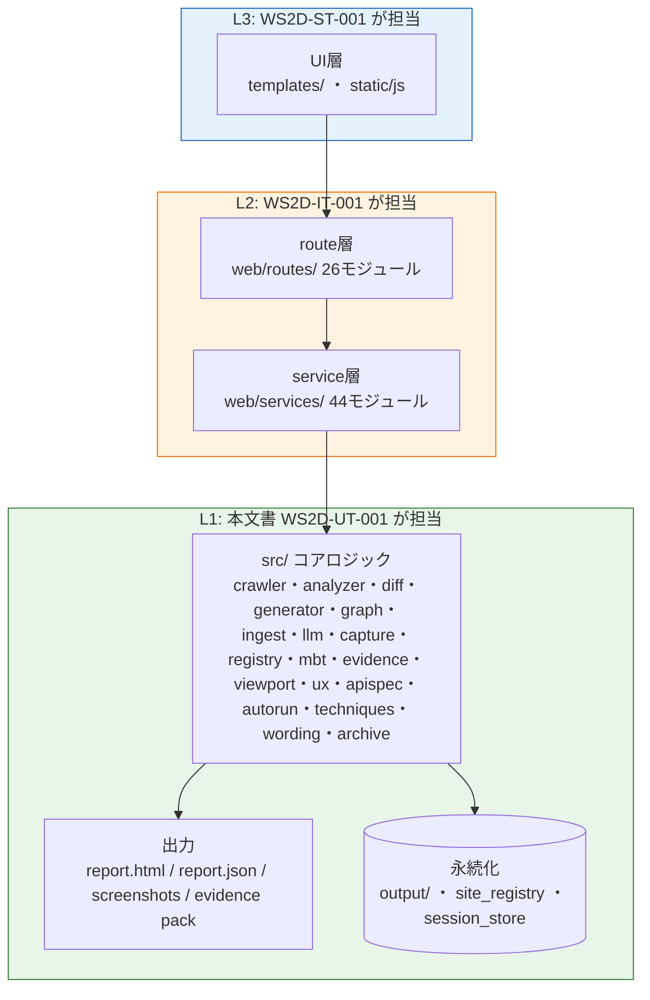
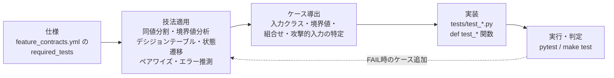

# WS2D-UT-001 単体テスト仕様兼結果報告書（L1）

- 版数: 3.0 / 作成日: 2026-08-02（前版 2.0 / 2026-08-02、初版 1.0 / 2026-07-16）
- 準拠: ISO/IEC/IEEE 29119（Software Testing）/ ISTQB Foundation Level Syllabus v4.0
- 定義: L1 コンポーネントテスト。`src/` のドメイン中核ロジック（Flask 非依存）を関数・クラス粒度で検証する。
  Flask ルート経由の HTTP レベル結合は L2（`WS2D-IT-001`）、実ブラウザ E2E は L3（`WS2D-ST-001`）で扱う。
- 対象読者: 開発チーム、レビュアー、検収担当者。本文書単体で L1 テストの範囲・方法・実測結果・残存リスクを判断できることを目標とする。

> **本文書の対象は「WebSpec2Doc を開発するチームが自社コードに書く単体テスト」である。**
> `docs/TEST_LEVEL_POLICY.md` が定める「WebSpec2Doc は顧客の Web サイトに対して単体テストを作らない」という
> **製品ポリシー**（＝WebSpec2Doc が生成するテスト資産のスコープ宣言）とは階層が異なり、矛盾しない。
> 前者はプロダクト自身の品質保証プロセス、後者は成果物としてのテスト自動化サービスの守備範囲の話である。

## 0. 文書概要

本文書は WebSpec2Doc の L1（単体テスト）について、テスト仕様（何を・どの技法で検証するか）と
テスト結果報告（実測値・カバレッジ・未カバー領域）を 1 冊に統合したものである。ISO/IEC/IEEE 29119-3 の
テストケース仕様書と、同 29119-8 系のテスト完了報告の両方の要素を、開発チームが実際に参照・更新しやすいよう
単一の Markdown に統合している（分冊は保守コストが更新漏れを生みやすいという判断による）。

読者は本文書だけで次を判断できる。

1. 「単体テスト」という語が本プロジェクトで何を指すか（§1）
2. どのテスト技法をどの根拠で適用したか（§6）
3. 現時点で何件・何をカバーし、何をカバーしていないか（§9〜§11）
4. 次に何を追加検証すべきか（§11・§12）

関連文書: `docs/TESTING_STRATEGY.md`（全社的テスト戦略）、`docs/TEST_LEVEL_POLICY.md`（製品ポリシーとの階層整理）、
`quality/feature_contracts.yml`（機能契約・リスクレベルの正本）、`WS2D-IT-001`（L2）、`WS2D-ST-001`（L3）。

## 1. テストレベル定義と適用範囲

| 項目 | 内容 |
|---|---|
| 対象 | `src/` 配下の関数・クラス（crawler / analyzer / diff / generator / graph / ingest / llm / capture / registry / mbt / evidence / viewport / ux / apispec / autorun / techniques / wording / archive 等 18 サブパッケージ） |
| 対象外 | `web/routes/*`・`web/services/*`（L2 対象）、実ブラウザ操作（L3 対象）、`output/`（生成物）、`venv/` |
| ツール | pytest >= 8.0 |
| 実行コマンド | `make test`（L1・L2 共通コマンド。ファイル分類上のみ区別） |
| ゲート | `docs/TESTING_STRATEGY.md` §2: 1 件でも FAIL、またはカバレッジ 80% 未満でコミット不可（pre-commit hook） |
| スコープ判定基準 | Flask の `app` / `request` / `test_client` に依存せず、Python プロセス内で完結して呼び出せる関数・クラスであること |

### 1.1 テスト対象のレイヤと単体テストの範囲図



**図の説明**: WebSpec2Doc は UI → route → service → src コアロジック → 出力/永続化 という縦方向の層構造を持つ。
本文書（L1）が検証責任を負うのは緑色の枠（`src/` の 18 サブパッケージと、その出力・永続化への副作用）のみである。
route 層・service 層は `app.test_client()` を介した結合として `WS2D-IT-001`（L2、橙色）が担い、
ブラウザ操作を伴う UI 層は `WS2D-ST-001`（L3、青色）が担う。この 3 層分担は `docs/TESTING_STRATEGY.md` の
テストピラミッド方針（L1 を厚く・L3 を薄く保つ）と一致しており、実測（§9）でも非 E2E 193 ファイルに対し
E2E は 20 ファイルと、意図した比率になっている。

## 2. テスト方針

WebSpec2Doc の L1 テスト方針は次の 4 点を軸とする。

1. **リスクベースの重点配分**: `quality/feature_contracts.yml` の `risk_level`（critical / high / medium / low）に
   応じて、critical・high 機能の core_files を優先的に厚く検証する。本改訂時点で critical 11 件・high 20 件・
   medium 18 件・low 2 件（計 51 件）が定義されている（詳細は §11）。
2. **技法駆動のケース設計**: 思いつきでのテスト追加を避け、ISTQB Foundation Level が定義するブラックボックス
   技法（同値分割・境界値分析・デシジョンテーブル・状態遷移・ペアワイズ／n-way・エラー推測）を明示的に適用する
   （§6）。本製品自身がテスト技法エンジン（`src/techniques/`, `src/mbt/`）を実装しているため、
   「製品が技法を実装しているケース」と「テストコードが技法に沿って書かれているケース」が併存する点に注意する。
3. **Flask 非依存の純粋関数優先**: L1 対象は `app`/`request` に依存しない層に限定し、モックの必要性そのものを
   減らす設計を志向する（§7）。
4. **実行速度の維持**: L1+L2 合算で `make test` が実用的な時間で完了することを開発体験上の制約とする
   （フル実行時間の目標値は `docs/TESTING_STRATEGY.md` 参照。本改訂ではフル実行を行っていないため実測時間は
   **未計測**）。

### 2.1 テストケース設計の流れ



**図の説明**: `feature_contracts.yml` の `required_tests`（`happy_path` / `error_path` / `evidence` 等）を出発点に、
ISTQB 技法を適用してケースを導出し、`tests/test_*.py` に実装、`pytest` で実行する流れを示す。FAIL や
未カバー領域が見つかった場合は技法適用段階に戻ってケースを追加する反復であり、一度書いたら終わりという
ウォーターフォール的な運用ではない。本文書 §11 の「未カバー領域」はこのループが未完了の箇所の一覧でもある。

## 3. テスト環境

| 項目 | 内容 |
|---|---|
| 言語/バージョン | Python（`venv/` で管理。バージョンはリポジトリの `venv` 構成に従う） |
| テストフレームワーク | pytest >= 8.0、`pytest.mark.parametrize`（64 箇所で使用、§9） |
| 実行方式 | ローカル開発機での対話実行、および pre-commit hook（`.githooks/pre-commit`）経由の強制実行 |
| 依存の分離 | `venv/` 配下に隔離。プロジェクトルートの二重 venv 化は既知の落とし穴として運用ドキュメントに記録済み |
| フィクスチャ | `tests/fixtures/sample_site/`（クロール対象のサンプル静的サイト。実サイトへの外部アクセスを避けるため） |
| 一時出力 | テスト実行中の生成物は `tmp_path`（pytest 標準フィクスチャ）配下に隔離し、リポジトリを汚さない |
| CI | GitHub Actions（docs のみの変更は CI スキップ設定済み。§13 参照） |
| OS 前提 | 開発・CI とも macOS/Linux 想定。Windows 固有の経路分離は本文書のスコープ外 |

L1 は Flask アプリケーションコンテキストを必要としないため、`create_app()` や `test_client()` の起動コストが
かからず、L2 に比べて実行が高速である。この速度差が「L1 を厚く書く」という §2 の方針を実務的に支えている。

## 4. 対象モジュールと対応テストファイル

### 4.1 概要（src/ サブパッケージ単位の代表例）

`tests/` 配下のファイル名（`test_<module>.py` 慣例）と `quality/feature_contracts.yml` の
`core_files` を突き合わせ、`src/` サブパッケージ単位に機械的グルーピングした代表例を示す。全件対応表は §4.2。

| src/ サブパッケージ | 主な役割 | 対応テストファイル（代表・関数数） |
|---|---|---|
| `crawler/` | 解析・探索・礼儀制御・認証記録 | `test_crawler.py`(81)、`test_politeness.py`(27)、`test_link_extractor.py`(65)、`test_auto_login.py`(28)、`test_login_wall.py`、`test_login_signal.py`、`test_session_guard.py`、`test_network_interceptor.py`、`test_form_navigator.py`、`test_data_flow.py`、`test_performance_probe.py`、`test_url_safety.py`、`test_parallel_site_crawl.py`、`test_crawl_resilience.py`、`test_real_site_resilience.py` |
| `analyzer/` | 正規化・BVA・フォーム/HTML 解析 | `test_analyzer.py`(16)、`test_bva.py`(21)、`test_canonicalizer.py`、`test_stack_detector.py`、`test_screen_classifier.py`、`test_conditions.py`(29) |
| `diff/` | 比較・差分・影響分析 | `test_diff.py`、`test_diff_reporter.py`、`test_diff_severity.py`(16)、`test_diff_overlay.py`、`test_diff_ignore_rules.py`、`test_screenshot_diff.py`(27)、`test_screenshot_diff_ssim.py`、`test_pair_matcher.py`、`test_impact_analyzer.py`(20)、`test_link_checker.py` |
| `generator/` | 各種レポート・仕様書生成 | `test_generator.py`(27)、`test_architecture_generator.py`(12)、`test_csv_reporter.py`、`test_json_reporter.py`(23)、`test_html_reporter.py`(18)、`test_pdf_reporter.py`、`test_export_xlsx.py`(15)、`test_coverage_gap.py`(14)、`test_coverage_heatmap.py`、`test_coverage_map.py`(12)、`test_feature_catalog.py`、`test_test_design.py` |
| `graph/` | 遷移グラフ・状態遷移表 | `test_transition_graph.py`、`test_state_table.py`(22) |
| `ingest/` | Doc Fusion（文書×実測突合） | `test_doc_fusion.py`(25)、`test_gherkin_reader.py`(12)、`test_req_tracer.py`(13)、`test_rule_injector.py`(16)、`test_llm_extractor.py`(15) |
| `llm/` | LLM プロバイダ抽象・プロンプト安全 | `test_llm_provider.py`(10)、`test_llm_activity_log.py`、`test_llm_wiring.py`、`test_openai_qa_connection.py`、`test_prompt_guard.py`(14) |
| `capture/` | 探索記録・カバレッジ・逆生成 | `test_capture.py`(20)、`test_burndown.py`、`test_charter_proposal.py`、`test_reverse_generator.py`、`test_finding_reporter.py`、`test_state_exploration.py`(24) |
| `registry/` | サイト/セッション永続化 | `test_site_registry.py`、`test_session_store.py` |
| `mbt/` | 文書駆動 MBT・ペアワイズ・メタモルフィック | `test_document_mbt.py`(9)、`test_document_test_data.py`、`test_manual_procedures.py`、`test_validation_observer.py`、`test_pairwise.py`(9)、`test_metamorphic.py`、`test_trace_suggestions.py`、`test_prime_path.py` |
| `techniques/` | 被覆配列（t-way）正準実装 | `test_techniques.py`(20)、`test_techniques_combinatorial.py`(9)、`test_techniques_extended.py`(29)、`test_techniques_verify.py`(8) |
| `autorun/` | 段階承認・技法エンジン | `test_autorun_stages.py`(30)、`test_autorun_suggest.py`、`test_autorun_automation_plan.py`、`test_failure_hypothesis.py`(20) |
| `evidence/` | 証跡パック | `test_evidence_pack.py`(16)、`test_evidence.py`(22) |
| `apispec/` | API 仕様逆生成 | `test_apispec_recovery.py`(17) |
| `ux/` | axe-core / ヒューリスティック | `test_axe_runner.py`(10)、`test_ux_reporter.py`、`test_ux_claim_scope.py`、`test_ux_heuristics.py`、`test_usability_smells.py` |
| `archive/` | 完全アーカイブ・外形監視 | `test_archive.py`(16) |
| `cli.py` | CLI モード | `test_cli_mode.py`(23)、`test_main_cli.py`(36)、`test_main.py`(44) |
| 品質ハーネス自己検証 | `scripts/quality_harness.py` | `tests/smoke/test_quality_harness.py`(5) |

### 4.2 全件機械対応表（193 ファイル、自動マッチング）

以下は `find tests -name "test_*.py" ! -path "*/e2e/*"` の全出力（193 件）を、ファイル名の `test_` 接頭辞を
除去した文字列と `src/`・`web/` 配下の同名 `.py` ファイルとの完全一致で自動マッチングした結果である
（`grep -m1 "/<name>\.py$"` による末尾一致。生成コマンドは §13）。

**マッチング方針と限界**: 本表は機械的な同名一致のみを行っており、意味的な対応関係の判断は含まない。
実測では 193 件中 **107 件**が同名モジュールに自動一致し、**86 件**は一致しなかった
（`(自動対応なし・複合/横断テスト)` と表示）。不一致の主因は次の 3 パターンである。

1. **横断的なテスト**（例: `test_qa_process.py` は `web/services/qa/` サブパッケージや複数の service を横断して検証しており単一モジュールに対応しない）
2. **API/ルートレベルの契約テスト**（例: `test_api_v1.py`、`test_admin_routes.py` は L2 寄りの内容を含みつつ本リポジトリの分類上 `tests/` 直下に置かれている）
3. **命名規則が対応しないテスト**（例: `test_enterprise_meta.py` のように概念名がそのままモジュール名になっていないもの）

不一致＝未検証という意味ではない点に注意（§4.1 の代表例で実際の対応関係を個別に補足している）。

| test ファイル | 対応する src/・web モジュール（自動推定） | def test_ 関数数 |
|---|---|---|
| `tests/smoke/test_quality_harness.py` | `(自動対応なし・複合/横断テスト)` | 5 |
| `tests/test_a11y_extraction.py` | `(自動対応なし・複合/横断テスト)` | 6 |
| `tests/test_accessibility_reporter.py` | `src/generator/accessibility_reporter.py` | 2 |
| `tests/test_admin_audit.py` | `web/services/admin_audit.py` | 4 |
| `tests/test_admin_routes.py` | `(自動対応なし・複合/横断テスト)` | 12 |
| `tests/test_analyzer.py` | `(自動対応なし・複合/横断テスト)` | 16 |
| `tests/test_api_v1_schedule.py` | `web/routes/api_v1_schedule.py` | 13 |
| `tests/test_api_v1.py` | `web/routes/api_v1.py` | 28 |
| `tests/test_apispec_recovery.py` | `(自動対応なし・複合/横断テスト)` | 17 |
| `tests/test_app_account.py` | `(自動対応なし・複合/横断テスト)` | 19 |
| `tests/test_app_login.py` | `(自動対応なし・複合/横断テスト)` | 23 |
| `tests/test_app_site.py` | `(自動対応なし・複合/横断テスト)` | 5 |
| `tests/test_app_wizard.py` | `(自動対応なし・複合/横断テスト)` | 24 |
| `tests/test_architecture_generator.py` | `src/generator/architecture_generator.py` | 12 |
| `tests/test_archive.py` | `(自動対応なし・複合/横断テスト)` | 16 |
| `tests/test_auth_recorder.py` | `src/crawler/auth_recorder.py` | 9 |
| `tests/test_auth_store.py` | `web/services/auth_store.py` | 24 |
| `tests/test_auth.py` | `web/auth.py` | 5 |
| `tests/test_auto_login.py` | `src/crawler/auto_login.py` | 28 |
| `tests/test_auto_run_live_screenshot.py` | `(自動対応なし・複合/横断テスト)` | 5 |
| `tests/test_auto_run.py` | `web/routes/auto_run.py` | 53 |
| `tests/test_autorun_audit.py` | `(自動対応なし・複合/横断テスト)` | 12 |
| `tests/test_autorun_automation_plan.py` | `(自動対応なし・複合/横断テスト)` | 8 |
| `tests/test_autorun_gate_integration.py` | `(自動対応なし・複合/横断テスト)` | 14 |
| `tests/test_autorun_mutation_stage.py` | `(自動対応なし・複合/横断テスト)` | 6 |
| `tests/test_autorun_report.py` | `web/routes/autorun_report.py` | 18 |
| `tests/test_autorun_stages_api.py` | `(自動対応なし・複合/横断テスト)` | 24 |
| `tests/test_autorun_stages.py` | `web/routes/autorun_stages.py` | 30 |
| `tests/test_autorun_suggest.py` | `(自動対応なし・複合/横断テスト)` | 8 |
| `tests/test_axe_runner.py` | `src/ux/axe_runner.py` | 10 |
| `tests/test_burndown.py` | `src/capture/burndown.py` | 8 |
| `tests/test_bva.py` | `src/analyzer/bva.py` | 21 |
| `tests/test_canonicalizer.py` | `src/analyzer/canonicalizer.py` | 4 |
| `tests/test_capture.py` | `(自動対応なし・複合/横断テスト)` | 20 |
| `tests/test_charter_proposal.py` | `(自動対応なし・複合/横断テスト)` | 10 |
| `tests/test_ci_drift.py` | `src/ci_drift.py` | 8 |
| `tests/test_cli_mode.py` | `(自動対応なし・複合/横断テスト)` | 23 |
| `tests/test_comparison_reporter.py` | `src/generator/comparison_reporter.py` | 5 |
| `tests/test_comparison_workspace.py` | `web/services/comparison_workspace.py` | 15 |
| `tests/test_comparison.py` | `src/viewport/comparison.py` | 12 |
| `tests/test_condition_run_status.py` | `web/services/condition_run_status.py` | 16 |
| `tests/test_conditions.py` | `(自動対応なし・複合/横断テスト)` | 29 |
| `tests/test_coverage_gap.py` | `src/generator/coverage_gap.py` | 14 |
| `tests/test_coverage_heatmap.py` | `(自動対応なし・複合/横断テスト)` | 8 |
| `tests/test_coverage_map.py` | `src/apispec/coverage_map.py` | 12 |
| `tests/test_crawl_integration.py` | `(自動対応なし・複合/横断テスト)` | 4 |
| `tests/test_crawl_resilience.py` | `(自動対応なし・複合/横断テスト)` | 7 |
| `tests/test_crawler.py` | `(自動対応なし・複合/横断テスト)` | 81 |
| `tests/test_csv_reporter.py` | `src/generator/csv_reporter.py` | 16 |
| `tests/test_data_flow.py` | `src/crawler/data_flow.py` | 6 |
| `tests/test_demo_site.py` | `(自動対応なし・複合/横断テスト)` | 10 |
| `tests/test_dev_reload.py` | `(自動対応なし・複合/横断テスト)` | 5 |
| `tests/test_diff_ignore_rules.py` | `(自動対応なし・複合/横断テスト)` | 13 |
| `tests/test_diff_overlay.py` | `(自動対応なし・複合/横断テスト)` | 12 |
| `tests/test_diff_reporter.py` | `src/generator/diff_reporter.py` | 5 |
| `tests/test_diff_severity.py` | `(自動対応なし・複合/横断テスト)` | 16 |
| `tests/test_diff.py` | `(自動対応なし・複合/横断テスト)` | 15 |
| `tests/test_doc_fusion.py` | `(自動対応なし・複合/横断テスト)` | 25 |
| `tests/test_doc_generator.py` | `web/services/qa/doc_generator.py` | 3 |
| `tests/test_doctor.py` | `src/doctor.py` | 9 |
| `tests/test_document_auto_run.py` | `(自動対応なし・複合/横断テスト)` | 9 |
| `tests/test_document_mbt.py` | `(自動対応なし・複合/横断テスト)` | 9 |
| `tests/test_document_test_data.py` | `(自動対応なし・複合/横断テスト)` | 11 |
| `tests/test_enterprise_meta.py` | `(自動対応なし・複合/横断テスト)` | 7 |
| `tests/test_evidence_pack.py` | `(自動対応なし・複合/横断テスト)` | 16 |
| `tests/test_evidence.py` | `(自動対応なし・複合/横断テスト)` | 22 |
| `tests/test_export_xlsx.py` | `web/services/export_xlsx.py` | 15 |
| `tests/test_failure_classifier.py` | `web/services/failure_classifier.py` | 45 |
| `tests/test_failure_hypothesis.py` | `web/services/failure_hypothesis.py` | 20 |
| `tests/test_feature_catalog.py` | `src/generator/feature_catalog.py` | 5 |
| `tests/test_finding_reporter.py` | `src/capture/finding_reporter.py` | 11 |
| `tests/test_form_navigator.py` | `src/crawler/form_navigator.py` | 13 |
| `tests/test_generate_traceability_doc.py` | `(自動対応なし・複合/横断テスト)` | 6 |
| `tests/test_generated_viewpoints_reach_qa.py` | `(自動対応なし・複合/横断テスト)` | 31 |
| `tests/test_generator.py` | `(自動対応なし・複合/横断テスト)` | 27 |
| `tests/test_gherkin_reader.py` | `src/ingest/gherkin_reader.py` | 12 |
| `tests/test_history_artifact_parity.py` | `(自動対応なし・複合/横断テスト)` | 5 |
| `tests/test_html_reporter.py` | `src/generator/html_reporter.py` | 18 |
| `tests/test_impact_analyzer.py` | `src/diff/impact_analyzer.py` | 20 |
| `tests/test_industry_template.py` | `src/llm/industry_template.py` | 13 |
| `tests/test_job_queue.py` | `web/services/job_queue.py` | 2 |
| `tests/test_json_reporter.py` | `src/generator/json_reporter.py` | 23 |
| `tests/test_layout_failures.py` | `src/viewport/layout_failures.py` | 10 |
| `tests/test_link_checker.py` | `src/diff/link_checker.py` | 6 |
| `tests/test_link_extractor.py` | `src/crawler/link_extractor.py` | 65 |
| `tests/test_llm_activity_log.py` | `(自動対応なし・複合/横断テスト)` | 9 |
| `tests/test_llm_extractor.py` | `src/ingest/llm_extractor.py` | 15 |
| `tests/test_llm_provider.py` | `(自動対応なし・複合/横断テスト)` | 10 |
| `tests/test_llm_wiring.py` | `(自動対応なし・複合/横断テスト)` | 4 |
| `tests/test_login_signal.py` | `src/crawler/login_signal.py` | 3 |
| `tests/test_login_wall.py` | `src/analyzer/login_wall.py` | 8 |
| `tests/test_main_cli.py` | `(自動対応なし・複合/横断テスト)` | 36 |
| `tests/test_main.py` | `src/main.py` | 44 |
| `tests/test_manual_procedures.py` | `src/mbt/manual_procedures.py` | 3 |
| `tests/test_markdown_lite.py` | `web/services/qa/markdown_lite.py` | 10 |
| `tests/test_metamorphic.py` | `src/mbt/metamorphic.py` | 7 |
| `tests/test_metrics.py` | `web/routes/metrics.py` | 12 |
| `tests/test_mock_auth_tenancy.py` | `(自動対応なし・複合/横断テスト)` | 29 |
| `tests/test_mutation_verifier.py` | `web/services/mutation_verifier.py` | 5 |
| `tests/test_network_interceptor.py` | `src/crawler/network_interceptor.py` | 23 |
| `tests/test_no_collection_warnings.py` | `(自動対応なし・複合/横断テスト)` | 4 |
| `tests/test_nonfunctional_judge.py` | `web/services/nonfunctional_judge.py` | 23 |
| `tests/test_notifier.py` | `web/services/notifier.py` | 9 |
| `tests/test_notify_drift.py` | `(自動対応なし・複合/横断テスト)` | 5 |
| `tests/test_oidc.py` | `web/routes/oidc.py` | 24 |
| `tests/test_old_new_comparison.py` | `(自動対応なし・複合/横断テスト)` | 12 |
| `tests/test_openai_qa_connection.py` | `(自動対応なし・複合/横断テスト)` | 4 |
| `tests/test_openapi_spec.py` | `web/services/openapi_spec.py` | 12 |
| `tests/test_page_object_output.py` | `(自動対応なし・複合/横断テスト)` | 3 |
| `tests/test_pages_routes.py` | `(自動対応なし・複合/横断テスト)` | 7 |
| `tests/test_pair_matcher.py` | `src/diff/pair_matcher.py` | 5 |
| `tests/test_pairwise.py` | `src/mbt/pairwise.py` | 9 |
| `tests/test_parallel_site_crawl.py` | `(自動対応なし・複合/横断テスト)` | 17 |
| `tests/test_pdf_reporter.py` | `src/generator/pdf_reporter.py` | 9 |
| `tests/test_perf_budgets.py` | `(自動対応なし・複合/横断テスト)` | 5 |
| `tests/test_performance_probe.py` | `src/crawler/performance_probe.py` | 7 |
| `tests/test_playwright_executor.py` | `web/services/playwright_executor.py` | 113 |
| `tests/test_playwright_runtime.py` | `src/crawler/playwright_runtime.py` | 2 |
| `tests/test_politeness.py` | `src/crawler/politeness.py` | 27 |
| `tests/test_prime_path.py` | `(自動対応なし・複合/横断テスト)` | 8 |
| `tests/test_prompt_guard.py` | `src/llm/prompt_guard.py` | 14 |
| `tests/test_qa_process.py` | `web/routes/qa_process.py` | 18 |
| `tests/test_real_site_resilience.py` | `(自動対応なし・複合/横断テスト)` | 11 |
| `tests/test_refresh_reporter.py` | `src/generator/refresh_reporter.py` | 11 |
| `tests/test_req_tracer.py` | `src/ingest/req_tracer.py` | 13 |
| `tests/test_retention.py` | `web/services/retention.py` | 13 |
| `tests/test_reverse_generator.py` | `src/capture/reverse_generator.py` | 10 |
| `tests/test_review_queue.py` | `src/autorun/review_queue.py` | 27 |
| `tests/test_review.py` | `web/routes/review.py` | 13 |
| `tests/test_rule_injector.py` | `src/analyzer/rule_injector.py` | 16 |
| `tests/test_run_store.py` | `web/services/run_store.py` | 22 |
| `tests/test_runs_routes.py` | `(自動対応なし・複合/横断テスト)` | 15 |
| `tests/test_sample_report.py` | `(自動対応なし・複合/横断テスト)` | 9 |
| `tests/test_scenario_traceability.py` | `(自動対応なし・複合/横断テスト)` | 15 |
| `tests/test_schedule.py` | `web/routes/schedule.py` | 25 |
| `tests/test_scheduler.py` | `web/services/scheduler.py` | 27 |
| `tests/test_screen_classifier.py` | `src/llm/screen_classifier.py` | 14 |
| `tests/test_screen_test_design.py` | `web/services/screen_test_design.py` | 7 |
| `tests/test_screenshot_diff_ssim.py` | `(自動対応なし・複合/横断テスト)` | 4 |
| `tests/test_screenshot_diff.py` | `src/diff/screenshot_diff.py` | 27 |
| `tests/test_security_headers.py` | `(自動対応なし・複合/横断テスト)` | 4 |
| `tests/test_security_kernel.py` | `(自動対応なし・複合/横断テスト)` | 24 |
| `tests/test_session_guard.py` | `src/crawler/session_guard.py` | 3 |
| `tests/test_session_store.py` | `src/registry/session_store.py` | 6 |
| `tests/test_settings_allow_local.py` | `(自動対応なし・複合/横断テスト)` | 12 |
| `tests/test_site_registry.py` | `src/registry/site_registry.py` | 8 |
| `tests/test_snapshot_screenshots.py` | `(自動対応なし・複合/横断テスト)` | 6 |
| `tests/test_spec_ts_generator.py` | `web/services/spec_ts_generator.py` | 54 |
| `tests/test_spec_ts_quality.py` | `(自動対応なし・複合/横断テスト)` | 16 |
| `tests/test_stack_detector.py` | `src/analyzer/stack_detector.py` | 9 |
| `tests/test_stage_auto_presentation.py` | `(自動対応なし・複合/横断テスト)` | 6 |
| `tests/test_stage_skip_on_rerun.py` | `(自動対応なし・複合/横断テスト)` | 6 |
| `tests/test_state_exploration.py` | `(自動対応なし・複合/横断テスト)` | 24 |
| `tests/test_state_table.py` | `src/graph/state_table.py` | 22 |
| `tests/test_technical_health.py` | `src/health/technical_health.py` | 3 |
| `tests/test_techniques_combinatorial.py` | `(自動対応なし・複合/横断テスト)` | 9 |
| `tests/test_techniques_extended.py` | `(自動対応なし・複合/横断テスト)` | 29 |
| `tests/test_techniques_verify.py` | `(自動対応なし・複合/横断テスト)` | 8 |
| `tests/test_techniques.py` | `src/autorun/techniques.py` | 20 |
| `tests/test_tenancy.py` | `web/tenancy.py` | 8 |
| `tests/test_test_design_settings.py` | `web/services/test_design_settings.py` | 7 |
| `tests/test_test_design.py` | `src/generator/test_design.py` | 33 |
| `tests/test_test_plan_generator.py` | `src/generator/test_plan_generator.py` | 15 |
| `tests/test_testcase_docs.py` | `web/services/qa/testcase_docs.py` | 13 |
| `tests/test_testcase_table.py` | `src/generator/testcase_table.py` | 23 |
| `tests/test_trace_suggestions.py` | `src/mbt/trace_suggestions.py` | 9 |
| `tests/test_traceability.py` | `web/routes/traceability.py` | 12 |
| `tests/test_transition_graph.py` | `src/graph/transition_graph.py` | 33 |
| `tests/test_ui_contract.py` | `(自動対応なし・複合/横断テスト)` | 35 |
| `tests/test_url_safety.py` | `src/crawler/url_safety.py` | 6 |
| `tests/test_usability_smells.py` | `src/ux/usability_smells.py` | 12 |
| `tests/test_usage_route.py` | `(自動対応なし・複合/横断テスト)` | 3 |
| `tests/test_usage_tracker.py` | `web/services/usage_tracker.py` | 31 |
| `tests/test_ux_claim_scope.py` | `(自動対応なし・複合/横断テスト)` | 3 |
| `tests/test_ux_heuristics.py` | `(自動対応なし・複合/横断テスト)` | 14 |
| `tests/test_ux_reporter.py` | `src/generator/ux_reporter.py` | 4 |
| `tests/test_validation_observer.py` | `src/mbt/validation_observer.py` | 9 |
| `tests/test_validation_security.py` | `(自動対応なし・複合/横断テスト)` | 17 |
| `tests/test_viewpoint_api.py` | `(自動対応なし・複合/横断テスト)` | 10 |
| `tests/test_viewpoint_blueprints.py` | `web/services/viewpoint_blueprints.py` | 31 |
| `tests/test_viewpoint_catalog_fuzzing.py` | `(自動対応なし・複合/横断テスト)` | 8 |
| `tests/test_viewpoint_csv_import_fuzzing.py` | `(自動対応なし・複合/横断テスト)` | 9 |
| `tests/test_viewpoint_default_selection.py` | `(自動対応なし・複合/横断テスト)` | 4 |
| `tests/test_viewpoint_generator.py` | `src/llm/viewpoint_generator.py` | 17 |
| `tests/test_viewpoint_sources.py` | `web/services/viewpoint_sources.py` | 9 |
| `tests/test_viewpoint_store_concurrency.py` | `(自動対応なし・複合/横断テスト)` | 6 |
| `tests/test_viewpoint_store.py` | `web/services/viewpoint_store.py` | 11 |
| `tests/test_viewpoint_templates.py` | `web/services/viewpoint_templates.py` | 16 |
| `tests/test_viewport.py` | `(自動対応なし・複合/横断テスト)` | 21 |
| `tests/test_visual_complexity.py` | `web/services/visual_complexity.py` | 7 |
| `tests/test_web_docfusion_routes.py` | `(自動対応なし・複合/横断テスト)` | 15 |
| `tests/test_web_utils.py` | `(自動対応なし・複合/横断テスト)` | 81 |
| `tests/test_wording.py` | `(自動対応なし・複合/横断テスト)` | 20 |

## 5. テスト観点（ISTQB 技法分類と実例）

ISTQB Foundation Level が定めるブラックボックス技法のうち、本コードベースで実例が直接確認できたものを示す。
本節は 6 技法・実在するテスト関数名 8 例以上を掲載し、タスク要件（最低 5 例）を上回る。

| 技法 | 定義 | 本コードベースでの実例（ファイル:行 関数名） |
|---|---|---|
| 同値分割（Equivalence Partitioning） | 入力を「有効/無効」等のクラスに分け代表値のみ検証 | `tests/test_qa_process.py:340 test_input_rejects_invalid_domain`、`tests/test_qa_process.py:353 test_generate_rejects_invalid_report_json`、`tests/test_validation_security.py:18 test_valid_url_accepts_https`／`:34 test_valid_url_rejects_ftp`（有効/無効スキームの分割） |
| 境界値分析（Boundary Value Analysis） | 有効/無効の境界値を検証 | 製品機能として実装（`src/analyzer/bva.py` の `derive_boundary_cases`）＋`tests/test_bva.py`（21 関数）。加えて `tests/test_analyzer.py:24 test_empty_list`、`tests/test_analyzer.py:109 test_empty_pages_returns_empty`、`tests/test_techniques_extended.py:198 test_domain_analysis_off_point_is_invalid_for_closed_boundary`（ドメイン分析＝BVA の拡張技法） |
| デシジョンテーブル（Decision Table Testing） | 条件の組合せ→動作をテーブル化 | 製品機能として実装（`src/autorun/` の原因結果グラフからデシジョンテーブルを導出）。個別テスト関数を本改訂で特定: `tests/test_techniques_extended.py:166 test_cause_effect_derives_causes_only_from_measured_attributes`、`:172 test_cause_effect_masks_constraint_for_multi_condition_field`、`:180 test_cause_effect_rule_count_is_causes_plus_one`（前版で「未確認」としていた項目を本改訂で解消） |
| 状態遷移（State Transition Testing） | 状態×イベントの遷移マトリクスと無効遷移を検証 | 製品機能として実装（`src/graph/state_table.py` の `zero_switch_paths` / `one_switch_paths` / `invalid_transition_cases`）＋`tests/test_state_table.py`（22 関数）。個別例: `tests/test_export_xlsx.py:132 test_state_table_marks_invalid_transitions`、`tests/test_nonfunctional_judge.py:174 test_unreached_transition_target_is_recorded` |
| ペアワイズ / n-way（Pairwise / Combinatorial） | 全組合せでなく t 因子の組合せ被覆で圧縮 | 製品機能として実装（`src/techniques/combinatorial.py` の `generate_covering_array` / `verify_t_way_coverage`）＋`tests/test_techniques_combinatorial.py`（9 関数）、`tests/test_techniques_verify.py`（8 関数）。`src/mbt/pairwise.py` → `tests/test_pairwise.py`（9 関数） |
| エラー推測（Error Guessing） | 既知の攻撃パターン・異常系を経験則で狙い撃ちする | `tests/test_validation_security.py:46 test_valid_url_rejects_javascript_scheme`、`tests/test_api_v1.py:264 test_api_domain_traversal_rejected`、`tests/test_api_v1.py:283 test_validate_domain_rejects_traversal`、`tests/test_security_kernel.py:213 test_injection_in_field_name_is_neutralized`、`tests/test_html_reporter.py:297 test_html_reporter_escapes_xss_in_title`、`tests/test_viewpoint_generator.py:113 test_abnormal_scenarios_includes_sql_injection`、`tests/test_retention.py:37 test_malformed_policy_falls_back_to_safe_unlimited_mode` |

> 上記は「製品自身が技法を実装している」ケースと「テストコードが技法に沿って書かれている」ケースが
> 混在する（本製品はテスト技法エンジンを内包するため）。混同を避けるため実例欄に両者を明記した。

## 6. モック・スタブの方針

L1 は「Flask に依存しない純粋ロジック」を対象とするため、モックの必要性自体が L2 より小さい。
それでも外部境界（ネットワーク・ファイルシステム・時刻・環境変数）については以下の方針で分離する。

| 対象 | 方針 | 根拠 |
|---|---|---|
| 実サイトへの HTTP アクセス | `tests/fixtures/sample_site/` のような静的フィクスチャ、または `monkeypatch` によるネットワーク層の差し替えで代替し、外部ネットワークに依存しない | `test_ux_review_e2e.py` の設計思想（「外部ネットワークなしでの完走」）は L1/L2 の一貫方針でもある |
| OpenAI API | `monkeypatch.setattr` で `has_openai_api_key` / `generate_openai_qa` 等をスタブ化 | `tests/test_qa_process.py`、`tests/test_openai_qa_connection.py`、`tests/test_llm_provider.py` |
| Ollama | 実測では `grep -rli "ollama" tests/` が **0 件**（本改訂で確認）。専用スタブの有無自体が確認できていない | `src/llm/provider.py` 側の抽象化実装を直接読む調査は本改訂では未実施（**未実施**） |
| 環境変数 | `monkeypatch.setenv` / `monkeypatch.delenv` でテストごとに独立させる | `tests/test_oidc.py`（プロバイダ切替）、`tests/test_url_safety.py`（`WEBSPEC2DOC_ALLOW_LOCAL` 切替） |
| ファイルシステム | pytest 標準の `tmp_path` フィクスチャで隔離 | 多数のテストで採用（例: `tests/test_retention.py`、`tests/test_html_reporter.py`） |
| 時刻 | 明示的な `freeze_time` 相当の仕組みは本改訂の grep 調査では確認できていない（**未確認**） | 次回改訂で `datetime.now` の差し替え方針を個別に調査し追記する |

## 7. テストデータ

| データ種別 | 内容 | 管理方法 |
|---|---|---|
| サンプルサイト | `tests/fixtures/sample_site/` に静的 HTML を配置し、クロール系テストの入力とする | リポジトリにチェックイン。外部依存を排除 |
| 攻撃的入力パターン | `../etc`、`..%2Fetc`、`javascript:` スキーム、SQL インジェクション文字列等をテストコード内にリテラルで保持 | §5「エラー推測」に対応する各テストファイル内に定義 |
| 境界値データ | 空文字列・空リスト・巨大値・None 等を `pytest.mark.parametrize` で列挙（64 箇所） | `tests/test_bva.py` 等 |
| feature_contracts.yml | 機能ごとの `required_tests`（`happy_path`/`error_path`/`evidence`）を定義し、テスト設計のインプットとする正本 | `quality/` 配下。51 件（§11 参照） |
| スナップショット/比較用データ | 画面のベースライン画像・JSON 等 | L1 では最小限。本格的な視覚回帰は L3（`tests/e2e/snapshots/`）が担当 |

## 8. 実施結果（実測: 2026-08-02 実施、本改訂で再測定）

| 指標 | 値 | 取得コマンド |
|---|---|---|
| 全テストファイル数（e2e 含む） | **213** | `find tests -name "test_*.py" \| wc -l` |
| うち E2E（L3、`tests/e2e/`） | **20** | `find tests -name "test_*.py" -path "*/e2e/*" \| wc -l` |
| 非 E2E（L1+L2 相当） | **193** | `find tests -name "test_*.py" ! -path "*/e2e/*" \| wc -l` |
| うち `test_client`/`create_app` 使用（L2 寄り、`WS2D-IT-001` で計上） | **42** | `grep -rl "test_client\|create_app" tests/ \| wc -l` |
| L1 中核ロジックのみ（193−42 の概算） | **151** | 上記差分（ファイルが両方の性質を持つ場合は重複しうる概算） |
| テスト関数総数（`def test_` 静的カウント、e2e 含む全体） | **3,026** | `grep -rhE '^\s*def test_' tests/ \| wc -l` |
| うち E2E（L3）の関数数 | **62** | `grep -rhE '^\s*def test_' tests/e2e/ \| wc -l` |
| `@pytest.mark.parametrize` 使用箇所 | **64** | `grep -rn "parametrize" tests/ \| wc -l` |
| §4.2 全件対応表のうち自動マッチ成功 | **107 / 193** | §4.2 参照（`grep -vc`/`grep -c` による集計） |

> **注記（本改訂で訂正）**: 前版（2.0）は「全テストファイル数 213」と「非 E2E 193」を並記していたが、
> 表記の読み違いが生じやすい構成だったため、本改訂では「213 ＝ 193（非 E2E）＋ 20（E2E）」の内訳関係を
> 明示する形に改めた。数値自体は前版から変更していない（本改訂で再実測し同値を確認）。

> **静的カウントと動的 PASS 件数は別物**である。上表はソース上の `def test_` 定義数（parametrize 展開前）。
> 実行時の PASS/FAIL 件数は `make test` を要するが、本改訂ではタスク制約によりフル実行していない
> （**未実行**）。参考として `docs/sdlc/README.md`（計測日 2026-07-16）は「L1/L2 テスト: 1,831 passed」
> 「テスト関数総数: 1,985」を記録している。当時比でファイル数・関数数とも大幅に増加しており、
> この 1,831 passed は現構成を反映していない参考値である。

## 9. カバレッジ

| 指標 | 値 | 出典 |
|---|---|---|
| カバレッジ（`src` + `web`） | **84.30%**（閾値 80%） | `docs/sdlc/README.md` および旧 `WS2D-UT-001`（いずれも計測日 2026-07-16、`make coverage` 実行、**参考値**） |

本改訂では `make coverage` を再実行していない（**未実行**。タスク制約によりフル実行を回避したため）。
テストファイル・関数数が前回計測から増加している一方、カバレッジ率は追随して再計測されていない点は
リスクとして §10 に記載する。

## 10. 未カバー領域とリスク評価

| 未カバー/未検証領域 | 理由 | リスク評価 |
|---|---|---|
| カバレッジ率の再計測 | `make coverage` 未実行（タスク制約） | 中: ファイル数・関数数が前回計測から増加しており、84.30% が現在も成立しているかは未確認 |
| §4.2 の自動マッチ失敗 86 件 | ファイル名からの機械推定では対応モジュールを特定できない（横断テスト等） | 低〜中: 検証されていないわけではないが、トレーサビリティとしての追跡可能性が低い。次回改訂で手動補完を推奨 |
| Ollama 経由の LLM 呼び出しのテスト方針 | `grep -rli "ollama" tests/` が 0 件（実測）。専用スタブの有無・抽象化層での間接的な検証有無が未確認 | 中: プロバイダ抽象化により文字列一致では検出できない可能性があるが、確認自体を実施していない |
| 時刻依存ロジックのモック方針 | 明示的な時刻固定の仕組みが grep 調査では確認できなかった | 低〜中: リトライ/タイムアウト系のテストが実時間に依存している場合、実行環境差で flaky 化するリスク |
| 性能テスト | `docs/TESTING_STRATEGY.md` §3 が「性能テスト: 現状対象外（将来拡張）」と明記 | 中: 製品方針として意図的に対象外。§ ST-001 で非機能面として扱う |
| feature_contracts.yml とテストの厳密な 1:1 対応付け | §4.2 の自動対応表は機械的な同名一致に留まり、`required_tests`（happy_path/error_path/evidence）を関数単位で全件突合するトレーサビリティマトリクスは未整備 | 高: リスクベースの網羅性主張の精度を上げるには、次回改訂で `WS2D-TM-001`（トレーサビリティマトリクス）の新規作成を推奨 |

## 11. 出口基準の達成状況

`docs/TESTING_STRATEGY.md` が定める L1/L2 共通の出口基準に対する本改訂時点の状況を示す。

| 出口基準 | 目標値 | 現状 | 判定 |
|---|---|---|---|
| 全件 PASS（FAIL 0 件） | FAIL 0 件 | 本改訂ではフル実行**未実行**（タスク制約）。参考値（2026-07-16）は 1,831 passed だが現構成を反映しない | **未確認** |
| カバレッジ 80% 以上 | 80% | 84.30%（2026-07-16 実測、参考値） | 参考値ベースでは達成、**再計測により確認要** |
| critical 機能の `required_tests` 充足 | happy_path・error_path・evidence の 3 種を満たす | §5〜§7 で個別技法の適用は確認できたが、11 件の critical 機能全てについて 3 種を機能単位で突合する作業は本改訂では未実施 | **未確認**（§10 のトレーサビリティ課題と同一） |
| 新規/変更コードのカバレッジ低下なし | 差分カバレッジの劣化なし | `make coverage` 未実行のため比較不能 | **未確認** |

出口基準 4 項目のうち、本改訂で「達成」と断定できるものは 0 件である。これは本改訂がタスク制約により
フル実行系のコマンド（`make test` / `make coverage`）を意図的に回避しているためであり、実装の劣化を
示すものではない。次回、フル実行が許可されるタイミングで再判定することを推奨する。

## 12. 再現方法

```bash
find tests -name "test_*.py" | wc -l                        # 213
find tests -name "test_*.py" -path "*/e2e/*" | wc -l        # 20
find tests -name "test_*.py" ! -path "*/e2e/*" | wc -l      # 193
grep -rhE '^\s*def test_' tests/ | wc -l                     # 3,026
grep -rhE '^\s*def test_' tests/e2e/ | wc -l                 # 62
grep -rn "parametrize" tests/ | wc -l                        # 64
grep -rli "ollama" tests/ | wc -l                             # 0
make test        # L1/L2 実行（本改訂ではフル実行していない。所要時間はタスク制約で回避）
make coverage     # カバレッジ実測（同上、未実行）
```

## 13. 改訂履歴

| 版 | 日付 | 内容 | 作成者 |
|---|---|---|---|
| 1.0 | 2026-07-16 | 初版 | 開発チーム |
| 2.0 | 2026-08-02 | 全面拡充。対象モジュール対応表・ISTQB 技法分類実例・実測更新（213 ファイル/3,026 関数）・`feature_contracts.yml` 母数不整合（19→51）を検出し明記 | 開発チーム |
| 3.0 | 2026-08-02 | 大手 SIer 納品水準へ拡充。mermaid 図 2 点（範囲図・ケース設計フロー）を追加、全 193 件の機械的対応表（自動マッチング方式）を新設、ISTQB 技法にエラー推測を追加し 6 技法・実例 8 件に拡充、デシジョンテーブルの個別テスト関数を特定（前版の未確認を解消）、テスト方針・テスト環境・モック方針・テストデータ・出口基準の各章を新設、213 件の内訳表記を明確化 | 開発チーム |
