# WS2D-EN-001 環境構築手順書

- 文書ID: WS2D-EN-001
- 版数: 2.0 / 作成日: 2026-08-02 / 最終更新: 2026-08-02
- 対象読者: 新規に開発・検証環境を構築するエンジニア、納品先の受け入れ担当者
- 関連文書: `docs/sdlc/50_operation/WS2D-OP-001_運用手順書.md`（運用時の変数・監視）、`docs/DEVELOPMENT.md`（アーキテクチャ）、`docs/sdlc/50_operation/WS2D-TS-001_障害対応手順書.md`（構築後の障害切り分け）

## 1. 文書概要

本書は WebSpec2Doc の開発・検証環境をゼロから構築するための手順書である。想定読者は次の2者。

- 新たにプロジェクトへ参加する開発者（自席のmacOSに開発環境を作る）
- 納品を受け入れる担当者（納品物が記載どおりに構築・起動できることを確認する）

本書の範囲は「環境構築」に限定する。日常運用（バックアップ・監視・保持ポリシー等）は `WS2D-OP-001`、構築後に発生した障害の切り分けは `WS2D-TS-001` を参照する。

本書に記載の手順・出力例は、断りが無い限り本書作成時点の実機（§3.1）で実際に実行し確認した結果である。実機で確認できていない事項は本文中に **未検証** と明記し、推測で断定しない。

読み方: §5の事前確認チェックリストを満たしてから §7 の手順どおりに構築し、§11 の動作確認チェックリストで完了を判定する。途中でエラーが出た場合はまず §13 のトラブルシューティング表を参照する。

## 2. 環境構築の全体フロー


上図は §7 の構築手順を6段階に集約したものである。

| 段階 | 内容 | 対応する手順 |
|---|---|---|
| 前提確認 | OS・Python・Node.js・ディスク・ネットワークの事前確認 | §5 事前確認チェックリスト |
| 取得 | リポジトリの取得、Python仮想環境の作成 | §7.1 手順1〜4 |
| 依存導入 | `pip install` によるPythonパッケージ導入 | §7.1 手順5〜7 |
| ランタイム導入 | Playwright Chromiumの導入・起動確認 | §7.1 手順8 |
| 初期化 | `.env` 作成、環境診断、git hook設定 | §7.1 手順9〜10・13 |
| 動作確認 | 起動確認・Prometheusエンドポイント疎通 | §7.1 手順11〜12、§11 |

各段階は前段が完了していることを前提とする。特に「取得」段階で `venv/` の作成を誤ると（§6参照）、以降の全段階が別のPython環境に対して実行されてしまうため、疑わしい場合は都度 `which python` で確認すること。

## 3. 前提環境

### 3.1 OS

- 開発・検証環境: **macOS**。本書作成時点の実機で確認: `ProductVersion 26.5.2` / `BuildVersion 25F84`（`sw_vers` の実行結果）。
- Windows / Linux での構築・動作は **未検証**。`run.sh` と `WebSpec2Doc.command` は `#!/bin/zsh` のシェルスクリプトであり、そのままでは Windows で動作しない。
- 本製品は **PC（デスクトップ）専用**。モバイル・タブレット向けの構築手順は無い（方針として対応しない）。

### 3.2 Python

- 要求バージョン: **3.12 系**。根拠: `pyproject.toml` の `[tool.black] target-version = ["py312"]`、`[tool.ruff] target-version = "py312"`、`[tool.mypy] python_version = "3.12"`。
- 実機の `venv/bin/python` はシンボリックリンクで実体は `Python 3.12.13`。
- `.python-version` ファイルは **存在しない**（確認コマンド `cat .python-version` → `No such file or directory`）。pyenv 等によるバージョン自動切替は設定されていないため、`python3.12` が `PATH` 上で解決できることを事前に確認すること。

### 3.3 Node.js / npm

- リポジトリ直下に `package.json` は **存在しない**。ただし `Makefile` の `audit` ターゲットのコメントに「Python + AutoRun npm env」とあり、`output/.playwright_env/node_modules` の有無を条件チェックしている。これは **AutoRun 機能が実行時に生成する npm 環境**であり、Node.js / npm はこの用途で必要になる。
- 開発機で確認したバージョン: `node v25.6.0` / `npm 11.9.0`（Homebrew, `/opt/homebrew/bin/node`）。
- リポジトリ内に `.nvmrc` 等の最小要求バージョン指定は無く、**最小要求バージョンは未検証**。

### 3.4 ディスク容量

- 開発機の実測（参考値。製品として規定された必要量ではない）: `/System/Volumes/Data` 全体 228Gi、使用 158Gi、空き 41Gi（使用率80%、`df -h` の結果）。
- 見込む増分: Playwright Chromium 本体のキャッシュ（既定でリポジトリ内 `.runtime/ms-playwright` に配置。§7.2参照）、クロール成果物 `output/{domain}/`（スナップショット・レポート・スクリーンショット）、`instance/`（DB・認証・保持設定）。
- **具体的な必要GB数は本書では実測しておらず未検証。** 長期運用時は `WS2D-OP-001` のデータ保持ポリシーで増加を抑制すること。

### 3.5 ネットワーク要件

| 通信先 | 用途 | 必須/任意 |
|---|---|---|
| PyPI (pypi.org) | `pip install`（requirements / requirements-dev） | 必須（初回構築時） |
| npm レジストリ | AutoRun の npm 環境構築時 | AutoRun 使用時に必須 |
| Playwright ブラウザ配布元 | `scripts/manage_playwright_runtime.py install` によるChromium取得 | 必須（初回構築時） |
| OpenAI API | LLM 補完機能（`OPENAI_API_KEY` 設定時のみ、未設定時はルールベースへフォールバック） | 任意 |
| Microsoft Entra ID / Google OAuth | SSO（`WEBSPEC2DOC_OIDC_PROVIDER` 設定時のみ） | 任意 |
| クロール対象サイト | 本製品の主機能（指定URLへの到達） | 必須（利用時） |

## 4. 構築される環境の構成図

```mermaid
graph TB
    subgraph RUNTIME["ランタイム"]
        PY["Python venv<br/>venv/bin/python (3.12.13)"]
        PW["Playwright Chromium<br/>.runtime/ms-playwright/"]
        ND["Node環境<br/>output/.playwright_env/（AutoRun初回実行時に生成）"]
    end
    subgraph PERSIST["永続化"]
        DB["SQLite<br/>instance/viewpoints.db・instance/auth.db"]
        OUT["output/&#123;domain&#125;/<br/>収集結果・レポート・スクリーンショット"]
        DAT["data/<br/>観点テンプレート・CSV"]
    end
    APP["app.py（Flask, 既定 127.0.0.1:8765）"]
    APP --> PY
    APP --> PW
    APP --> DB
    APP --> OUT
    APP --> DAT
    PY -. 生成時のみ .-> ND
```



構築が完了すると上図の各要素が揃う。中心にあるのは `app.py` が起動するFlaskプロセスで、Python venv上で動作しながら、Playwright Chromium（クロール実行）、SQLite（観点DB・認証DB）、`output/`（クロール成果物）、`data/`（同梱テンプレート・CSV）へアクセスする。Node環境（`output/.playwright_env/`）はAutoRun機能を初めて実行したときにのみ生成される派生物であり、`make setup` の直後にはまだ存在しない点に注意する（§3.3参照）。この構成図に無いディレクトリ（`docs/`・`scripts/`・`tests/` 等）は §9 に一覧化する。

## 5. 事前確認チェックリスト

構築に着手する前に、以下をすべて確認する。

- [ ] `python3.12 --version` が `Python 3.12.x` を返す
- [ ] `which python3.12` がパスを返す（`PATH` 解決できる）
- [ ] `df -h` で作業ディスクに十分な空き容量がある（§3.4参照。具体的な必要量は未検証のため目安として数GB以上を確保する）
- [ ] `curl -sI https://pypi.org` がHTTPレスポンスを返す（PyPI疎通）
- [ ] Playwrightブラウザ配布元への疎通がある（社内プロキシ環境の場合は事前に許可設定を確認する。プロキシ配下での具体設定は本書では **未検証**）
- [ ] `git --version` が利用可能
- [ ] `lsof -i :8765` が既定ポートの未使用を示す（使用中なら §13 参照）
- [ ] AutoRunを使う場合は `node --version` / `npm --version` が利用可能（§3.3。最小要求バージョンは未検証のため最新LTSを推奨）
- [ ] リポジトリへの読み取り権限がある
- [ ] （社内共有サーバ展開の場合）`WEBSPEC2DOC_TRUSTED_HOSTS` に設定するホスト名を事前に決めている

## 6. 仮想環境の注意（`venv/` と `.venv/` が両方存在する）

実機確認結果:

```
$ ls -la venv/bin/python .venv/bin/python
lrwxr-xr-x  venv/bin/python  -> python3.12   （2026-07-30 更新）
lrwxr-xr-x  .venv/bin/python -> python3.12   （2026-07-05 作成。venvより古い）
$ venv/bin/python --version   → Python 3.12.13
$ .venv/bin/python --version  → Python 3.12.13
```

両方とも実体は同じ `Python 3.12.13` だが、**`Makefile` が参照するのは `venv/` のみ**である。

```makefile
PYTHON     := venv/bin/python
PIP        := venv/bin/pip
```

`check-venv` ターゲット（全ての `make` コマンドの前提）も `venv/bin/python` の存在だけを確認する。`.venv/` はどの Makefile ターゲットからも参照されない。

**結論: `venv/` が正。`.venv/` は使わない。**

`.venv/` はエディタ等が自動生成した可能性があるが本リポジトリの運用とは無関係。誤って `source .venv/bin/activate` で作業すると、`make` コマンド実行時に別の Python 環境へ切り替わり、インストール済みパッケージの状態が一致しなくなる（気づきにくい事故につながる）。作業前に `which python` で `venv/bin/python` を指しているか必ず確認すること。エディタ（VS Code等）のPythonインタプリタ選択機能を使う場合も、誤って `.venv/` を選択しないよう注意する。

## 7. 構築手順

### 7.1 手順一覧（13ステップ）

| # | 手順 | 実行コマンド | 期待される出力 | 失敗時の対処 |
|---|---|---|---|---|
| 1 | リポジトリ取得 | `git clone <repo-url> && cd webspec2doc` | ディレクトリ一式が展開される | 認証エラー時はSSH鍵/PAT（Personal Access Token）の設定を確認する |
| 2 | Pythonバージョン確認 | `python3.12 --version` | `Python 3.12.13` 等3.12系 | 無ければ `brew install python@3.12` 等で導入する（Homebrew前提、未検証の代替手段は本書対象外） |
| 3 | venv作成 | `python3.12 -m venv venv` | `venv/` ディレクトリが生成される | 壊れた既存venvがある場合は `rm -rf venv` 後に再実行する |
| 4 | venv有効化 | `source venv/bin/activate` | プロンプトに `(venv)` が付与される | `which python` で `venv/bin/python` を指しているか確認する（§6参照） |
| 5 | pipアップグレード | `pip install --upgrade pip` | pipのバージョンが最新化される | 社内プロキシ環境では `pip config list` でプロキシ設定を確認する（具体手順は未検証） |
| 6 | ゲート通過確認 | `make check-venv` | 何も出力せず終了する（`echo $?` で `0`） | 「venv が見つかりません」と出たら手順3から再実行する |
| 7 | 依存導入・Playwright・hook | `make setup` | §7.2の4工程が順に成功する | 途中で失敗した工程だけを §7.2 の該当コマンドで単体実行する |
| 8 | Playwright実起動確認 | `make check-runtime` | Chromiumが起動し正常終了する | `make setup-runtime` で再導入する |
| 9 | 環境診断 | `make doctor` | 不一致0件で終了する | 指摘された項目を個別に解消する（§13参照） |
| 10 | `.env` 作成 | `cp .env.example .env` | `.env` が生成される | 既存 `.env` がある場合は上書き前に `cp .env .env.bak` でバックアップする |
| 11 | 初回起動 | `FLASK_TESTING=1 WEBSPEC2DOC_ALLOW_LOCAL=1 venv/bin/python app.py` | `127.0.0.1:8765` でLISTENし、起動ログにエラーが出ない | §13 のトラブルシューティングを参照する |
| 12 | 疎通確認 | `curl -sf http://127.0.0.1:8765/metrics` | Prometheus形式のテキストが返る | プロセス有無を `lsof -i :8765` で確認する |
| 13 | pre-commit hook確認 | `ls -la .git/hooks/pre-commit` | ファイルが存在し実行権限が付与されている | `make setup-hooks` を再実行する |

`FLASK_TESTING=1` を付けずに `app.py` を起動すると、起動のたびに `webbrowser.open` でブラウザタブが増える。手順11は必ず `FLASK_TESTING=1` を付けること。

### 7.2 `make setup` の内訳

```makefile
setup: check-venv
	$(PIP) install -r requirements-dev.txt
	$(PYTHON) scripts/manage_playwright_runtime.py install
	$(MAKE) setup-hooks
```

1. **`check-venv`**: `venv/bin/python` が無ければ「エラー: venv が見つかりません。`python3.12 -m venv venv && source venv/bin/activate && pip install -r requirements.txt`」を出して停止する。
2. **`pip install -r requirements-dev.txt`**: `-r requirements.txt` を内部で含み、ランタイム依存に加えて ruff / black / mypy / pip-audit 等の開発ツールを導入する。
3. **`scripts/manage_playwright_runtime.py install`**: Playwright の Chromium を導入する。既定の導入先は `Makefile` が `PLAYWRIGHT_BROWSERS_PATH ?= $(CURDIR)/.runtime/ms-playwright` を `export` しているため、**リポジトリ直下の `.runtime/ms-playwright/`**（macOS既定のユーザーキャッシュではない）。
4. **`setup-hooks`**: `.githooks/pre-commit` を `.git/hooks/pre-commit` にコピーし実行権限を付与する。以降 `git commit` 時に品質ゲートが走る。

### 7.3 補助ターゲット

- `make setup-runtime`: Chromium の導入のみをやり直したい場合（`check-venv` → `manage_playwright_runtime.py install`）。
- `make check-runtime`: Chromium が実際に起動できるかの確認のみ（導入は行わない）。
- `make doctor`: `venv/bin/python src/doctor.py` を実行し環境不一致を一括診断する。「取得に失敗する時」の第一手。

## 8. 環境変数一覧

出典: `web/config.py`, `web/env_store.py`, `app.py`, `.env.example`。**秘密情報の実値はこの表に記載しない。** `.env` はリポジトリ直下に置き `web/config.py` の `ENV_FILE = Path(".env")` が読む（`web/env_store.py` がキー名を正規表現 `ENV_KEY_RE` で検証してから読み書きする。行インジェクション対策のため、この正規表現に合わないキー名は書き込まれない）。

| 変数名 | 用途 | 必須/任意 | 既定値 | 設定例 | 影響範囲 |
|---|---|---|---|---|---|
| `WEBSPEC2DOC_PORT` | 待受ポート | 任意 | `8765` | `WEBSPEC2DOC_PORT=8080` | 待受アドレス・全アクセスURL |
| `FLASK_TESTING` | テスト/自動起動モード。設定時はブラウザ自動起動を抑止する | 任意 | 未設定 | `FLASK_TESTING=1` | 起動時のブラウザ自動起動の有無 |
| `WEBSPEC2DOC_TRUSTED_HOSTS` | 設定時は `0.0.0.0` 待受＋許可ホストガードに切替（社内サーバ展開） | 任意 | 未設定（`127.0.0.1`限定） | `WEBSPEC2DOC_TRUSTED_HOSTS=webspec2doc.example.internal` | 待受アドレスとHostヘッダ検証 |
| `WEBSPEC2DOC_BOOTSTRAP_ADMIN` | 起動時にユーザーが0件なら初期管理者（ID: admin）を自動作成 | 任意 | `1`（有効） | `WEBSPEC2DOC_BOOTSTRAP_ADMIN=0` | 初回起動時の管理者アカウント有無 |
| `WEBSPEC2DOC_AUTH_MODE` | 認証モード（`auto`/`required`/`off`） | 任意 | `auto` | `WEBSPEC2DOC_AUTH_MODE=required` | ログイン必須化・全画面への到達可否 |
| `WEBSPEC2DOC_AUTH_DB` | 認証DBのファイルパス | 任意 | `instance/auth.db` | `WEBSPEC2DOC_AUTH_DB=instance/auth_prod.db` | 認証データの格納先切替 |
| `WEBSPEC2DOC_SESSION_HOURS` | セッション有効時間 | 任意 | `12` | `WEBSPEC2DOC_SESSION_HOURS=8` | セッション切れまでの時間・再ログイン頻度 |
| `WEBSPEC2DOC_SECURE_COOKIES` | HTTPS終端の背後で `1`（Secureクッキー） | 任意 | OFF | `WEBSPEC2DOC_SECURE_COOKIES=1` | Cookie送信可否。非HTTPS環境で誤設定するとログイン不能になり得る |
| `WEBSPEC2DOC_SECRET_KEY` | セッション署名鍵 | 任意 | 自動生成（`instance/secret_key`, 0600） | 実値は記載しない | 値変更で既存セッションが全失効する |
| `WEBSPEC2DOC_ALLOW_LOCAL` | ローカルURLクロールの許可（SSRF保護のバイパス） | 任意 | OFF | `WEBSPEC2DOC_ALLOW_LOCAL=1`（信頼環境限定） | ローカル/イントラURLへのクロール可否（SSRF境界） |
| `WEBSPEC2DOC_ALLOW_FORM_SUBMIT` | フォーム送信を伴うクロールの解禁（二重オプトインの片方） | 任意 | OFF | テスト環境限定 | フォーム送信を伴うクロールの可否 |
| `VIEWPOINTS_DB` | 観点DBのパス | 任意 | `instance/viewpoints.db` | — | 観点データの参照先切替（テスト隔離にも使用） |
| `QA_VIEWPOINTS_CSV` | 観点サマリCSVのパス | 任意 | `data/qa_viewpoints_summary.csv` | — | 観点サマリの参照元切替 |
| `VIEWPOINT_TEMPLATES_DIR` | 観点テンプレート格納先 | 任意 | `data/viewpoint_templates` | — | テンプレート読み込み元切替 |
| `WEBSPEC2DOC_DATA_DIR` | データ格納先ルート | 任意 | `data` | — | データ格納ルート全体の切替 |
| `TEST_DESIGN_SETTINGS_FILE` | テスト設計設定ファイル | 任意 | `instance/test_design_settings.json` | — | テスト設計設定の保存先切替 |
| `OPENAI_API_KEY` | LLM補完（未設定時はルールベースにフォールバック） | 任意 | 未設定 | 実値は記載しない | LLM補完機能の有効/無効（未設定でも動作継続） |
| `OPENAI_MODEL` | 使用するLLMモデル名の上書き | 任意 | `gpt-5.4-mini`（`web/config.py` の `DEFAULT_OPENAI_MODEL`） | `OPENAI_MODEL=gpt-5.4` | LLM応答の品質・コストに影響 |
| `WEBSPEC2DOC_OIDC_PROVIDER` | SSOプロバイダ（`entra`/`google`）。未設定ならSSO完全無効 | 任意 | 未設定 | `WEBSPEC2DOC_OIDC_PROVIDER=entra` | SSOの有効/無効全体 |
| `WEBSPEC2DOC_OIDC_CLIENT_ID` / `_CLIENT_SECRET` / `_REDIRECT_URI` | SSO有効時必須。不足時は不足変数名を挙げて起動時に失敗する | SSO時必須 | — | 実値は記載しない | SSO起動可否（不足時は起動失敗） |
| `WEBSPEC2DOC_OIDC_TENANT` | Entra IDのテナント（issuer組み立て用） | 任意 | `common` | — | Entra ID issuer解決 |
| `WEBSPEC2DOC_OIDC_ALLOWED_DOMAINS` | SSOを許可するメールドメイン（カンマ区切り） | 任意 | 未設定 | `example.co.jp` | SSOログイン許可範囲 |
| `PLAYWRIGHT_BROWSERS_PATH` | Playwrightブラウザの導入・参照先 | 任意（Makefileが既定をexport） | `.runtime/ms-playwright`（Makefile経由時） | — | Chromiumの導入・参照先。誤設定でブラウザ未検出になり得る |
| `WEBSPEC2DOC_E2E_URL` | E2Eテスト対象URLの上書き（`make verify-ui`用、開発時のみ） | 任意 | `http://127.0.0.1:8765` | ポート競合時に使用 | E2Eテスト対象の切替のみ。本番動作に影響なし |

## 9. ディレクトリ構成と用途

| ディレクトリ | 用途 |
|---|---|
| `venv/` | 正規のPython仮想環境（§6参照） |
| `.venv/` | 未使用。Makefileから参照されない残存物（§6参照） |
| `src/` | クロール・解析・生成のコア実装（`analyzer`/`apispec`/`autorun`/`capture`/`crawler`/`diff`/`evidence`/`generator`/`graph`/`health`/`ingest`/`llm`/`mbt`/`registry`/`techniques`/`ux`/`viewport`/`wording` 等のサブパッケージ） |
| `web/` | Flask GUI本体（`web/routes/`・`web/services/`） |
| `templates/` | Jinja2テンプレート（`admin`/`auth`/`partials`） |
| `static/` | CSS/JS/vendor資産 |
| `data/` | 観点テンプレート・CSV等の同梱データ |
| `instance/` | 実行時生成データ（認証DB・観点DB・テナント設定）。バックアップ対象（`WS2D-OP-001`参照） |
| `output/` | クロール結果・レポート・スクリーンショット。バックアップ対象 |
| `output/.playwright_env/` | AutoRun実行時に生成されるnpm環境（§3.3参照） |
| `docs/` | 設計・SDLC文書一式（本書もここに含まれる） |
| `scripts/` | 運用・診断・ライセンス抽出等の補助スクリプト |
| `tests/` | ユニット・統合・E2E（`tests/e2e/`）テスト |
| `demo/` | 同梱デモサイト・サンプルレポート |
| `delivery/` | Excel/Word納品物のテンプレート・出力 |
| `quality/` | 機能契約定義（`quality/feature_contracts.yml`） |
| `.runtime/ms-playwright/` | Playwright Chromiumの導入先（§7.2参照） |
| `node_modules/` | リポジトリ直下の開発補助資産（AutoRun本体が生成する `output/.playwright_env/` とは別物） |
| `.githooks/` | pre-commit hookの原本（`make setup-hooks` が `.git/hooks/` へコピーする） |

## 10. 起動・停止手順

```bash
source venv/bin/activate
FLASK_TESTING=1 WEBSPEC2DOC_ALLOW_LOCAL=1 python app.py   # 127.0.0.1:8765、ブラウザは自動起動しない
# または
./run.sh <URL>                      # CLI: 単発クロール実行
# または
open WebSpec2Doc.command            # ダブルクリック起動と同等（ブラウザが自動起動する点に注意）
```

停止: フォアグラウンド実行時は `Ctrl-C`。バックグラウンド起動時は `pkill -f "python app.py"` で該当プロセスを停止する。

`WebSpec2Doc.command` はエンドユーザー向けのダブルクリック起動を想定しており `FLASK_TESTING` を付けないため、実行のたびに既定ブラウザでタブが開く。開発・検証時に繰り返し起動する場合は手順どおり `FLASK_TESTING=1` を付けたコマンドラインを使うこと。

## 11. 動作確認手順

1. `make doctor` — venv・Chromium・依存の一括診断が不一致0件で終わることを確認する。
2. `venv/bin/python --version` — `Python 3.12` 系であることを確認する。
3. `FLASK_TESTING=1 WEBSPEC2DOC_ALLOW_LOCAL=1 venv/bin/python app.py` — 起動ログにエラーが出ないことを確認する。
4. ブラウザで `http://127.0.0.1:8765` を開き、初期セットアップ画面（`/auth/setup`）またはトップ画面が表示されることを確認する。
5. `curl -sf http://127.0.0.1:8765/metrics` — Prometheus形式のテキストが返ることを確認する（`web/routes/metrics.py` → `web/services/metrics.py`）。
6. `make check-runtime` — Chromiumが実起動できるかを確認する。
7. 任意のURLを指定して1回クロールを実行し、`output/{domain}/` に成果物が生成されることを確認する。
8. 生成されたレポート（Markdown/Excel等）を開き、内容が空でないことを確認する。
9. `ls -la .git/hooks/pre-commit` — pre-commit hookが導入されていることを確認する。
10. `make test` — ユニット・統合テストがPASSすることを確認する。
11. AutoRunを使う場合は初回実行時に `output/.playwright_env/node_modules` が生成されることを確認する（Node.js未導入時は失敗するため§3.3を先に満たす）。

## 12. アンインストール手順

1. プロセスを停止する（`Ctrl-C` または `pkill -f "python app.py"`）。
2. 有効化中なら `deactivate`。
3. `rm -rf venv .venv .runtime`（Python環境とPlaywrightキャッシュを削除。`.venv` は本来使っていないが存在すれば併せて削除する）。
4. データを残さず完全に撤去する場合のみ: `rm -rf instance output`（**復元不可。事前に `WS2D-OP-001` の「バックアップ・リストア」に従いバックアップを取得すること**）。
5. 開発用リポジトリごと撤去する場合は pre-commit hook も解除する: `rm .git/hooks/pre-commit`。
6. AutoRunのnpm環境も削除する場合: `rm -rf output/.playwright_env`。

## 13. トラブルシューティング

| 症状 | 原因 | 対処 |
|---|---|---|
| Playwrightのブラウザが未取得 | `.runtime/ms-playwright/` にChromiumが導入されていない | `make check-runtime` で確認し、未導入なら `make setup-runtime` を実行する |
| ポート競合（8765使用中） | 他プロセスが既定ポートを占有している | `lsof -i :8765` で確認し、既存プロセスを停止するか `WEBSPEC2DOC_PORT` で待受ポートを変更する |
| `make setup` が `check-venv` で停止する | `venv/bin/python` が存在しない | `ls venv/bin/python` で確認し、`python3.12 -m venv venv` を先に実行する |
| `venv/` と `.venv/` を取り違えて依存が古い/合わない | 誤って `.venv/` を有効化した | `which python` で確認し、`source venv/bin/activate` で入り直す（§6参照） |
| AutoRunのnpm環境が構築できない | Node.js/npmが未導入、またはバージョン不整合 | `node --version` / `npm --version` を確認し、未導入ならHomebrew等で導入する（最小要求バージョンは未検証のため最新LTSを推奨） |
| macOS以外での構築 | Windows/Linuxは未検証 | 本書はmacOSのみ検証済み。構築手順は対象外・未検証 |
| `pip install` がタイムアウトする（社内プロキシ環境） | プロキシ設定が反映されていない | `pip config list` でプロキシ設定を確認する（具体的な設定手順は本書では未検証。組織のプロキシ運用手順に従う） |
| `make doctor` がエラーを出す | 環境不一致（複数原因があり得る） | 出力メッセージを個別に確認し、`src/doctor.py` の指摘に従う（本書は個別パターンを網羅していない） |
| `.env` を書いても設定が反映されない | キー名が `web/config.py` の `ENV_KEY_RE`（`^[A-Z_][A-Z0-9_]*$`）に合わずWeb画面からの書き込みが無視された | `.env` の当該行のキー名を確認し、正規表現に合う形式に修正する |
| `OPENAI_API_KEY` を設定してもLLM機能が使えない | ネットワーク到達不可、レート制限、キー誤り | 起動ログでAPI関連の例外有無を確認する（未設定時はルールベースへのフォールバックが仕様であり障害ではない） |
| SSOでログインできない | `WEBSPEC2DOC_OIDC_CLIENT_ID` 等の設定不足 | 起動ログで不足変数名の指摘有無を確認し、`WEBSPEC2DOC_OIDC_CLIENT_ID` / `_CLIENT_SECRET` / `_REDIRECT_URI` を設定する |
| pre-commit hookが効かない | `.git/hooks/pre-commit` が未導入または実行権限が無い | `ls -la .git/hooks/pre-commit` で確認し、`make setup-hooks` を再実行する |
| `make verify-ui` がUIハッシュ不一致で失敗する | UI変更後にハッシュが更新されていない状態でコミットしようとした | UI変更後は必ず `make verify-ui` を実行してからコミットする（併走・二重実行は避ける。`CLAUDE.md` S-2参照） |

## 14. 構築所要時間の目安

初回構築にかかる時間の目安を示す。値は一般的な目安として記載するものであり、回線速度・PyPIミラーの状態・プロキシ有無によって変動する。**組織のネットワーク環境における正式な所要時間は未計測。**

| 段階 | 所要時間の目安 | 主な変動要因 |
|---|---|---|
| リポジトリ取得（手順1） | 数十秒〜数分 | リポジトリサイズ、回線速度 |
| venv作成・pipアップグレード（手順2〜6） | 1分未満 | ローカル処理のため変動小 |
| 依存導入 `make setup`（手順7） | 3〜10分 | PyPIからのダウンロード量、Playwright Chromium本体の取得（数百MB規模） |
| 環境診断・`.env`作成（手順9〜10） | 1分未満 | ローカル処理のため変動小 |
| 初回起動・疎通確認（手順11〜13） | 1分未満 | ローカル処理のため変動小 |
| **合計目安** | **概ね10〜20分** | 主にネットワーク帯域とPyPI/Playwright配布元の応答速度に依存する |

上記はあくまで目安であり、**本書では秒単位の実測は行っていない（未検証）**。受け入れ試験でSLAとして所要時間を定める場合は、実際の納品先ネットワーク環境で計測し直すこと。オフライン環境（社内クローズドネットワーク）での構築は、PyPIミラーとPlaywrightブラウザの事前配布が必要になるが、その手順は本書の対象外・未検証である。

## 15. 環境変数の設定方法

環境変数は次の3通りのいずれかで設定できる。

1. **`.env` ファイルへの直接記載**: リポジトリ直下の `.env` に `KEY=VALUE` 形式で1行ずつ記載する。`web/config.py` の `ENV_FILE = Path(".env")` が読み込む。
2. **シェルの環境変数として設定**: `export WEBSPEC2DOC_PORT=8080` のようにシェルで設定してから `python app.py` を起動する。プロセスを終了すると設定も消える。
3. **Web管理画面からの設定**: `web/env_store.py` が提供する読み書き機構により、管理画面からキーと値を保存できる（対象は `ENV_KEY_RE`（`^[A-Z_][A-Z0-9_]*$`）に一致するキー名のみ。行インジェクション対策のため、正規表現に合わないキーは無視される）。

いずれの方法で設定した場合も、既存のキーがあれば値を上書きし、無ければ末尾に追記する（`web/env_store.py` の `_write_env` の実装による）。複数の方法を併用すると設定箇所が分散し追跡しづらくなるため、恒久的な設定は `.env` に一本化することを推奨する。

## 16. 改訂履歴

| 版 | 日付 | 内容 | 作成者 |
|---|---|---|---|
| 1.0 | 2026-08-02 | 新規作成 | 開発チーム |
| 2.0 | 2026-08-02 | 全体フロー図・構成図（mermaid）を追加。構築手順を6→13ステップに拡充し失敗時の対処を追加。事前確認チェックリスト、ディレクトリ構成表を新設。環境変数を24→26項目に拡充（`OPENAI_MODEL`・`WEBSPEC2DOC_AUTH_DB` を追加し影響範囲列を新設）。動作確認手順を4→11項目、トラブルシューティングを6→12項目に拡充 | 開発チーム |
| 2.1 | 2026-08-02 | 構築所要時間の目安、環境変数の設定方法（3通り）を新設 | 開発チーム |
