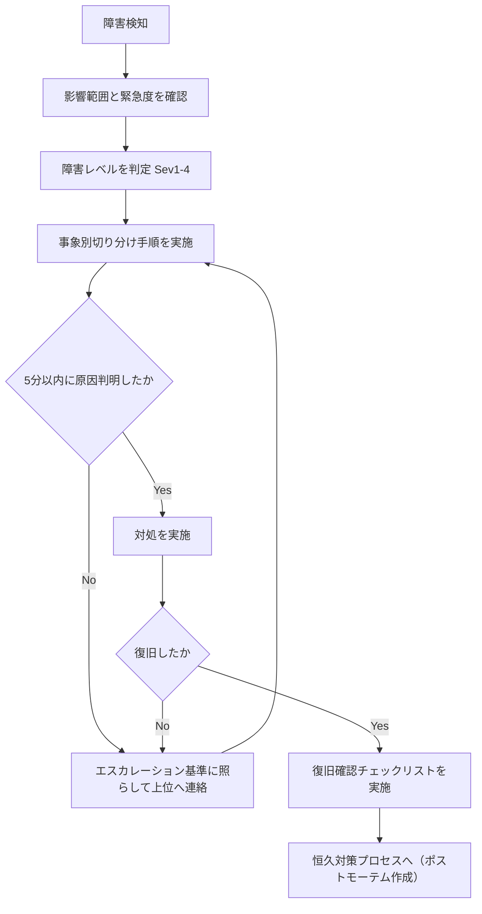
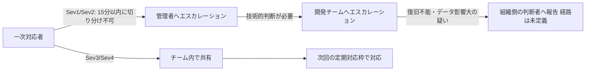

# WS2D-TS-001 障害対応手順書

- 文書ID: WS2D-TS-001
- 版数: 2.0 / 作成日: 2026-08-02 / 最終更新: 2026-08-02
- 対象読者: 障害発生時に一次対応する運用担当者・開発チーム
- 関連文書: `docs/sdlc/50_operation/WS2D-OP-001_運用手順書.md`（バックアップ・リストア／監視）、`docs/sdlc/50_operation/WS2D-EN-001_環境構築手順書.md`（構築時の切り分け）、`docs/INCIDENT_POSTMORTEM.md`（ポストモーテムの実例フォーマット）

## 1. 文書概要

本書は WebSpec2Doc の運用中に障害が発生した際、一次対応者が「何を確認し、どう切り分け、いつエスカレーションするか」を判断するための手順書である。対象は次の場面。

- 利用者からの申告（起動しない・ログインできない等）を受けた運用担当者の初動対応
- メトリクス・ログの悪化を検知した際の切り分け
- 障害収束後の恒久対策プロセス（ポストモーテム作成）への橋渡し

本書の範囲外: 恒久対策の技術的な実装内容そのもの（個別の修正）、組織のSLA・当番体制の策定（本書では「未定義」と明記し、導入組織側での策定を促すに留める）。

読み方: 障害を検知したら §4 の初動フローに従い、§5 の障害レベル定義でレベルを判定し、§5.1〜5.10（事象別の切り分け手順）で原因を絞り込む。切り分けがつかない場合は §7 のエスカレーション基準に従う。復旧後は §9 の恒久対策プロセスに必ず進める。

## 2. 障害レベル定義

### 2.1 影響範囲×緊急度マトリクス

| 影響範囲 \ 緊急度 | 高（即時対応要） | 中 | 低 |
|---|---|---|---|
| 全ユーザー影響（起動不可・全体停止） | Sev1 | Sev2 | — |
| 一部機能停止（特定機能のみ不可） | Sev2 | Sev3 | Sev3 |
| 個別サイト・個別テナントのみ | Sev3 | Sev3 | Sev4 |
| 軽微（表示崩れ等、業務継続可） | Sev3 | Sev4 | Sev4 |

### 2.2 レベル別の初動・連絡・目標復旧時間

| レベル | 初動 | 連絡 | 目標復旧時間（RTO） |
|---|---|---|---|
| Sev1 | 直ちに調査に着手する | 管理者へ即時連絡する | **未定義** |
| Sev2 | 当日中に着手する | 管理者へ連絡する | **未定義** |
| Sev3 | 翌営業日までに着手する | チーム内で共有する | **未定義** |
| Sev4 | 次回の定期メンテナンスで対応する | 記録のみ | **未定義** |

RTO/RPOおよび障害対応の当番体制は、本書時点で組織側の合意がなく **未定義**。社内展開時は導入組織がSLAとして別途定めること。

## 3. 障害検知の手段

| 手段 | 内容 |
|---|---|
| ユーザー申告 | UI操作不能・想定外の挙動の報告 |
| メトリクス | `GET /metrics`（Prometheus形式）。詳細は下表参照 |
| ログ | アプリケーション標準出力、クロール監査ログ `output/{domain}/audit.jsonl`。詳細は §6 参照 |

`web/services/metrics.py` で定義されているメトリクスは次の5種類（実装を確認済み）。

| メトリクス名 | 種別 | 内容 | 障害検知での見方 |
|---|---|---|---|
| `webspec2doc_crawl_total{result}` | Counter | クロール実行の累計（`result=success`/`failure`） | `failure` ラベルの増加率で失敗増加を検知する |
| `webspec2doc_crawl_duration_seconds` | Histogram | クロール1回あたりの所要時間（バケット: 1/5/15/30/60/120/300/600/1800秒） | 上位バケット（600秒・1800秒）への集中でクロール遅延・ハングを検知する |
| `webspec2doc_schedule_delay_seconds` | Gauge | 予定時刻から実際の開始までの遅延（秒） | 値の悪化でスケジューラ遅延を検知する |
| `webspec2doc_job_queue_depth` | Gauge | 未終了のジョブ数 | 値の高止まりでジョブ滞留（AutoRun等）を検知する |
| `webspec2doc_notification_total{result,channel}` | Counter | 通知送信の累計（成否・チャネル別） | `failure` ラベルの増加で通知連携の異常を検知する |

**アラートの自動発報（閾値監視・通知連携）は本書時点で未確認。** 上記メトリクス・ログは目視または外形監視ツール（別途導入時）での参照を前提とする。

## 4. 初動フロー



上図が一次対応者の判断の骨格である。障害を検知したら、まず影響範囲（全ユーザーか個別テナントか）と緊急度を確認し、§2のマトリクスでレベルを判定する。次に §5 の事象別切り分け手順を実施し、5分以内に原因が判明すれば対処へ進み、判明しなければ §7 のエスカレーション基準に従って上位へ連絡したうえで切り分けを継続する。対処後は復旧の成否を確認し、未復旧なら再度エスカレーション、復旧していれば復旧確認チェックリスト（`WS2D-OP-001`の該当項目）を実施したうえで、必ず §9 の恒久対策プロセスへ進む。

## 5. 事象別の切り分け手順

### 5.1 起動しない

- **確認コマンド**:
  ```bash
  FLASK_TESTING=1 venv/bin/python app.py
  ```
  標準出力を直接確認する（専用ログファイルへの出力設定は §6 参照）。
- **想定原因**:
  - `venv/bin/python` が存在しない（構築未完了。`WS2D-EN-001`参照）
  - Playwrightランタイム未整備。`app.py` の `__main__` ブロックが起動時に `crawler.playwright_runtime.verify_playwright_runtime()` を呼び、失敗時は `PlaywrightRuntimeError` で起動を止める
  - ポート競合（既定8765が使用中。詳細は §5.9）
- **対処**:
  - `make doctor` で環境診断
  - `make setup-runtime` でChromiumを導入
  - `lsof -i :8765` で競合プロセスを確認し、停止するか `WEBSPEC2DOC_PORT` で待受ポートを変更する

### 5.2 ログインできない

- **確認コマンド**: ブラウザで `/auth/login` を開きエラーメッセージを確認する。管理者は `/admin/console` で対象ユーザーの `is_active` を確認する。
- **想定原因**:
  - `WEBSPEC2DOC_AUTH_MODE=off` になっている（認証自体が無効）
  - アカウントが無効化されている（`is_active=false`）
  - パスワード誤り、またはSSO設定不備（`WEBSPEC2DOC_OIDC_CLIENT_ID`等の不足。不足時は不足変数名を挙げて起動時に失敗する仕様）
- **対処**:
  - 環境変数 `WEBSPEC2DOC_AUTH_MODE` を確認する
  - 管理コンソール（`/admin/console`）でアカウントの有効/無効を確認・切替する（`WS2D-OP-001` §7.1）
  - SSO利用時は `WEBSPEC2DOC_OIDC_CLIENT_ID` / `_CLIENT_SECRET` / `_REDIRECT_URI` の設定漏れを確認する

### 5.3 クロールが失敗する

- **確認コマンド**:
  ```bash
  tail -n 50 output/{domain}/audit.jsonl
  ```
- **想定原因**:
  - ローカル/イントラURLをSSRF保護がブロック（`WEBSPEC2DOC_ALLOW_LOCAL` 未設定）
  - robots.txt による制限
  - 対象サイトのログインセッション失効
- **対処**:
  - 信頼できる対象なら `WEBSPEC2DOC_ALLOW_LOCAL=1` を設定する（信頼環境限定）
  - `audit.jsonl` で遮断理由を確認し、意図した制御か判断する
  - サイト認証を使うクロールで失効を検知した場合は再ログインを促す

### 5.4 AutoRunが終わらない

- **確認コマンド**:
  ```bash
  curl http://127.0.0.1:8765/api/autorun/status
  curl http://127.0.0.1:8765/metrics | grep webspec2doc_job_queue_depth
  ```
- **想定原因**:
  - ジョブキューの滞留（`web/services/job_queue.py`）
  - AutoRunのnpm環境（`output/.playwright_env/node_modules`）が壊れている
- **対処**:
  - `webspec2doc_job_queue_depth` の値で滞留を判断する
  - 個別ジョブは `GET /api/v1/jobs/<job_id>` で状態確認する
  - npm環境の破損が疑われる場合は該当ディレクトリを退避し再構築させる（具体的な再構築コマンドは本書では **未検証**）

### 5.5 ドキュメント生成が空になる

- **確認コマンド**:
  ```bash
  ls -la output/{domain}/
  cat output/{domain}/technical_health.json
  ```
- **想定原因**:
  - クロールが0ページしか到達していない（`technical_health.json` で到達済み・同一オリジンの実測範囲を確認できる）
  - 出力フォーマット指定漏れ（`--format md,html,excel` 等）
- **対処**:
  - 到達ページ数を確認し、クロール自体が失敗していないか §5.3 の手順で切り分ける
  - 出力オプション指定を確認する

### 5.6 LLM連携が失敗する

- **確認コマンド**: 起動ログ・実行ログでOpenAI関連の例外有無を確認する。
- **想定原因**:
  - `OPENAI_API_KEY` 未設定（この場合は **仕様どおり** ルールベースにフォールバックする。エラーではない）
  - APIキーは設定されているがネットワーク到達不可、レート制限
- **対処**:
  - `OPENAI_API_KEY` の設定有無を確認する（未設定はフォールバック運用であり障害ではない）
  - 設定ありで失敗する場合はOpenAI API側のステータス・レート制限を確認する

### 5.7 DBが壊れた

- **確認コマンド**:
  ```bash
  sqlite3 instance/viewpoints.db "PRAGMA integrity_check;"
  ```
- **想定原因**: 予期しないプロセス終了時の書き込み中断、ディスク容量枯渇（§5.8参照）。
- **対処**: `WS2D-OP-001` §5「バックアップ・リストア」に従い直近の正常なバックアップからリストアする。バックアップが無い場合は復旧不能なため、日次/週次のバックアップ運用の徹底が前提となる。

### 5.8 ディスク不足

- **確認コマンド**:
  ```bash
  df -h .
  du -sh output instance .runtime 2>/dev/null
  ```
- **想定原因**:
  - `output/{domain}/` のクロール成果物（スナップショット・スクリーンショット）が保持ポリシーの上限を超えて蓄積している
  - `.runtime/ms-playwright/` のChromiumキャッシュ肥大化
  - ログ・監査ファイル（`audit.jsonl`等）の無制限な追記
- **対処**:
  - `WS2D-OP-001` のデータ保持ポリシーに従い古い `output/{domain}/` を整理する
  - `df -h` で空き容量を確保してからプロセスを再起動する（SQLite書き込み中のディスク枯渇はDB破損の原因になり得る。§5.7参照）
  - 恒常的な不足であれば保持世代数の見直しを恒久対策として検討する

### 5.9 ポート競合

- **確認コマンド**:
  ```bash
  lsof -i :8765
  ```
- **想定原因**:
  - 既定ポート8765を別プロセス（前回終了し損ねたWebSpec2Doc自身、または別アプリ）が占有している
- **対処**:
  - `lsof -i :8765` で表示されたPIDのプロセスが不要なら停止する（`kill <PID>`）
  - 停止できない、または意図的に併存させたい場合は `WEBSPEC2DOC_PORT` で待受ポートを変更する（`WS2D-EN-001` §8参照）
  - E2Eテスト実行時のポート競合は `make verify-ui E2E_BASE_URL=http://127.0.0.1:8799` のように個別に上書きできる

### 5.10 Playwrightブラウザ異常

- **確認コマンド**:
  ```bash
  make check-runtime
  ```
- **想定原因**:
  - `.runtime/ms-playwright/` にChromiumが未導入、または導入後にOSアップデート等で実行できなくなった
  - `PLAYWRIGHT_BROWSERS_PATH` が意図しない値に上書きされ、導入先と参照先が食い違っている
- **対処**:
  - `make setup-runtime` でChromiumを再導入する
  - `echo $PLAYWRIGHT_BROWSERS_PATH` で参照先を確認し、`Makefile` の既定値（`.runtime/ms-playwright`）と一致しているか確認する
  - 再導入しても解消しない場合は `.runtime/ms-playwright` を削除してから `make setup-runtime` を再実行する（**この削除後の再導入手順は本書では未検証**）

## 6. ログの確認方法

| 種別 | 出力先 | 確認方法 |
|---|---|---|
| アプリケーションログ | 標準出力（`web/services/metrics.py` の `configure_json_logging()` が呼ばれている場合はJSON1行形式） | フォアグラウンド実行時はターミナルを直接確認する。バックグラウンド実行時は起動コマンドの標準出力・標準エラーをリダイレクトしていなければ確認できない |
| クロール監査ログ | `output/{domain}/audit.jsonl` | `tail -n 50 output/{domain}/audit.jsonl` で直近の記録を確認する（§5.3参照） |
| E2Eテストのスクリーンショット | `tests/e2e/screenshots/` | `make verify-ui` 実行時に失敗したケースのみ保存される（`--screenshot=only-on-failure`） |

`configure_json_logging()` は `logging.StreamHandler` のみを設定しており、専用のログファイルへ出力するハンドラは定義されていない（`web/services/metrics.py` で確認済み）。そのため、ログを永続化したい場合は起動コマンド自体を `>> app.log 2>&1` 等でリダイレクトする必要がある。**`app.py` の起動時に `configure_json_logging()` が実際に呼び出されているか（＝ログが常にJSON形式になるか）は本書では未確認**。呼び出されていない場合はPythonの既定ログ形式（プレーンテキスト）になる。

障害調査でログを最初に見るべき箇所は、事象に応じて §5 の該当節が指す確認コマンドを優先する。ログはそれらで原因が特定できない場合の補助情報として使う。

## 7. エスカレーション基準



- Sev1/Sev2は、初動対応者だけで **15分以内** に原因の切り分けがつかない場合、上位（管理者・開発チーム）へエスカレーションする。
- Sev3/Sev4は、初動対応者の判断で対応し、解決しない場合はチーム内で共有した上で次の定期対応枠に回す。
- 開発チームへのエスカレーション後、復旧不能またはデータ影響が大きいと判断される場合の報告先（経営層・顧客等）は組織側で定義する（本書時点で **未定義**）。
- 具体的な連絡先・当番体制・エスカレーション経路（電話/チャット/チケット等の連絡手段）も組織側で定義する（本書時点で **未定義**）。社内展開時はSLAとして別途定めること。

## 8. 暫定対処と恒久対策の切り分け

障害対応では、まず利用者影響を止める「暫定対処」を優先し、根本原因を解消する「恒久対策」は事後に計画的に行う。両者を混同すると、暫定対処だけで「解決」と誤認し根本原因が放置される。

| 観点 | 暫定対処 | 恒久対策 |
|---|---|---|
| 目的 | 利用者影響を止める・軽減する | 再発を防ぐ |
| 実施時期 | 障害検知直後〜復旧まで | 復旧後、ポストモーテム作成と並行 |
| 例 | プロセス再起動、ポート変更、一時的な設定変更 | コードの修正、監視の追加、ドキュメント・DoDの更新 |
| 判断基準 | 「利用者が再び使える状態」に戻ったか | 「同じ原因で再発しない」と説明できるか |
| 本書での対応節 | §5（事象別の切り分け手順）の「対処」欄 | §9（恒久対策のプロセス）・ポストモーテム |

暫定対処を実施して復旧した時点で対応を終了せず、必ず §9 の恒久対策プロセスに進めること。

## 9. 恒久対策のプロセス

- 障害収束後、`docs/INCIDENT_POSTMORTEM.md` のフォーマット（インシデントID・タイムライン・根本原因分析・影響評価・是正措置・学習事項・再発防止の検証方法）に従ってポストモーテムを作成する。
- **根本原因分析（RCA）は必ず名前付きフレームワークを使用する**: 5 Whys / Fishbone / FMEA / CAPA のいずれか。フレームワーク名を明示しない場当たり的なRCAは禁止する（`.claude/rules/functional-integrity.md` の規約に準拠）。
- 是正措置は「予防」「検知」等の種別・対象ファイル・完了有無を表で管理する（`docs/INCIDENT_POSTMORTEM.md` の書式を踏襲）。
- Sev1/Sev2は必ずポストモーテムを作成する。Sev3/Sev4は必要に応じて作成する。
- ポストモーテムの実例は `docs/INCIDENT_POSTMORTEM.md`（INC-2026-001、5 Whysによる根本原因分析、是正措置7件を実施済み）を参照する。

## 10. 障害報告書テンプレート

障害発生時、関係者への報告に使うテンプレート。Sev1/Sev2は必須、Sev3/Sev4は必要に応じて使用する。

```markdown
# 障害報告書

- 報告日時:
- 報告者:
- インシデントID:（例: INC-YYYY-NNN）

## 概要
（何が・いつから・どの範囲で発生しているか、2〜3行で）

## 影響
- 影響範囲（全ユーザー／一部機能／個別テナント）:
- 障害レベル（Sev1〜4、§2参照）:
- 発生日時:
- （復旧済みの場合）復旧日時:

## 現在の状況
- [ ] 調査中
- [ ] 原因判明・対処中
- [ ] 暫定対処により復旧
- [ ] 恒久対策待ち
- [ ] クローズ

## 暫定対処の内容
（実施した内容。未実施なら「未実施」と明記）

## 今後の見込み
（次回報告予定時刻、恒久対策の着手予定）

## 連絡先
（本報告に関する問い合わせ先）
```

## 11. 障害対応記録シート（記入用）

一次対応者が対応中にその場で記入する。時系列の記録は後のポストモーテムの一次資料になる。

```markdown
# 障害対応記録シート

- インシデントID:
- 記入者:
- 障害レベル（Sev1〜4）:

## 検知
- 検知日時:
- 検知手段（ユーザー申告／メトリクス／ログ／その他）:
- 検知内容:

## タイムライン
| 時刻 | 実施内容 | 実施者 |
|---|---|---|
|  |  |  |
|  |  |  |
|  |  |  |

## 切り分け
- 参照した事象別手順（§5の番号）:
- 確認コマンドと結果:
- 想定原因:

## 対処
- 暫定対処の内容:
- 実施時刻:
- 復旧確認時刻:
- エスカレーション有無（有の場合、連絡先・時刻）:

## 未解決事項・引き継ぎ事項
（次の担当者・恒久対策担当への申し送り）

## 恒久対策プロセスへの移行
- [ ] `docs/INCIDENT_POSTMORTEM.md` フォーマットでポストモーテムを作成する
- [ ] RCAフレームワーク（5 Whys/Fishbone/FMEA/CAPA）を選定する
```

## 12. 改訂履歴

| 版 | 日付 | 内容 | 作成者 |
|---|---|---|---|
| 1.0 | 2026-08-02 | 新規作成 | 開発チーム |
| 2.0 | 2026-08-02 | 文書概要を新設。メトリクスを3種→5種に拡充（実装確認済み）。事象別切り分けを7→10事象に拡充（ディスク不足・ポート競合・Playwrightブラウザ異常を追加）。ログの確認方法、暫定対処と恒久対策の切り分け、障害報告書テンプレート、障害対応記録シートを新設。エスカレーションフロー図（mermaid）を追加 | 開発チーム |
