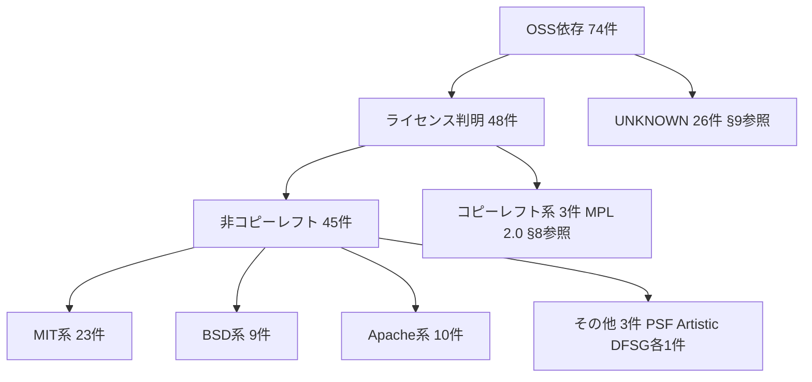
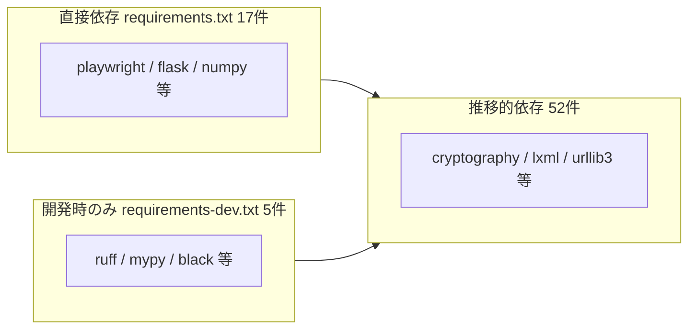

# WS2D-LI-001 OSSライセンス一覧

- 文書ID: WS2D-LI-001
- 版数: 2.0 / 作成日: 2026-08-02 / 最終更新: 2026-08-02
- 対象読者: 納品・再配布時の法務確認担当者、開発チーム
- 出典: `docs/sdlc/_asbuilt/licenses.json`（機械抽出済み・74件）、`requirements.txt`、`requirements-dev.txt`

## 1. 文書概要

本書は WebSpec2Doc が依存する OSS（オープンソースソフトウェア）のライセンス一覧である。目的は、本製品を第三者へ納品・再配布する際に、含まれるOSSのライセンス条件（表示義務・改変時の開示義務等）に抵触しないことを法務・開発の双方が確認できるようにすることである。

対象は Python の実行時依存・開発時依存・推移的依存の全パッケージ（合計74件）。AutoRun機能が実行時に生成するnpm環境（`output/.playwright_env/node_modules`）は、ユーザーの実行環境ごとに動的に生成されるものであり、本書の機械抽出（§2参照）の対象には含まれていない。npm環境のライセンス確認が必要な場合は別途 `npm ls --all` 等での確認が必要（本書では **未実施**）。

読み方: §6の全74件一覧が一次情報である。§7〜§9は§6を集計・分類したものであり、依存関係を変更した際は必ず§6と再突き合わせる（§12の再生成手順参照）。

## 2. ライセンス確認の方針と手順

- ライセンス情報は `docs/sdlc/_asbuilt/licenses.json` から機械的に抽出する。生成元は `scripts/extract_asbuilt.py`（§12参照）。
- 抽出元はPyPIパッケージのメタデータ（`license` フィールドおよび `homepage`）であり、SPDXライセンス識別子ではなく配布者が自由記述したライセンス名がそのまま入る。そのため同一ライセンスでも表記揺れが生じる（例: `MIT` と `MIT License`）。本書§7の集計ではこれらを人手で同一区分にまとめている。
- `license` フィールドが取得できなかったパッケージは `UNKNOWN` として抽出される。これは「ライセンスが無い」ことを意味しない。§9で個別対応方針を示す。
- 用途区分（実行時／開発時のみ／推移的）はPyPIメタデータに含まれないため、`requirements.txt` と `requirements-dev.txt` への記載有無から本書作成者が判定した（判定基準は§5）。
- 本書の内容は生成時点のスナップショットである。依存を追加・更新した場合は再生成（§12）と本書の手動更新が必要であり、自動では追随しない。

## 3. ライセンス分類ツリー



74件の内訳は大きく「ライセンス判明」48件と「UNKNOWN」26件に分かれる。判明した48件のうち、再配布時に個別の義務が生じる可能性がある**コピーレフト系（MPL 2.0）が3件**、それ以外の非コピーレフト（MIT/BSD/Apache系等）が45件である。個別の内訳・パッケージ名は §7（集計）・§6（全件一覧）を参照する。

## 4. 依存関係の階層



直接依存（`requirements.txt` に明記）は17件、開発時のみ（`requirements-dev.txt` にのみ明記）は5件、残る52件はどちらにも直接の記載が無い推移的依存である。推移的依存は直接依存・開発時依存のいずれか（または双方）が間接的に引き込んでいるため、直接依存を1件削除・変更するだけでも推移的依存の構成が変わり得る。バージョン変更時は必ず§12の再生成手順を実行し、本書を最新の実態に合わせること。

## 5. 用途区分の判定基準

- **実行時依存**: `requirements.txt` に直接記載されているパッケージ。
- **開発時のみ**: `requirements-dev.txt` に直接記載され、`requirements.txt` には記載が無いパッケージ（lint/型検査/監査等の開発ツール）。
- **推移的依存**: どちらのファイルにも直接記載が無く、上記の依存が間接的に引き込むパッケージ。
- 新規に追加された `lxml` と `python-docx` はこの判定基準に基づき推移的依存と分類したが、`src/`・`web/`・`app.py` を対象に `import docx` / `from docx` / `import lxml` / `from lxml` を検索した結果、直接の import は見つからなかった（確認済み）。したがって現時点でアプリケーションコードがこの2件に直接依存している証跡はなく、機械的な分類（推移的依存）と実装上の実態は一致している。

## 6. OSS一覧（全74件）

| パッケージ名 | バージョン | ライセンス | 用途区分 | エコシステム | 入手元URL |
|---|---|---|---|---|---|
| Authlib | 1.7.2 | BSD License | 実行時依存 | PyPI | https://docs.authlib.org/ |
| black | 26.3.1 | UNKNOWN | 開発時のみ | PyPI | https://black.readthedocs.io/ |
| blinker | 1.9.0 | MIT License | 推移的依存 | PyPI | https://discord.gg/pallets |
| boolean.py | 5.0 | BSD-2-Clause | 推移的依存 | PyPI | https://github.com/bastikr/boolean.py |
| CacheControl | 0.14.4 | UNKNOWN | 推移的依存 | PyPI | https://pypi.org/project/CacheControl/ |
| certifi | 2026.7.22 | Mozilla Public License 2.0 (MPL 2.0) | 推移的依存 | PyPI | https://github.com/certifi/python-certifi |
| cffi | 2.1.0 | UNKNOWN | 推移的依存 | PyPI | https://cffi.readthedocs.io/ |
| charset-normalizer | 3.4.9 | MIT | 推移的依存 | PyPI | https://github.com/jawah/charset_normalizer/blob/master/CHANGELOG.md |
| click | 8.4.2 | UNKNOWN | 推移的依存 | PyPI | https://click.palletsprojects.com/page/changes/ |
| coverage | 7.15.2 | Apache-2.0 | 推移的依存 | PyPI | https://github.com/coveragepy/coveragepy |
| cryptography | 49.0.0 | UNKNOWN | 推移的依存 | PyPI | https://cryptography.io/en/latest/changelog/ |
| cyclonedx-python-lib | 7.6.2 | Apache Software License | 推移的依存 | PyPI | https://github.com/CycloneDX/cyclonedx-python-lib/#readme |
| defusedxml | 0.7.1 | Python Software Foundation License | 実行時依存 | PyPI | https://github.com/tiran/defusedxml |
| et_xmlfile | 2.0.0 | MIT License | 推移的依存 | PyPI | https://foss.heptapod.net/openpyxl/et_xmlfile |
| filelock | 3.32.2 | MIT License | 推移的依存 | PyPI | https://py-filelock.readthedocs.io |
| Flask | 3.1.3 | UNKNOWN | 実行時依存 | PyPI | https://flask.palletsprojects.com/page/changes/ |
| greenlet | 3.5.4 | UNKNOWN | 推移的依存 | PyPI | https://greenlet.readthedocs.io |
| html5lib | 1.1 | MIT License | 推移的依存 | PyPI | https://github.com/html5lib/html5lib-python |
| idna | 3.18 | UNKNOWN | 推移的依存 | PyPI | https://github.com/kjd/idna/blob/master/HISTORY.md |
| iniconfig | 2.3.0 | UNKNOWN | 推移的依存 | PyPI | https://github.com/pytest-dev/iniconfig |
| itsdangerous | 2.2.0 | BSD License | 推移的依存 | PyPI | https://itsdangerous.palletsprojects.com/changes/ |
| Jinja2 | 3.1.6 | BSD License | 実行時依存 | PyPI | https://jinja.palletsprojects.com/changes/ |
| joserfc | 1.7.4 | BSD License | 推移的依存 | PyPI | https://jose.authlib.org/ |
| license-expression | 30.4.4 | Apache-2.0 | 推移的依存 | PyPI | https://github.com/aboutcode-org/license-expression |
| lxml | 6.1.1 | BSD-3-Clause | 推移的依存 | PyPI | https://lxml.de/ |
| markdown-it-py | 4.2.0 | MIT License | 推移的依存 | PyPI | https://markdown-it-py.readthedocs.io |
| MarkupSafe | 3.0.3 | UNKNOWN | 推移的依存 | PyPI | https://palletsprojects.com/donate |
| mdurl | 0.1.2 | MIT License | 推移的依存 | PyPI | https://github.com/executablebooks/mdurl |
| msgpack | 1.2.1 | UNKNOWN | 推移的依存 | PyPI | https://msgpack.org/ |
| mypy | 1.13.0 | MIT License | 開発時のみ | PyPI | https://www.mypy-lang.org/ |
| mypy_extensions | 1.1.0 | UNKNOWN | 推移的依存 | PyPI | https://github.com/python/mypy_extensions |
| networkx | 3.3 | BSD License | 実行時依存 | PyPI | https://networkx.org/ |
| numpy | 2.5.1 | UNKNOWN | 実行時依存 | PyPI | https://numpy.org |
| openpyxl | 3.1.4 | MIT License | 実行時依存 | PyPI | https://openpyxl.readthedocs.io |
| packageurl-python | 0.17.6 | MIT License | 推移的依存 | PyPI | https://github.com/package-url/packageurl-python |
| packaging | 26.2 | UNKNOWN | 推移的依存 | PyPI | https://packaging.pypa.io/ |
| pathspec | 1.1.1 | Mozilla Public License 2.0 (MPL 2.0) | 推移的依存 | PyPI | https://python-path-specification.readthedocs.io/en/latest/changes.html |
| pillow | 12.3.0 | UNKNOWN | 実行時依存 | PyPI | https://pillow.readthedocs.io/en/stable/releasenotes/index.html |
| pip | 26.2 | UNKNOWN | 推移的依存 | PyPI | https://pip.pypa.io/en/stable/news/ |
| pip-api | 0.0.34 | Apache Software License | 推移的依存 | PyPI | http://github.com/di/pip-api |
| pip-requirements-parser | 32.0.1 | MIT | 推移的依存 | PyPI | https://github.com/nexB/pip-requirements-parser |
| pip_audit | 2.7.3 | Apache Software License | 開発時のみ | PyPI | https://pypi.org/project/pip-audit/ |
| platformdirs | 4.11.0 | MIT License | 推移的依存 | PyPI | https://platformdirs.readthedocs.io/en/latest/changelog.html |
| playwright | 1.61.0 | UNKNOWN | 実行時依存 | PyPI | https://github.com/Microsoft/playwright-python |
| pluggy | 1.6.0 | MIT License | 推移的依存 | PyPI | ― |
| prometheus_client | 0.21.1 | Apache Software License | 実行時依存 | PyPI | https://github.com/prometheus/client_python |
| py-serializable | 1.1.2 | Apache Software License | 推移的依存 | PyPI | https://github.com/madpah/serializable#readme |
| pycparser | 3.0 | UNKNOWN | 推移的依存 | PyPI | https://github.com/eliben/pycparser |
| pyee | 13.0.1 | MIT License | 推移的依存 | PyPI | https://github.com/jfhbrook/pyee |
| Pygments | 2.20.0 | UNKNOWN | 推移的依存 | PyPI | https://pygments.org |
| pyparsing | 3.3.2 | UNKNOWN | 推移的依存 | PyPI | https://pyparsing-docs.readthedocs.io/en/latest/ |
| pypdf | 6.14.2 | UNKNOWN | 実行時依存 | PyPI | https://github.com/py-pdf/pypdf/issues |
| pytest | 9.0.3 | UNKNOWN | 実行時依存 | PyPI | https://docs.pytest.org/en/stable/changelog.html |
| pytest-base-url | 2.1.0 | Mozilla Public License 2.0 (MPL 2.0) | 推移的依存 | PyPI | https://github.com/pytest-dev/pytest-base-url |
| pytest-cov | 5.0.0 | MIT License | 実行時依存 | PyPI | https://github.com/pytest-dev/pytest-cov |
| pytest-playwright | 0.8.0 | Apache Software License | 実行時依存 | PyPI | https://github.com/microsoft/playwright-pytest |
| pytest-timeout | 2.3.1 | DFSG approved | 実行時依存 | PyPI | https://github.com/pytest-dev/pytest-timeout |
| python-docx | 1.2.0 | MIT License | 推移的依存 | PyPI | https://github.com/python-openxml/python-docx/blob/master/HISTORY.rst |
| python-dotenv | 1.2.2 | BSD-3-Clause | 実行時依存 | PyPI | https://github.com/theskumar/python-dotenv |
| python-slugify | 8.0.4 | MIT License | 推移的依存 | PyPI | https://github.com/un33k/python-slugify |
| pytokens | 0.4.1 | MIT License | 推移的依存 | PyPI | https://github.com/tusharsadhwani/pytokens |
| PyYAML | 6.0.1 | MIT License | 実行時依存 | PyPI | https://pyyaml.org/ |
| requests | 2.34.2 | Apache Software License | 推移的依存 | PyPI | https://requests.readthedocs.io |
| rich | 15.0.0 | MIT License | 推移的依存 | PyPI | https://rich.readthedocs.io/en/latest/ |
| ruff | 0.6.9 | MIT License | 開発時のみ | PyPI | https://docs.astral.sh/ruff |
| six | 1.17.0 | MIT License | 推移的依存 | PyPI | https://github.com/benjaminp/six |
| sortedcontainers | 2.4.0 | Apache Software License | 推移的依存 | PyPI | http://www.grantjenks.com/docs/sortedcontainers/ |
| text-unidecode | 1.3 | Artistic License | 推移的依存 | PyPI | https://github.com/kmike/text-unidecode/ |
| toml | 0.10.2 | MIT License | 推移的依存 | PyPI | https://github.com/uiri/toml |
| types-PyYAML | 6.0.12.20260518 | UNKNOWN | 開発時のみ | PyPI | https://github.com/python/typeshed |
| typing_extensions | 4.16.0 | UNKNOWN | 推移的依存 | PyPI | https://github.com/python/typing_extensions/issues |
| urllib3 | 2.7.0 | UNKNOWN | 推移的依存 | PyPI | https://github.com/urllib3/urllib3/blob/main/CHANGES.rst |
| webencodings | 0.5.1 | BSD License | 推移的依存 | PyPI | https://github.com/SimonSapin/python-webencodings |
| Werkzeug | 3.1.8 | UNKNOWN | 推移的依存 | PyPI | https://werkzeug.palletsprojects.com/page/changes/ |

## 7. ライセンス種別ごとの集計

| ライセンス種別 | 件数 | 備考 |
|---|---|---|
| MIT系（MIT / MIT License） | 23 | `python-docx`（MIT License）の追加により22→23 |
| BSD系（BSD License / BSD-2-Clause / BSD-3-Clause） | 9 | `lxml`（BSD-3-Clause）の追加により8→9 |
| Apache系（Apache-2.0 / Apache Software License） | 10 | |
| Mozilla Public License 2.0 (MPL 2.0) | 3 | コピーレフト。§8参照 |
| Python Software Foundation License | 1 | defusedxml |
| Artistic License | 1 | text-unidecode |
| DFSG approved（ライセンス名不明・要確認） | 1 | pytest-timeout。PyPIのトローブ分類のみが取得されておりSPDXライセンス名ではない |
| UNKNOWN（要個別確認） | 26 | §9参照 |
| **合計** | **74** | `docs/sdlc/_asbuilt/licenses.json` の全件と一致 |

## 8. コピーレフト系ライセンス（GPL/LGPL/AGPL/MPL/EPL）の該当有無

確認方法: `grep -inE "gpl|lgpl|agpl|mpl|epl" docs/sdlc/_asbuilt/licenses.json`

**GPL / LGPL / AGPL / EPL: 該当なし。**

**MPL 2.0（Mozilla Public License 2.0）: 3件該当。**

| パッケージ名 | バージョン | 用途区分 |
|---|---|---|
| certifi | 2026.7.22 | 推移的依存 |
| pathspec | 1.1.1 | 推移的依存 |
| pytest-base-url | 2.1.0 | 推移的依存（開発時のみ経由） |

**再配布時の義務（MPL 2.0はファイル単位のコピーレフト）**:
- MPL 2.0が適用されるファイル自体を改変して配布する場合、そのファイルのソースコードを開示する義務がある。
- 本製品はいずれのパッケージも改変せずライブラリとして利用するのみであり、上記の改変時開示義務は生じない。
- 他のファイルと結合（インポート／リンク）して使用する分には、製品全体をMPLにする義務はない（file-level copyleft）。
- 配布物にはMPL 2.0の原文・著作権表示を添付することが望ましい。

## 9. UNKNOWN（要個別確認）一覧と対応方針

`docs/sdlc/_asbuilt/licenses.json` 上でライセンス文字列が `UNKNOWN` と抽出された26件。**「一般的に知られたライセンスだろう」という推測でライセンス名を補って記載することはしない。** UNKNOWNは抽出ツールがPyPIのメタデータからSPDXライセンス名を機械的に取得できなかったことを意味し、ライセンスが存在しないという意味ではない。再配布前に各パッケージのPyPIページまたはリポジトリのLICENSEファイルを直接参照し、個別に確認すること。

| # | パッケージ名 | バージョン | 用途区分 |
|---|---|---|---|
| 1 | black | 26.3.1 | 開発時のみ |
| 2 | CacheControl | 0.14.4 | 推移的依存 |
| 3 | cffi | 2.1.0 | 推移的依存 |
| 4 | click | 8.4.2 | 推移的依存 |
| 5 | cryptography | 49.0.0 | 推移的依存 |
| 6 | Flask | 3.1.3 | 実行時依存 |
| 7 | greenlet | 3.5.4 | 推移的依存 |
| 8 | idna | 3.18 | 推移的依存 |
| 9 | iniconfig | 2.3.0 | 推移的依存 |
| 10 | MarkupSafe | 3.0.3 | 推移的依存 |
| 11 | msgpack | 1.2.1 | 推移的依存 |
| 12 | mypy_extensions | 1.1.0 | 推移的依存 |
| 13 | numpy | 2.5.1 | 実行時依存 |
| 14 | packaging | 26.2 | 推移的依存 |
| 15 | pillow | 12.3.0 | 実行時依存 |
| 16 | pip | 26.2 | 推移的依存 |
| 17 | playwright | 1.61.0 | 実行時依存 |
| 18 | pycparser | 3.0 | 推移的依存 |
| 19 | Pygments | 2.20.0 | 推移的依存 |
| 20 | pyparsing | 3.3.2 | 推移的依存 |
| 21 | pypdf | 6.14.2 | 実行時依存 |
| 22 | pytest | 9.0.3 | 実行時依存 |
| 23 | types-PyYAML | 6.0.12.20260518 | 開発時のみ |
| 24 | typing_extensions | 4.16.0 | 推移的依存 |
| 25 | urllib3 | 2.7.0 | 推移的依存 |
| 26 | Werkzeug | 3.1.8 | 推移的依存 |

### 9.1 特定方法

各パッケージのPyPIページ（`https://pypi.org/project/<name>/`）の「Meta」欄、またはリポジトリ直下の `LICENSE`/`LICENSE.txt`/`COPYING` ファイルを直接参照する。`pip show <name>` はPyPIメタデータをそのまま表示するだけであり、`UNKNOWN` の解消にはならない場合が多い（メタデータ自体に記載が無いため）。

### 9.2 納品前に必要な作業

- [ ] 26件それぞれについてPyPIページまたはリポジトリのLICENSEファイルを確認し、実際のライセンス種別を特定する
- [ ] 特定した結果を本書§6・§7に反映し、UNKNOWN件数を0に近づける
- [ ] 特定の結果コピーレフト系ライセンスが含まれると判明した場合は§8の様式で再配布義務を追記する
- [ ] 上記が完了するまでは、UNKNOWN26件を「ライセンス未確認のまま」として納品先に開示する

## 10. 本体（WebSpec2Doc自身）のライセンス方針

リポジトリ直下に `LICENSE` ファイルは **存在しない**（確認コマンド: `ls LICENSE*` → `no matches found`）。本体のライセンス方針は **未定義・要決定**。納品・再配布前に方針を確定させる必要がある。

## 11. 再配布時のチェックリスト

- [ ] `docs/sdlc/_asbuilt/licenses.json` を最新の依存関係で再生成済みである（§12）
- [ ] 本書§6の全件一覧が再生成結果と一致している
- [ ] UNKNOWN（§9）を可能な範囲で特定済み、または未特定である旨を納品先に開示済みである
- [ ] コピーレフト系（§8）が含まれる場合、再配布時の義務（原文添付・改変部分の開示等）を果たす計画がある
- [ ] 本体（WebSpec2Doc自身）のライセンス方針（§10）を確定している。未定義のまま納品する場合はその旨を契約書等で明示している
- [ ] AutoRunのnpm環境（§1参照）のライセンス確認要否を判断している

## 12. 再生成手順

依存関係やバージョンが変わった場合、`licenses.json` は以下で再生成できる。

```bash
venv/bin/python scripts/extract_asbuilt.py
```

再生成後は本書§3〜§9の集計・分類を実データと突き合わせて更新すること（自動反映されない）。

## 14. エコシステム別内訳

| エコシステム | 件数 | 備考 |
|---|---|---|
| PyPI（Python） | 74 | `docs/sdlc/_asbuilt/licenses.json` の全件 |
| npm（Node.js） | 0（本書の対象外） | AutoRunが実行時に生成する `output/.playwright_env/node_modules` は動的生成のため機械抽出の対象外。§1参照 |

現時点で本書が機械的に把握しているOSS依存は100%がPyPI（Python）エコシステムである。npm環境を含めた完全なライセンス一覧が必要な場合は、AutoRunを実行した環境で `cd output/.playwright_env && npm ls --all` 等を別途実行する必要がある（本書では **未実施**）。

## 15. 直接依存17件の内訳

| パッケージ名 | 用途 |
|---|---|
| playwright | クロール実行 |
| networkx | グラフ処理 |
| Jinja2 | テンプレート |
| openpyxl | Excel出力 |
| pypdf | 参考文書取り込み（Doc Fusion） |
| PyYAML | 設定・データ記述 |
| defusedxml | 安全なXML処理 |
| pytest / pytest-cov / pytest-playwright / pytest-timeout | テスト |
| Flask | Web UI |
| Pillow | 視覚複雑度の実測 |
| numpy | 視覚複雑度の実測 |
| python-dotenv | `.env` 読み込みユーティリティ |
| prometheus_client | メトリクス公開 |
| Authlib | SSO（OIDC RP） |

## 16. サードパーティ表示ファイルの同梱（推奨）

再配布物には、本書§6の一覧を元にした `THIRD_PARTY_NOTICES.md`（または同等のファイル）を同梱することを推奨する。現時点でこのファイルは **存在しない（未作成）**。作成する場合は次を含めること。

- 各パッケージ名・バージョン・ライセンス種別（本書§6を転記）
- MPL 2.0該当3件（§8）については原文またはライセンス全文へのリンク
- UNKNOWN26件（§9）は「本書作成時点で未特定」である旨を明記し、特定済みになり次第更新する

このファイルの作成・同梱要否は納品契約の条件による。本書はその判断材料を提供するものであり、作成そのものは本書の作業範囲外（**未着手**）。

## 17. 改訂履歴

| 版 | 日付 | 内容 | 作成者 |
|---|---|---|---|
| 1.0 | 2026-08-02 | 新規作成（72件） | 開発チーム |
| 2.0 | 2026-08-02 | 依存追加により72→74件へ更新（`lxml`・`python-docx`を追加）。文書概要、ライセンス確認の方針と手順、ライセンス分類ツリー図、依存関係の階層図（mermaid）、UNKNOWN対応方針、再配布時のチェックリストを新設。エコシステム列を追加 | 開発チーム |
| 2.1 | 2026-08-02 | エコシステム別内訳、直接依存17件の内訳、サードパーティ表示ファイルの同梱方針を新設 | 開発チーム |
